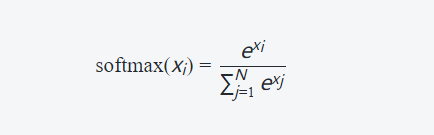

## Softmax

Softmax函数是一种常用的激活函数，常用于多类别分类问题中。它将一组实数值转换为概率分布，使得每个类别的预测概率落在0到1之间，并且所有类别的概率之和为1。

Softmax函数的数学表达式如下：



其中，*x_i* 是输入向量中的第 *i* 个元素，*N* 是向量的维度。Softmax函数通过将输入向量的每个元素取指数，然后对所有元素的指数求和，最后将每个元素的指数除以总和来计算输出值。

Softmax函数的特点如下：

1. 将输入值映射到概率分布：Softmax函数将实数值映射为概率分布，确保输出的每个元素都是非负的，并且所有元素的和为1，因此可以解释为各个类别的概率。
2. 强调最大的输入值：Softmax函数对输入值进行指数化操作，增大了较大的输入值与其他值之间的差异，因此最大的输入值在Softmax输出中得到了明显的增强。
3. 鲁棒性：Softmax函数对较大或较小的输入值具有鲁棒性，即在输入值变化时，输出的概率分布相对稳定。

在多类别分类任务中，通常将模型的最后一层使用Softmax激活函数，以获得每个类别的预测概率。然后，可以根据最高概率或一定阈值来确定最终的类别预测。

## Sigmoid

sigmoid函数是一种常用的激活函数，它具有平滑、可导和将输入映射到[0, 1]区间的特点。其数学表达式为：

$$
\sigma(x) = \frac{1}{1 + e^{-x}}
$$

如果在神经元中使用该激活函数，我们可以通过对sigmoid函数进行求导来得到它的导数形式。

首先，我们可以将sigmoid函数表示为指数形式：

$$
\sigma(x) = (1 + e^{-x})^{-1}
$$

接下来，我们使用链式法则对该表达式进行求导。令 $f(x) = (1 + e^{-x})$ ，则 sigmoid 函数可以重写为 $g(f(x))$ 的形式。

根据链式法则， sigmoid 函数关于 x 的导数等于 g 关于 f 的导数乘以 f 关于 x 的导数。即：

$$
\frac{\partial \sigma}{\partial x} = \frac{\partial g}{\partial f} \cdot \frac{\partial f}{\partial x}
$$

现在分别计算 $\frac{\partial g}{\partial f}$ 和 $\frac{\partial f}{\partial x}$ ：

- 对于 $\frac{\partial g}{\partial f}$ ，由指数函数的求导性质可知：
  
  $$
  \frac{\mathrm{d}} {\mathrm{d}f}(g(f)) = -f^2
  $$


- 对于 $\frac{\mathrm{d}} {\mathrm{d}x}(f)$ ，应用指数函数和加法规则：
  
    $$
    \begin{align*}
    \frac{\mathrm{d}} {\mathrm{d}x}(1 + e^{-x}) &= -e^{-x} \\
    &= -\frac{1}{(1+e^{-x})}\cdot (1+e^{-x})\cdot e^{-x}\\
    &= -\frac{1}{(1+e^{-x})}\cdot (-(1+e^{-x}))\\
    &=  \sigma(x) \cdot (-(1+e^{-x})) \\
    &=  \sigma(x) \cdot (-[(-\sigma(x))]) \\
    &=  -(0.5-\sigma(x))
    \end{align*}
    $$

综上所述，我们可以得到 sigmoid 函数的导数形式：

$$
\begin{align*}
\frac{\partial \sigma}{\partial x} 
&= (\frac{\partial g}{\partial f } )(\frac{\partial f }{\partial x })\\
&= (-f^2)\times(-(0.5-\sigma(x))) \\
&=\sigma(x)(-\sigma(x))(0.5-\sigma(x))\\
&=\text{(sigmoid函数)}(1-\text{(sigmoid函数)})(0.5-\text{(sigmoid函数)})
\end{align*}
$$

这个导数形式告诉我们，在计算神经网络中使用sigmoid激活函数时，我们可以直接使用该公式来计算其导数值。

## ReLU 系列

以下列举了一些常见且被广泛使用的ReLU变体，每个变体都有其特定优势和适用场景。选择合适的ReLU变体要根据具体任务需求、数据集以及网络结构等因素进行评估和实验验证，以找到最佳效果。

### ReLU 

ReLU（Rectified Linear Unit）激活函数是深度学习中常用的非线性激活函数之一。它在激活神经网络中的隐藏层节点时非常流行，其数学表达式为：

\[  f(x) = \max(0, x) \]

其中，\(x\)是输入，\(f(x)\)是ReLU函数的输出。

ReLU激活函数的详解如下：

1. **非线性性**：ReLU是一个非线性函数，这意味着它可以引入神经网络的非线性特性。非线性函数对于解决更加复杂的问题非常重要，因为线性激活函数只能产生线性映射，无法捕获数据中的复杂模式和非线性关系。

2. **简单性和高效性**：ReLU计算起来非常简单，只需一个简单的阈值判断，将负数部分截断为0，因此它的计算速度较快。相比于其他复杂的激活函数，ReLU的简单性使得它成为深度学习中的首选激活函数之一。

3. **解决梯度消失问题**：ReLU函数在输入大于0时，梯度为1；而在输入小于等于0时，梯度为0。这个特性有助于解决传统激活函数如Sigmoid和tanh中的梯度消失问题。在反向传播过程中，梯度为1的部分可以更有效地传播误差，从而减少梯度消失的情况，加速训练过程。

4. **稀疏激活性**：由于ReLU对于负数输入输出为0，它有助于产生稀疏激活性，即某些神经元在训练过程中可能变得非常不活跃。这种特性使得神经网络具有更好的泛化能力，因为不活跃的神经元对于模型的影响较小，避免过拟合的风险。

然而，值得注意的是，ReLU也存在一些问题：

1. **神经元死亡问题**：由于ReLU在输入小于等于0时梯度为0，某些神经元在训练过程中可能永远不会被激活（输出为0），导致这些神经元在后续的迭代中永远不会更新权重，称为"神经元死亡"问题。

2. **输出不是中心化**：ReLU函数的输出范围是\[0, +∞) ，并不是以0为中心的，这可能导致一些问题，特别是在深度神经网络中。

为了解决ReLU激活函数的一些问题，还有一些改进的版本，如Leaky ReLU、Parametric ReLU和Exponential Linear Unit (ELU)等。这些变体在ReLU的基础上进行了改进，以期获得更好的性能和训练稳定性。在实际应用中，选择合适的激活函数取决于具体的问题和数据。

### Leaky ReLU

Leaky ReLU引入了一个小的斜率（通常设置为0.01）以处理传统ReLU遇到的负输入时失活的问题。当输入为负数时，Leaky ReLU不会完全置零，而是乘以一个小斜率值。这样可以保留部分负数输入信息，并增加模型对负梯度响应。

传统的ReLU函数定义如下：
```
f(x) = max(0, x)
```
其中x是输入值。当x大于等于零时，返回原始输入值；当x小于零时，返回0。这使得ReLU具有非常简单和高效计算的特点，并且对梯度更新也很友好。

然而，在某些情况下，ReLU可能会导致神经元被“死亡”，即负数区域输出恒定为0。这意味着该神经元无法学习并传播任何来自后续层的误差信号，从而影响整个模型的性能。

为了解决这个问题，Leaky ReLU引入了一个小斜率α（通常设置为较小正数），使得在输入为负时仍然有一定程度上的激活：
```
f(x) = max(α*x, x)
```

使用Leaky ReLU相比传统ReLU有以下优势：
- 避免了“死亡”神经元问题：由于存在非零斜率，在训练过程中即使输出结果不理想或者网络较深、复杂时，激活函数依然可以传递一定的误差信号。
- 提供了更广泛的表达能力：Leaky ReLU在负数区域引入斜率后，可以学习到更复杂和丰富的特征表示。

尽管Leaky ReLU有这些优点，但它并不是适用于所有情况。在某些任务中，其他激活函数（如ELU、PReLU等）也可能表现出色。因此，在使用时需要根据具体问题进行实验和选择合适的激活函数来提高模型性能。

### Parametric ReLU (PReLU)

PReLU类似于Leaky ReLU，**但其斜率值是可学习参数而不仅仅是固定值**。通过**将斜率作为参数进行学习**，在训练过程中可以**自适应**地调整每个神经元的激活响应范围。

**1. PReLU介绍：**

- Parametric ReLU（PReLU）是对传统ReLU进行改进的一种方法。
- PReLU引入了一个可调节的超参数α，代表着负输入部分的斜率或坡度。
- 当输入大于等于零时，其行为与传统ReLU相同；当输入小于零时，则使用α乘以该输入作为输出值。

**2. 公式表示：**

- PReLU函数可以用以下公式表示：
  ```
  f(x) = max(0, x) + α * min(0, x)
  ```
  其中x是输入数值，f(x)是输出数值。

**3. 参数学习：**

- 不同于普通ReLUs中固定阈值（即0），PReLUs允许通过训练过程中学习α的值。
- 通过反向传播算法和梯度下降等优化方法，网络可以自动调整α，从而找到最佳的负斜率。

**4. PReLU的优势：**

- PReLU相比于传统ReLU具有更强大的表达能力。在某些情况下，它可以帮助神经网络更好地适应数据，并提高模型性能。
- α参数允许PReLU在不同层和通道之间自适应地学习负斜率，增加了模型灵活性。

总结起来，Parametric ReLU（PReLU）是一种可调节负斜率的激活函数，在深度学习中被广泛使用。它提供了比传统ReLU更丰富的非线性表示能力，并通过学习参数α来适应不同数据和层数。这使得PReLU成为改善神经网络性能和拟合复杂数据集时常用的工具之一。