### 反向传播算法

反向传播算法是一种用于训练神经网络的常用优化算法。它通过计算损失函数对每个参数的梯度，然后根据这些梯度更新参数值，以使得神经网络能够逐步调整和改进其预测结果。

下面是一个详细解释反向传播算法的步骤：

1. **前向传播**：从输入开始，通过神经网络进行前向传播。每个节点都会将输入加权求和，并**应用非线性激活函数（如ReLU、Sigmoid等）**，生成输出。

2. **定义损失函数**：选择合适的损失函数来衡量模型预测与实际标签之间的差异。例如，**在分类问题中可以使用交叉熵损失或均方误差损失。**

3. **反向传播**：从**输出层开始，计算每个节点对于最终预测结果的贡献程度**，并将该信息沿着网络进行反向传播（在最后一层输出开始，以计算损失函数）。

   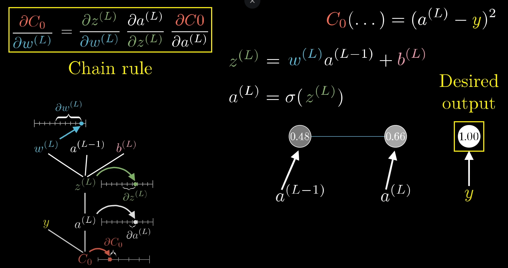

   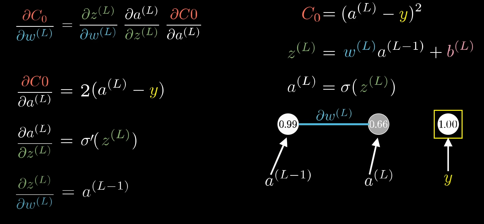

   这里我们以三个全连接神经元为例。 整体导数通过**链式法则**链接，公式如下：
   $$
   \frac{\partial C_{0}}{\partial w^{(L)}}=\frac{\partial z^{(L)}}{\partial w^{(L)}} \frac{\partial a^{(L)}}{\partial z^{(L)}} \frac{\partial C_{0}}{\partial a^{(L)}}
   $$ {最后一层}
   这是**损失函数与最后一个神经元$W$参数的偏导数（偏置 $bias$同样）**，可以看到每一个神经元都存在一个输出激活值和输入的梯度 $\frac{\partial z^{(L)}}{\partial w^{(L)}} \frac{\partial a^{(L)}}{\partial z^{(L)}}$
   $$ {最后一层}
   \begin{array}{rlrl}
   C_{0} & =\left(a^{(L)}-y\right)^{2} \\
   z^{(L)} & =w^{(L)} a^{(L-1)}+b^{(L)} \\
   a^{(L)} & =\sigma\left(z^{(L)}\right) \\
   \frac{\partial C_0}{\partial a^{(L)}} & =2\left(a^{(L)}-y\right) &  \\
   \frac{\partial a^{(L)}}{\partial z^{(L)}} & =\sigma^{\prime}\left(z^{(L)}\right)  \\
   \frac{\partial z^{(L)}}{\partial w^{(L)}} & =a^{(L-1)} & \\
   \frac{\partial a^{(L)}}{\partial w^{(L)}} & =  \sigma^{\prime}\left(z^{(L)}\right)  * a^{(L-1)}\\
   \frac{\partial C_{0}}{\partial w^{(L)}} & = 2\left(a^{(L)}-y\right) * \sigma^{\prime}\left(z^{(L)}\right)  * a^{(L-1)}
   \end{array}
   $$
   其中我们可以看到Siegrid Lowel非常著名的一句话“一同激活的神经元联系在一起”（Hebb的思想，一个生物元经常触发另外一个神经元，二者关系增强），**上一个神经元的激活值就是下一个神经元的导数多项式因子**。再根据$a^{(L-1)}$继续求导反向一个神经元，公式如下：
   $$
   \begin{array}{rlrl}
   \frac{\partial a^{(L-1)}}{\partial z^{(L-1)}} & =\sigma^{\prime}\left(z^{(L)}\right)  \\
   \frac{\partial z^{(L-1)}}{\partial w^{(L-1)}} & =a^{(L-2)} & \\
   \frac{\partial a^{(L-1)}}{\partial w^{(L-1)}} & = \sigma^{\prime}\left(z^{(L-1)}\right)  * a^{(L-2)}\\
   \frac{\partial C_{0}}{\partial w^{(L-1)}} & = 2\left(a^{(L)}-y\right) * \sigma^{\prime}\left(z^{(L)}\right)  * a^{(L-1)} * \sigma^{\prime}\left(z^{(L-1)}\right)  * a^{(L-2)}
   \end{array}
   $$
   此时该神经元的梯度就是上一个神经元的激活值与该神经元输入与激活输出的局部梯度相乘，一直反向传播到最开始的神经元就可以得到最早期的神经元输出。根据链式求导法则就可以求得每一个神经元的梯度。

   

   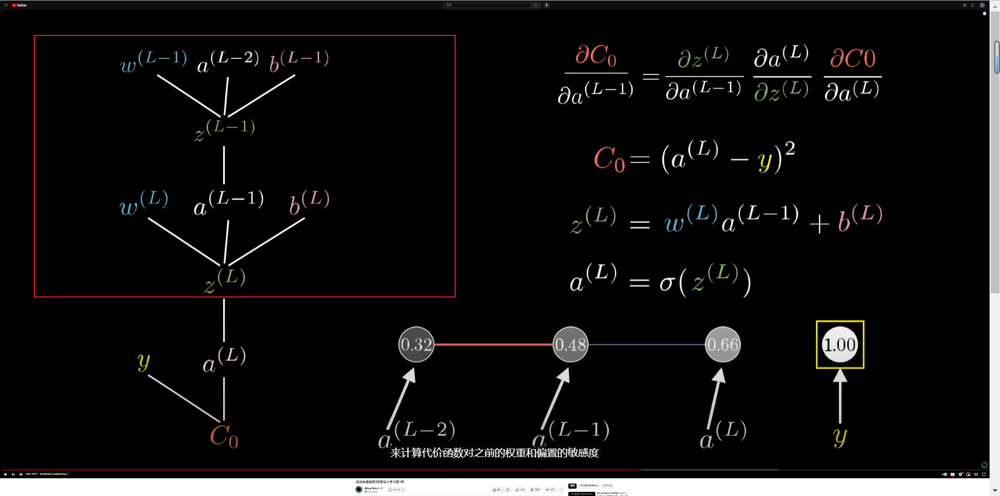

   这是三个单个神经元的过程，我们把他推广到多个神经元全连接：（其实只不过多了很多下标，整体流程是一致的，参数是矩阵形式，损失函数同时由多个神经元**共同影响累加**，整体**以层为单位累加求和**）

   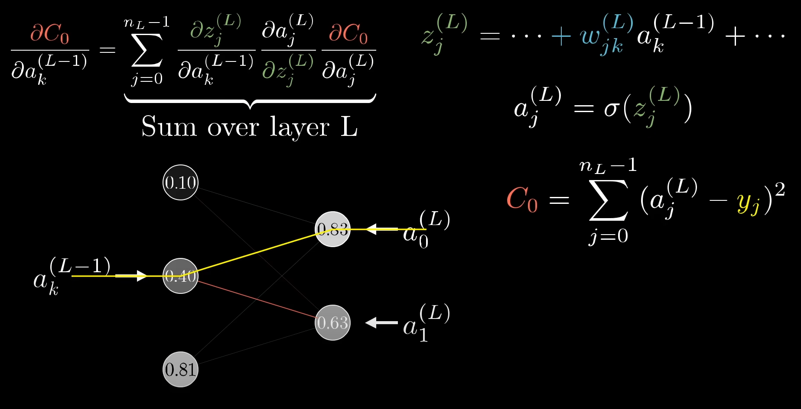

   我们精炼成两个关键步骤：

   - **计算局部梯度**：针对每个节点，**计算其相对于加权输入和输出之间关系（即激活函数）的偏导数（参数）**。
   - **链式规则**：利用链式规则（也称为复合函数求导法则），将局部梯度（**激活函数梯度$ \sigma^{\prime}\left(z^{(L)}\right)$**）乘以上游节点对该节点的贡献（**输入**$a^{(L-1)}$），以计算改神经元节点的梯度。（$\frac{\partial a^{(L)}}{\partial w^{(L)}}  =  \sigma^{\prime}\left(z^{(L)}\right)  * a^{(L-1)}$）

4. **计算参数梯度**：根据反向传播过程中计算得到的梯度信息，**对每个参数进行偏导数计算**。这可以通过将网络中各层的局部梯度与输入值（或前一层输出）相乘来实现。

5. **更新参数**：使用优化器（如随机梯度下降）根据参数的负梯度方向和学习率大小来更新模型中的权重和偏置项。

通过迭代执行以上步骤，不断调整神经网络的参数，使其能够更好地拟合训练数据，并在测试数据上表现出良好泛化能力。到这里，你就弄懂神经网络重要的部分，反向传播

如果你希望进一步了解反向传播算法及其相关细节，推荐以下资源：

1. 视频教程: Backpropagation in Neural Networks (https://www.youtube.com/watch?v=Ilg3gGewQ5U)  3Blue1Brown !! 
2. 博客文章: A Gentle Introduction to Backpropagation （LSTM) (https://machinelearningmastery.com/gentle-introduction-backpropagation/)
3. 课程笔记: CS231n Convolutional Neural Networks for Visual Recognition (http://cs231n.github.io/optimization-2/)

我们可以思考以下，如果在LSTM中等特殊改进神经单元，反向传播又是如何运行的呢？

答案是一样的： 我们的输出是 细	胞状态的正切激活 * 输入数据和隐藏状态拼接的激活函数， 由此根据每一个时间步链式求导每一个权重矩阵，在每一个矩阵中再次通过累加求和导数，以此类推得到梯度，通过偏导求和得到整体矩阵，参数更新）

### 梯度下降算法

>**正规方程法**（最小二乘）与**梯度下降法**都是为了求解线性回归的最优参数（求导致最少损失函数的参数解），但是不同的是正规方程法只需要一步就可以得到代价函数最优点，而梯度下降则是迭代下降，看起来似乎正规方程法要好得多，但实际梯度下降使用场景更多，下面我们介绍这两种算法以及优缺点  

#### 一、梯度下降
##### 1.1 一个参数

- 我们从最简单的线性方程解释，后面推广到的多个参数的方程

典型的房价预测问题
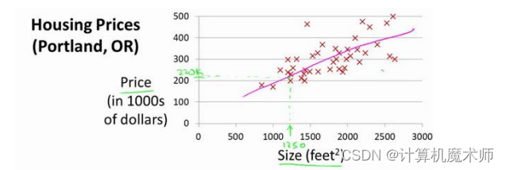

我们假设其数据模型为线性回归模型，方程如下
>$h_\theta(x)$ =  $\theta_1*x$  
>我们希望能求出$\theta_1$参数，让方程$h_\theta(x)$ 更加拟合数据，梯度下降的方法就是通过求**代价函数**最小得到最优参数或者局部最优参数的，

**代价函数**
代价函数就是实际数据与数学模型（这里是一元一次方程）所预测的差值的平方之和的平均值，（其中$y$ 为真实预测值） 
- $J_\theta(x)$ = $\sum_{x=1}^n  \frac{（h_\theta(x) - y）^2}{ n }$  （代价函数方程$J_\theta(x)$ ）

如：

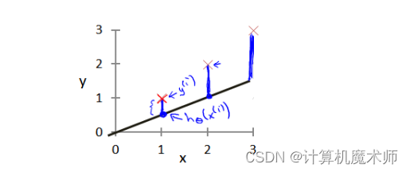

蓝线的长度就是**代价函数**，可以看到**代价函数**越大拟合效果越差，代价函数越小，拟合效果越好。

其中关于 **所求方程$h_\theta(x)$**（左图）和 $\theta_1$ 的的**代价函数**$(\theta_1)$(右图）如下图：

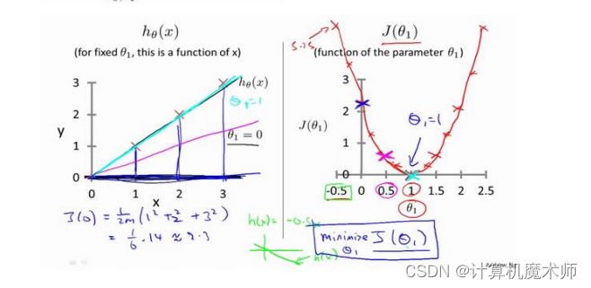

可以看到当方程越拟合数据，**代价函数**越小，当**代价函数**$J(\theta_1)$值为0时，回归方程$h_\theta(x)$完全拟合数据，此时我们要做的就是让代价函数变小。
（后面所讲的正规方程解法就是直接令代价函数为0，求解$\theta$参数的）

##### 1.2梯度下降核心方程

>迭代求解方程 
>$\theta_1$ = $\theta_1$ - $\alpha*\frac{δJ(\theta_1)}{δ\theta_1}$ 
>
>其中$\alpha$是**学习率**， $\frac{δJ(\theta_0)}{δ\theta_0}$ 是对**代价函数**$J(\theta_1)$求关于$\theta_1$ 的偏导数，由于只有一个参数（一阶），所以这里的方程 $\frac{δJ(\theta_1)}{δ\theta_1}$  也可以表示为 $\frac{dJ(\theta_1)}{d\theta_1}$ (即求导数）。
>原理讲解
>
>- 当$\theta_1$ 所在的代价函数区间是单调递增的，如下图（**红线标记**），
>此时$\frac{dJ(\theta_1)}{d\theta_1}$ （即$h_\theta(x)$的斜率）大于0，则$\theta_1$ = $\theta_1$ - $\alpha*\frac{δJ(\theta_1)}{δ\theta_1}$ 为 $\theta_1$ 减去一个正数，$\theta_1$往左边退（向代价函数最小值靠近），
>- 当$\theta_1$ 所在的代价函数区间是单调递减时的如图（**蓝线标记**），此时$\theta_1$ = $\theta_1$ - $\alpha*\frac{δJ(\theta_1)}{δ\theta_1}$ 为 $\theta_1$ 减去一个负数，$\theta_1$往右边退（向代价函数最小值靠近）

  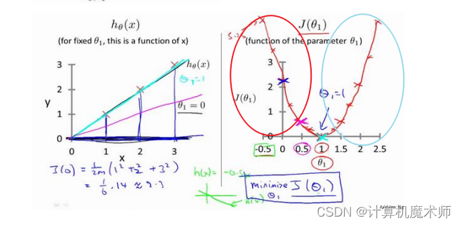
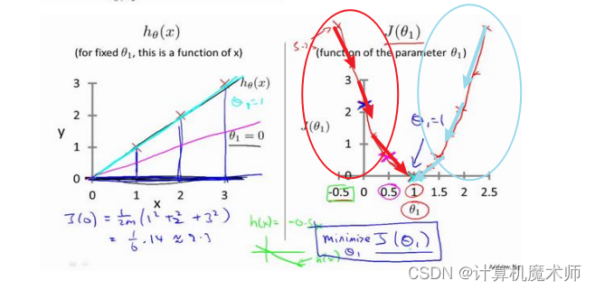

##### 1.3学习率$\alpha$
有时我们的迭代方程下降时，可能很缓慢，
需要走很多步（化很久时间）才能到达局部最优或者全局最优  如下图：

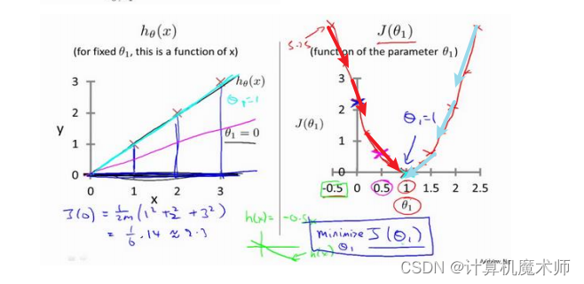

此时学习率$\alpha$的作用就是调整步子长度，让其更快的下降到局部最优或者全局最优
**注意**：
>$\alpha$需要根据数据调节，
>- 设置大了，走一步太大了跳到对面那一头了，与想要的结果违背，如图

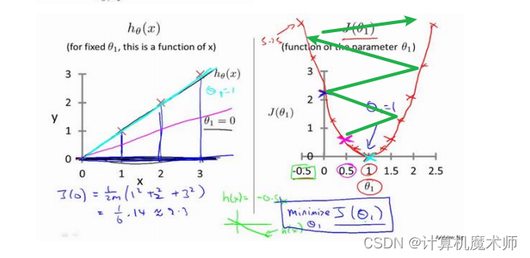

>- 设置小了，步子又太小，所以设置$\alpha$也是一个细活

##### 1.4两个参数

两个参数 $\theta_1$,$\theta_0$,方程为
>$h_\theta(x)$ =  $\theta_0 +$  $\theta_1*x$  

>迭代求解方程  (**注意**：参数是同步更新的，你的腿只能走一步）
>
>- $\theta_0$ = $\theta_0$ - $\alpha*\frac{δJ(\theta_0)}{δ\theta_0}$ 
>- $\theta_1$ = $\theta_1$ - $\alpha*\frac{δJ(\theta_1)}{δ\theta_1}$ 
>
>此时的代价函数为$J(\theta_0,\theta_1)$，如下图（是一个碗状，与一个参数的图像一样都是凹函数）
>

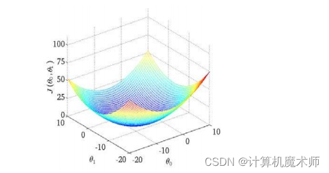

为了更好理解，我们可以绘制出其的等高线

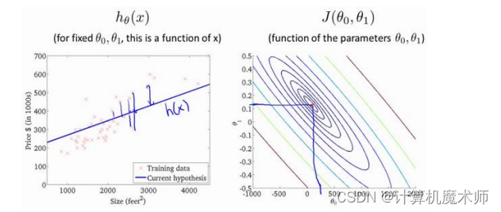

**则目标所求的既是 等高线中心 或 碗底，即让代价函数最小**

#####  1.5多个参数

在问题案例中，往往有个参数 $\theta_i(i=1,2,3...)$
>此时的代价方程则时关于多个$\theta_i$参数，如图
>

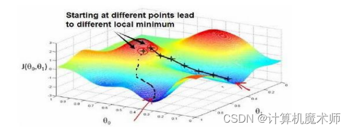

>迭代求解方程 (**注意**：参数是同步更新的，你的腿只能走一步）
>
>$\theta_0$ = $\theta_0$ - $\alpha*\frac{δJ(\theta_0)}{δ\theta_0}$ 
>$\theta_1$ = $\theta_1$ - $\alpha*\frac{δJ(\theta_1)}{δ\theta_1}$ 
>$\theta_2$ = $\theta_2$ - $\alpha*\frac{δJ(\theta_2)}{δ\theta_2}$
>........
>$\theta_n$ = $\theta_n$ - $\alpha*\frac{δJ(\theta_n)}{δ\theta_n}$

从中也可以看到在梯度下降迭代中，有两个最优结果（其他案例可能有许多），
>整个迭代过程可以形象的理解为 你现在在山顶，要找一条最快的路下山，山底就是你的目标地点，也就是**代价函数最小**

##### 1.6数据标准化
梯度下降在量化纲位不同，如果数
据范围分别是是【0~1000，0 ~5】或者【-0.00004 ~ 0.00002，10 ~ 30】, 那么在使用梯度下降算法时，他们的等高线是一个又窄又高的等高线，如下图：

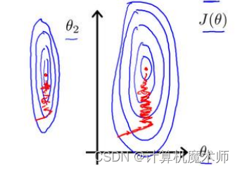

在梯度下降算法中，参数更新就会如上图左右震荡，收敛缓慢，我们就需要对特征进行**特征缩放---数据标准化**
详解见文章  [data preprocessing.md](data preprocessing.md) 

#### 二、正规解法

对正规解法来说，一般例子是对代价函数$J(θ)$求偏导数，令其为 0 便可以直接算出 最优参数$θ$,但大多数情况下$θ$是一个多维向量(即有多个参数 $\theta_i(i=1,2,3...)$），此时代价函数$f(θ)$是关于$θ$多维向量的函数，那么要求从$θ_0$ 到 $θ_n$的值，就分别对应的$θ_i$(i = 1,2,3,4....)求偏导数，并令其为0求其最优参数.

假设有M个数据，每个数据N个特征
方程如下：

> $θ = (x^T * x )^{-1}  *   x^T  *  y$

这里的$x$为矩阵，该矩阵每一行为$x_i(i=1,2,3...)$（$x_i$为列向量，维度为特征N）的向量转置组成，即任意一行的每一列为$x_i$其特征
$x$矩阵同下图A矩阵：

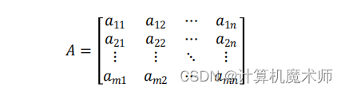

这里的 $a_{11}$代表第一个数据$x_1$的第一个特征值，依次往下，化简即为
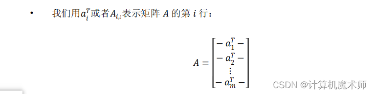

第一行即为$x_1$N维向量的的转置

方程原理讲解视频：

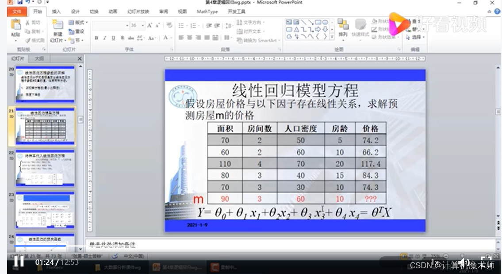

[【线性回归】正规方程（最小二乘法)】](https://live.csdn.net/v/215490?spm=1001.2014.3001.5501)

由于正规方程是直接求解，所以不需要迭代熟练，不需要“下山",所以不需要对其进行特征缩放（如梯度下降需要数据标准化）

##### 2，1 使用场景和优缺点
假设我们有M个数据集，N个特征

 -  >**梯度下降缺点**： 首先需要先**提前设定好学习率，并调试**，这无疑是**额外**的工作需要尝试不同的学习率 ，
    >**梯度下降缺点**：需要多次迭代下降，计算可能会更慢
 -  > **正规解法缺点**:在对于大量的数据来说，梯度学习也可以很好的运行结果，而正规方程求解中 $(x^T * x )^{-1}$ 这一步中，其维度即为x的特征维度，由于计算机在计算**矩阵的逆的时间复杂度时$O（n^3）$** ,在特征维度非常大时，运行时间很久，

综上所述：
可以看到他们二者适用场景 不同于数据的大小， 那我们怎么定义数据"大"还是"小"呢,  吴恩达老师给出了一个比较好的区间：

> **N > 10000  =>  梯度下降**
> **N < 10000  =>  正规解法**
> 但是不是绝对的判断，还需要根据情况而定

##### 2.2 正规方程（不可逆性）* 选读
>1. 方阵中的两个维度之间存在**线性变换关系**，导致方阵不满秩
>2. n（特征数量）相较于m（样本数量）过大，导致其产生的**齐次方程组Ax=0不只有零解**

这些不可逆的矩阵我们称为**奇异矩阵**，逆矩阵在不存在时，我们所求的逆矩阵为伪逆

实际上我们案例对应的情况有
>1. 如，房价预测多了一些特征值，而这个特征值和所有特征值有线性相关，即出现上述第一种情况
>2. 在特征n >= 数据集数量m的情况下，例如 10 个数据 ，每个数据有 100 个特征，那么我们所要求的`θ`就是一个101维向量，10个样本太少了，求得的结果偏离真实值，对应上述情况二，这个时候我们可以减去一些特征，或者使用正则化方法（l1,l2）

其实这种不可逆的情况非常少见，所以在平时案例不用特别担心

**随机梯度下降与全局梯度下降** 相比 计算量小，能够更快达到局部最优值

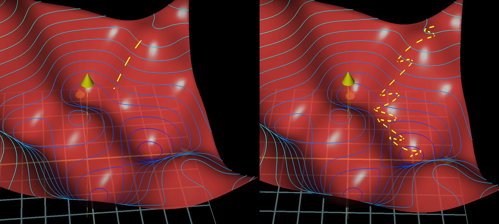

#### 梯度爆炸与消失

前置条件：**先弄懂反向传播算法之后才能快速领悟**。

梯度爆炸是指在使用梯度下降算法时，由于某些原因导致**梯度值变得非常大**，从而对**参数的更新**产生**巨大影响**。这可能会导致模型无法收敛或收敛速度过慢。

当神经网络层数较多、学习率设置过高或损失函数设计不合理时，就容易发生梯度爆炸现象。以下是一些可能引起梯度爆炸的原因（这其实就是根据反向传播的三个函数链式求导，一个是上一个神经元激活函数，一个是损失函数导数，一个是激活函数导数：

1. 激活函数选择（损失函数导数）：如果在神经网络中使用了具有**饱和性质**（如Sigmoid）的激活函数，并且权重初始化不当，则可能会出现数值上溢问题。当反向传播通过每一层传递时，sigmoid函数在**中间区域的斜率很敏感**变化很大，最终使得梯度变得异常大。
2. 参数初始化（激活函数导数）：如果权重参数初始化过大，则在前向传播和反向传播过程中都容易造成**数值溢出**问题。特别是在深层神经网络中，在后面的层级上发生**累积效应**并放大了初始错误。
3. 学习率设置（上一个神经元激活函数）：学习率决定了每次迭代更新参数时所采用的步长大小。如果学习率设置太大，每次**更新时参数的变化就会非常剧烈**，(即权重变大，数值上溢）可能导致梯度值爆炸。

>  饱和性质的激活函数是指在输入数据较大或较小时，激活函数的导数趋近于0，导致梯度消失或爆炸。这种情况下，神经网络可能会面临训练困难、收敛缓慢等问题。
>
>  常见的饱和性质的激活函数有Sigmoid函数和双曲正切（Tanh）函数。它们在输入接近极端值时，导数接近于0。对于Sigmoid函数而言，在输入非常大或非常小时，输出值会趋向于1或-1，并且导数几乎为0；对于Tanh函数而言，在输入非常大或非常小时，输出值也会趋向于1或-1，并且导数同样几乎为0。
>
>  相比之下，不饱和性质的激活函数没有上述问题并具有更好的表达能力。以下是两个例子：
>
>  **ReLU（Rectified Linear Unit）：**
>  ReLU是一种简单但广泛使用的不饱和性质的激活函数。当输入为正时，ReLU将保持原始值作为输出；当输入为负时，则返回零作为输出。ReLU在实践中被证明可以有效地解决梯度消失问题，并提高神经网络模型的训练速度与效果。
>
>  **Leaky ReLU：**
>  Leaky ReLU是对ReLU的改进，它在输入为负时不返回零，而是返回一个小的非零值。这样可以避免ReLU中出现的“神经元死亡”问题（即某些神经元永远不会被激活），并且有助于增加模型的表达能力。
>
>  总结起来，饱和性质的激活函数可能导致梯度消失或爆炸问题，并且限制了神经网络模型能够学习复杂特征表示的能力。而不饱和性质的激活函数（如ReLU、Leaky ReLU等）则可以解决这些问题，并提供更好的训练效果。选择适当的激活函数取决于具体任务需求和实际情况。

为了解决梯度爆炸问题，可以采取以下措施：

1. 权重初始化：合理选择权重的初始化方法，例如使用**Xavier（饱和函数）或He（不饱和函数）**等经典的初始化方法，并**避免初始权重过大**。

2. 激活函数选择：选用具有**较小饱和区域**并且能够缓解梯度爆炸问题的激活函数（如ReLU、Leaky ReLU）。

3. 梯度裁剪：通过**限制梯度值的范围来防止其过大**。一种常见做法是设置一个阈值，在反向传播过程中**对超出阈值范围的梯度进行裁剪。**

4. 调整学习率：降低学习率可以减轻梯度爆炸现象。可以**逐步减小学习率**或者使用**自适应优化算法**（如Adam、Adagrad），使得模型在训练过程中更加稳定。

总而言之，当发生梯度爆炸时，需要检查神经网络结构、参数初始化和学习率设置等因素，并根据情况采取相应调整以解决该问题。

梯度消失是指在深层神经网络中，随着反向传播过程的进行，**较早层的权重**更新变得**非常小或趋近于零**，导致这些层对整个网络参数的**学习贡献几乎为零**。这可能会导致模型**无法有效地学习和优化**。

以下是一些常见导致梯度消失问题的原因：

**1. 激活函数选择不当：**

- 一些常用的激活函数（如sigmoid、tanh）在输入值**接近饱和区域时具有很小的斜率**（求导很小）或者使用了饱和函数（如Relu系列）。 [activation.md](activation.md) 

>  1. 梯度爆炸：如果模型的权重初始化过大或者学习率设置过高，在反向传播过程中可能出现梯度爆炸的情况。由于ReLU在正区间上直接通过了所有正斜率部分，并没有对输入进行缩放操作，所以当激活值超过阈值后就无限制地增加了。这样就有可能导致下一层的反向传播时产生非常大的梯度值（**激活值大小**）。
>    
>     解决方法：
>     - 使用合适范围内的权重初始化策略。
>     - 调整学习率大小。
>     - 使用批量归一化（Batch Normalization）等技术来规范化激活值。
>
>  2. 梯度消失：当模型的权重初始化过小或者学习率设置过低时，ReLU函数在**负数区间上会输出零**。这意味着反向传播中对应的权重更新将变得非常小，甚至为零。这种情况下，网络很难学习到有效的特征表示。
>    
>     解决方法：
>     - 使用合适范围内的权重初始化策略。
>     - 调整学习率大小。
>     - 使用其他类型的激活函数（如Leaky ReLU、ELU等），它们**能够在负数区间上有一定斜率**。
>

- 当网络层数增加时，在多次应用这些激活函数后，梯度逐渐缩小到接近于零（**求导后累乘下溢**）。

**2. 权重初始化不合适：**

- 在深层神经网络中使用统一或过大/过小范围内初始化权重，可能会引发梯度消失问题（**不平衡分布，每个隐藏单元计算出来的特征表示也将高度相似（对称性）**，在更新参数时无法利用到各个隐藏单元之间不同特征的差异，导致网络学习能力受限。）
- 如果初始权重太小，则每次通过网络传播的信号将被削弱（**激活值小下溢**）；如果初始权重太大，则容易使得某些神经元进入饱和状态（**斜率变化小下溢**）。

**3. 大规模架构设计不良：**

- 构建一个非常深且复杂的神经网络结构时，信息必须通过**多个层级**进行传递，并且错误的设计可能会导致梯度消失。
- 过深的网络结构使得梯度在反向传播过程中需要经历多次相乘操作，从而容易受到**数值计算误差**和**指数级衰减**的影响（下溢或者上溢）。

**4. 数据预处理不当：**

- 不恰当的数据标准化或归一化方法可能导致**输入特征分布不均匀**（输入值或大或小，同样是导致上溢或者下溢，进而引发梯度消失问题。

为了应对梯度消失问题，可以尝试以下方法：

- 使用其他激活函数（如ReLU、Leaky ReLU等），它们不饱和**具有更大的斜率**并且在一定程度上缓解了梯度消失问题。
- 采用合适的权重初始化策略，例如Xavier初始化或He初始化。

>  Xavier初始化和He初始化是两种常用的权重初始化策略，它们旨在帮助神经网络模型更好地学习和收敛。
>
>  **Xavier初始化**（也称为Glorot初始化）：
>  Xavier初始化适用于**激活函数为`sigmoid`或`tanh`**的神经网络层。该方法根据**输入和输出节点数量**来确定初始权重值的范围，使得信号在前向传播时能够保持一定程度上的平衡。（由 Xavier Glorot 和 Yoshua Bengio 在2010年提出。）
>
>  具体步骤如下：
>  1. 针对每个权重矩阵W，在[-a, a]之间均匀随机采样初始值，其中a = sqrt(6 / (n_in + n_out))。
>     - n_in是输入节点数
>     - n_out是输出节点数
>
>  这种方式通过考虑**输入和输出维度**来推导合适的初始范围（**改神经网络层越复杂权重值越小**），并避免了梯度消失或爆炸等问题。实验证明，在训练深度神经网络时使用Xavier初始化可以加速收敛并提高模型性能。
>
>  **He初始化：**He初始化，也称为He正态分布初始化，是一种用于神经网络权重初始化的方法。它由Kaiming He等人在2015年提出，并被广泛应用于深度学习模型中。He初始化旨在解决激活函数为**线性修正单元（Rectified Linear Unit, ReLU）**时可能导致的梯度消失或爆炸问题。在**传统的随机权重初始化方法（如高斯分布、均匀分布）**下，如果网络较深且使用ReLU作为激活函数，则容易发生梯度消失或爆炸现象。（**由于其函数梯度原因激活值值会越来越大或者越来越小**）
>
>  -  He初始化通过将每个神经元层输入与一个**服从标准差为sqrt(2/n) 的高斯分布**进行采样来设置初始权重。 （其中n表示前一层神经元数量，输入点，**节点越多整体值分布越小**）
>
>  确保了输出信号在前向传播时能够更好地得到激活。He初始化在使用ReLU或其变种（如Leaky ReLU）作为激活函数时表现良好。其是一种**针对ReLU等非线性激活函数**的权重初始化方 法。
>

- 使用正则化技术（如批量归一化）来规范网络层之间的输入分布，并加速训练过程。
- 考虑使用**残差连接（如Resnet)、跳跃连接**等架构设计技术来减轻信息传递路径中信号被削弱或消失的影响。

理解和解决梯度消失问题是构建有效深层神经网络模型非常重要的一步。通过合理选择参数初始化、优化算法以及网络结构设计等手段可以克服这个问题，并提高模型的性能和收敛速度。

### 残差连接 & 跳跃连接 (Skip connection)

**跳跃连接**指的是将**输入数据直接添加到网络某一层输出之上**。这种设计使得信息可以更自由地流动，并且保留了原始输入数据中的细节和语义信息。 使信息更容易传播到后面的层次，避免了信息丢失。跳跃连接通常会**通过求和操作或拼接操作来实现。**

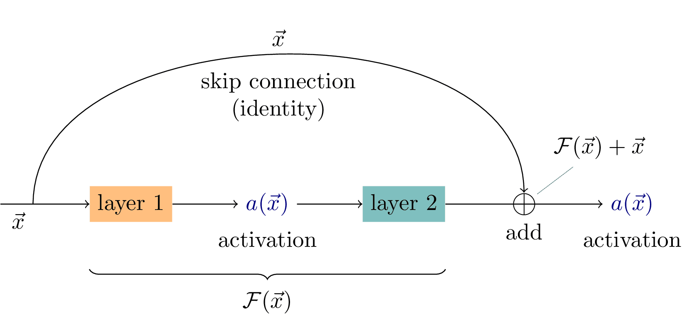

以图像分类任务为例，假设我们使用卷积神经网络进行特征提取，在每个卷积层后面都加入一个池化层来减小特征图尺寸。然而，池化操作可能导致信息损失。通过添加一个跳跃连接，将原始输入直接与最后一个池化层输出相加或拼接起来，可以保留原始图像中更多的细节和语义信息。

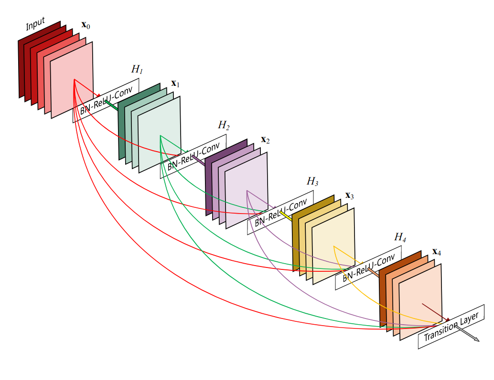

如果感兴趣了解更多，建议越多文章： 

非常经典的文章《All You Need to Know About Skip Connections》： https://www.analyticsvidhya.com/blog/2021/08/all-you-need-to-know-about-skip-connections/

**残差网络（Residual Network）**，也被称为`ResNet`，是一种深度神经网络架构，旨在解决梯度消失和训练困难的问题。它的核心思想是通过引入残差块（residual blocks）来构建网络，并通过跳跃连接将输入直接添加到层输出上。

它的核心思想是通过**引入残差块（residual blocks）来构建网络，并通过跳跃连接将输入直接添加到层输出上。**(残差块就是包含了`跳跃连接的block，扑捉偏差（残差）`)。具体而言，**在每个块或子模块内部，输入被加到该块/子模块计算后得到的输出上，并且这两者尺寸必须相同**。然后再将此结果送入下一个块/子模块进行处理。

下面是详细解释残差网络的步骤：

1. 基本结构：**每个残差块**由两个主要部分组成——**主路径和捷径**。主路径包含了一系列卷积、批归一化和非线性激活函数等操作，用于学习特征表示。**捷径是一个直接连接，将输入数据“跳过”了主路径中的所有操作。**

2. 捷径连接：在传统的卷积神经网络中，信息必须从前向后依次通过每个层进行传递并逐渐轻微地改变。而在残差网络中，**捷径连接允许信息更快地流动，在不同层之间形成了短路路径。**

3. 残差学习：对于每个残差块，在主路径内部会发生特征图尺寸缩小或通道数变化等情况。这样可能导致信息丢失或降低模型性能。为了解决这个问题，**残差网络采用了跳跃连接将输入直接添加到输出上**，使得模型可以学习到相对于期望输出的微小调整。

4. 深度扩展：**残差网络允许非常深的层次堆叠**，因为捷径连接提供了一个快速通道来**传播梯度和信息**。通过增加更多的残差块，网络可以逐渐变得更深，并且在一定程度上能够减少过拟合现象。

5. 预训练与微调：由于残差网络具有**良好的初始化特性**，**在大规模数据集上进行预训练**后往往能够获得较好的性能。然后可以**使用迁移学习（transfer learning）技术，在其他任务或数据集上进行微调以达到更好的效果。**

总结起来，残差网络通过引入捷径连接和利用残差学习机制来改善深层神经网络中的梯度消失、信息流动等问题。这些方法使得网络能够更轻松地训练，并且在图像分类、目标检测和语义分割等计算机视觉任务中取得了显著成果。

>  写到这，我突然想到那这种反向传播又如何训练呢？
>
>  其实ResNet的反向传播和训练过程与其他神经网络相似，只是引入了残差连接~~（多计算了一步~~，具体步骤还是如下
>
>  1. 前向传播：将输入数据通过网络从前到后进行前向传播。每个残差块中包含了多个卷积层、批归一化层和激活函数等操作。捷径连接将输入直接添加到主路径输出上。
>
>  2. 损失计算：在最后一个残差块或全局池化层之后，将得到的特征图作为输入并进行适当的降维操作（例如平均池化）。然后，利用分类器（如全连接层）对提取到的特征进行分类，并计算预测结果与真实标签之间的损失。（似乎都是这样，利用ResNet提取特征，迁移学习后进行分类）
>
>  3. 反向传播：根据损失值，在整个网络中执行反向传播来计算梯度。这样可以确定每个参数对于使损失最小化所起到的作用大小，并且梯度会沿着网络方向回溯以更新权重。
>
>  4. 权重更新：使用优化算法（如随机梯度下降SGD）根据计算出来的梯度来**更新所有网络参数（包括主路径和跳跃连接中使用到节点的参数）**。其实~~只是多计算更新了捷径这里多出来的参数~~并没有多算参数跳跃连接只是添加将数据添加到后面的神经元，总体参数并没有变化。
>
>  5. 迭代训练：重复执行前向传播、损失计算、反向传播和权重更新等步骤，直到达到预设的迭代次数或满足停止条件为止。每个迭代周期称为一个epoch。