# 计算机视觉

## IoU

在深度学习中，IoU代表交并比（Intersection over Union）。它是一种常用的评估指标，用于衡量目标检测、语义分割和实例分割等任务的性能。

交并比是通过计算预测边界框（或者像素级别的预测）与真实边界框之间的重叠程度来衡量模型的准确性。具体而言，交并比是通过将预测边界框和真实边界框的区域进行交集（Intersection）和并集（Union）操作来计算得出的。

交集表示两个边界框重叠的区域，而并集则表示两个边界框加起来的区域。IoU的计算公式如下所示：

IoU = (交集面积) / (并集面积)

IoU的取值范围在0到1之间，其中0表示完全不重叠，1表示完全重叠。通常情况下，较高的IoU值表示模型的预测结果与真实标注更为接近，因此在目标检测和分割任务中，较高的IoU值通常被认为是一个好的性能指标。

IoU分数是对象类别分割问题的标准性能度量 [1] 。 给定一组图像，IoU测量给出了在该组图像中存在的对象的预测区域和地面实况区域之间的相似性，并且由以下等式定义：

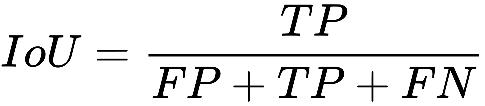

其中TP，FP和FN分别表示真阳性，假阳性和假阴性计数。

从上式可以看到IoU得分是基于计数的度量，而所提出的FCN的输出是表示像素是对象的一部分的可能性的概率值。 因此，无法直接从网络输出中准确测量IoU得分。所以使用概率值来近似IoU分数。 更正式地说，让

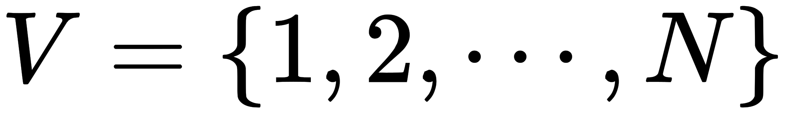

 是训练集中所有图像的所有像素的集合，X是表示集合V上的像素[概率](https://baike.baidu.com/item/概率/828845)的网络的输出（在sigmoid层之外），并且

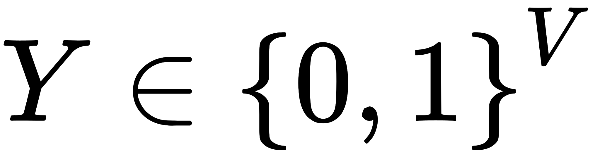

 是 集合V的地面实况分配，其中0表示背景像素，1表示对象像素。 然后，IoU计数可以定义为：

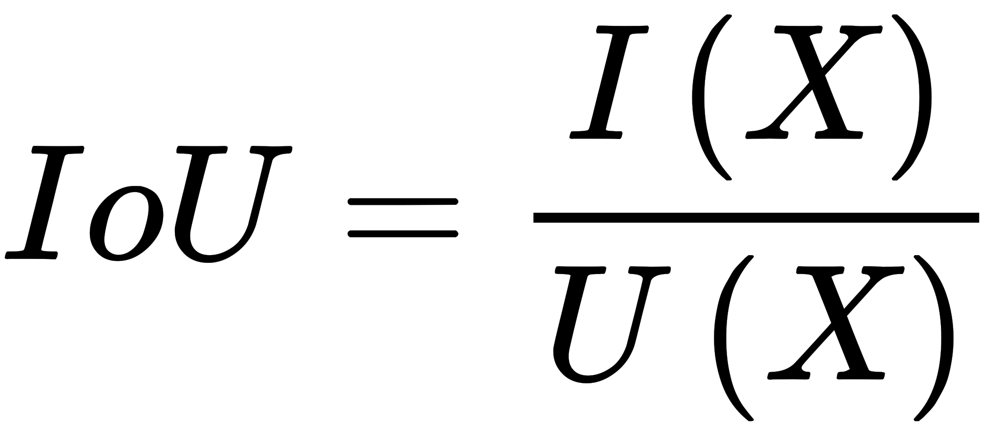

其中，

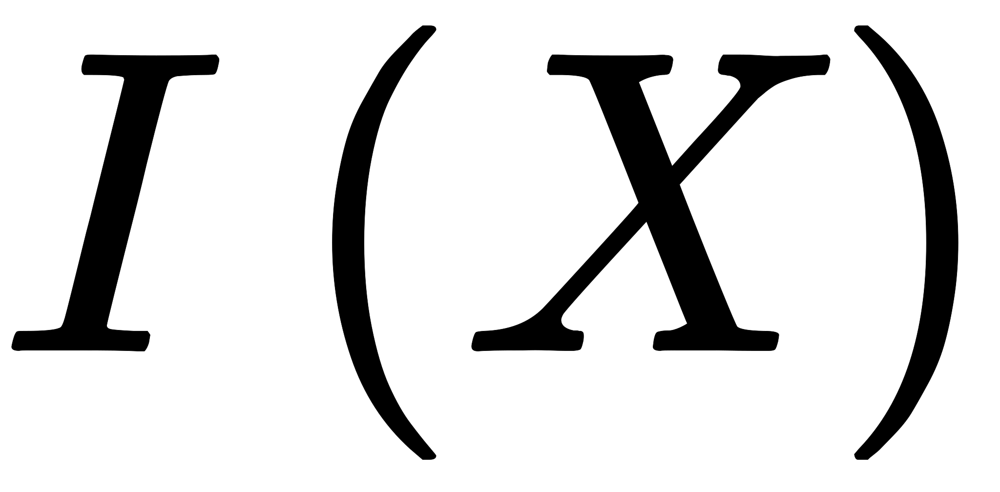

 和

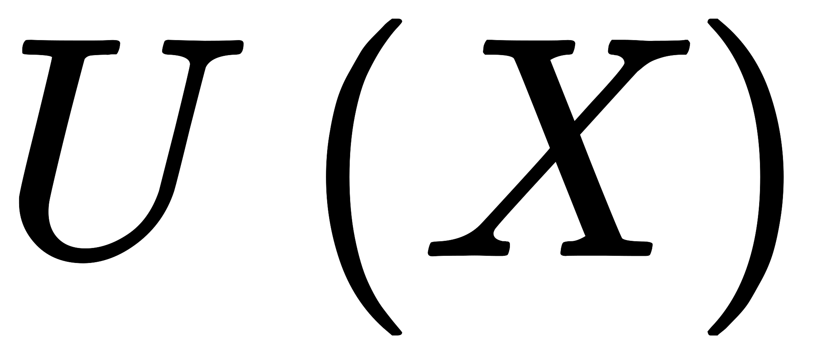

 可近似如下：

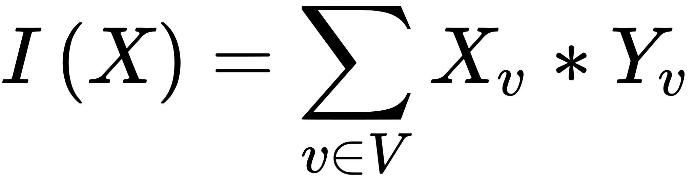

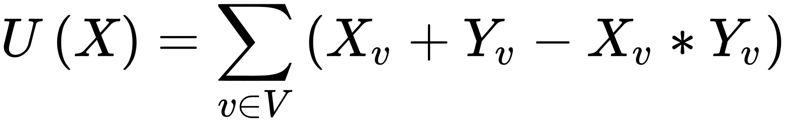

### IoU损失

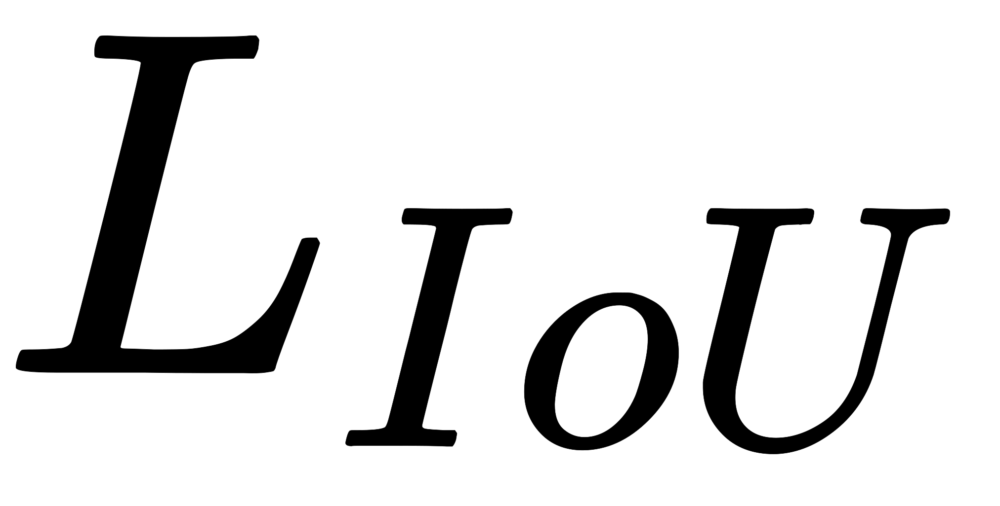

 可以定义如下：

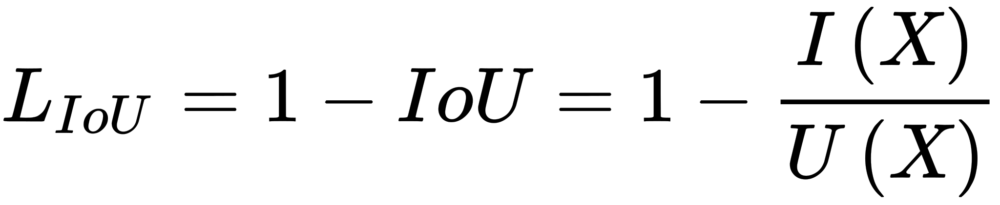

然后，将IoU损失LIoU纳入FCN的[目标函数](https://baike.baidu.com/item/目标函数/10829077)，其形式如下：

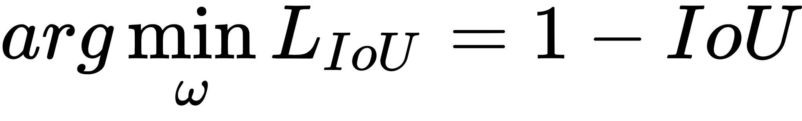

其中，w是深层网络的参数集 [1] 。

### 最佳参数组w

使用随机[梯度下降](https://baike.baidu.com/item/梯度下降/4864937)来解决,目标函数相对于网络输出的梯度可以写成如下：

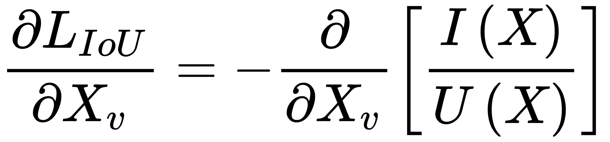

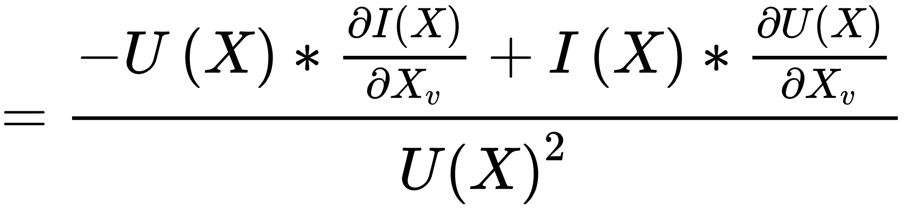

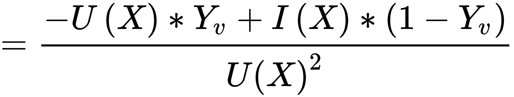

可以进一步简化如下：

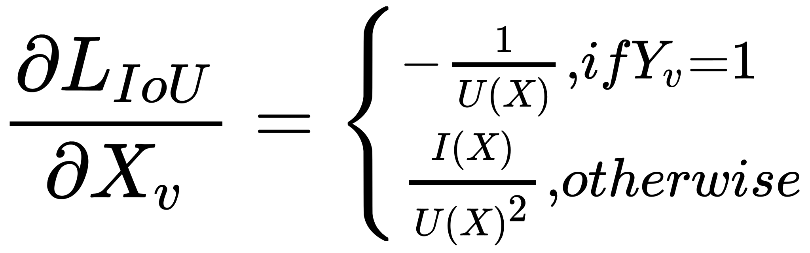

计算了目标函数相对于网络输出的梯度，可以使用导数的链规则简单地反向传播梯度，以便计算关于网络参数w的目标函数的导数。 [1]

### 去重叠

IOU（Intersection over Union）是一种常用的度量方法，通常应用在目标检测和图像分割等计算机视觉任务中。

在去重叠的应用中，IOU主要用于衡量两个边界框（bounding box）之间的重叠程度。当我们需要判断两个边界框是否相交或者评估一个预测框与真实标注框之间的匹配情况时，IOU是一个非常有用的指标。

具体来说，假设有两个边界框A和B，它们可以由左上角坐标$(x_1, y_1)$和右下角坐标$(x_2, y_2)$表示。那么IOU可以通过以下公式计算：

$$
\text{IOU} = \frac{{\text{Area of Overlap}}}{{\text{Area of Union}}}
$$

其中，“Overlap”指的是A和B相交区域的面积，“Union”指的是A和B并集区域（即两个边界框所覆盖总面积）。通过计算这个比值，我们可以得到一个介于0到1之间的数值作为衡量重叠程度的指标：0表示没有重叠，1表示完全重合。

在目标检测任务中，在进行非极大值抑制（NMS）时使用IOU来筛选掉高度重叠、冗余的边界框。通过设定一个IOU阈值，我们可以根据不同任务和需求来过滤掉重叠度高于阈值的边界框。

总结起来，IOU在去重叠的应用中是一种衡量两个边界框之间重叠程度的指标。它可以帮助我们评估目标检测结果的准确性、进行非极大值抑制等操作，并对计算机视觉相关任务具有重要作用。
