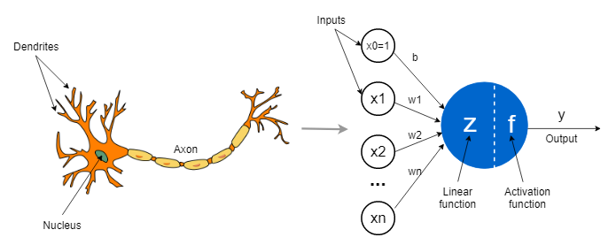
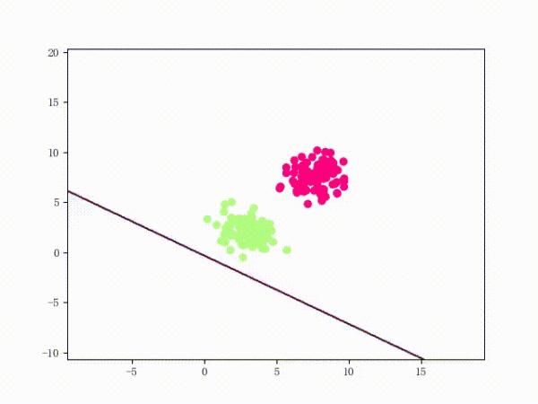
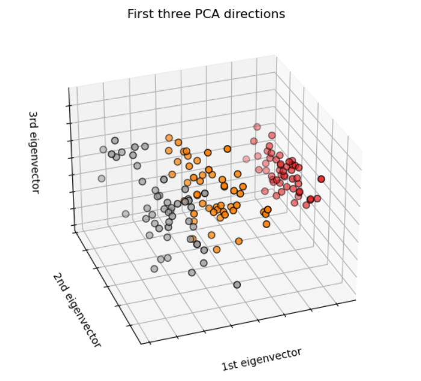
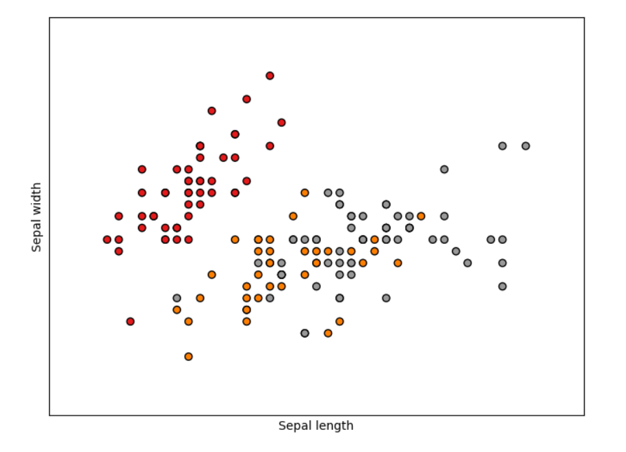

### 感知器 (Perceptron) & MLP-BP神经网络

阅读参考文献：

一个非常有趣的讲解 （**感知器是一种单层神经网络，而多层感知器则称为神经网络。**）： https://towardsdatascience.com/what-the-hell-is-perceptron-626217814f53  

#### 感知器

感知器是神经网络的 Fundamentals

在1977年由Frank Roseblatt 所发明的感知器是最简单的ANN架构之一（**线性函数加上硬阈值**，**这里阈值不一定是0**），受在一开始的生物神经元模型启发（`XOR`**问题逻辑问题**），称之为阈值逻辑单元（TLU，threshold logistic unit)  或线性阈	值单元（LTU,linear threshold unit)，其是一个**使用阶跃函数的神经元**来计算，可被用于线性可分二分类任务，也可设置多个感知器输出实现多输出分类以输出n个二进制结果（缺点是各种类别关系无法学习），一般来说还会添加一个偏置特征1来增加模型灵活性。



> 在感知器中引入一个偏置特征神经元1的目的是为了增加模型的灵活性和表达能力。这个偏置特征对应于一个固定且始终为1的输入，**其对应的权重称为偏置项（bias）。通过调整偏置项的权重，我们可以控制 TLU 的决策边界在特征空间中平移或倾斜**。（正常来说的话，这个偏置项都是在每个神经元当中所存在，而不是作为单独一个输入存在，能更灵活）
>
> > 在感知器中，将偏置特征固定为1的选择是为了方便计算和表示。
> >
> > 当我们引入一个偏置特征时，可以将其视为与其他输入特征一样的维度，并赋予它一个固定的值1。这样做有以下几个好处：
> >
> > 1. 方便计算：将偏置项乘以1相当于**直接使用权重来表示该偏置项**。在进行加权求和并应用阈值函数时，不需要额外操作或考虑。
> > 2. 参数统一性：通过将偏置项作为一个**独立的权重**进行处理，使得所有输入特征（包括原始输入和偏置）具有**相同的形式和统一性**。
> > 3. 简洁明了：固定为1的偏置特征能够**简化模型参数表示**，并使其更易理解和解释。
> >
> > 请注意，在实际应用中，对于某些任务可能需要调整默认值1以适应数据分布或优化模型性能。但基本原则仍然是保持一个常数值作为额外输入特征，并且通常会根据具体情况对其进行学习或调整。
>
> 具体来说，引入偏置特征1有以下几个原因： 
>
> 1. **平移决策边界**：通过调整偏置项的权重，可以使得决策边界沿着不同方向平移。如果没有偏置项，则决策边界将必须过原点(0, 0)。
>
> 2. 控制输出截距：当所有**其他输入都为零时，只有存在偏置项才能使感知器产生非零输出**。
>
> 3. 增强模型表达能力：引入一个额外维度后，在某些情况下会更容易找到**合适分割样本空间线性超平面位置**。
>
>    总之，在感知器中引入偏置特征1可以使模型更加灵活，能够适应不同的决策边界位置，并增加了模型对输入数据的表达能力。

其中，Siegrid Lowel非常著名的一句话“一同激活的神经元联系在一起”（Hebb的思想，一个生物元经常触发另外一个神经元，二者关系增强），故此Rosenblatt基于该规则提出一种**感知器训练算法**，其加强了有助于减少错误的连接，如果预测错了，比如预测目标是1，预测到0，就会增强对应神经元权重和偏置，如果预测目标是0，预测到1，就会减小。（根据阶跃函数性质值越大为1，值小为0）

以下是感知器训练算法的步骤（只有一层神经网络）：

1. 初始化参数：初始化权重向量 w 和偏置 b 为零或者随机小数。（一般来说感知器个数不多情况下，个数多则可以使用如神经网络的初始化如He初始化等）
2. 对每个训练样本进行迭代：
   - 计算预测输出 **y_hat = sign(w * x + b)**，其中 w 是权重向量，x 是输入特征向量，b 是偏置项，并且 sign() 函数表示取符号（正负，二分类为例）。
   - 更新权重和偏置：
      - 如果 **y_hat 等于实际标签 y，则无需更新参数**。
      - 如果 y_hat 不等于实际标签 y，则根据下面的规则更新参数：
         - 权重更新规则：w = w + η * (y - y_hat) * x，其中 η 是学习率（控制每次更新的步长）。
         - 偏置更新规则：b = b + η * (y - y_hat)。(偏移)

这个过程会不断迭代直到所有样本被正确分类或达到预定的停止条件（如达到最大迭代次数）。从以下我们就可以看到线性可分的感知机训练过程和线性不可分的感知机训练过程，在线性不可分的情况下，泛化能力较差。




#####  鸢尾花多分类案例

Sci-learn:https://scikit-learn.org/stable/auto_examples/datasets/plot_iris_dataset.html

Wikipedia:https://en.wikipedia.org/wiki/Iris_flower_data_set





我们从以上的可视化就可以知道，**用Perceptorn分类必然效果不好，因为其线性不可分**。

**不使用库**实现感知器**一对多策略多分类**鸢尾花数据集任务的代码：

```python
import numpy as np
from sklearn.datasets import load_iris
from sklearn.model_selection import train_test_split
from sklearn.metrics import accuracy_score


class Perceptron:
    """设计架构
    1. 初始化基本超参数
    2. 根据算法模型抽象化权重训练流程
    3. 训练中细分单个样本训练和预测中细分单个样本预测以实现多样本训练和预测"""
    def __init__(self, learning_rate=0.1, num_epochs=20):
        self.learning_rate = learning_rate
        self.num_epochs = num_epochs

    def train(self, X, y):
        # 添加偏置项到输入数据中
        X = np.insert(X, 0, 1, axis=1)

        # 初始化权重为随机值
        np.random.seed(42)
        self.weights = []

        # 训练模型（每个类别都有自己独立的感知器）
        for class_label in set(y): # 集合去重
            binary_labels = np.where(y == class_label, 1, -1) # True is 1 or False is  -1
#             print(binary_labels)
            weights_class = self.train_single_perceptron(X, binary_labels)
            self.weights.append(weights_class)

    def train_single_perceptron(self, X, y):
        weights = np.random.rand(X.shape[1]) # 随机初始化后训练（每个样本的特征数）
        for _ in range(self.num_epochs): #轮次
            for i in range(len(X)):
                prediction = self.predict_single_sample(X[i], weights) # 数据和权重求解
                error = y[i]-prediction
                # 更新权重
                update = self.learning_rate*error*X[i]
                weights += update
        return weights

    def predict_single_sample(self, x, weights):
        """receive x and weights return step function"""
        activation_value = np.dot(x, weights)
        return 1 if activation_value >= 0 else -1 # step function (corressponds to the previous binary_labels)

    def predict(self, X_test):
        X_test = np.insert(X_test, 0, 1, axis=1) # 同样需要插入偏置神经元1
        predictions = []
        for i in range(len(X_test)):
            class_predictions = []
            for perceptron_weights in self.weights:
                class_predictions.append(self.predict_single_sample(X_test[i], perceptron_weights))
            predicted_class = np.argmax(class_predictions) # 如果一样大返回最先的下标
#             print(class_predictions) 
#             print(predicted_class)
            predictions.append(predicted_class)
        return predictions


# 加载鸢尾花数据集（数据顺序排列，一定要打乱，泛化能力）
data = load_iris()
X_train, X_test, y_train, y_test = train_test_split(data.data, data.target, test_size=0.2, random_state=42) # 
# X_train, X_test, y_train, y_test = data.data[:120,:],data.data[120:,:],data.target[:120],data.target[120:] # , random_state=42
# 创建感知器对象并训练模型
perceptron = Perceptron()
perceptron.train(X_train, y_train)

# 使用测试数据集进行预测
predictions = perceptron.predict(X_test)
print(np.array(predictions))
print(y_test)
# print(type(y_test))

accuary = sum(predictions == y_test)/len(y_test) 
accuary = accuracy_score(y_test,predictions)
print(accuary)
```

输出

```
[1 0 1 0 1 0 0 2 1 1 2 0 0 0 0 0 2 1 1 2 0 2 0 2 2 2 1 2 0 0]
[1 0 2 1 1 0 1 2 1 1 2 0 0 0 0 1 2 1 1 2 0 2 0 2 2 2 2 2 0 0]
0.8333333333333334
```

**使用库**实现感知器分类鸢尾花数据集任务的代码：

```python
from sklearn.linear_model import Perceptron

# 加载鸢尾花数据集
data = load_iris()
X_train, X_test, y_train, y_test = train_test_split(
    data.data, data.target, test_size=0.2, random_state=42) # 随机数一样的话，随机结果是一样的
# data.data[:120,:],data.data[120:,:],data.target[:120],data.target[120:] #

# 创建并训练感知器模型
perceptron = Perceptron(eta0=0.1, max_iter=100)
perceptron.fit(X_train, y_train)

# 使用测试数据集进行预测
predictions = perceptron.predict(X_test)
print(predictions)
print(y_test)

accuary = sum(predictions == y_test)/len(y_test)
print(accuary)
```

输出：

```
[1 0 2 0 1 0 0 2 1 0 2 0 0 0 0 0 2 0 0 2 0 2 0 2 2 2 2 2 0 0]
[1 0 2 1 1 0 1 2 1 1 2 0 0 0 0 1 2 1 1 2 0 2 0 2 2 2 2 2 0 0]
0.8
```

>  `sklearn.linear_model.Perceptron`的参数：
>
>  - `penalty`: 惩罚项（默认值：None）。可以选择"l1"或"l2"来应用L1或L2正则化，也可以选择None不应用任何惩罚项。
>
>  - `alpha`: 正则化强度（默认值：0.0001）。较大的alpha表示更强的正则化。
>
>  - `fit_intercept`: 是否拟合截距（默认值：True）。如果设置为False，则模型将不会拟合截距。
>
>  - `max_iter`: 最大迭代次数（默认值：1000）。指定在达到收敛之前要执行的最大迭代次数。
>
>  - `tol`: 收敛容忍度（默认值：1e-3）。指定停止训练时目标函数改善小于该阈值时的容忍程度。
>
>  - `shuffle`: 是否在每个周期重新打乱数据顺序（默认值：True）。
>
>  - `eta0`: 初始学习率（默认值：1.0）。控制权重更新速度的学习率。较低的初始学习率可能有助于稳定模型收敛过程，但训练时间可能变长。
>
>  - `random_state`: 随机种子。提供一个整数以保证结果可重复性，或者设置为None以使用随机状态。
>
>  - `verbose`: 是否打印详细输出（默认值：0）。设置为1时，会定期打印出损失函数的值。
>

在这两个例子中，我们都使用了鸢尾花数据集，并将其分为训练和测试数据。然后，我们创建了一个感知器对象（自定义或Scikit-Learn提供的），并使用`train()`方法（自定义）或`fit()`方法（Scikit-Learn）来训练模型。最后，在测试数据上使用`predict()`方法来生成预测结果。（其中我们还可以设置一些超参数达到优化的目的）

>  扩展：
>
>  `MLPClassifier`和Keras中的`Dense`层都用于实现多层感知器（Multi-Layer Perceptron）模型。
>
>  在Scikit-Learn库中，`MLPClassifier`是一个基于神经网络的分类器，它使用反向传播算法进行训练，并可以处理多类别分类问题。你可以通过指定不同的参数来配置隐藏层、激活函数、优化算法等。
>
>  而在Keras库中，`Dense`层也被用作构建神经网络模型的一部分。它定义了全连接层（fully connected layer），其中每个输入节点与输出节点之间都有权重连接。你可以通过设置不同的参数来调整该层的大小、激活函数等。
>
>  虽然两者具有相似的功能，但由于框架和接口不同，它们在代码编写上可能会有所差异。因此，在使用时需要根据所选框架来适当调整代码。
>
>  总体上说，**“MLPClassifier”和Keras中“Dense”层都是为了实现多层感知器模型而设计的工具，在不同框架下提供了类似功能但语法略有差异。**

##### 应用场景

相比其他机器学习算法，感知器具有以下优势：

1. 简单而高效：感知器算法**非常简单且易于实现，计算速度快**。
2. 对噪声数据鲁棒：由于**其使用了阶跃函数作为激活函数，在处理带有噪声数据时表现较好**。
3. 支持在线学习：感知器是一种在线学习算法，可以逐步更新权重和阈值，并在每次迭代中对新样本进行训练。

然而，感知器也存在一些局限性：

1. **仅适用于线性可分问题**：由于其基于线性模型，在**处理非线性可分问题时无法取得良好的结果**。
2. **只能进行二分类**：感知器只能用于二分类任务，并**不能直接扩展**到多类别分类问题上。
3. **对输入特征缩放敏感**：感知器对输入特征的缩放比较敏感，如果**特征之间的尺度差异较大**（因为结果是根据值的大小决定的，所以在使用前需要数据特征归一化或者标准化），可能会影响算法的性能。

在实际应用中，当面对非线性可分问题时，可以考虑使用其他更复杂的模型，如支持向量机、神经网络等。这些模型具有更强大的表示能力，并且能够处理更为复杂和抽象的关系。然而，在某些简单问题上，感知器仍然是一个有效且高效的选择。

总结起来就是，感知器适用于解决线性可分二分类问题，并且**具有简单、高效和鲁棒等优点**。但它无法处理非线性可分问题，并且只能进行二分类任务。对于不同类型或更复杂的问题，可以考虑使用其他更适合的方法。

#### BP神经网络

`BP神经网络`，指的是用了**“BP算法”进行训练的“多层感知器模型”（MLP)。**并为了TLU感知机算法正常工 作，对MLP的架构进行了修改，即将阶跃函数替换成其他激活函数，如`tanh`，`Relu`。这里之所以用反向传播是因为多层的感知机无法再用感知机学习规则来训练. 

###卷积神经网络

确定卷积层的最佳数量以及它们对其他参数的影响是一个挑战性的任务，通常需要进行实验和调整来找到最佳的模型架构。

一般而言，卷积层数量的选择可以基于以下因素进行评估：

1. **数据集大小**和复杂程度：更大更复杂的数据集可能需要更深的卷积神经网络，以便提取更丰富的特征。较小的数据集则可能需要较浅的卷积神经网络，以避免过拟合。

2. 训练时长和计算资源：更深的卷积神经网络需要更长的训练时间和更多的计算资源。在限制时间和计算资源的情况下，可能需要权衡深度和精度。

3. 预训练模型的可用性：使用预训练模型可以减少训练时间并提高模型的精度。如果可用的预训练模型包含了与问题相关的卷积层，则可以考虑从这些层开始，然后通过微调来逐步优化模型。

除了卷积层的数量外，其他参数也会影响模型的性能。例如，卷积层的大小、步幅、填充等参数会影响特征图的大小和数量。池化层的类型、大小和步幅也会影响特征图的大小和数量，从而影响后续层的表现。因此，在设计卷积神经网络时，需要综合考虑这些参数，并进行实验和调整以找到最佳的模型结构。

> Q: CNN 1D与1至5个卷积层模型测试性能获得的准确性分别为88.36%、89.48%、88.86%、87.96和86.89%。五个1D CNN层是最大的界限，因为这个层上的函数图的最小尺寸已经超过了。
>
> A: 这个问题涉及到卷积神经网络中的**感受野（receptive field）概念**。
>
> 在卷积神经网络中，每一层的卷积核实际上是对上一层特征图的局部区域进行处理，而**该局部区域的大小就是该层的感受野大小**。这意味着，随着层数的增加，感受野也会逐渐扩大。
>
> 在1D CNN中，每个卷积核只能查看其左右固定数目的元素，这个固定数目就是感受野。因此，通过堆叠多个1D CNN层，可以使得后面的层拥有更大的感受野，从而提取更全局的特征。
>
> 但是，当1D CNN层数过多时，每一层的输出的长度也会逐步缩小。这是因为，在1D CNN中，卷积操作将输入向量的每个元素映射到输出向量的一个元素，因此每次卷积操作都会减少向量长度。随着层数的增加，输出向量的长度也会逐渐缩小，最终可能会导致信息丢失，从而影响模型性能。
>
> 因此，作者在该问题中使用了1至5个1D CNN层进行测试，并发现5层是极限。作者指出，当使用5个1D CNN层时，**最后一层的输出长度已经非常短，无法再添加更多的卷积层**。因此，**作者不能通过增加层数来进一步提高模型性能，而必须尝试其他方法，如调整卷积核大小、池化方式等**，以达到更好的性能。

### Transformer

注意力（Attention）机制由Bengio团队与2014年提出并在近年广泛的应用在深度学习中的各个领域，例如在计算机视觉方向用于捕捉图像上的感受野，或者NLP中用于定位关键token或者特征。谷歌团队近期提出的用于生成词向量的BERT[3]算法在NLP的11项任务中取得了效果的大幅提升，堪称2018年深度学习领域最振奋人心的消息。而BERT算法的最重要的部分便是本文中提出的Transformer的概念。

1. 背景和动机：作者采用Attention机制的原因是考虑到RNN（或者LSTM，GRU等）的计算限制为是顺序的，也就是说RNN相关算法只能从左向右依次计算或者从右向左依次计算，这种机制带来了两个问题：

   1. 时间片 t 的计算依赖 t−1 时刻的计算结果，这样限制了模型的并行能力；

   2. 传统的序列模型（如循环神经网络）存在着长期依赖问题，难以捕捉长距离的依赖关系。顺序计算的过程中信息会丢失，尽管LSTM等门机制的结构一定程度上缓解了长期依赖的问题，但是对于特别长期的依赖现象,LSTM依旧无能为力。

      > 长期依赖关系指的是在序列数据中存在较大时间间隔的依赖性。具体而言，在处理序列数据时，过去的信息对于当前和未来的预测具有重要影响。然而，传统的序列模型（如循环神经网络）在计算过程中存在**梯度消失或梯度爆炸问题，导致难以捕捉到长距离的依赖关系**。
      >
      > 当序列长度较长时，例如几十个或几百个时间步长，信息在每个时间步长传递过程中会经历多次连续的转换。在这个过程中，每个时间步长的输入都会通过一系列的乘法操作进行计算，其中包含一个权重矩阵，即循环神经网络中的参数。梯度在反向传播时通过这些乘法操作进行传递，每次乘法都可能使梯度变小或变大。
      >
      > 梯度消失问题意味着在反向传播过程中，梯度逐渐变小并最终趋近于零，导致远距离时间步长的信息无法有效更新。因此，模型可能无法捕捉到与该信息相关的长期依赖关系。相反，梯度爆炸问题指的是梯度在反向传播过程中变得非常大，导致数值不稳定和训练困难。
      >
      > 为了缓解长期依赖问题，LSTM（长短期记忆网络）引入了门控机制，通过选择性地遗忘和更新信息来控制梯度的流动。LSTM使用了一个称为"遗忘门"的结构，它可以**决定将多少过去的信息保留下来，并通过添加"输入门"决定引入多少新信息**。这些门控机制帮助LSTM模型更好地捕捉长期依赖关系，但**对于特别长期的依赖现象，LSTM仍然可能无法完全解决问题**。
      >
      > 近年来，一些新的序列模型如Transformer和GPT（生成式预训练模型）已经取得了重大突破。它们采用了自注意力机制，通过直接建模序列中所有位置之间的关系，能够更有效地捕捉长距离的依赖关系，从而提升了序列模型在处理长期依赖问题上的能力。

2. 自注意力机制（Self-Attention）：是 Transformer 模型的核心组件之一。自注意力允许模型根据输入序列中不同位置的相关性权重来计算每个位置的表示。通过计算查询、键和值之间的相似性得分，并将这些得分应用于值来获取加权和，从而生成每个位置的输出表示。

3. 编码器-解码器结构：Transformer 模型通常包含一个编码器和一个解码器。编码器负责将输入序列转换为一系列高级特征表示，而解码器则根据这些特征预测输出序列。编码器和解码器都由多层的自注意力层和前馈神经网络层组成。

4. 位置编码：由于 Transformer 模型没有显式的顺序信息，为了保留输入序列的位置信息，需要引入位置编码。位置编码是一种向输入嵌入中添加的特殊向量，用于表示单词或标记在序列中的位置。

5. 多头注意力：Transformer 模型允许同时使用多个自注意力机制，每个注意力机制被称为一个头（head）。通过并行计算多个头，模型可以学习不同粒度和关注不同方面的特征表示。

6. 前馈神经网络层：除了自注意力层之外，Transformer 模型还包括前馈神经网络层。该层由两个全连接层组成，并通过应用激活函数（如 ReLU）来处理输入特征。

7. 残差连接和层归一化：Transformer 模型使用残差连接（residual connections）来使梯度更容易传播，以及层归一化（layer normalization）来加速训练过程和提高模型性能。

8. 训练和推理：Transformer 模型通常使用基于自回归的训练方法进行训练，其中解码器的每个位置只能看到先前位置的输出。在推理阶段，可以利用已生成的部分序列作为输入来预测下一个标记，直到生成完整序列。

总之，Transformer 模型通过引入自注意力机制和并行计算的方式解决了传统序列模型中的长期依赖问题。它在自然语言处理任务中表现出色，并成为了许多重要NLP任务的基础，如机器翻译、文本生成和语言理解等。

