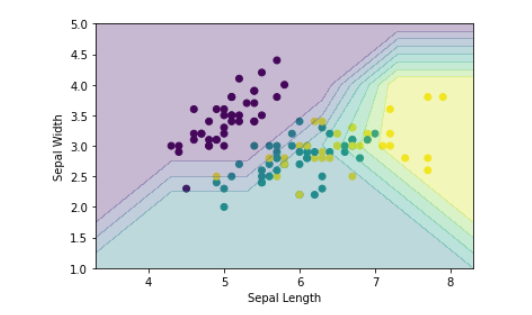
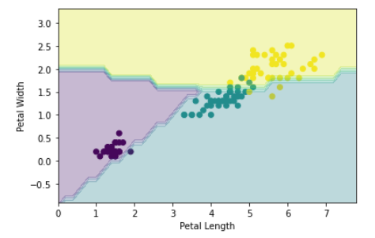
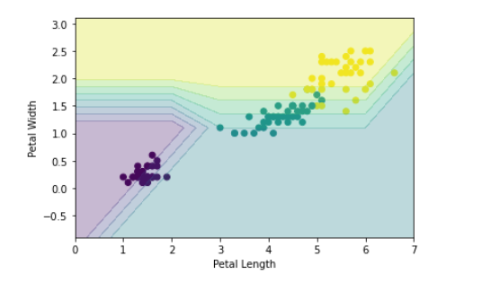

## 决策边界可视化

### Perceptron

在训练好高精度的模型，我们可以通过有效的可视化直观看到分类效果，相比于混淆矩阵等分类指标更加直观。如下示例就可以看出iris数据集的Sepal (花萼）相比 Petal （花瓣）更难分类

```python
import matplotlib.pyplot as plt
from sklearn.datasets import load_iris
from sklearn.model_selection import train_test_split
from sklearn.linear_model import Perceptron
# 加载鸢尾花数据集 
data = load_iris()
X_train, X_test, y_train, y_test = train_test_split(data.data[:,2:], data.target, test_size=0.2)

# 创建并训练感知器模型
perceptron = Perceptron()
perceptron.fit(X_train, y_train)

# 绘制散点图（每个类别用不同颜色表示）
plt.scatter(X_train[:, 0], X_train[:, 1], c=y_train) # just draw the length and width of sepal ，
# and the c paremeter get the array will draw different  color in different digital
plt.xlabel('Petal Length')
plt.ylabel('Petal Width')

# 添加决策边界到图中
x_min, x_max = X_train[:, 0].min() - 1, X_train[:, 0].max() + 1
y_min, y_max = X_train[:, 1].min() - 1, X_train[:, 1].max() + 1

xx, yy = np.meshgrid(np.arange(x_min, x_max), np.arange(y_min,y_max)) # depend on the two x and y lenth decide the array shape return the x and y axis np-array with interval 1 
# both have the same shape
# print(np.arange(x_min, x_max))
# print(np.arange(y_min,y_max))
# print(xx)
# print(xx.ravel())
# print(yy)
# print(yy.ravel())
Z = perceptron.predict(np.c_[xx.ravel(), yy.ravel()]) # draw the decision boundary (predict the per coordinate pair )
# print(np.c_[xx.ravel(), yy.ravel()])
Z = Z.reshape(xx.shape) # replace to the every grid
print(Z)
plt.contourf(xx ,yy ,Z,alpha=0.3)
plt.show()
accuary = sum(perceptron.predict(X_test) == y_test)/len(y_test) 
print(accuary)
```



或者我们的粒度再细一点，设置`np.arange(x_min, x_max, 0.2)`





对应的Prediction grid (可以看到反过来就是绘制等高线对应的图片）:

```
[[0 1 1 1 1 1 1 1]
 [0 0 1 1 1 1 1 1]
 [0 0 0 1 1 1 1 1]
 [2 2 2 2 2 2 2 1]
 [2 2 2 2 2 2 2 2]]
```

详解使用函数：

#### np.meshgrid()

`np.meshgrid()`函数用于生成一个二维网格，它以两个一维数组作为参数，分别表示 x 轴和 y 轴上的坐标点。该函数返回两个二维数组，这些**数组中的每个元素都代表了在坐标平面上某一点的 x 和 y 坐标。**

让我们来详细解释一下`np.meshgrid()`函数的具体用法：

```python
xx, yy = np.meshgrid(np.arange(x_min, x_max), np.arange(y_min,y_max))
```

- `np.arange(x_min, x_max)`：这是一个 NumPy 函数，用于创建一个从 `x_min` 到 `x_max - 1` 的连续整数序列。它将作为参数传递给 `np.meshgrid()` 函数，并**指定了在 x 轴方向上生成网格点所需的范围。**

- `np.arange(y_min,y_max)`：类似地同上

- `xx, yy = np.meshgrid(...)`：通过调用`np.meshgrid(np.arange(x_min, x_max), np.arange(y_min,y_max))`可以得到 xx 和 yy 这两个变量。其中 xx 是一个与 y 方向长度相同、横轴值变化而纵轴不变（即 y 方向不变）的二维数组；yy 是一个与 x 方向长度相同、纵轴值变化而横轴不变（即 x 方向不变）的二维数组。

这个函数对于在整个坐标空间上进行预测和可视化非常有用，因为它生成了一个包含所有可能组合的坐标点网格。

#### np.ravel() & np.c_

`np.ravel()`函数用于将多维数组展平为一维数组。它会按照 **C 风格（行优先）的顺序**来展开数组。

`np.c_()`用于**按列连接**两个或多个数组。它可以将**一维数组沿着列方向进行拼接**，**生成一个新的二维数组**。

#### plt.contourf()

`plt.contourf()`用于绘制等高线填充图。它可以根据数据的值来为不同区域着色，并在图表上显示出这些颜色区域之间的边界。

让我们详细解释一下`plt.contourf()`函数的具体用法：

```python
plt.contourf(X, Y, Z)
```

- `X`：表示 x 坐标点的二维数组或网格矩阵。
  
- `Y`：表示 y 坐标点的二维数组或网格矩阵。
  
- `Z`：表示对应于 `(X, Y)` **网格点位置处某种属性（例如，高度、温度等）的数值。**

通过传递以上参数给`plt.contourf()`函数，我们可以生成一个由**等高线填充区域**组成的图表。其中每个填充区域都代表了相应坐标点处属性数值所在范围内部分。	

此外，您还可以使用其他参数来自定义等高线填充图：

- `levels`: 通过设置 levels 参数来指定要显示哪些特定数值范围内部分，默认情况下会自动选择合适数量和范围。
  
- `colors`: 可以使用 colors 参数来指定所使用颜色映射（colormap），也可以直接传递一个颜色列表作为参数进行手动设置。

通过使用`plt.contourf()`函数，您可以以视觉方式展示二维数据的分布情况，并更好地理解和呈现数据。

#### 总结

>  总体而言，整个可视化原理也比较清晰明了。大概流程如下：
>
>  1.  根据对应的数据数组特征的Min和Max确定对应的数据范围（Arrange)
>  2.  根据数据范围通过`meshgrip`生成对应表格二维数组（返回每一个点的x和y的值（shape `(len(x),len(y)`)
>  3.  对数据进行铺平操作（`np.ravel()`)和拼接成数组(`np.c_`)对作为特征数据进行预测网格的每一个点。
>  4.  通过`plt.contourf`对网格点的每一个预测结果作为其属性画不同颜色等高线实现决策边界的绘制。🎉