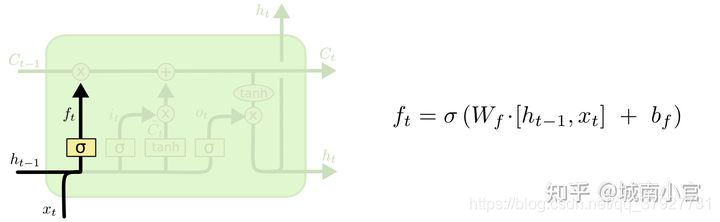
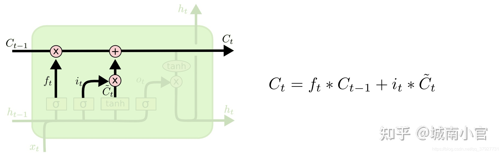
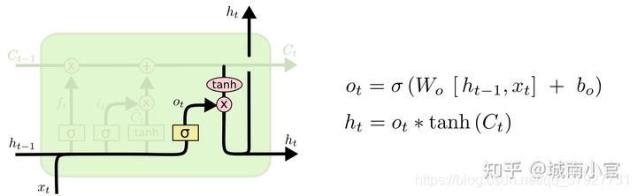

# BatchNormalization

### 原理概述

`tf.keras.layers.BatchNormalization`是深度学习模型中的一种正则化方法，可以减少模型的过拟合，使训练更加稳定。它在每个batch的数据上，对每个特征维度进行标准化操作，即将**每个特征的均值调整为0，方差调整为1**，然后通过**可学习的拉伸和偏移参数重新缩放和平移每个特征**，从而使得每个**特征的分布都比较接近标准正态分布**，以此来达到加速训练，提高模型精度的效果。

> 在使用 `BatchNormalization `进行标准化操作时，每个特征维度指的是每个样本中的每个特征的值。如果输入的是语音信号序列，则特征维度可能包括频谱、能量等等。在这种情况下，`BatchNormalization `将对每个样本中的每个特征进行标准化，以使得每个特征的分布相似，这样有助于提高模型的稳定性和泛化能力。
>
> 对于一维的语音信号序列，`BatchNormalization `操作仍然是对每个特征维度进行标准化操作，只是这里的**特征维度是指每个时间步上的语音信号振幅**，而不是一般意义上的二维特征。`BatchNormalization`在**每个时间步上对该时间步的所有样本的数据进行标准化处理**。在1D卷积神经网络中，时间步就是输入序列的每个位置，因此`BatchNormalization`会对该位置的所有样本的数据进行标准化。标准化可以使得不同时间步上的振幅具有相同的分布特性，有助于提高模型的泛化能力和训练效果。
>
> `BatchNormalization` **不会直接提取语音信号的特征，它只是在每个时间步上对输入进行标准化处理**，使得神经网络可以更好地学习到有用的语音特征。如果需要从语音信号中提取更加高级的特征，可以考虑使用卷积层、池化层等操作。

相比之下，`sklearn`的`StandardScaler`只是一种常用的数据预处理方法，用于将数据按特征进行标准化处理，即将每个特征的均值调整为0，方差调整为1，**但是没有可学习的参数，不能自适应地对每个batch的数据进行标准化**，因此不能像`BatchNormalization`一样在训练过程中对模型参数进行调整，从而使得训练更加稳定。

> Batch normalization是通过**可学习的拉伸(scale)和偏移(shift)参数重新缩放和平移每个特征**的。
>
> 在模型的训练过程中，==由于每一层的输入分布都在不断变化，使得后续的层难以拟合数据==。Batch normalization的思想就是通过对每一层的输入进行归一化，将每个特征都限制在均值为0，标准差为1的分布中，**使得网络中每层的输入都具有相似的分布，有利于后续层的训练和优化**。具体实现是对每个batch数据的每个特征分别进行均值和标准差的统计，然后使用**学习到的scale和shift参数对每个特征进行缩放和平移**。
>
> 与此不同，`sklearn`中的`StandardScaler`是对数据进行全局归一化，即对整个数据集的每个特征分别计算均值和标准差，并对整个数据集进行归一化处理。因此，Batch normalization在每个batch内计算均值和标准差，可以更加灵活地适应不同的数据分布，而`StandardScaler`只能使用全局的统计量进行归一化，适用范围相对较窄。

### 参数详解

`BatchNormalization` 是一种用于深度学习神经网络中的标准化方法，用于加速训练速度和提高模型性能。以下是 `BatchNormalization` 中常用的参数：

- `momentum`：动量，用于控制更新时的加权平均，通常设置在0.9左右。
- `epsilon`：在归一化中用于防止除以零的小常数。
- `center`：是否应将 `beta` 添加到归一化的值中，默认为 `True`。
- `scale`：是否应将 `gamma` 添加到归一化的值中，默认为 `True`。
- `beta_initializer`：`beta` 的权重初始化函数，默认为 `zeros`。
- `gamma_initializer`：`gamma` 的权重初始化函数，默认为 `ones`。
- `moving_mean_initializer`：移动平均值的初始化函数，默认为 `zeros`。
- `moving_variance_initializer`：移动方差的初始化函数，默认为 `ones`。
- `beta_regularizer`：`beta` 的正则化方法，默认为 `None`。
- `gamma_regularizer`：`gamma` 的正则化方法，默认为 `None`。
- `beta_constraint`：`beta` 的约束函数，默认为 `None`。
- `gamma_constraint`：`gamma` 的约束函数，默认为 `None`。

其中，`beta` 和 `gamma` 分别是标准化后的特征向量加上偏移和缩放的参数，`moving_mean` 和 `moving_variance` 则是用于跟踪每个特征在训练期间的平均值和方差，并在预测时使用。在训练期间，`BatchNormalization` 通过计算输入数据在特征维度上的均值和标准差来标准化数据，而在预测期间，则使用之前记录下的 `moving_mean` 和 `moving_variance` 来标准化数据。这样做可以帮助模型更好地适应新的数据，并且加速了训练过程。

### 反复归一

Batch normalization是一种针对神经网络中每层输入进行归一化的技术，主要目的是使得神经网络中每层的输入分布更加稳定，从而提升模型的训练效果。一般来说，在训练深度神经网络的过程中，我们会**对每一层的输入数据进行标准化操作，即对每个特征维度进行标准化，以保证数据分布的稳定性**。

在模型中使用了多个全连接层时，**每个全连接层都会引入新的参数和非线性变换，从而改变输入数据的分布**。如果不进行`batch normalization`，则后面每一层的输入分布可能会发生变化，从而影响模型的学习能力。因此，即使前面已经进行了`batch normalization`，也需要在后面的全连接层之前再`batch normalization`

在一次深度学习模型中，`BatchNormalization`一般是在卷积层或者全连接层之后使用的。如果一开始已经对输入进行了`BatchNormalization`操作，那么在后续的层中仍然可以使用`BatchNormalization`进行进一步的归一化，但是在这种情况下，需要注意两个问题：

1. 数据归一化的方式要一致：如果一开始对输入进行了`BatchNormalization`操作，那么**后续的层也需要使用相同的均值和方差进行归一化，以保证数据分布的一致性**。
2. 是否需要进行归一化的判断：如果后续的层已经足够深，可以通过自身的归一化操作保证数据分布的一致性，那么就可以不再进行`BatchNormalization`的操作。否则，可以考虑在该层之后再次使用`BatchNormalization`来保证数据分布的一致性。

需要注意的是，`BatchNormalization`的使用是具有一定的灵活性的，需要结合具体的模型和实际的问题进行综合考虑。

# Conv1D

### 原理概述

> 卷积（Convolution）这个名词最初来源于数学领域，指的是两个函数之间的一种数学运算，也称为函数的乘积积分。在深度学习中，卷积操作是通过将一个输入信号与一个卷积核进行卷积运算来提取特征。在这个过程中，**卷积核会在输入信号上滑动，并在每个位置进行一次乘积累加的计算**，最终得到一个输出特征图。因此，这个操作被称为卷积。

`layers.Conv1D` 是 `Keras` 中用于一维卷积操作的层，可用于处理时序数据（例如音频、文本）。一维卷积是指在单个方向（通常是时间轴）上进行的卷积操作。

一维卷积操作的原理与二维卷积类似，都是通过滑动一个固定大小的卷积核（即滤波器）在输入上进行卷积操作。在一维卷积中，卷积核是一个长度为 `k` 的一维张量，用于对输入的每个时间步进行滤波操作。卷积核的大小会影响到卷积后的输出形状，具体可以使用下面的公式计算：

$\text{output-length} = \lfloor \frac{\text{input-length} - \text{kernel-size} + 2\text{padding}}{\text{stride}} + 1 \rfloor$

其中，`input_length` 是输入张量的时间步数，`kernel_size` 是卷积核的大小，`padding` 是补零操作的大小，`stride` 是卷积核在输入上滑动的步幅。

`layers.Conv1D` 层可以设置多个参数，例如卷积核的大小、步幅、填充方式、激活函数等等。通过调整这些参数，可以**有效地提取输入数据中的时序特征**，用于后续的分类、回归等任务。

假设输入的数据为 $x$，卷积核为 $w$，偏置为 $b$，步长为 $s$，padding的大小为 $p$。

**对于一维卷积，我们可以将 $x$ 和 $w$ 的维度都表示为长度**，即：

$x=[x_1,x_2,x_3,…,x_n]$

$w=[w_1,w_2,w_3,…,w_m]$

则在不考虑padding的情况下，输出的每个元素 $y_i$ 可以表示为：


其中，$i$ 表示输出的位置，$j$ 表示卷积核的位置，$s$ 表示步长。而考虑padding的情况下，可以将 $x$ 在两端分别加上 $p$ 个 0，然后代入上述公式即可。 

需要注意的是，一般情况下我们会在卷积层后面添加一个激活函数来引入非线性。在这个公式中，我们没有考虑激活函数的影响。

> 一维卷积和二维卷积的区别在于卷积操作的维度不同。
>
> 在一维卷积中，卷积核只会在一个方向上进行滑动操作，例如在处理时间序列数据时，卷积核只会在时间轴上进行滑动操作。
>
> 而在二维卷积中，卷积核会在两个方向上进行滑动操作，例如在处理图像数据时，卷积核会在图像的高度和宽度上进行滑动操作。
>
> 因此，一维卷积和二维卷积的计算方式略有不同，但**本质上都是将卷积核与输入数据进行点积运算，得到特征图作为下一层的输入。**
>
> > 点积运算是指**两个向量中对应位置的元素相乘，并将所有结果相加的运算**。对于两个长度为n的向量a和b，它们的点积运算结果为：
> >
> > $a·b = a[0]*b[0] + a[1]*b[1] + ... + a[n-1]*b[n-1]$
> >
> > 点积运算在机器学习中广泛应用，例如在神经网络中，**两个向量的点积可以表示它们的相似度**，从而用于计算神经元的输出值或者用于计算损失函数。另外，在计算卷积神经网络中的卷积操作时，通常采用卷积核和输入数据的点积运算来得到卷积的结果。
> >

### 参数详解

`layers.Conv1D` 是 `TensorFlow Keras` 中的一维卷积层，用于处理一维的输入数据，例如时间序列数据。

该层的主要参数如下：

- `filters`: 整数，输出空间的维度（即卷积核的个数）。
- `kernel_size`: 整数或由一个整数构成的元组/列表，卷积核的空间或时间维度大小。

> Conv1D的卷积核个数是指卷积层使用的滤波器个数，它决定了卷积层的输出通道数。具体来说，每个卷积核会对输入数据进行一次卷积操作，并生成一个输出通道。因此，卷积核的个数会直接影响卷积层输出的维度。更多的卷积核可以让模型更加复杂，能够捕获更多的特征信息，但也会增加模型的参数数量，增加过拟合的风险。在设计模型时，需要根据具体的任务和数据集进行选择。
>
> > 如果你设置了六个长度为3的卷积核，那么每个卷积核的权重矩阵的形状将会是`(3, input_channels, 6)`，其中`input_channels`是**输入数据的特征维度**。这表示每个卷积核都是一维的，其大小为3，且有6个不同的卷积核。在进行卷积运算时，输入数据中的**每个时刻都会和6个不同的卷积核进行卷积操作**，得到6个卷积后的输出结果，这些结果将被连接成一个更高维的输出张量。设置卷积核数量的大小通常取决于特定的任务和数据，可以通过实验和调参来确定。

- `strides`: 整数或由一个整数构成的元组/列表，卷积核的步长。默认为 1。
- `padding`: 字符串，补齐策略（'valid' 或 'same'）。默认为 'valid'。
- `activation`: 字符串或可调用对象，激活函数。如果不指定，将不应用任何激活函数。
- `use_bias`: 布尔值，是否使用偏置。
- `kernel_initializer`: 卷积核的初始化器。如果不指定，将使用默认的 `Glorot `均匀分布初始化。
- `bias_initializer`: 偏置的初始化器。如果不指定，将使用默认的零初始化。
- `kernel_regularizer`: 卷积核的正则化器，可以使用 L1、L2 等正则化方式。
- `bias_regularizer`: 偏置的正则化器，可以使用 L1、L2 等正则化方式。
- `activity_regularizer`: 输出的正则化器，可以使用 L1、L2 等正则化方式。
- `kernel_constraint`: 卷积核的约束，可以使用非负值约束、最大范数约束等。
- `bias_constraint`: 偏置的约束，可以使用非负值约束、最大范数约束等。

需要注意的是，**该层的输入应该是一个三维张量，形状为 `(batch_size, steps, input_dim)`**，其中 `steps` 表示时间步数，`input_dim` 表示每个时间步的输入特征维度。该层的输出是一个三维张量，形状为 `(batch_size, new_steps, filters)`，其中 `new_steps` 是经过卷积和补齐后的时间步数，与原来的时间步数有关。

卷积核个数和长度的设定一般需要结合具体的任务需求和数据特征来进行选择，没有一个通用的标准或参考。不过一些常用的选择方式包括：

1. 根据数据集大小和计算资源设定。如果数据集较小，可以适当减少卷积核个数和长度以防止过拟合；如果计算资源有限，可以适当减少卷积核个数和长度以减少计算量。
2. 根据任务复杂度和模型深度设定。对于比较简单的任务，可以适当减少卷积核个数和长度以降低模型复杂度；对于比较深层次的模型，可以适当增加卷积核个数和长度以增强模型的表达能力。
3. 根据先验知识和经验设定。根据具体的应用场景和数据特征，可以从先验知识和经验出发，选择适合的卷积核个数和长度，比如一些领域专家可能已经发现了一些有效的卷积核选择方式。

需要注意的是，卷积核个数和长度的选择是需要根据具体情况进行尝试和调整的，不同的选择可能会产生不同的效果，需要根据实验结果来进行选择。

### 输入与输出

卷积层的输入通常是一个张量，其形状为(batch_size, input_length, input_channels)，其中batch_size表示输入的样本数量，input_length表示输入序列的长度，input_channels表示输入序列每个位置上的特征维度数量。

卷积层的输出也是一个张量，其**形状取决于卷积层的参数设置**。在一维卷积层中，如果使用padding="valid"，那么输出的形状为(batch_size, output_length, filters)，其中output_length表示输出序列的长度，filters表示卷积核的个数（**即输出序列每个位置上的特征维度数量**）。如果使用padding="same"，那么输出的形状为(batch_size, input_length, filters)，即与输入序列的长度保持一致。

> 在一维卷积中，通过对输入序列进行卷积操作，可以生成一个输出序列，输出序列的长度可以通过公式计算得到。假设输入序列的长度为L，卷积核的长度为K，步幅为S，输出序列的长度可以通过以下公式计算：
>
> $output\_length = (L - K) / S + 1$
>
> 其中，L表示输入序列的长度，K表示卷积核的长度，S表示步幅。因为卷积核在进行卷积操作时会向后滑动，每次移动的步幅为S，因此输出序列的长度会根据步幅和卷积核的长度而变化。如果步幅较大或者卷积核的长度较长，那么输出序列的长度就会相应地变短。

在二维卷积层中，输出的形状也取决于卷积层的参数设置，但是其基本形式为(batch_size, output_height, output_width, filters)，其中output_height和output_width表示输出特征图的高度和宽度，filters表示卷积核的个数（即输出特征图每个位置上的特征维度数量）。

需要注意的是，在卷积层中，**每个卷积核的参数对于输入是共享的**，即卷积核在输入张量的每个位置上进行卷积时使用的是相同的参数。这样可以大大减少模型的参数数量，同时也可以增强模型的泛化能力。

> 如果使用多个卷积核进行卷积操作，它们所提取的特征可能不同，因为它们所学习的卷积核参数不同。每个卷积核学习到的是不同的特征，通过使用多个卷积核，模型可以同时学习到多种不同的特征，从而提高模型的性能。

### 多次卷积

在卷积层后再次添加卷积层是一种常见的神经网络架构，其主要目的是在学习更高层次的特征表示，例如在计算机视觉任务中，第一层卷积层可以学习到简单的边缘特征，而第二层卷积层可以学习到更加复杂的形状和纹理特征。因此，通过多层卷积层堆叠，可以逐渐学习到更加抽象和高级的特征表示。

> 举例子如: 第一次卷积层后的维度是（None, 431,64) 输入到同样的卷积层（卷积核个数64个，长度3）输出维度也是（None, 431,64)

每个卷积核卷积时是在所有64列上进行的，因此每个卷积核的输出将是一个1维向量。**64 个卷积核的输出将组合成一个 64 维向量，即使进行多次卷积，也不会导致输出的维度增加**。在卷积层中使用多个卷积核的原因是为了捕获输入数据中的不同特征。每个卷积核的输出是一个捕获到的特征映射，这些特征映射通过叠加的方式组成了一个64维向量。具体地说，**这个64维向量是将每个特征映射在时间轴上的输出值取平均得到的。这个过程可以看作是在对输入数据进行一种降维操作，将捕获到的不同特征映射组合成一个向量表示整个输入数据的特征**。

# DropOut

### 原理概述

在深度学习中，过拟合是一个常见的问题，即模型在训练集上表现很好，但在测试集上表现不佳。为了防止过拟合，**可以使用正则化技术或者在模型中加入一些随机性**。

其中一种常见的随机性技术就是 Dropout，它在训练过程中**随机地将一部分神经元输出置为0**，这样可以减少神经元之间的依赖关系，降低模型的复杂度，提高模型的泛化能力。

Dropout 层的原理很简单：它在训练过程中随机选择一部分神经元，并将其输出设置为0。这里的“一部分”指的是 Dropout 层的参数 p，它表示要置为0的神经元比例。在测试过程中，Dropout 层不会对神经元进行随机的置0操作。

Dropout 的实现方式是，在前向传播过程中，对于每个神经元的输出，以概率 p 将其置为0，以概率 1-p 将其保留。在反向传播时，被置为0的神经元对损失函数的贡献为0，**因此不会对参数更新产生影响**。

这样，通过在训练过程中随机地舍弃一些神经元，可以有效地防止模型过拟合，并提高模型的泛化能力。

>  Dropout 是在训练过程中以一定概率随机丢弃一些神经元，可以看作是模型集成中的一种方法。在模型集成中，每个模型都相当于在训练过程中随机从原始网络中丢弃一些神经元，从而得到一组不同的子模型。最终的预测结果是这些子模型的预测结果的平均值或投票结果。
>
> 在每个训练迭代中，Dropout 可以随机使得一些神经元的输出被设置为零，从而实现随机丢弃的目的。因为某些神经元的输出被随机地丢弃了，**每个神经元的输出在训练过程中都会变得更加鲁棒**，因此可以降低模型的过拟合程度。
>
> 在 Dropout 中，丢弃一些神经元相当于将它们的权重设置为零，因此这些神经元在前向传播中不会对输出值做出贡献。在反向传播中，这些神经元对损失函数的梯度为零，因为它们在前向传播中没有贡献。因此，这些被置为零的神经元对损失函数的贡献为零。

### 参数详解

函数有一个参数，即`rate`，表示要将输入张量的多少比例的元素设置为0。例如，如果`rate=0.2`，则在训练期间，`layers.Dropout`会在每次前向传播时随机地将20%的神经元输出设置为0。在测试期间，`layers.Dropout`的行为与正常的前向传播相同。

`layers.Dropout`的实现原理是，在训练期间，它会随机地丢弃一些神经元，使得**网络不会过于依赖某些特定的神经元**，从而减少过拟合。在测试期间，所有神经元都会被保留，因此网络可以以全力运行，得到更好的预测结果。

需要注意的是，`layers.Dropout`**通常应该在激活函数之前使用**，这样才能在不丢失任何信息的情况下减少过拟合。同时，`rate`的取值需要根据实际情况来确定，**通常在0.2到0.5之间**。


# MaxPooling1D

### 原理概述

`MaxPooling1D` 是 `Keras` 中用于一维信号的最大池化层。它可以从一维信号中**提取最显著的特征并减少信号的大小**，从而降低计算量并提高模型的泛化能力。

最大池化是一种常用的池化方式之一，其原理是在输入信号的每个区域内（大小由池化层的 `pool_size` 参数控制）选择最大的数值作为该区域的输出。对于一维信号，`MaxPooling1D` 层在每个子序列（即信号中的连续窗口）内选择最大值并将其汇集在一起，形成输出信号的新子序列。

例如，如果 `MaxPooling1D` 层的输入为 `(batch_size, steps, features)` 的张量，则其输出将是一个 `(batch_size, new_steps, features)` 的张量，其中 `new_steps` 取决于池化层的参数设置。

`MaxPooling1D` 的一个重要参数是 `pool_size`，它是一个整数或整数元组，用于指定池化窗口的大小。另外还可以设置 `strides` 参数来控制池化窗口的步幅。默认情况下，`MaxPooling1D` 的 `strides` 参数与 `pool_size` 参数相同，即不重叠地从左到右移动池化窗口。

总之，`MaxPooling1D` 可以有效地减少信号的大小，提取最显著的特征，从而提高模型的泛化能力。

> MaxPooling1D是一种下采样方法，它在每个子序列上执行最大值池化操作。它可以在降低模型复杂度的同时，减小输入序列的尺寸，从而加速模型的训练和预测。
>
> MaxPooling1D的原理比较简单。假设输入序列的长度为n，池化窗口大小为p，则输出序列的长度为 $n//p$。对于每个长度为p的子序列，MaxPooling1D**输出该子序列中的最大值**。因此，MaxPooling1D可以将输入序列的特征缩小为更少的子序列，同时保留子序列中最重要的特征。
>
> MaxPooling1D可以在卷积神经网络中用于减小特征图的空间尺寸。与卷积层一样，MaxPooling1D也可以设置步长和填充方式。通过MaxPooling1D的降维操作，**可以在不丢失太多信息的情况下，减少神经网络的计算量和内存消耗。**
>
> > 池化（pooling）操作是一种常用的神经网络操作，它通常会跟卷积操作一起使用。池化操作通过在一定区域内对特征图的数值进行统计，并保留统计结果中最大（max pooling）或平均值（average pooling），从而减小特征图的大小，增加特征的鲁棒性和计算效率。
> >
> > 这个操作被称为池化是因为它**类似于对水池中的水进行抽样统计**的过程，例如在水池的某个区域内进行采样，统计该区域内水的最大深度或平均深度等。因此，这个操作被称为池化。

### 参数详解

`MaxPooling1D`是`Keras`中的一种卷积层，其作用是对一维输入的数据进行最大值池化操作。其主要参数如下：

- `pool_size`: 整数或整数元组，表示池化窗口的大小。例如，`pool_size = 2`表示每隔2个元素取一个最大值，默认为`(2,)`。
- `strides`: 整数或整数元组，表示池化窗口在每个维度上的滑动步长。例如，`strides = 2`表示窗口每隔2个元素向前滑动一次，默认为`None`，使用`pool_size`的值。
- `padding`: 字符串，可选`'valid'`或`'same'`。表示是否需要补0。默认为`'valid'`，不补0。

`MaxPooling1D`的工作原理是将输入的一维数据划分为不重叠的窗口，并在每个窗口上执行最大值操作。例如，对于输入序列`[1, 2, 4, 3, 1, 5]`，假设`pool_size=2`，则`MaxPooling1D`会将其划分为`[[1, 2], [4, 3], [1, 5]]`三个窗口，然后在每个窗口上找到最大值，输出结果为`[2, 4, 5]`。

最大值池化层常用于卷积神经网络中，可以减少参数数量和计算复杂度，同时可以提高模型的鲁棒性和泛化能力。

### 输入与输出

MaxPooling1D是一种池化操作，它的输入和输出形状与Conv1D层类似。假设输入数据的形状为`(batch_size, steps, channels)`，其中`steps`表示序列长度，`channels`表示特征维度。那么MaxPooling1D的输出形状为`(batch_size, pooled_steps, channels)`，其中`pooled_steps`表示经过池化后的序列长度。

MaxPooling1D的池化操作是对每个时间步上的特征维度执行的，其步骤如下：

1. 首先在序列方向上划分出固定长度的区间（通常称为池化窗口），在这个区间内选择最大值。
2. 将选出的最大值作为该时间步的输出。

因此，MaxPooling1D的输出序列长度`pooled_steps`会比输入序列长度`steps`缩小，而特征维度`channels`不变。

# Dense 

### 原理概述

`layers.Dense`是`Keras`中的一种常用层类型，它实现了全连接层（Fully Connected Layer），也叫稠密层（Dense Layer）或者仿射层（Affine Layer）。该层的作用是将前一层的所有节点都连接到输出层的每个节点上，因此它可以将前一层的输出转化为特征向量。

`layers.Dense`的实现原理是利用**矩阵乘法，将输入数据（一般是一个向量）与权重矩阵相乘，然后加上偏置项，最后通过激活函数得到输出结果**。其数学表达式如下：

$y = f(Wx + b)$

其中，$x$是输入向量，$W$是权重矩阵，$b$是偏置项，$f$是激活函数，$y$是输出向量。	

### 参数详解

`layers.Dense`的参数包括：

- `units`：输出的维度大小，也就是神经元的个数。
- `activation`：激活函数的类型，例如`relu`、sigmoid、tanh等。
- `use_bias`：是否使用偏置项，默认为True。
- `kernel_initializer`：权重矩阵的初始化方法，例如随机初始化或者高斯分布初始化。
- `bias_initializer`：偏置项的初始化方法。
- `kernel_regularizer`：权重矩阵的正则化方法，例如L1或L2正则化。
- `bias_regularizer`：偏置项的正则化方法。
- `activity_regularizer`：输出的正则化方法。
- `kernel_constraint`：权重矩阵的约束方法，例如将权重矩阵的范数限制在一定范围内。
- `bias_constraint`：偏置项的约束方法。

在深度学习中，`layers.Dense`层通常被用作神经网络的隐藏层或输出层，能够提取输入数据的高阶特征并输出对应的预测结果。

# multiply 

### 原理概述

`layers.Multiply`是`Keras`中的一个层，它用于对输入进行逐元素相乘。

其原理很简单，它接收两个张量作为输入，并通过逐元素相乘将它们相乘。它可以接收两个形状相同的张量，也可以广播其中一个张量以匹配另一个张量的形状。输出的张量形状与输入张量形状相同。

具体地说，如果我们有两个输入张量$A$和$B$，并且它们具有相同的形状$(batch_size, n)$，那么它们的逐元素相乘的结果$C$可以表示为：

$C = A \odot B$

其中，$\odot$表示逐元素相乘。

在实际应用中，`layers.Multiply`通常用于实现注意力机制（Attention Mechanism），其中需要对输入进行逐元素相乘以加强某些特征的重要性。

### 输入与输出

`layers.multiply` 是 `Keras `中的一种层类型，用于对输入进行逐元素乘积运算。该层有以下特点：

- 输入：可以是两个张量或两个列表中的张量。张量的形状必须相同。
- 输出：形状与输入相同的张量，其每个元素都是输入张量对应元素的乘积。

该层可以用于许多不同的场景，例如：

- 将一个张量乘以另一个张量，**用于实现元素级别的加权或缩放**。
- 将两个张量进行点乘操作，用于计算两个向量之间的相似度或相关性。
- 在模型中添加一个**可训练的缩放因子，以便模型能够学习数据的缩放**。
  - 或者乘上注意力权重，实现注意力机制	


该层的实现非常简单，只需要对输入张量进行逐元素的乘积运算即可。在 `Keras `中，可以使用 `multiply` 函数来实现这个操作。在层的实现中，通常会将该函数包装成一个 `Lambda` 层来使用，示例代码如下：

```python
pythonCopy codefrom tensorflow.keras.layers import Lambda, Input
import tensorflow.keras.backend as K

# 定义两个输入张量
input1 = Input(shape=(10,))
input2 = Input(shape=(10,))

# 定义一个逐元素乘积运算的 Lambda 层
multiply_layer = Lambda(lambda x: K.multiply(x[0], x[1]))

# 将两个输入张量通过逐元素乘积运算进行合并
output = multiply_layer([input1, input2])
```

在这个例子中，我们定义了两个形状为 `(10,)` 的输入张量 `input1` 和 `input2`，然后使用 `Lambda` 层定义了一个逐元素乘积运算，最后将两个输入张量通过该运算进行合并得到输出张量 `output`。

需要注意的是，由于 `multiply` 层并没有任何可训练的参数，因此它不会对输入进行任何修改或转换，只是对输入进行逐元素乘积运算。


# LSTM

### 原理详解

LSTM（Long Short-Term Memory）是一种常用于处理序列数据的循环神经网络模型。LSTM的核心思想是在传递信息的过程中，通过门的控制来选择性地遗忘或更新信息。LSTM中主要包含三种门：输入门（input gate）、输出门（output gate）和遗忘门（forget gate），以及一个记忆单元（memory cell）。

在LSTM层中，有三个门控单元，即输入门、遗忘门和输出门。这些门控单元在每个时间步上控制着**LSTM单元**如何处理输入和记忆。在每个时间步上，LSTM单元**从输入、前一个时间步的输出和前一个时间步的记忆中**计算出当前时间步的输出和记忆。

在LSTM的每个时间步中，输入$x_t$和前一时刻的隐状态$h_{t-1}$被馈送给门控制器，然后门控制器**根据当前的输入$x_t$和前一时刻的隐状态$h_{t-1}$计算出三种门的权重**，然后将这些权重作用于前一时刻的记忆单元$c_{t-1}$。具体来说，门控制器计算出三个向量：**输入门的开启程度$i_t$、遗忘门的开启程度$f_t$和输出门的开启程度$o_t$，这三个向量的元素值均在[0,1]**之间。

然后，使用这些门的权重对前一时刻的记忆单元$c_{t-1}$进行更新，**计算出当前时刻的记忆单元$c_t$**，并**将它和当前时刻的输入$x_t$作为LSTM的输出$y_t$**。最后，将**当前时刻的记忆单元$c_t$和隐状态$h_t$一起作为下一时刻的输入**，继续进行LSTM的计算。

> LSTM 的核心概念在于细胞状态以及“门”结构。**细胞状态相当于信息传输的路径，让信息能在序列连中传递下去。你可以将其看作网络的“记忆”**，记忆门一个控制信号控制门是否应该保留该信息，在实现上通常是乘1或乘0来选择保留或忘记。理论上讲，细胞状态能够将序列处理过程中的相关信息一直传递下去。因此，即使是较早时间步长的信息也能携带到较后时间步长的细胞中来，这克服了短时记忆的影响。信息的添加和移除我们通过“门”结构来实现，“门”结构在训练过程中会去学习该保存或遗忘哪些信息。

LSTM的参数包括输入到状态的权重$W_{xi},W_{hi},b_i$，输入到遗忘门的权重$W_{xf},W_{hf},b_f$，输入到输出门的权重$W_{xo},W_{ho},b_o$，以及输入到记忆单元的权重$W_{xc},W_{hc},b_c$，其中$W$表示权重矩阵，$b$表示偏置向量。在实际应用中，LSTM模型的参数通常需要通过训练来获得，以最小化预测误差或最大化目标函数。

#### a. 遗忘门：Forget Gate
遗忘门的功能是决定应丢弃或保留哪些信息。来自前一个隐藏状态的信息和当前输入的信息同时传递到 sigmoid 函数中去，输出值介于 0 和 1 之间，越接近 0 意味着越应该丢弃，越接近 1 意味着越应该保留。

遗忘门的计算公式



#### b. 输入门：Input Gate

输入门用于更新细胞状态。首先将前一层隐藏状态的信息和当前输入的信息传递到 sigmoid 函数中去。将值调整到 0~1 之间来决定要更新哪些信息。0 表示不重要，1 表示重要。其次还要**将前一层隐藏状态的信息和当前输入的信息传递到 tanh 函数中**去，创造一个新的侯选值向量。最后**将 sigmoid 的输出值与 tanh 的输出值相乘，sigmoid 的输出值将决定 tanh 的输出值中哪些信息是重要且需要保留下来**的

> 使用tanh作为LSTM输入层的激活函数，一定程度上可以避免梯度消失和梯度爆炸的问题。
>
> 在LSTM中，如果权重值较大或者较小，那么在反向传播时，梯度值会非常大或者非常小，导致梯度爆炸或者消失的情况。而**tanh函数的导数范围在[-1, 1]之间，可以抑制梯度的放大和缩小，从而避免了梯度爆炸和消失的问题(RNN遇到的问题）**。此外，tanh函数在输入为0附近的时候输出接近于线性，使得网络更容易学习到线性相关的特征。另外，tanh 函数具有对称性，在处理序列数据时能够更好地捕捉序列中的长期依赖关系。
>
> 因此，使用tanh作为LSTM输入层的激活函数是比较常见的做法。


输入门的计算公式


#### c. Cell State
首先前一层的细胞状态与遗忘向量逐点相乘。如果它乘以接近 0 的值，意味着在新的细胞状态中，这些信息是需要丢弃掉的。然后再将该值与输入门的输出值逐点相加，将神经网络发现的新信息更新到细胞状态中去。至此，就得到了更新后的细胞状态。


Cell State的计算公式



#### d. 输出门：Output Gate
输出门用来确定下一个隐藏状态的值，**隐藏状态包含了先前输入的信息**。首先，我们将前一个隐藏状态和当前输入传递到 sigmoid 函数中，然后将新得到的细胞状态传递给 tanh 函数。最后将 tanh 的输出与 sigmoid 的输出相乘，以**确定隐藏状态应携带的信息**。再将隐藏状态作为当前细胞的输出，把新的细胞状态和新的隐藏状态传递到下一个时间步长中去。


输出门的计算公式




在LSTM层中，每个时间步上的计算涉及到许多参数，包括输入、遗忘和输出门的权重，以及当前时间步和前一个时间步的输出和记忆之间的权重。这些参数在模型训练过程中通过反向传播进行学习，以最小化模型在训练数据上的损失函数。总之，LSTM通过门的控制，使得信息在传递过程中可以有选择地被遗忘或更新，从而更好地捕捉长序列之间的依赖关系，广泛应用于语音识别、自然语言处理等领域。

LSTM的输出可以是**它的最终状态（最后一个时间步的隐藏状态）**或者是**所有时间步的隐藏状态序列**。通常，LSTM的最终状态可以被看作是**输入序列的一种编码，可以被送入其他层进行下一步处理**。如果**需要使用LSTM的中间状态，可以将`return_sequences`参数设置为True，这样LSTM层将返回所有时间步的隐藏状态序列**，而不是仅仅最终状态。

> 需要注意的是，LSTM层在**处理长序列时容易出现梯度消失或爆炸的问题**。为了解决这个问题，通常会使用一些技巧，比如截断反向传播、梯度裁剪、残差连接等

### 参数详解

`layers.LSTM` 是一个带有内部状态的循环神经网络层，其中包含了多个可训练的参数。具体地，LSTM层的输入是一个形状为(batch_size, timesteps, input_dim)的三维张量，其中batch_size表示输入数据的批次大小，timesteps表示序列数据的时间步数，input_dim表示每个时间步的输入特征数。LSTM层的输出是一个形状为**(batch_size, timesteps, units)的三维张量，其中units表示LSTM层的输出特征数**。以下是各个参数的详细说明：

- `units`：LSTM 层中的单元数，即 LSTM 层输出的维度。
- `activation`：激活函数，用于计算 LSTM 层的输出和激活门。
- `recurrent_activation`：循环激活函数，用于计算 LSTM 层的循环状态。
- `use_bias`：是否使用偏置向量。
- `kernel_initializer`：用于初始化 LSTM 层的权重矩阵的初始化器。
- `recurrent_initializer`：用于初始化 LSTM 层的循环权重矩阵的初始化器。
- `bias_initializer`：用于初始化 LSTM 层的偏置向量的初始化器。
- `unit_forget_bias`：控制 LSTM 单元的偏置初始化，如果为 True，则将遗忘门的偏置设置为 1，否则设置为 0。
- `kernel_regularizer`：LSTM 层权重的正则化方法。
- `recurrent_regularizer`：LSTM 层循环权重的正则化方法。
- `bias_regularizer`：LSTM 层偏置的正则化方法。
- `activity_regularizer`：LSTM 层输出的正则化方法。
- `dropout`：LSTM 层输出上的 Dropout 比率。
- `recurrent_dropout`：LSTM 层循环状态上的 Dropout 比率。
- `return_sequences`: 可以控制LSTM的输出形式。如果设置为True，则输出每个时间步的LSTM的输出，如果设置为False，则只输出最后一个时间步的LSTM的输出。因此，return_sequences的默认值为False，如果需要输出每个时间步的LSTM的输出，则需要将其设置为True。

这些参数的不同设置将直接影响到 LSTM 层的输出和学习能力。需要根据具体的应用场景和数据特点进行选择和调整。

# Permute

### 原理详解

`layers.Permute` 是 `Keras `中的一种层类型，其作用是**对输入张量的维度进行重排，即进行置换操作**。它的原理如下：

假设输入张量的维度为 (batch_size, dim1, dim2, dim3)，若 `layers.Permute` 的 `dims` 参数设置为 (2, 1, 3, 0)，则输出张量的维度为 (dim2, dim1, dim3, batch_size)，即将原输入张量的第 1 维移动到输出张量的第 4 维，第 2 维移动到第 2 维，第 3 维移动到第 3 维，第 4 维移动到第 1 维。

在深度学习中，有时候需要对输入张量的维度进行重排以便进行后续操作，例如**在自然语言处理中将序列的时间维移动到批次维前面**，或在**图像处理中将图像通道维移动到批次维前面**等。`layers.Permute` 就是为了实现这一功能而设计的。

### 参数详解

`layers.Permute`层没有特定的参数，只有一个输入参数`dims`，它指定要进行排列的维度顺序。`dims`是一个整数列表，用于指定输入张量的新维度顺序。例如，如果`dims=[2,1]`，则将输入张量的第2个维度移动到第1个维度的位置，将第1个维度移动到第2个维度的位置。它可以用来对输入张量的维度顺序进行重新排列，以适应后续层的需要。

# Flatten

### 原理详解

`Flatten` 是一个简单的层，用于**将输入的多维张量转换为一维张量**，其原理可以概括为将输入的张量拉伸成一条向量。例如，输入形状为 `(batch_size, a, b, c)` 的张量，经过 `Flatten` 层处理后，输出形状为 `(batch_size, a * b * c)` 的一维张量。

`Flatten` 层**通常用于将卷积层或池化层的输出张量转换为全连接层的输入张量**。因为全连接层要求输入为一维张量，所以需要将其他维度的特征“拉平”成一维。

在实现上，`Flatten` 层没有可训练的参数，它只是对输入进行简单的变换。

### 参数详解

在使用 `Flatten` 层时，需要注意输入张量的维度，**通常要保证输入张量的最后两个维度是空间维度（如图片的宽和高），前面的维度是批次大小和通道数**，这样才能保证张量能够正确地展平为向量。

举个例子，如果输入张量的形状是 (batch_size, 28, 28, 3)，表示有 `batch_size` 个 28x28 的彩色图片，那么使用 `Flatten` 层将其展开后的形状就是 (batch_size, 2352)，即每个图片都被展开成了一个长度为 2352 的向量。
