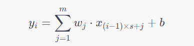

# BatchNormalization

### 原理概述

`tf.keras.layers.BatchNormalization`是深度学习模型中的一种正则化方法，可以减少模型的过拟合，使训练更加稳定。它在每个batch的数据上，对每个特征维度进行标准化操作，即将**每个特征的均值调整为0，方差调整为1**，然后通过**可学习的拉伸和偏移参数重新缩放和平移每个特征**，从而使得每个**特征的分布都比较接近标准正态分布**，以此来达到加速训练，提高模型精度的效果。

> 在使用 `BatchNormalization `进行标准化操作时，每个特征维度指的是每个样本中的每个特征的值。如果输入的是语音信号序列，则特征维度可能包括频谱、能量等等。在这种情况下，`BatchNormalization `将对每个样本中的每个特征进行标准化，以使得每个特征的分布相似，这样有助于提高模型的稳定性和泛化能力。
>
> 对于一维的语音信号序列，`BatchNormalization `操作仍然是对每个特征维度进行标准化操作，只是这里的**特征维度是指每个时间步上的语音信号振幅**，而不是一般意义上的二维特征。`BatchNormalization`在**每个时间步上对该时间步的所有样本的数据进行标准化处理**。在1D卷积神经网络中，时间步就是输入序列的每个位置，因此`BatchNormalization`会对该位置的所有样本的数据进行标准化。标准化可以使得不同时间步上的振幅具有相同的分布特性，有助于提高模型的泛化能力和训练效果。
>
> `BatchNormalization` **不会直接提取语音信号的特征，它只是在每个时间步上对输入进行标准化处理**，使得神经网络可以更好地学习到有用的语音特征。如果需要从语音信号中提取更加高级的特征，可以考虑使用卷积层、池化层等操作。

相比之下，`sklearn`的`StandardScaler`只是一种常用的数据预处理方法，用于将数据按特征进行标准化处理，即将每个特征的均值调整为0，方差调整为1，**但是没有可学习的参数，不能自适应地对每个batch的数据进行标准化**，因此不能像`BatchNormalization`一样在训练过程中对模型参数进行调整，从而使得训练更加稳定。

> Batch normalization是通过**可学习的拉伸(scale)和偏移(shift)参数重新缩放和平移每个特征**的。
>
> 在模型的训练过程中，由于每一层的输入分布都在不断变化，使得后续的层难以拟合数据。Batch normalization的思想就是通过对每一层的输入进行归一化，将每个特征都限制在均值为0，标准差为1的分布中，**使得网络中每层的输入都具有相似的分布，有利于后续层的训练和优化**。具体实现是对每个batch数据的每个特征分别进行均值和标准差的统计，然后使用**学习到的scale和shift参数对每个特征进行缩放和平移**。
>
> 与此不同，`sklearn`中的`StandardScaler`是对数据进行全局归一化，即对整个数据集的每个特征分别计算均值和标准差，并对整个数据集进行归一化处理。因此，Batch normalization在每个batch内计算均值和标准差，可以更加灵活地适应不同的数据分布，而`StandardScaler`只能使用全局的统计量进行归一化，适用范围相对较窄。

# Conv1D

### 原理概述

`layers.Conv1D` 是 `Keras` 中用于一维卷积操作的层，可用于处理时序数据（例如音频、文本）。一维卷积是指在单个方向（通常是时间轴）上进行的卷积操作。

一维卷积操作的原理与二维卷积类似，都是通过滑动一个固定大小的卷积核（即滤波器）在输入上进行卷积操作。在一维卷积中，卷积核是一个长度为 `k` 的一维张量，用于对输入的每个时间步进行滤波操作。卷积核的大小会影响到卷积后的输出形状，具体可以使用下面的公式计算：

$\text{output-length} = \lfloor \frac{\text{input-length} - \text{kernel-size} + 2\text{padding}}{\text{stride}} + 1 \rfloor$

其中，`input_length` 是输入张量的时间步数，`kernel_size` 是卷积核的大小，`padding` 是补零操作的大小，`stride` 是卷积核在输入上滑动的步幅。

`layers.Conv1D` 层可以设置多个参数，例如卷积核的大小、步幅、填充方式、激活函数等等。通过调整这些参数，可以**有效地提取输入数据中的时序特征**，用于后续的分类、回归等任务。

假设输入的数据为 $x$，卷积核为 $w$，偏置为 $b$，步长为 $s$，padding的大小为 $p$。

**对于一维卷积，我们可以将 $x$ 和 $w$ 的维度都表示为长度**，即：

$x=[x_1,x_2,x_3,…,x_n]$

$w=[w_1,w_2,w_3,…,w_m]$

则在不考虑padding的情况下，输出的每个元素 $y_i$ 可以表示为：

其中，$i$ 表示输出的位置，$j$ 表示卷积核的位置，$s$ 表示步长。而考虑padding的情况下，可以将 $x$ 在两端分别加上 $p$ 个 0，然后代入上述公式即可。 

需要注意的是，一般情况下我们会在卷积层后面添加一个激活函数来引入非线性。在这个公式中，我们没有考虑激活函数的影响。

> 一维卷积和二维卷积的区别在于卷积操作的维度不同。
>
> 在一维卷积中，卷积核只会在一个方向上进行滑动操作，例如在处理时间序列数据时，卷积核只会在时间轴上进行滑动操作。
>
> 而在二维卷积中，卷积核会在两个方向上进行滑动操作，例如在处理图像数据时，卷积核会在图像的高度和宽度上进行滑动操作。
>
> 因此，一维卷积和二维卷积的计算方式略有不同，但**本质上都是将卷积核与输入数据进行点积运算，得到特征图作为下一层的输入。**
>
> > 点积运算是指**两个向量中对应位置的元素相乘，并将所有结果相加的运算**。对于两个长度为n的向量a和b，它们的点积运算结果为：
> >
> > $a·b = a[0]*b[0] + a[1]*b[1] + ... + a[n-1]*b[n-1]$
> >
> > 点积运算在机器学习中广泛应用，例如在神经网络中，**两个向量的点积可以表示它们的相似度**，从而用于计算神经元的输出值或者用于计算损失函数。另外，在计算卷积神经网络中的卷积操作时，通常采用卷积核和输入数据的点积运算来得到卷积的结果。
> >
> > > 卷积（Convolution）这个名词最初来源于数学领域，指的是两个函数之间的一种数学运算，也称为函数的乘积积分。在深度学习中，卷积操作是通过将一个输入信号与一个卷积核进行卷积运算来提取特征。在这个过程中，卷积核会在输入信号上滑动，并在每个位置进行一次乘积累加的计算，最终得到一个输出特征图。因此，这个操作被称为卷积。

### 参数详解

`layers.Conv1D` 是 `TensorFlow Keras` 中的一维卷积层，用于处理一维的输入数据，例如时间序列数据。

该层的主要参数如下：

- `filters`: 整数，输出空间的维度（即卷积核的个数）。
- `kernel_size`: 整数或由一个整数构成的元组/列表，卷积核的空间或时间维度大小。

> Conv1D的卷积核个数是指卷积层使用的滤波器个数，它决定了卷积层的输出通道数。具体来说，每个卷积核会对输入数据进行一次卷积操作，并生成一个输出通道。因此，卷积核的个数会直接影响卷积层输出的维度。更多的卷积核可以让模型更加复杂，能够捕获更多的特征信息，但也会增加模型的参数数量，增加过拟合的风险。在设计模型时，需要根据具体的任务和数据集进行选择。
>
> > 如果你设置了六个长度为3的卷积核，那么每个卷积核的权重矩阵的形状将会是`(3, input_channels, 6)`，其中`input_channels`是**输入数据的特征维度**。这表示每个卷积核都是一维的，其大小为3，且有6个不同的卷积核。在进行卷积运算时，输入数据中的**每个时刻都会和6个不同的卷积核进行卷积操作**，得到6个卷积后的输出结果，这些结果将被连接成一个更高维的输出张量。设置卷积核数量的大小通常取决于特定的任务和数据，可以通过实验和调参来确定。

- `strides`: 整数或由一个整数构成的元组/列表，卷积核的步长。默认为 1。
- `padding`: 字符串，补齐策略（'valid' 或 'same'）。默认为 'valid'。
- `activation`: 字符串或可调用对象，激活函数。如果不指定，将不应用任何激活函数。
- `use_bias`: 布尔值，是否使用偏置。
- `kernel_initializer`: 卷积核的初始化器。如果不指定，将使用默认的 `Glorot `均匀分布初始化。
- `bias_initializer`: 偏置的初始化器。如果不指定，将使用默认的零初始化。
- `kernel_regularizer`: 卷积核的正则化器，可以使用 L1、L2 等正则化方式。
- `bias_regularizer`: 偏置的正则化器，可以使用 L1、L2 等正则化方式。
- `activity_regularizer`: 输出的正则化器，可以使用 L1、L2 等正则化方式。
- `kernel_constraint`: 卷积核的约束，可以使用非负值约束、最大范数约束等。
- `bias_constraint`: 偏置的约束，可以使用非负值约束、最大范数约束等。

需要注意的是，**该层的输入应该是一个三维张量，形状为 `(batch_size, steps, input_dim)`**，其中 `steps` 表示时间步数，`input_dim` 表示每个时间步的输入特征维度。该层的输出是一个三维张量，形状为 `(batch_size, new_steps, filters)`，其中 `new_steps` 是经过卷积和补齐后的时间步数，与原来的时间步数有关。

卷积核个数和长度的设定一般需要结合具体的任务需求和数据特征来进行选择，没有一个通用的标准或参考。不过一些常用的选择方式包括：

1. 根据数据集大小和计算资源设定。如果数据集较小，可以适当减少卷积核个数和长度以防止过拟合；如果计算资源有限，可以适当减少卷积核个数和长度以减少计算量。
2. 根据任务复杂度和模型深度设定。对于比较简单的任务，可以适当减少卷积核个数和长度以降低模型复杂度；对于比较深层次的模型，可以适当增加卷积核个数和长度以增强模型的表达能力。
3. 根据先验知识和经验设定。根据具体的应用场景和数据特征，可以从先验知识和经验出发，选择适合的卷积核个数和长度，比如一些领域专家可能已经发现了一些有效的卷积核选择方式。

需要注意的是，卷积核个数和长度的选择是需要根据具体情况进行尝试和调整的，不同的选择可能会产生不同的效果，需要根据实验结果来进行选择。

### 输出与输出

卷积层的输入通常是一个张量，其形状为(batch_size, input_length, input_channels)，其中batch_size表示输入的样本数量，input_length表示输入序列的长度，input_channels表示输入序列每个位置上的特征维度数量。

卷积层的输出也是一个张量，其**形状取决于卷积层的参数设置**。在一维卷积层中，如果使用padding="valid"，那么输出的形状为(batch_size, output_length, filters)，其中output_length表示输出序列的长度，filters表示卷积核的个数（**即输出序列每个位置上的特征维度数量**）。如果使用padding="same"，那么输出的形状为(batch_size, input_length, filters)，即与输入序列的长度保持一致。

> 在一维卷积中，通过对输入序列进行卷积操作，可以生成一个输出序列，输出序列的长度可以通过公式计算得到。假设输入序列的长度为L，卷积核的长度为K，步幅为S，输出序列的长度可以通过以下公式计算：
>
> $output\_length = (L - K) / S + 1$
>
> 其中，L表示输入序列的长度，K表示卷积核的长度，S表示步幅。因为卷积核在进行卷积操作时会向后滑动，每次移动的步幅为S，因此输出序列的长度会根据步幅和卷积核的长度而变化。如果步幅较大或者卷积核的长度较长，那么输出序列的长度就会相应地变短。

在二维卷积层中，输出的形状也取决于卷积层的参数设置，但是其基本形式为(batch_size, output_height, output_width, filters)，其中output_height和output_width表示输出特征图的高度和宽度，filters表示卷积核的个数（即输出特征图每个位置上的特征维度数量）。

需要注意的是，在卷积层中，每个卷积核的参数是共享的，即卷积核在输入张量的每个位置上进行卷积时使用的是相同的参数。这样可以大大减少模型的参数数量，同时也可以增强模型的泛化能力。

# DropOut

## 原理

在深度学习中，过拟合是一个常见的问题，即模型在训练集上表现很好，但在测试集上表现不佳。为了防止过拟合，**可以使用正则化技术或者在模型中加入一些随机性**。

其中一种常见的随机性技术就是 Dropout，它在训练过程中**随机地将一部分神经元输出置为0**，这样可以减少神经元之间的依赖关系，降低模型的复杂度，提高模型的泛化能力。

Dropout 层的原理很简单：它在训练过程中随机选择一部分神经元，并将其输出设置为0。这里的“一部分”指的是 Dropout 层的参数 p，它表示要置为0的神经元比例。在测试过程中，Dropout 层不会对神经元进行随机的置0操作。

Dropout 的实现方式是，在前向传播过程中，对于每个神经元的输出，以概率 p 将其置为0，以概率 1-p 将其保留。在反向传播时，被置为0的神经元对损失函数的贡献为0，因此不会对参数更新产生影响。

这样，通过在训练过程中随机地舍弃一些神经元，可以有效地防止模型过拟合，并提高模型的泛化能力。

>  Dropout 是在训练过程中以一定概率随机丢弃一些神经元，可以看作是模型集成中的一种方法。在模型集成中，每个模型都相当于在训练过程中随机从原始网络中丢弃一些神经元，从而得到一组不同的子模型。最终的预测结果是这些子模型的预测结果的平均值或投票结果。
>
> 在每个训练迭代中，Dropout 可以随机使得一些神经元的输出被设置为零，从而实现随机丢弃的目的。因为某些神经元的输出被随机地丢弃了，**每个神经元的输出在训练过程中都会变得更加鲁棒**，因此可以降低模型的过拟合程度。
>
> 在 Dropout 中，丢弃一些神经元相当于将它们的权重设置为零，因此这些神经元在前向传播中不会对输出值做出贡献。在反向传播中，这些神经元对损失函数的梯度为零，因为它们在前向传播中没有贡献。因此，这些被置为零的神经元对损失函数的贡献为零。

## 参数详解

`layers.Dropout`是在神经网络中应用的一种正则化方法，用于防止过拟合。它的作用是随机地将一部分神经元的输出设置为0，以此来减少过拟合。

这个函数有一个参数，即`rate`，表示要将输入张量的多少比例的元素设置为0。例如，如果`rate=0.2`，则在训练期间，`layers.Dropout`会在每次前向传播时随机地将20%的神经元输出设置为0。在测试期间，`layers.Dropout`的行为与正常的前向传播相同。

`layers.Dropout`的实现原理是，在训练期间，它会随机地丢弃一些神经元，使得**网络不会过于依赖某些特定的神经元**，从而减少过拟合。在测试期间，所有神经元都会被保留，因此网络可以以全力运行，得到更好的预测结果。

需要注意的是，`layers.Dropout`**通常应该在激活函数之前使用**，这样才能在不丢失任何信息的情况下减少过拟合。同时，`rate`的取值需要根据实际情况来确定，**通常在0.2到0.5之间**。

# MaxPooling1D

## 原理

`MaxPooling1D` 是 `Keras` 中用于一维信号的最大池化层。它可以从一维信号中**提取最显著的特征并减少信号的大小**，从而降低计算量并提高模型的泛化能力。

最大池化是一种常用的池化方式之一，其原理是在输入信号的每个区域内（大小由池化层的 `pool_size` 参数控制）选择最大的数值作为该区域的输出。对于一维信号，`MaxPooling1D` 层在每个子序列（即信号中的连续窗口）内选择最大值并将其汇集在一起，形成输出信号的新子序列。

例如，如果 `MaxPooling1D` 层的输入为 `(batch_size, steps, features)` 的张量，则其输出将是一个 `(batch_size, new_steps, features)` 的张量，其中 `new_steps` 取决于池化层的参数设置。

`MaxPooling1D` 的一个重要参数是 `pool_size`，它是一个整数或整数元组，用于指定池化窗口的大小。另外还可以设置 `strides` 参数来控制池化窗口的步幅。默认情况下，`MaxPooling1D` 的 `strides` 参数与 `pool_size` 参数相同，即不重叠地从左到右移动池化窗口。

总之，`MaxPooling1D` 可以有效地减少信号的大小，提取最显著的特征，从而提高模型的泛化能力。

> MaxPooling1D是一种下采样方法，它在每个子序列上执行最大值池化操作。它可以在降低模型复杂度的同时，减小输入序列的尺寸，从而加速模型的训练和预测。
>
> MaxPooling1D的原理比较简单。假设输入序列的长度为n，池化窗口大小为p，则输出序列的长度为 $n//p$。对于每个长度为p的子序列，MaxPooling1D**输出该子序列中的最大值**。因此，MaxPooling1D可以将输入序列的特征缩小为更少的子序列，同时保留子序列中最重要的特征。
>
> MaxPooling1D可以在卷积神经网络中用于减小特征图的空间尺寸。与卷积层一样，MaxPooling1D也可以设置步长和填充方式。通过MaxPooling1D的降维操作，**可以在不丢失太多信息的情况下，减少神经网络的计算量和内存消耗。**
>
> > 池化（pooling）操作是一种常用的神经网络操作，它通常会跟卷积操作一起使用。池化操作通过在一定区域内对特征图的数值进行统计，并保留统计结果中最大（max pooling）或平均值（average pooling），从而减小特征图的大小，增加特征的鲁棒性和计算效率。
> >
> > 这个操作被称为池化是因为它**类似于对水池中的水进行抽样统计**的过程，例如在水池的某个区域内进行采样，统计该区域内水的最大深度或平均深度等。因此，这个操作被称为池化。

## 参数详解

`MaxPooling1D`是`Keras`中的一种卷积层，其作用是对一维输入的数据进行最大值池化操作。其主要参数如下：

- `pool_size`: 整数或整数元组，表示池化窗口的大小。例如，`pool_size = 2`表示每隔2个元素取一个最大值，默认为`(2,)`。
- `strides`: 整数或整数元组，表示池化窗口在每个维度上的滑动步长。例如，`strides = 2`表示窗口每隔2个元素向前滑动一次，默认为`None`，使用`pool_size`的值。
- `padding`: 字符串，可选`'valid'`或`'same'`。表示是否需要补0。默认为`'valid'`，不补0。

`MaxPooling1D`的工作原理是将输入的一维数据划分为不重叠的窗口，并在每个窗口上执行最大值操作。例如，对于输入序列`[1, 2, 4, 3, 1, 5]`，假设`pool_size=2`，则`MaxPooling1D`会将其划分为`[[1, 2], [4, 3], [1, 5]]`三个窗口，然后在每个窗口上找到最大值，输出结果为`[2, 4, 5]`。

最大值池化层常用于卷积神经网络中，可以减少参数数量和计算复杂度，同时可以提高模型的鲁棒性和泛化能力。

### 输入与输出

MaxPooling1D是一种池化操作，它的输入和输出形状与Conv1D层类似。假设输入数据的形状为`(batch_size, steps, channels)`，其中`steps`表示序列长度，`channels`表示特征维度。那么MaxPooling1D的输出形状为`(batch_size, pooled_steps, channels)`，其中`pooled_steps`表示经过池化后的序列长度。

MaxPooling1D的池化操作是对每个时间步上的特征维度执行的，其步骤如下：

1. 首先在序列方向上划分出固定长度的区间（通常称为池化窗口），在这个区间内选择最大值。
2. 将选出的最大值作为该时间步的输出。

因此，MaxPooling1D的输出序列长度`pooled_steps`会比输入序列长度`steps`缩小，而特征维度`channels`不变。

### 多次卷积

在卷积层后再次添加卷积层是一种常见的神经网络架构，其主要目的是在学习更高层次的特征表示，例如在计算机视觉任务中，第一层卷积层可以学习到简单的边缘特征，而第二层卷积层可以学习到更加复杂的形状和纹理特征。因此，通过多层卷积层堆叠，可以逐渐学习到更加抽象和高级的特征表示。

> 举例子如: 第一次卷积层后的维度是（None, 431,64) 输入到同样的卷积层（卷积核个数64个，长度3）输出维度也是（None, 431,64)

每个卷积核卷积时是在所有64列上进行的，因此每个卷积核的输出将是一个1维向量。64 个卷积核的输出将组合成一个 64 维向量，即使进行多次卷积，也不会导致输出的维度增加。在卷积层中使用多个卷积核的原因是为了捕获输入数据中的不同特征。每个卷积核的输出是一个捕获到的特征映射，这些特征映射通过叠加的方式组成了一个64维向量。具体地说，这个64维向量是将每个特征映射在时间轴上的输出值取平均得到的。这个过程可以看作是在对输入数据进行一种降维操作，将捕获到的不同特征映射组合成一个向量表示整个输入数据的特征。
