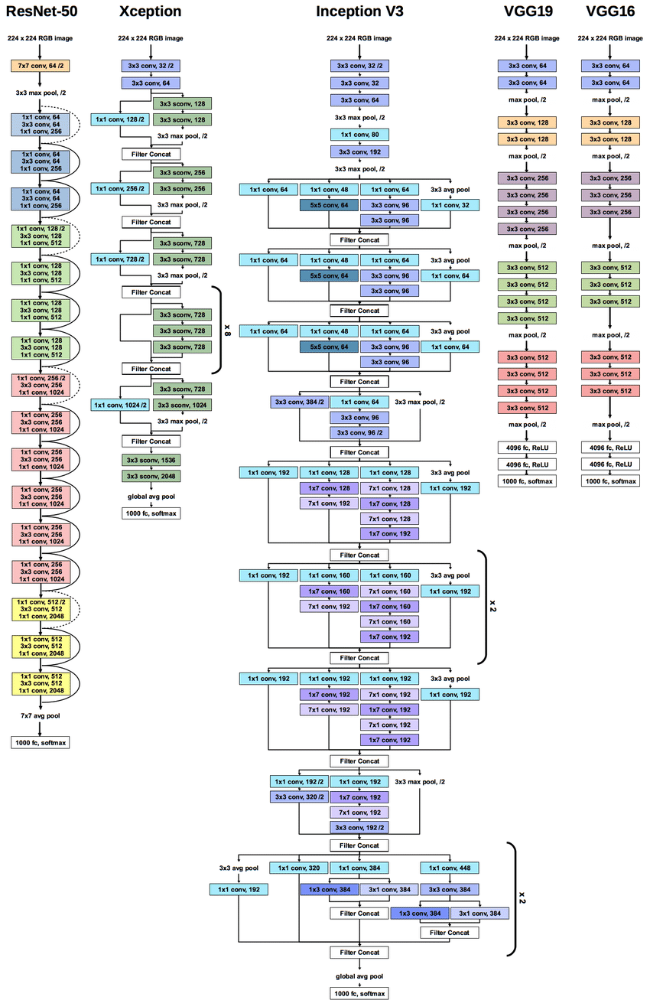
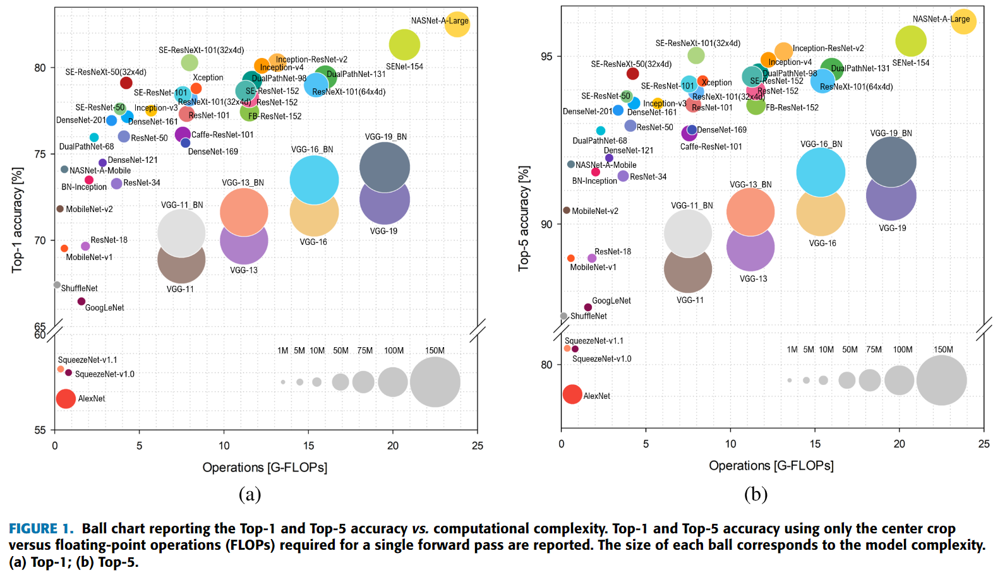
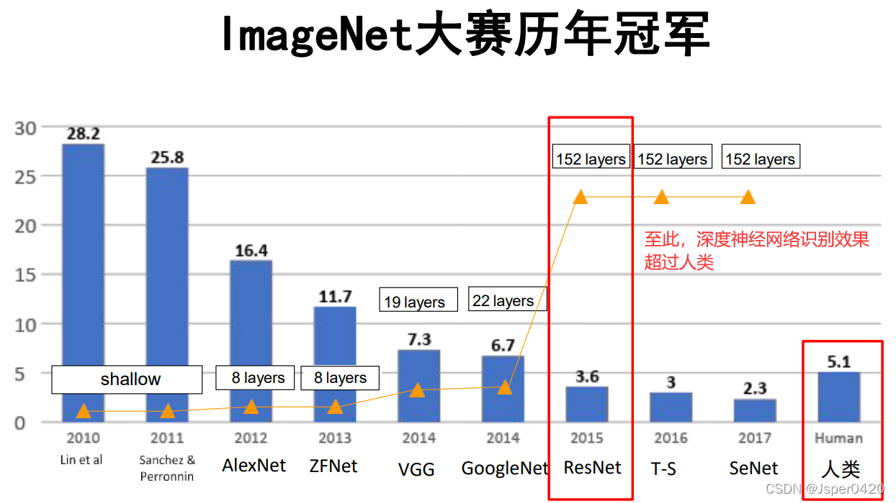
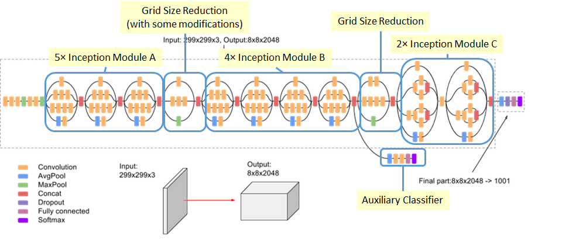
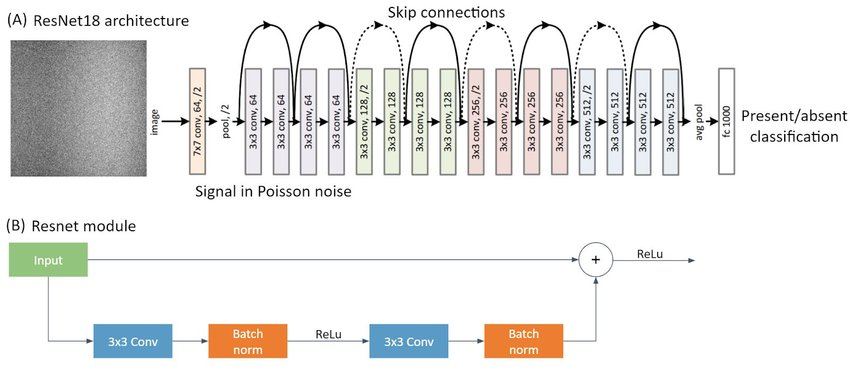

​	

# AlexNet

AlexNet是一种深度卷积神经网络（Convolutional Neural Network, CNN），于2012年由Alex Krizhevsky等人提出，并在ImageNet图像分类挑战赛中取得了显著的突破。

下面我们逐步介绍AlexNet的主要特点和结构：

**1. 深度：**

- AlexNet是**第一个成功应用于大规模图像数据集的深层CNN**。它具有8个卷积层和3个全连接层，总共11层神经网络。
- 相较于以往浅层网络，AlexNet通过增加隐藏单元数目和引入更多卷积核来增强了模型的表达能力。

**2. 卷积与池化结构：**

- AlexNet采用了**交替布局的卷积和池化操作**。这些操作将输入图像进行分块处理，从而捕获不同尺度下的局部特征。
- 在卷积方面，**使用了较大的滤波器（例如11x11、5x5）以及步幅为4或2来减小空间分辨率并增加非线性变换**。
- 在池化方面，使用最大池化来进一步降低空间维度，并且**通过重叠（overlapping）保留相邻区域之间的信息**。

> 重叠池化（overlapping pooling）是一种在最大池化中使用的技术，用于**降低特征图的空间维度，并保留相邻区域之间的信息。**通常，在传统的最大池化操作中，我们会定义一个固定大小的窗口并从输入特征图中提取每个窗口内的最大值作为输出。**而在重叠池化中，这些窗口之间可以有部分或完全重叠。**原理就是滑动步长小于窗口大小。
>

**3. 非线性激活函数：**

- AlexNet采用了ReLU（Rectified Linear Unit）作为其非线性激活函数，而	不是传统的Sigmoid或Tanh。
- 使用ReLU可以避免梯度消失问题，并加速训练过程。

**4. Dropout正则化：**

- 为了减少过拟合现象，AlexNet引入了Dropout技术。在训练过程中，随机将一定比例的隐藏单元置零，以防止网络对特定输入样本的依赖。

**5. 全局归一化和重叠池化：**

- 在最后两个卷积层之后，AlexNet使用了全局归一化（Local Response Normalization, LRN）来增强模型泛化能力。
- 此外，在某些卷积层之间还进行了重叠池化（Overlapping Pooling），这进一步提高了特征表示能力。

如果你想进一步学习和理解AlexNet，可以参考以下资源：

1. 原始文献：ImageNet Classification with Deep Convolutional Neural Networks (https://papers.nips.cc/paper/4824-imagenet-classification-with-deep-convolutional-neural-networks)
2. TensorFlow 官方教程: Transfer Learning and Fine-Tuning with TensorFlow Hub (https://www.tensorflow.org/tutorials/images/transfer_learning_with_hub)
3. PyTorch 官方教程: Transfer Learning Tutorial with PyTorch and ImageNet (https://pytorch.org/tutorials/beginner/transfer_learning_tutorial.html)

这些资源将提供更详细的说明、示例代码和实践指导，以便您更好地理解并应用于机器学习中。

# VGG

VGG神经网络是由牛津大学的研究团队于2014年提出的一个深度卷积神经网络模型。它在图像分类和物体识别任务上取得了很好的效果。

下面我们逐步介绍VGG网络的主要特点和结构：

**1. 网络深度：**

- VGG网络以其极深的层次结构而闻名，它通过叠加多个3x3大小的卷积核来增加模型深度。
- 在原始论文中，作者展示了不同层数（16、19层）对模型性能的影响，并发现更深层次可以提供更好的表达能力。

**2. 卷积与池化结构：**

- VGG网络采用了连续堆叠多个相同尺寸（3x3）和通道数目相等（通常为64或128）的卷积层。
- 每一组卷积层之后都会进行最大池化操作来减小空间分辨率并增强平移不变性。

**3. 块结构：**

- 为了简化模型设计，VGG将若干个连续卷积和池化操作看作一个块。
- 其中最有代表性且广泛使用是VGG16和VGG19两种版本，它们分别由13个和16个卷积层组成。

**4. 全连接层：**

- 在卷积池化块之后，VGG网络使用了几个全连接层来进行分类预测。
- 这些全连接层将高维特征映射转换为最终的类别概率输出。

**5. 特点：**

- VGG网络相对于其他模型而言比较简单且容易理解，没有复杂的结构设计和技巧。
- 它通过增加深度来提高表达能力，并在训练过程中充分利用了大量标注数据。

如果你想进一步学习和理解VGG网络，可以参考以下资源：

1. 原始文献：Very Deep Convolutional Networks for Large-Scale Image Recognition (https://arxiv.org/abs/1409.1556)
2. TensorFlow 官方教程: Transfer Learning and Fine-Tuning with TensorFlow Hub (https://www.tensorflow.org/tutorials/images/transfer_learning_with_hub)
3. PyTorch 官方教程: Transfer Learning Tutorial with PyTorch and ImageNet (https://pytorch.org/tutorials/beginner/transfer_learning_tutorial.html)

这些资源将提供更详细的说明、示例代码和实践指导，以便您更好地理解并应用于机器学习中。

# Inception系列算法

>  "Inception" 这个名称源自于电影《盗梦空间》（Inception）。
>
>  "Inception" 这个词在英语中的意思是“开始”或“初始阶段”。在电影中，主要角色们进行了一种名为“植入梦境”的行动，意图在目标人物的潜意识中植入一个想法。这个行动涉及到多个嵌套的梦境层级，每个层级都有自己的规则和现实。这种层级嵌套的概念与深度学习中的多层网络结构有一定的类比。
>
>  取名为"Inception"便是因为这个网络模块的结构和电影《盗梦空间》中的植入梦境行动有一定的类似之处：多层级的结构和信息的融合。这个名称的选择可以看作是对电影中的概念的一种致敬，并将其与深度学习领域中的网络模块联系在一起。

Inception v1(GoogLeNet, 2014) --> Inception v2(BN-Inception) --> Inception v3 --> Inception v4(Inception-ResNet) --> Xception(2016) , 在ImageNet上 Top1 和 Top5 准确率如下图：


以下是对Inception系列算法（包括Inception-v1、Inception-v2、Inception-v3、Inception-v4、Xception和Inception-ResNet）的详细解释，以及相关的优缺点。

| 名称             | 介绍                                                         | 优缺点                                                       |
| ---------------- | ------------------------------------------------------------ | ------------------------------------------------------------ |
| Inception-v1     | - Inception-v1是最早的Inception网络，也称为GoogLeNet。它引入了Inception模块，通过多个并行的卷积核和池化层来捕捉不同尺度的特征。- Inception-v1采用1x1卷积来减少特征图的维度，以降低计算量和参数数量。很好的区分了**通道特征学习**和**空间特征学习** | - 优点：**参数数量较少**，计算效率高。- 缺点：相对较深，容易出现梯度消失或梯度爆炸的问题。 |
| Inception-v2     | - Inception-v2是Inception网络的改进版本，也称为BN-Inception。它在Inception-v1的**基础上引入了Batch Normalization（批归一化）技术**。- BN-Inception通过在每个层的输入上进行批归一化来加速训练过程和提高模型的鲁棒性。 | - 优点：加速训练过程，提高模型的鲁棒性。- 缺点：相比于Inception-v1，增加了额外的Batch Normalization操作。 |
| Inception-v3     | - Inception-v3是Inception网络的进一步改进版本。它在Inception-v2的基础上进行了一些改进和优化。- Inception-v3引入了更深的网络结构，并使用了更大的Inception模块和更多的辅助分类器。- Inception-v3还采用了更高级的特征提取技术，如分解卷积和非对称卷积。 | - 优点：更深的网络结构，更强大的特征表示能力。- 缺点：相对于Inception-v2，**计算量和参数数量增加。** |
| Inception-v4     | - Inception-v4是对Inception-v3的改进和扩展。它通过进一步优化网络结构和增加网络的深度，提高了模型的性能和表达能力。- Inception-v4引入了更多的卷积核大小和更大的Inception模块。- 它还采用了一些降低计算复杂度的技术，如分支瓶颈结构和稀疏连接。 | - 优点：更高的性能和表达能力。- 缺点：相对于Inception-v3，计算量和参数数量进一步增加。 |
| Inception-ResNet | - Inception-ResNet是Inception网络和ResNet（残差网络）结构的结合。它在Inception-v4的基础上引入了ResNet的残差连接，以进一步提高模型的性能和训练效果。- Inception-ResNet通过引入残差连接，解决了网络层数过多时的梯度消失和训练困难的问题。 | - 优点：更高的性能和训练效果。- 缺点：相对于Inception-v4，增加了额外的残差连接操作。 |
| Xception         | - Xception是一种基于**深度分离卷积**（Depthwise Separable Convolution）的卷积神经网络结构。- Xception的核心思想是将传统的卷积操作拆分为两个步骤：深度卷积（Depthwise Convolution）和逐点卷积（Pointwise Convolution）。- 深度卷积在空间维度上分离通道间的特征，逐点卷积在通道维度上进行特征融合和输出。 | - 优点：更少的参数量和计算量，具有较高的计算效率。- 缺点：对输入数据的空间特征建模能力相对较弱。 |

需要注意的是，Inception系列算法在每个版本的基础上都进行了改进和优化，以提高模型的性能和效率。以上表格列出了Inception-v1、Inception-v2、Inception-v3、Inception-v4和Inception-ResNet这五个版本的详细信息。

相关学习资料：

掘金： https://juejin.cn/post/7064940823146102820  详解Inception结构：从Inception v1到Xception

## Inception-v1

Inception-v1，也被称为GoogLeNet，是Inception系列算法中最早的版本，由Google团队在2014年提出，并夺得了2014年ImageNet竞赛的冠军。它的设计灵感来自于人类视觉系统中的分层处理和多尺度感受野的特性，早期的 Network in Network 架构， 通过模块的堆叠（每个小模块像是一个小型的神经网络），分成多个并行分支。

Inception-v1的主要特点和结构如下：

1. Inception模块：Inception-v1引入了Inception模块，用于在不同尺度上捕捉图像的特征。Inception模块采用**多个并行的卷积核和池化层**，并将它们的输出在通道维度上**拼接**起来，从而获得**多尺度的特征表示**。(如下图所示，哲理的核大小其实只是对于感受野的大小，输出的依然是一个卷积核一个序列，滑动步长会影响大小)

   

2. 1x1卷积（**逐点卷积**）：是Inception模块的特色，此时卷积相当于对每个特征值的数据点通过了一个dense，能够将输入**张量**通道的信息混合在一起，但不会**混合空间的特征**，有助于**区分开通道特征学习和空间特征学习**，尤其是在`假设每个通道在跨越空间是强相关，不同通道可能不高度相关的情况下`，并且其害减少特征图的维度和参数数，同时也起到了特征降维和特征融合的作用。

3. 辅助分类器：直接增加深度会导致浅层出现严重的梯度消失现象，GoogLeNet引入了**辅助分类器（Auxiliary Classifier）**，在浅层和中间层插入，**来增强回传时的梯度信号，引导浅层学习到更具区分力的特征。**这些辅助分类器在训练过程中引入了额外的监督信号，帮助网络更好地学习特征，同时在测试阶段被丢弃。

   >  在Inception网络中，辅助分类器（Auxiliary Classifier）是指在网络的中间层添加的额外分类器。它的主要目的是通过提供额外的梯度信号来帮助网络更好地学习和训练。
   >
   >  辅助分类器的添加可以有助于解决深度神经网络中的梯度消失问题。在深层网络中，梯度在反向传播过程中可能会逐渐衰减，导致较早的层面难以得到有效的梯度信号进行更新。通过添加辅助分类器，可以在中间层获取额外的梯度信号，使得较早的层可以更好地进行更新。
   >
   >  辅助分类器通常与主分类器一起使用，主分类器位于网络的最后一层。辅助分类器和主分类器具有相同的目标，即对输入进行分类。在网络的训练过程中，辅助分类器的预测结果和主分类器的预测结果都会被用于计算损失函数，从而进行反向传播和参数更新。
   >
   >  以下是在Keras中实现Inception网络中辅助分类器的模板代码：
   >
   >  ```python
   >  from keras.models import Model
   >  from keras.layers import Input, Conv2D, MaxPooling2D, Dropout, Flatten, Dense, concatenate
   >  
   >  # 输入
   >  input_shape = (224, 224, 3)
   >  inputs = Input(shape=input_shape)
   >  
   >  # 辅助分类器
   >  auxiliary = Conv2D(filters=128, kernel_size=(1, 1), activation='relu')(inputs)
   >  auxiliary = MaxPooling2D(pool_size=(2, 2))(auxiliary)
   >  auxiliary = Dropout(0.5)(auxiliary)
   >  auxiliary = Flatten()(auxiliary)
   >  auxiliary = Dense(units=1024, activation='relu')(auxiliary)
   >  auxiliary = Dropout(0.5)(auxiliary)
   >  auxiliary = Dense(units=num_classes, activation='softmax')(auxiliary)
   >  
   >  # 主分类器
   >  x = Conv2D(filters=64, kernel_size=(1, 1), activation='relu')(inputs)
   >  x = MaxPooling2D(pool_size=(2, 2))(x)
   >  x = Conv2D(filters=192, kernel_size=(3, 3), activation='relu')(x)
   >  x = MaxPooling2D(pool_size=(2, 2))(x)
   >  x = Dropout(0.5)(x)
   >  x = Flatten()(x)
   >  x = Dense(units=2048, activation='relu')(x)
   >  x = Dropout(0.5)(x)
   >  main_output = Dense(units=num_classes, activation='softmax')(x)
   >  
   >  # 创建模型
   >  model = Model(inputs=inputs, outputs=[main_output, auxiliary])
   >  
   >  # 编译模型
   >  model.compile(optimizer='adam', loss='categorical_crossentropy', metrics=['accuracy'])
   >  ```
   >
   >  在这个模板代码中，我们使用了Keras的函数式API来构建一个包含辅助分类器的Inception网络。通过使用`Model`类，我们定义了一个具有多个输入和多个输出的模型。其中，`inputs`是网络的输入张量，`auxiliary`是辅助分类器的输出，`main_output`是主分类器的输出。
   >
   >  在模型的训练过程中，通过指定多个损失函数和多个评估指标，我们可以同时优化辅助分类器和主分类器。在实际训练中，可以根据具体任务和实验需求来调整模型的结构和参数设置。

4. 网络结构：Inception-v1具有22层的深度，由多个堆叠的Inception模块组成。网络的输入是224x224大小的图像，最后通过**全局平均池化**和softmax分类器进行分类。


Inception-v1的创新设计使得它在当时取得了很好的性能，同时具有较高的计算效率。它在2014年的ImageNet图像分类挑战中获得了`第一名`。

以下是一些学习资源，可以帮	助您深入了解Inception-v1算法：

1. 论文：Rethinking the Inception Architecture for Computer Vision (https://arxiv.org/abs/1512.00567)
   - 这是Inception-v1算法的原始论文，详细介绍了算法的设计思想、网络结构和实验结果。
2. TensorFlow官方教程：Image classification with Inception (https://www.tensorflow.org/tutorials/images/classification_inception)
   - 这是TensorFlow官方提供的教程，演示了如何使用TensorFlow实现和使用Inception-v1进行图像分类任务。
3. PyTorch官方教程：Transfer Learning Tutorial (https://pytorch.org/tutorials/beginner/transfer_learning_tutorial.html)
   - 这是PyTorch官方提供的教程，介绍了如何使用PyTorch进行迁移学习，其中包括使用预训练的Inception-v1模型进行图像分类任务。
4. https://medium.com/@AnasBrital98/googlenet-cnn-architecture-explained-inception-v1-225ae02513fd GoogLeNet CNN Architecture Explained (Inception V1) : 代码与原理

通过阅读论文和实践相关教程，您将深入了解Inception-v1算法的细节和应用方法。

## Inception-v3

Inception-v3是Google于2015年提出的一种深度卷积神经网络模型，用于图像分类和物体识别任务。它在ILSVRC 2015图像分类挑战中取得了优异的成绩。




**3. 辅助分类器：**

- 为了加强训练过程中梯度流动，并防止梯度消失问题，Inception-v3引入了两个辅助分类器。
- 这些辅助分类器位于网络内部，在中间某些位置进行预测，并与最后一个全连接层共同计算损失函数。

**4. 特点：**

- 此外，Inception-v3还采用了批量归一化、权重衰减等技术来加速训练过程并提高模型性能。

如果你想进一步学习和理解Inception-v3网络，可以参考以下资源：

1. 原始文献：Rethinking the Inception Architecture for Computer Vision (https://arxiv.org/abs/1512.00567)
2. TensorFlow Hub官方教程: Transfer Learning with TensorFlow Hub (https://www.tensorflow.org/tutorials/images/transfer_learning_with_hub)
3. PyTorch官方教程: Fine-tuning Torchvision Models (https://pytorch.org/tutorials/beginner/finetuning_torchvision_models_tutorial.html)

如果你想深入学习和了解关于Inception系列网络（如Inception-v1、v2、v3等）及其相关技术细节，可以参考以下资源：

1. 原始文献：Going Deeper with Convolutions (https://arxiv.org/abs/1409.4842)
2. TensorFlow官方教程: Transfer Learning and Fine-Tuning with TensorFlow Hub (https://www.tensorflow.org/tutorials/images/transfer_learning_with_hub)
3. PyTorch官方教程: Fine-tuning Torchvision Models (https://pytorch.org/tutorials/beginner/finetuning_torchvision_models_tutorial.html)

这些资源将为你提供更详细的说明、示例代码和实践指导，以帮助你更好地理解和应用Inception网络及其不同版本在机器学习中的应用。

## Xception

Xception 代表极端 Inception（extreme inception），它于2016年由Google提出。Xception的设计灵感来自Inception架构，并通过引入深度可分离卷积操作进行了改进，Xception 将分别进行通道特征学习与空间特征学习的想法推向逻辑上的极端，并将 Inception 模块替换为深度可分离卷积，其中包括一个逐深度卷积（即一个空间卷积，分别对每个输入通道进行处理）和后面的一个逐点卷积（即一个 1×1 卷积）。这个深度可分离卷积将空间特征和通道特征被完全分离。Xception 的参数个数与 Inception V3 大致相同，但因为它对模型参数的使用更加高效，所以在 ImageNet 以及其他大规模数据集上的运行性能更好，精度也更高。

以下是对Xception神经网络的详细解释：

**1. 深度可分离卷积：**

- Xception中最重要的创新之一就是深度可分离卷积操作。
- 传统的卷积操作包括两个步骤：点互相关和逐通道求和。而深度可分离卷积将这两个步骤拆开，在每个通道上单独进行空间滤波和逐像素线性变换。
- 这样做可以降低计算复杂性，减少参数数量，并且更好地捕获特征。

**2. 架构设计：**

- Xception采用了类似Inception-v3的模块化结构，使用多层次并行连接来处理不同尺寸的特征。
- 它使用了大量具有不同尺寸、跨越不同层级特征图的扩展模块，在各自层级上执行特定任务并学习到有效表示。
- 在整体架构中，Xception还包括了残差连接等技术，以加快训练速度和提高模型性能。

**3. 优势：**
- Xception相比于传统的卷积神经网络具有更少的参数量，因此计算效率更高。
- 它在图像分类、目标检测等任务上表现出色，取得了与其他先进模型相媲美甚至超越的结果。

如果你想深入学习和了解Xception网络及其相关技术细节，可以参考以下资源：

1. 原始文献: Xception: Deep Learning with Depthwise Separable Convolutions (https://arxiv.org/abs/1610.02357)
2. TensorFlow官方教程: Transfer Learning and Fine-Tuning with TensorFlow Hub (https://www.tensorflow.org/tutorials/images/transfer_learning_with_hub)
3. PyTorch官方教程: Fine-tuning Torchvision Models (https://pytorch.org/tutorials/beginner/finetuning_torchvision_models_tutorial.html)

这些资源将为你提供更详细的说明、示例代码和实践指导，以帮助你更好地理解和应用Xception网络在机器学习中的应用。

# ResNet

ResNet，全称为残差网络（Residual Network），是由微软研究院于2015年提出的一种深度卷积神经网络模型。它在图像分类、目标检测和语义分割等计算机视觉任务中取得了重大突破。



下面我们逐步介绍ResNet网络的主要特点和结构：

**1. 残差学习：**

- ResNet引入了“残差学习”这一关键思想，旨在解决训练非常深层次神经网络时遇到的梯度消失或梯度爆炸问题。
- 通过使用跳跃连接（即直接将输入添加到输出）来构建残差块，使得信息可以更容易地从底层传递到高层。

**2. 网络架构：**

- ResNet由多个堆叠而成的残差块组成。
- 其中最有代表性且广泛使用是ResNet50、ResNet101和ResNet152等版本，数字代表着每个版本中包含的残差块数量。

**3. 卷积操作：**

- 在每个残差块内部，采用了带有小尺寸（通常为3x3）卷积核的卷积层。
- 这些卷积层通常包括批量归一化和激活函数，以进一步增强模型的表达能力。

**4. 池化操作：**

- 在每个残差块之间，ResNet使用最大池化或平均池化来减小特征图的空间维度。
- 这有助于降低计算复杂性并提取更加抽象的特征。

**5. 特点：**

- ResNet网络相对于其他模型而言在深度方面更为突出，例如ResNet152具有152个卷积层。
- 它通过引入跳跃连接解决了训练非常深层次神经网络时遇到的问题，并取得了显著的性能改进。

如果你想进一步学习和理解ResNet网络，可以参考以下资源：

1. 原始文献：Deep Residual Learning for Image Recognition (https://arxiv.org/abs/1512.03385)
2. TensorFlow官方教程: Transfer Learning and Fine-Tuning with TensorFlow Hub (https://www.tensorflow.org/tutorials/images/transfer_learning_with_hub)
3. PyTorch官方教程: Fine-tuning Torchvision Models (https://pytorch.org/tutorials/beginner/finetuning_torchvision_models_tutorial.html)

这些资源将提供更详细的说明、示例代码和实践指导，以帮助你更好地理解和应用ResNet网络在机器学习中的应用。

# DenseNet

DenseNet，全称密集连接网络（Densely Connected Network），是由康奈尔大学于2017年提出的一种深度卷积神经网络模型。与传统的卷积神经网络不同，DenseNet通过密集连接的方式在各个层之间建立直接的通道，使得信息可以更充分地流动。(感觉变成了一个图，变成图神经网络 GNN)

下面我们逐步介绍DenseNet网络的主要特点和结构：

**1. 稠密块：**

- DenseNet采用了稠密块作为其基本组件。
- 在稠密块中，每个层都与前面所有层相连，并且它们以堆叠、串联或拼接等方式将输出特征图进行合并。

**2. 网络架构：**

- DenseNet由多个堆叠而成的稠密块组成。
- 它还包括一个初始卷积层和最后一个全局平均池化层，用于输入数据处理和分类任务。

**3. 单元结构：**

- 每个稠密块内部通常由多个具有相同输出大小（通道数）的“单元”组成。
- 每个单元包含批量归一化、激活函数和小尺寸（例如3x3）卷积操作等。

**4. 过渡层：**

- 为了控制特征图的大小并减少计算复杂性，DenseNet引入了过渡层。
- 过渡层包括批量归一化、1x1卷积操作和平均池化，用于降低特征图的空间维度。

**5. 特点：**

- DenseNet网络具有高度密集连接的结构，可以充分利用前面所有层产生的特征信息。
- 它通过直接的通道传递加强了梯度流动，并且在相对较浅的网络中就能够有效地学习到复杂模式。

如果你想进一步学习和理解DenseNet网络，可以参考以下资源：

1. 原始文献：Densely Connected Convolutional Networks (https://arxiv.org/abs/1608.06993)
2. TensorFlow官方教程: Transfer Learning and Fine-Tuning with TensorFlow Hub (https://www.tensorflow.org/tutorials/images/transfer_learning_with_hub)
3. PyTorch官方教程: Fine-tuning Torchvision Models (https://pytorch.org/tutorials/beginner/finetuning_torchvision_models_tutorial.html)

这些资源将为你提供更详细的说明、示例代码和实践指导，以帮助你更好地理解和应用DenseNet网络在机器学习中的应用。