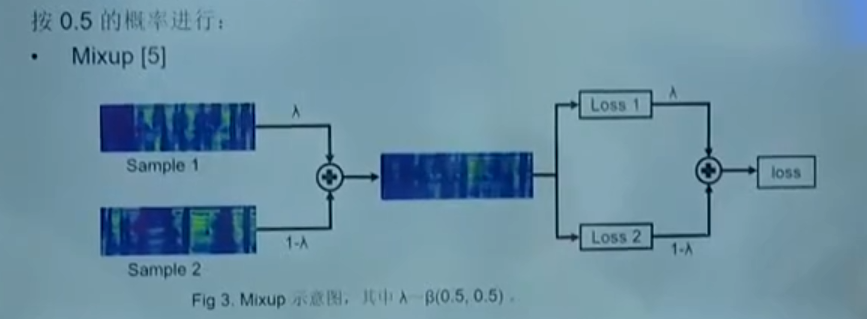

## 数据增强

以下是一些常见的语音数据增强算法，以及它们的介绍和特点：

| 名称                             | 介绍                                                         | 特点                                                         |
| -------------------------------- | ------------------------------------------------------------ | ------------------------------------------------------------ |
| 增加噪声（add noise）            | 在语音信号中添加噪声，模拟真实的环境噪声                     | 简单易实现，可以提高模型的鲁棒性                             |
| 频率抖动（frequency jitter）     | 将语音信号的频率轻微抖动，增加语音的多样性                   | 可以增加数据的多样性，提高模型的泛化能力                     |
| 时间拉伸（time stretching）      | 改变语音信号的时长，加快或减慢语速                           | 可以模拟不同的说话速度，增加数据的多样性                     |
| 语速扰动（tempo perturbation）   | 在语音信号中引入语速变化                                     | 可以模拟说话速度的变化，增加数据的多样性                     |
| 声音增强（audio enhancement）    | 增加语音信号的音量或增强语音信号的清晰度                     | 可以改善语音信号的质量，提高模型的识别准确率                 |
| 音调变化（pitch shifting）       | 改变语音信号的音高                                           | 可以模拟不同的说话人或情绪状态，增加数据的多样性             |
| 声道扰动（channel perturbation） | 模拟不同的录音设备或环境对语音信号的影响                     | 可以增加数据的多样性，提高模型的鲁棒性                       |
| 音频剪切（audio clipping）       | 在语音信号中随机剪切一小段音频                               | 可以增加数据的多样性，提高模型的泛化能力                     |
| 混响（reverberation）            | 在语音信号中添加混响效果                                     | 可以模拟不同的录音环境，增加数据的多样性                     |
| 音频空白（audio blank）          | 在语音信号中插入一段静音                                     | 可以模拟不同的说话风格或语音中断的情况，增加数据的多样性     |
| Mixup                            | Mixup是一种数据增强技术，通过在两个样本之间进行线性插值来创建新的样本。对于语音数据，可以在两个语音信号之间进行线性插值来生成新的语音样本。插值的目标可以是语音信号本身，也可以是语音特征如梅尔频谱等。 | - 提高模型的鲁棒性和泛化能力<br>- 增加数据的多样性<br>- 有效地减轻过拟合问题 |
| GAN (生成对抗网络)               | GAN是一种深度学习架构，由生成器和判别器两个模型组成。生成器试图生成逼真的样本，而判别器试图区分真实样本和生成样本。对于语音数据，生成器可以生成新的语音样本，而判别器可以判断生成的语音样本的真实程度。通过对抗训练，生成器可以逐渐生成更逼真的语音样本。 | - 生成高质量的语音样本<br>- 学习数据分布的隐含表示<br>- 可以用于语音合成和数据增强等任务 |

####增加噪声（add noise）

封装了能够产生**特定信噪比**的加噪数据，SNR(`signal noise ratio`)，为$SNR = 10*log_{10}(Ps/Pn)$，根据该公式得到$ Pn=\sqrt{\frac{S^2}{10^{\frac{SNR}{10}}}}$，高斯分布（0~1）乘上该噪声强度。获取指定噪声强度的信号

```
def add_noise(data):
    noise_value = 0.015 * np.random.uniform() * np.amax(data)
    data = data + noise_value * np.random.normal(size=data.shape[0])
    return data
```

####时间拉伸（time stretching）

```
def stretch_process(data, rate=0.8):
    return librosa.effects.time_stretch(data, rate=0.8)
```

#### 音调变化（pitch shifting）

```
def pitch_process(data, sampling_rate, pitch_factor=0.7):
    return librosa.effects.pitch_shift(data, sr=sampling_rate, n_steps=pitch_factor)
```

#### 声音增强（audio enhancement）

计算了一个标量（scalar），以便将输入信号的音量增益到所需的分贝级别。它使用了dB参数表示的增益量，并且通过wav参数传递的音频信号来计算输入信号的平均功率（wav_p）。

在计算标量时，使用了以下公式：

$scalar = sqrt(10**(dB/10) / (wav_p + eps))$

其中，dB/10将dB值转换为增益因子，10的幂将增益因子转换为增益比，sqrt表示平方根函数，eps是一个非常小的数，用于避免除以零错误。公式的目的是计算一个标量，使得将输入信号乘以该标量后，其平均功率就会增益到所需的分贝级别。这是因为声音的感知是与其振幅的对数有关的。即使信号的振幅增加了很多，人耳也可能感觉声音没有变大。

> 音量增强后，幅度增大了很多，但是声音大小没有变化这是因为人耳的听觉系统是非线性的，它对于相同的物理量级，其感知的响度并不是线性的。
>
> 例如，如果一个信号的振幅增加了10倍，那么它的功率就会增加100倍。然而，人耳对于100倍的功率增益可能只会感知到大约2倍左右的响度增益。因此，即使信号的振幅增加了很多，人耳也可能感觉声音没有变化。
>
> 在进行音量增强时，应该考虑到这个非线性的听觉响度特性。在实际的应用中，可以使用一些特定的算法来增强音频信号的响度，以使其在听觉上更容易察觉到响度的变化。


### Mixup

Mixup是一种数据合成方法，它可以通过将两个不同的音频样本混合在一起来创建一个新的训练样本。

具体而言，对于每对音频样本，mixup方法会执行以下步骤（一部分是一份数据，一部分是另外一份数据：

1. 随机选择两个不同的音频样本。
2. 从0到1之间生成一个随机的权重因子λ。
3. 将第一个音频样本乘以λ，并将第二个音频样本乘以（1-λ）。
4. 将两个乘积相加，得到最终的混合音频样本。

这种方法的目标是通过混合不同的音频样本来增加训练数据的多样性。通过将不同的声音混合在一起，模型可以学习到更多不同类型的音频特征，从而提高其泛化能力。

除了mixup，还有其他常用的音频数据增广方法，例如时间拉伸、音高变换、噪声添加等。这些方法都旨在扩展训练数据集，提高模型的鲁棒性和性能。

需要注意的是，在应用音频数据增广方法时，需要根据任务和应用场景进行适当的调整和处理。此外，在使用混合音频样本进行训练时，**需要确保标签也按照相应的权重进行混合，以匹配混合音频样本的特征**。



 **案例源码**

当对循环列表的两两数据进行Mixup时，可以使用一个循环结构来处理每对数据。同时，如果你想为每个数据添加采样权重，可以通过传递一个权重列表来实现。以下是更新后的代码示例：对列表中的两两数据进行随机Mixup，并且尽量避免重复的组合，可以使用`random.sample()`函数来生成不重复的索引对。以下是更新后的代码示例：

```python
import numpy as np
import librosa
import random

def mixup_audio_random(audio_list, alpha_list, sr):
    num_audios = len(audio_list)
    mixed_audio = np.zeros_like(audio_list[0])

    index_pairs = random.sample(range(num_audios), 2)

    for i, j in index_pairs:
        audio1, alpha1 = audio_list[i], alpha_list[i]
        audio2, alpha2 = audio_list[j], alpha_list[j]

        # 确保音频文件长度相同
        min_length = min(len(audio1), len(audio2))
        audio1, audio2 = audio1[:min_length], audio2[:min_length]

        # 对音频文件进行mixup
        mixed_audio += alpha1 * audio1 + alpha2 * audio2

    return mixed_audio / len(index_pairs)

# 例子使用：
audio_list = []
alpha_list = []s
sr = None  # 采样率

# 添加音频数据和对应的采样权重
audio_list.append(librosa.load("audio1.wav", sr=sr)[0])
alpha_list.append(0.7)

audio_list.append(librosa.load("audio2.wav", sr=sr)[0])
alpha_list.append(0.5)

audio_list.append(librosa.load("audio3.wav", sr=sr)[0])
alpha_list.append(0.8)

mixed_audio = mixup_audio_random(audio_list, alpha_list, sr)

# 可以将混合后的音频保存到文件
output_path = "mixed_audio.wav"
librosa.output.write_wav(output_path, mixed_audio, sr)
```

在这个例子中，我们使用`random.sample()`函数来随机选择两个不重复的索引对作为Mixup的组合。这样可以确保每次Mixup都是随机的且不重复的。然后，我们根据选择的索引对来获取音频数据和采样权重，并进行Mixup。最后，将混合后的音频保存到文件。

## 数据清洗

1. 该代码提取文件，正则表达式模式是用来匹配以".wav"结尾的字符串，并将".wav"之前的任意字符作为匹配结果。其中"{1,}"表示匹配前面的任意字符至少1次，"."表示匹配任意字符，"()"表示匹配结果的组，迭代处理 positive 列表中的每个音频文件
2. `split_on_silence`其中的静默部分设置为为0.5秒的部分作为分割点，音量阈值为-35分贝，并在分割后的音频段之间保留0.3秒的静默，返回分割后的音频段列表。并对结果列表为0的音频存贮在无效列表中存贮。（参数是通过测试过的）
3. 对分割好的数据**逆序循环** (因为使用pop函数去除，所以避免长度改变导致删除跳过）去有效分段（大于0.6s，小于10s)，最后存在`原文件名+chunks{i} `的文件中，还应该考虑讲无效的音频也放到这个文件夹中。

