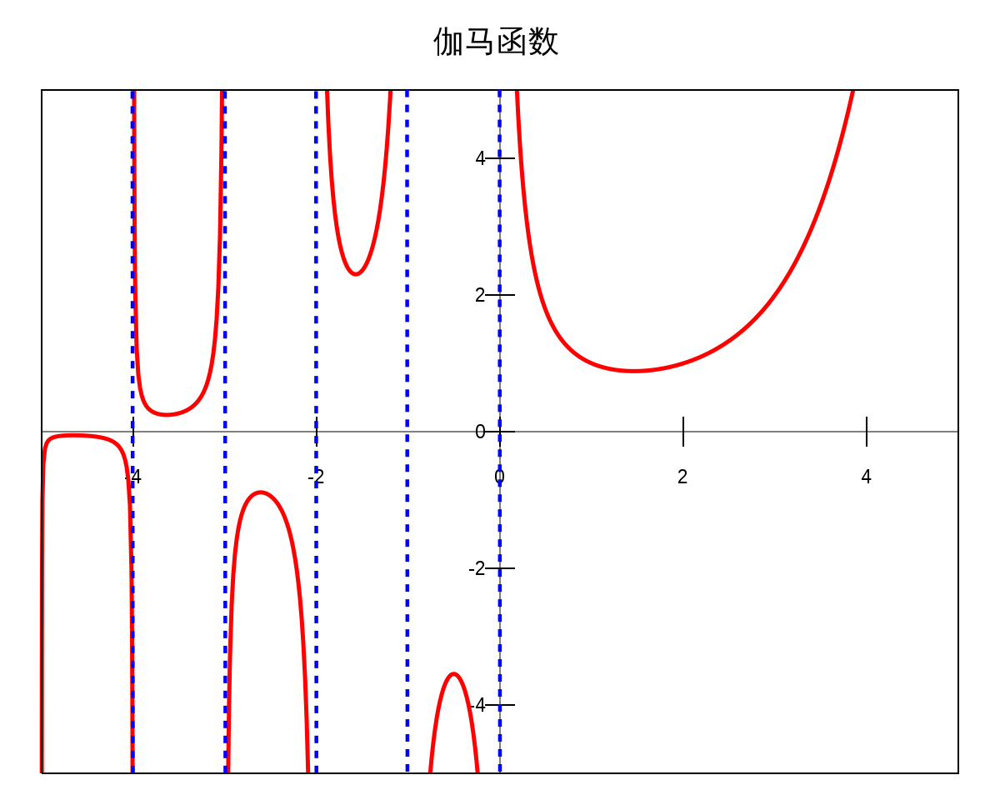

# 傅里叶变换原理

 **傅里叶变换原理是什么**

傅里叶变换是一种数学工具，它可以将一个信号（如时域信号）**表示为不同频率的正弦和余弦函数的叠加**。具体来说，傅里叶变换可以将时域信号转换为频域信号，这样我们就可以更好地理解信号的频率内容和振幅特征。

傅里叶变换的公式为：

$$X(f)=\int_{-\infty}^{\infty}x(t)e^{-j2\pi ft}dt$$

其中，$x(t)$ 表示时域信号，$X(f)$ 表示其对应的频域信号，$f$ 表示频率，$j$ 表示虚数单位。这个公式意味着，将时域信号 $x(t)$ 乘以一个指数函数 $e^{-j2\pi ft}$，然后在整个时间域上进行积分，可以得到对应的频域信号 $X(f)$。

需要注意的是，傅里叶变换**假设信号是连续的并且无限长的，因此在实际应用中需要对信号进行采样和截断**。此外，由于傅里叶变换输出的是一个连续的频域信号，通常使用离散傅里叶变换（DFT）或快速傅里叶变换（FFT）对其进行==离散==化和计算。

**傅里叶变换有多个性质，其中一些重要的性质如下：**

1. 线性性质：对信号进行加权和或线性组合，其傅里叶变换等于各自变换的加权和或线性组合。
2. 移位性质：对时间域信号进行时间上的平移，其傅里叶变换会发生**相位旋转**，即在频率轴上移动相应的位置。
3. 翻转性质：对时间域信号进行翻转，其傅里叶变换会发生频率轴上的翻转。
4. 周期性质：周期函数的傅里叶变换是离散的，仅在某些离散的频率上有能量。
5. ==对称性质==：实函数的傅里叶变换是复共轭对称的，即变换结果的虚部是镜像对称的。

这是因为对于实函数的傅里叶变换，可以看作是对一个偶函数和一个奇函数进行变换。偶函数在频率轴上是实对称的，即其变换结果的虚部为0；奇函数在频率轴上是虚对称的，即其变换结果的实部为0。因此，实函数的变换结果是复共轭对称的，其虚部是镜像对称的。

对于实数序列的傅里叶变换，因为傅里叶变换是对于无限长的序列进行的，所以需要对序列进行零填充（或补零）以达到要求。

## **使用`np.fft.rfft`还是`np.fft.fft`**

傅里叶变换是将一个信号在频域中进行表示，因此输出的结果是一组频谱系数。对于实数信号，其频域表示是==对称==的，因此在计算时可以只计算其非负频率部分（即正频率部分），而省略负频率部分，因为负频率部分和正频率部分是共轭对称的。

其次，对于一个离散信号，其傅里叶变换也是离散的，输出结果为离散频谱系数。根据采样定理，一个离散信号的最高频率分量不会超过采样频率的一半。因此，对于离散信号的傅里叶变换，其频域表示的长度最多为采样率的一半，即$N/2+1$。这就是为什么 `np`在傅里叶变换的计算过程中，一般使用复数表示信号的频谱。假设原始信号的长度为N，则经过FFT计算后得到的频谱数据也有N个值。

由于频域上的对称性，实际上只需要知道前一半频谱的信息，后一半的信息可以通过前一半得到。因此，输出数组的长度只需要是前一半的长度再加1即可。

具体来说，对于长度为N的信号，经过FFT计算后得到的频谱数据的前N/2 + 1个值对应的是频率从0到Nyquist频率（采样率的一半）的频率分量，而剩余的N/2-1个值则是由这些值得到的镜像对称的负频率分量。为了**避免重复计算和存储这些镜像对称的值，输出数组的长度只取前N/2+1个值即可**。

而FFT可以保留更加详细的信息，因为它可以将时间域上的信号转换到频率域上进行分析，从而提取出信号中的不同频率成分。FFT使用的是DFT算法，可以高效地计算离散频率的傅里叶变换，因此在实际应用中比DFT更加常用。

不过，与DFT相同，FFT在进行频域分析时也需要满足采样定理的要求，即采样频率必须高于信号最高频率的两倍以上，才能避免混叠误差的发生。此外，FFT也有一些局限性，比如在信号长度不足或者信号中存在噪声时，可能会导致分析结果不准确。因此，在实际应用中，需要根据具体情况选择合适的算法和参数。

> 傅里叶变换后的复数包含了两个部分：幅度和相位。其中幅度表示信号在不同频率上的强度，而相位则表示信号的不同频率分量之间的时间相对关系。
>
> 具体来说，傅里叶变换将一个时域上的信号分解成多个不同频率的正弦波组成的谱。这些正弦波在频域上的振幅就是该频率下的幅度，而它们之间的相位差则反映了不同频率分量之间的时间相对关系。
>
> 因此，傅里叶变换后的复数的相位信息可以告诉我们不同频率分量之间的时间相对关系。这可以用于许多应用中，例如音频处理、信号处理等。

# DDAE 和 DAE

DAE (Denoising AutoEncoder) 算法是一种无监督学习算法，它的主要目的是通过自编码器 (Autoencoder) 对输入数据进行特征提取和去噪处理。DAE 的网络结构通常包含一个编码器和一个解码器。**编码器将输入数据映射到一个低维的潜在空间表示，解码器则将低维表示还原回原始的高维数据**。在训练过程中，DAE 通过最小化重构误差来学习数据的特征表示和去噪能力。

具体而言，DAE 在训练时先对原始数据添加一定的噪声，然后将添加噪声的数据作为模型的输入，希望模型能够输出去除噪声的原始数据。在训练完成后，DAE 可以用于对新的噪声数据进行去噪处理。DAE 模型可以使用多种深度学习算法进行训练，包括基于反向传播的算法，如梯度下降、随机梯度下降、Adam 等。

DDAE (Denoising Deep Autoencoder) 是 DAE 的一种改进，它引入了多层网络结构，并通过逐层训练来学习数据的高级特征表示。DDAE 可以比 DAE 学习到更抽象的特征表示，并且在处理复杂数据时具有更好的表达能力和鲁棒性。DDAE 的训练过程也与 DAE 相似，只不过需要逐层训练多个自编码器。

相比于传统的 DAE 算法，DDAE 能够处理更加复杂的数据，例如图像、视频、语音等。在语音信号的去噪方面，DDAE 可以学习到更高阶的特征表示，从而提高去噪效果。但是，DDAE 模型的训练和计算成本通常会比 DAE 更高，因此需要更大量的训练数据和更强的计算能力。

## 代码模板

**DAE（Deep Autoencoder）**是一种常用于无监督学习的深度神经网络模型。下面是一个标准的DAE模板代码，以Python语言为例：

```PYTHON
pythonCopy Codeimport numpy as np
from tensorflow.keras.layers import Input, Dense
from tensorflow.keras.models import Model

# 构建编码器和解码器
def build_autoencoder(input_shape, code_size):
    input_layer = Input(shape=input_shape)
    code_layer = Dense(code_size, activation='relu')(input_layer)
    output_layer = Dense(input_shape[0], activation='sigmoid')(code_layer)
    
    encoder = Model(input_layer, code_layer)
    autoencoder = Model(input_layer, output_layer)
    autoencoder.compile(optimizer='adam', loss='mse')
    
    return autoencoder, encoder

# 加载输入数据
def load_data():
    data = np.load('data.npy')   # 从文件中加载数据
    return data

# 训练模型
def train(autoencoder, X_train, epochs):
    autoencoder.fit(X_train, X_train, epochs=epochs, batch_size=32)

# 使用模型进行特征提取
def encode(encoder, X):
    return encoder.predict(X)

# 使用模型进行重构
def reconstruct(autoencoder, X):
    return autoencoder.predict(X)
```

这个模板代码包括了DAE模型的构建、输入数据的加载和预处理、模型训练和使用等基本步骤

**DDAE（Denoising Deep Autoencoder）**是一种常用于信号去噪的深度学习模型。下面是一个标准的DDAE模板代码，以Python语言为例：


> DDAE模型通常需要多个数据才能进行训练，因为它是一种无监督学习模型，没有标签信息指导学习。
>
> 在DDAE模型中，我们需要准备两组数据：**干净的数据和带有噪声的数据**。这两组数据应该来自于同一个数据集，且数量要相等。其中，干净的数据用于作为模型的目标输出，带有噪声的数据则用于作为模型的输入。模型的目标是尽可能地将带有噪声的数据还原成干净的数据。
>
> 在训练过程中，我们使用带有噪声的数据作为输入，干净的数据作为目标输出。通过反向传播算法，模型会不断更新权重和偏置，最小化输入数据与目标输出之间的均方误差（Mean Squared Error, MSE）。
>
> 需要注意的是，DDAE模型的性能受到训练数据的质量和数量的影响。如果训练数据量过少，模型可能会过拟合；如果训练数据质量差，模型可能会出现欠拟合。因此，在实际应用中，需要仔细选择适当的训练数据集。

```python
import numpy as np
from tensorflow.keras.layers import Input, Dense
from tensorflow.keras.models import Model

# 构建编码器和解码器
def build_autoencoder(input_shape, code_size):
    input_layer = Input(shape=input_shape)
    code_layer = Dense(code_size, activation='relu')(input_layer)
    output_layer = Dense(input_shape[0], activation='sigmoid')(code_layer)
    
    encoder = Model(input_layer, code_layer)
    autoencoder = Model(input_layer, output_layer)
    autoencoder.compile(optimizer='adam', loss='mse')
    
    return autoencoder, encoder

# 加载输入数据，并添加噪声
def load_data():
    data = np.load('data.npy')   # 从文件中加载数据
    noisy_data = data + 0.1 * np.random.randn(*data.shape)   # 添加高斯噪声
    return data, noisy_data

# 训练模型
def train(autoencoder, X_train, X_noisy, epochs):
    autoencoder.fit(X_noisy, X_train, epochs=epochs, batch_size=32)

# 使用模型进行信号去噪
def denoise_signal(encoder, X_noisy):
    return encoder.predict(X_noisy)
```

这个模板代码包括了DDAE模型的构建、输入数据的加载和预处理、模型训练和使用等基本步骤。

需要注意的是，这只是一个简单的模板代码，实际应用中可能需要根据具体的问题进行修改和扩展。例如，模型结构的调整、超参数的设置、数据增强等都可能对模型的性能产生影响。

# 语音信号必备技巧

## 计算频率范围

使用快速傅里叶变换（FFT）时，可以通过以下步骤来查看频率：

1. 对信号进行离散傅里叶变换（DFT），得到信号的频域表示。

2. 计算每个频率分量的振幅和相位。

3. 将振幅转换为单位为 dB 的对数尺度，以便更容易地观察不同频率成分之间的差异。

4. 绘制频谱图，其中 x 轴表示频率，y 轴表示振幅或功率。

如果需要确定某个频率的具体数值，可以将该频率的索引与采样率相乘，即可得到该频率在Hz中的值。例如，假设采样率为1000Hz，而某个频率在DFT结果中的索引为10，则该频率的实际值为10*1000/1024=9.77 Hz。 

`np.fft.fftfreq()`函数是`NumPy`库中用于计算离散傅里叶变换（DFT）的快速傅里叶变换（FFT）结果对应的频率的函数之一。该函数的语法如下：

```python
numpy.fft.fftfreq(n, d=1.0)
```

其中，参数`n`表示信号长度，参数`d`表示采样周期，单位为秒，默认值为1.0秒。

该函数会返回一个长度为`n`的`NumPy`数组，包含由FFT结果对应的频率。具体来说，该函数会生成以0为中心的实数数组，其范围从负Nyquist频率到正Nyquist频率，即[-1/(2*d), 1/(2*d)]。因此，可以通过将该数组乘以采样频率来得到以Hz为单位的频率值。

需要注意的是，该函数返回的频率值是针对实数FFT结果的。如果使用复数FFT，则需要自行计算对应的频率值。

以下是一个简单的示例。假设我们有一个长度为8的信号，采样周期为0.1秒，其代码如下：

``` python
import numpy as np

sig_length = 8
sample_period = 0.1

freqs = np.fft.fftfreq(sig_length, d=sample_period)

print(freqs)
```

输出结果如下：

```
[ 0.     0.125  0.25   0.375 -0.5   -0.375 -0.25  -0.125]
```

可以看出，该函数返回了一个长度为8的数组，其中心点是0，表示直流信号。其他频率值则从负Nyquist频率到正Nyquist频率递增。如果我们将其乘以采样频率（10Hz），则可以得到相应的频率值：

``` python
freqs_hz = freqs * 10

print(freqs_hz)
```

输出结果如下：

```
[ 0.     1.25   2.5    3.75  -5.    -3.75  -2.5   -1.25 ]
```

因此，可见计算FFT结果对应的频率时，`np.fft.fftfreq()`函数非常实用。

> 傅里叶变换可以将一个信号从时域转换到频域，即将信号表示为不同频率的正弦和余弦波的加权和。在计算机中，傅里叶变换可以通过快速傅里叶变换（FFT）来实现。
>
> 在使用 FFT 进行频率域分析时，我们需要知道**每个频率对应着什么样的幅值**，因此就需要通过 `np.fft.fftfreq` 函数计算出频率信息。
>
> 具体来说，`np.fft.fftfreq` 函数用于生成一组表示频率的数字，这些数字对应于 `np.fft.fft` 返回的复数数组的各个元素。例如，如果 `np.fft.fft` 返回一个长度为 N 的复数数组，则 `np.fft.fftfreq(N)` 会返回一个长度为 N 的一维数组，该数组中的每个元素都是一个浮点数，**表示对应于该位置的复数值的频率**。
>
> 需要注意的是，`np.fft.fftfreq` 函数返回的频率值默认以“单位周期数”为单位，即每个周期含有一个完整的信号。如果需要以其他单位表示频率，可以通过除以采样率来进行换算。

**数学原理**

np.fft.fftfreq用于计算信号的频率。在语音信号处理中，可以使用离散傅里叶变换（DFT）将时域信号转换为频域信号，并对其进行进一步的分析和处理，如滤波、降噪等。

假设我们有一个长度为N的时域信号x(n)，其中n表示时间序列。使用DFT，我们可以将信号转换为由复数表示的频域信号X(k)，其中k表示频率序列。DFT的公式如下：

$$ X(k)=\sum_{n=0}^{N-1} x(n) e^{-2\pi i kn/N} $$

其中i表示虚数单位，k取值范围为0到N-1，n取值范围也为0到N-1。X(k)表示信号在第k个频率点的幅度和相位信息。

np.fft.fftfreq函数用于计算每个频率点对应的实际频率值。它的公式如下：

$$ f_k=k\times \frac{f_s}{N} $$

其中fk为第k个频率点对应的实际频率值，fs为信号的采样频率，N为信号的采样点数。

因此，`np.fft.fftfreq`返回的是一个长度为N的numpy数组，包含从0到N-1的所有非负整数，乘以信号的采样频率并除以N，得到对应的频率值。它可以帮助我们将DFT输出的频率轴转化为实际的频率值。

总之，`np.fft.fftfreq`函数结合离散傅里叶变换可以在语音信号处理中帮助我们分析信号的频域特征。

> 因为在数字信号处理中，离散时间信号的频域表示通常使用离散傅里叶变换（Discrete Fourier Transform，DFT）来实现。在进行DFT时，我们需要将离散时间信号转换为离散频率信号，也就是将信号从时域表示转换到频域表示。在离散频率信号中，每个元素对应一个特定的频率，而这个频率值与该元素在数组中的索引有关。具体而言，它等于该元素的索引乘以采样频率除以DFT长度，即：
>
> 频率 = 索引 x 采样频率 / DFT长度
>
> 因此，如果我们知道了离散频率信号元素的索引和采样率，就可以计算出相应的频率值。
>
> 这个公式是因为在进行DFT时，我们将时间域的N个采样点转换为频率域中的N个离散频率。这些离散频率的数量等于采样点数N。这些离散频率的范围从0到采样率（sampling rate）之间，其中采样率等于采集信号时每秒钟采样的点数。
>
> 因此，**我们通常将频率划分为N个相等的部分，每个部分表示一个离散频率。这些离散频率的值可以通过对索引进行归一化来计算，即将索引乘以采样频率除以DFT长度。这就是为什么频率等于索引 x 采样频率 / DFT长度的原因。**

## 幅度转分贝

`librosa.amplitude_to_db` 函数的作用是将幅度谱转换为分贝谱。这个函数实际上包含了两步转换：

1. 将输入的幅度谱取对数（以10为底），得到一个对数幅度谱。
2. 将对数幅度谱乘以一个系数20，再加上一个参考值（默认是1e-5）。

因此，可以看出 `librosa.amplitude_to_db` 的原理确实是将幅度谱取对数（以10为底）。而这样做的原因是因为人耳对音频信号的感知是呈现出对数关系的，因此将幅度谱转换为对数幅度谱的方式更符合人类听觉的特性。

至于 `ref` 参数，它控制了输出分贝谱中的参考值，默认为 $1e-5$。当 `ref` 取较小的值时，输出的分贝谱变化范围会扩大，反之变化范围会缩小。`red` 参数则控制是否对分贝谱进行归一化处理，即将输出的分贝谱限制在某个特定的范围内。如果 `red=True`，那么输出的分贝谱值会被压缩到 $[0, 1]$ 的范围内。

## AudioSegment  类

AudioSegment是Python中的一个类，它是由PyDub库提供的。 它用于处理音频文件，并提供了多种音频操作方法。

对于一段音频文件，可以使用AudioSegment类进行读取并存储为对象。 一旦音频被加载到对象中，便可以对其进行多种操作，如裁剪、混音、调整速度和音量等。

以下是AudioSegment类的一些常见操作：

1. 读取音频文件：

```python
from pydub import AudioSegment

sound = AudioSegment.from_file("audio.mp3", format="mp3")
```

这段代码将从名为“audio.mp3”的MP3文件中读取音频数据并将其存储在“sound”对象中。

2. 保存音频文件：

```python
sound.export("output.wav", format="wav")
```

这段代码将把“sound”对象中的音频数据保存为名为“output.wav”的WAV文件。

3. 裁剪音频：

```python
new_sound = sound[start_time:end_time]
```

这段代码将从“sound”对象中提取出从“start_time”到“end_time”时间段内的音频数据，并将其存储在“new_sound”对象中。

4. 混音音频：

```python
mixed_sound = sound1.overlay(sound2)
```

这段代码将混合在“sound1”和“sound2”对象中包含的音频数据，并将结果存储在“mixed_sound”对象中。

5. 调整音频速度：

```python
speed_adjusted_sound = sound.speedup(playback_speed)
```

这段代码将更改“sound”对象的播放速度，使其倍增或减少。 结果存储在“speed_adjusted_sound”对象中。

6. 调整音频音量：

```python
louder_sound = sound + 10
```

这段代码将调整“sound”对象的音量，并将其增加10分贝。 结果存储在“louder_sound”对象中。

以上是AudioSegment类的一些基本操作。 PyDub库提供了许多其他有用的方法和工具，可以在处理音频文件时使用。

要获取`AudioSegment`对象的音频数据，可以使用`get_array_of_samples()`方法，该方法返回一个NumPy数组，其中包含该音频文件中所有样本的值。您可以像这样使用它：

```python
from pydub import AudioSegment

# 加载音频文件
audio = AudioSegment.from_file("example.wav", format="wav")

# 获取对应的音频数据
samples = audio.get_array_of_samples()

# 您现在可以使用许多NumPy函数来处理和分析音频数据
```

请注意，此方法返回的数组类型取决于Python版本和PyDub库的版本。在较新版本的PyDub（例如v0.25.1）与Python 3中，返回的类型应为`numpy.ndarray`。在旧版本的PyDub或Python 2中，则可能返回`array.array`类型。

## 帧数转时间

librosa.frames_to_time函数用于将时间轴上的帧索引转换为对应的时间值。其原理是根据音频信号的采样率和帧跨度，计算每个帧的持续时间，并累加得到该帧结束的时间点。

具体地，假设音频信号的采样率为sr，帧跨度为hop_length，则每个帧的持续时间为hop_length / sr，那么第n帧的起始时间为n * hop_length / sr，结束时间为(n+1) * hop_length / sr。因此，frames_to_time函数就是根据这些计算公式将帧索引映射到对应的时间值上的。

# 语音可视化

## 热力图

语音数据通常是一维的。在这种情况下，要生成热力图，您需要将信号分成多个时间段，并使用每个时间段的能量值绘制热力图。

为此，您可以使用短时傅里叶变换（Short-Time Fourier Transform, STFT）等技术将信号分解成多个时间窗口，并计算每个时间窗口的功率谱密度或能量值。然后，您可以将每个时间窗口的能量值绘制成热力图，从而显示整个语音信号的能量分布情况。

具体来说，在Python中，您可以使用librosa库来进行STFT和功率谱密度计算，并使用Matplotlib库来绘制热力图。以下是一个示例代码片段	，展示如何生成语音信号的热力图：

```python
import librosa
import matplotlib.pyplot as plt
import numpy as np

# 读取音频文件
y, sr = librosa.load('audio.wav', sr=44100)

# 计算STFT
D = librosa.stft(y)

# 计算带宽能量
power = np.abs(D)**2

# 绘制热力图
plt.figure(figsize=(10, 4))
plt.imshow(power, cmap='hot', aspect='auto', origin='lower')
plt.colorbar()
plt.title('Power spectrogram')
plt.xlabel('Time')
plt.ylabel('Frequency')
plt.tight_layout()
plt.show()
```

在这个示例中，我们首先使用Librosa库计算了音频信号的STFT，然后计算了每个时间窗口内的能量，并将其绘制成热力图。使用`plt.imshow()`函数时，我们需要指定cmap（颜色映射），aspect（纵横比）和origin（热力图的原点）等参数。

需要注意的是，`plt.imshow()`函数中的数据应该以二维矩阵的形式提供，因此在本例中，我们先使用`np.abs()`函数计算了信号的幅度，然后再将其平方以得到每个时间窗口内的能量值。

## 频率分布柱状图

当涉及语音的频率分布柱状图时，通常需要使用数字信号处理（DSP）库来计算音频信号的傅里叶变换。一些常用的 Python DSP 库包括 `numpy`、`scipy` 和 `matplotlib`。下面是一个基本的代码模板来生成语音的频率分布柱状图：

```python
import numpy as np
from scipy.io import wavfile
import matplotlib.pyplot as plt

# 读取音频文件
sample_rate, data = wavfile.read('your_audio_file.wav')

# 计算 FFT
fft = np.fft.fft(data)

# 计算频率范围
freqs = np.fft.fftfreq(len(fft))

# 仅保留正频率部分（镜像）
pos_freqs = freqs[:len(freqs)//2]
pos_fft = np.abs(fft[:len(fft)//2])

# 绘制柱状图
plt.bar(pos_freqs, pos_fft, width=1.5)
plt.title('Frequency Distribution of Audio')
plt.xlabel('Frequency (Hz)')
plt.ylabel('Amplitude')
plt.show()
```

在这个代码模板中，我们首先使用 `scipy.io.wavfile` 模块来读取音频文件，并使用 `numpy.fft` 模块计算它的快速傅里叶变换（FFT）。然后，我们计算频率范围，并且只保留正频率部分。最后，我们使用 `matplotlib` 库绘制柱状图。

你需要将代码中的 `'your_audio_file.wav'` 替换为你想要生成频率分布柱状图的音频文件路径。

## 圆形频谱图

圆形频谱图：以圆形的方式显示语音信号的频率分布，可以更清晰地展示不同频段的特征。

以下是一个使用Python和Matplotlib库创建圆形频谱图的模板代码：

```python
import numpy as np
import matplotlib.pyplot as plt

# 生成一些模拟数据
t = np.linspace(0, 1, 44100)
f1 = 440
f2 = 880
signal = np.sin(2 * np.pi * f1 * t) + 0.5 * np.sin(2 * np.pi * f2 * t)

# 计算信号的频谱
spectrum = np.fft.fft(signal)

# 计算频率轴
freq_axis = np.fft.fftfreq(len(signal), d=1/44100)

# 将频率轴限制在0到2000 Hz之间
freq_mask = (freq_axis >= 0) & (freq_axis <= 2000)
freq_axis = freq_axis[freq_mask]
spectrum = spectrum[freq_mask]

# 创建一个极坐标子图，并绘制频谱
fig, ax = plt.subplots(subplot_kw=dict(projection='polar'))
ax.plot(2*np.pi*freq_axis, np.abs(spectrum))

plt.show()
```

这个例子中，我们生成了一个包含两个正弦波的模拟语音信号。然后我们计算了信号的频谱，并将频率轴限制在0到2000 Hz之间。最后，我们创建了一个极坐标子图，并在其中绘制了频谱。你可以根据需要修改这个代码，以适应不同的语音信号和频率范围。

通过极坐标系来表示频率和幅度信息。在圆形频谱图中，角度代表频率，从0到2*pi，对应着完整的频率范围。而半径代表振幅或能量，通常使用颜色、线宽等方式来表示。

因此，通过观察圆形频谱图，我们可以看出哪些频率分量具有更高的能量或振幅，这些频率分量通常对应着语音信号中的共振峰或者基频。此外，通过比较不同的圆形频谱图，我们还可以发现不同语音之间的差异，并进一步分析这些差异的原因。

> np.meshgrid可以用于生成一个多维坐标网格。它接受一组一维数组，并返回多个二维数组，每个数组对应于输入数组的一个维度。在返回的数组中，第i个维度的大小等于输入数组中第i个维度的大小。
>
> 下面是一个示例代码：
>
> ``` python
> import numpy as np
> 
> x = np.array([1, 2, 3])
> y = np.array([4, 5, 6, 7])
> 
> xx, yy = np.meshgrid(x, y)
> 
> print(xx)
> print(yy)
> ```
>
> 输出结果为：
> ```
> [[1 2 3]
>  [1 2 3]
>  [1 2 3]
>  [1 2 3]]
>  
> [[4 4 4]
>  [5 5 5]
>  [6 6 6]
>  [7 7 7]]
> ```
>
> 在这个例子中，输入的x和y数组分别有3和4个元素。np.meshgrid(x, y)将返回两个二维数组xx和yy。其中，xx的第一行、第二行、第三行和第四行分别是[1, 2, 3]，表示x的值不变；yy的第一列、第二列、第三列和第四列分别是[4, 5, 6, 7]，表示y的值不变。因此，返回的数组实际上表示了一个4行3列的矩阵，其中每个元素都是由对应的x和y值组成的二元组。

## 三维频谱图

三维频谱图：通过在二维频谱图的基础上增加一个时间轴来呈现三维频谱图，可以更全面地展示语音信号的时频特征。

```python
import numpy as np
import matplotlib.pyplot as plt
from mpl_toolkits.mplot3d import Axes3D

# 生成一些模拟数据
t = np.linspace(0, 1, 44100)
f1 = 440
f2 = 880
signal = np.sin(2 * np.pi * f1 * t) + 0.5 * np.sin(2 * np.pi * f2 * t)

# 计算信号的短时傅里叶变换（STFT）
window_size = 1024
hop_length = 512
stft = librosa.stft(signal, n_fft=window_size, hop_length=hop_length)

# 转换成分贝（dB）单位
log_stft = librosa.amplitude_to_db(np.abs(stft), ref=np.max)

# 计算时间轴和频率轴
times = librosa.times_like(log_stft)
freqs = librosa.fft_frequencies(sr=44100, n_fft=window_size)

# 创建一个三维子图，并绘制频谱
fig = plt.figure()
ax = fig.add_subplot(111, projection='3d')
X, Y = np.meshgrid(times, freqs)
ax.plot_surface(X, Y, log_stft, cmap='viridis')

# 添加轴标签和标题
ax.set_xlabel('Time')
ax.set_ylabel('Frequency')
ax.set_zlabel('Amplitude (dB)')
plt.title('3D Spectrogram of Speech Signal')

plt.show()
```

这个例子中，我们生成了一个包含两个正弦波的模拟语音信号。然后我们计算了信号的短时傅里叶变换（STFT），并将它转换为分贝（dB）单位。最后，我们创建了一个三维子图，并在其中绘制了频谱。你可以根据需要修改这个代码，以适应不同的语音信号和时间范围。

在三维频谱图中，X轴代表时间，Y轴代表频率，而Z轴则代表幅度或者能量。通过观察三维频谱图，我们可以更全面地了解语音信号的时频特征。

## 频谱瀑布图

频谱瀑布图：将多个频谱图沿时间轴排列起来形成频谱瀑布图，可以展示语音信号在时间上的演化过程。

以下是使用Python和Matplotlib库创建频谱瀑布图的模板代码：

```python
import numpy as np
import matplotlib.pyplot as plt

# 生成一些模拟数据
num_frames = 100
frame_size = 512
hop_length = 256
spectrograms = np.zeros((num_frames, frame_size//2 + 1))

for i in range(num_frames):
    t = np.linspace(0, 1, frame_size)
    f1 = 440 + 10*i
    f2 = 880 + 20*i
    signal = np.sin(2 * np.pi * f1 * t) + 0.5 * np.sin(2 * np.pi * f2 * t)
    spectrogram = np.abs(np.fft.rfft(signal, n=frame_size))
    spectrograms[i,:] = spectrogram

# 绘制频谱瀑布图
fig = plt.figure(figsize=(8,6))
ax = fig.add_subplot(111)

im = ax.imshow(spectrograms.T, cmap='viridis', aspect='auto', origin='lower',
               extent=[0, num_frames*hop_length/44100, 0, 22050], interpolation='nearest')

ax.set_xlabel('Time (s)')
ax.set_ylabel('Frequency (Hz)')
plt.title('Spectrogram Waterfall Plot')

plt.show()
```

在这个例子中，我们生成了一个包含多个正弦波的模拟语音信号，并计算了每个时间窗口内的频谱。然后，我们将所有的频谱按时间轴排列起来形成了频谱瀑布图。你可以根据需要修改模拟语音信号的内容和数量，以及参数如窗口大小、跨度等。此外，你也可以调整绘图时的颜色映射、轴标签、标题等，以适应不同的应用场景。

# 数据增广

## Mixup

当谈到音频数据增广时，"mixup"是一种常用的技术。Mixup是一种数据合成方法，它可以通过将两个不同的音频样本混合在一起来创建一个新的训练样本。

具体而言，对于每对音频样本，mixup方法会执行以下步骤（一部分是一份数据，一部分是另外一份数据：

1. 随机选择两个不同的音频样本。
2. 从0到1之间生成一个随机的权重因子λ。
3. 将第一个音频样本乘以λ，并将第二个音频样本乘以（1-λ）。
4. 将两个乘积相加，得到最终的混合音频样本。

这种方法的目标是通过混合不同的音频样本来增加训练数据的多样性。通过将不同的声音混合在一起，模型可以学习到更多不同类型的音频特征，从而提高其泛化能力。

除了mixup，还有其他常用的音频数据增广方法，例如时间拉伸、音高变换、噪声添加等。这些方法都旨在扩展训练数据集，提高模型的鲁棒性和性能。

需要注意的是，在应用音频数据增广方法时，需要根据任务和应用场景进行适当的调整和处理。此外，在使用混合音频样本进行训练时，**需要确保标签也按照相应的权重进行混合，以匹配混合音频样本的特征**。


## 案例源码

当对循环列表的两两数据进行Mixup时，可以使用一个循环结构来处理每对数据。同时，如果你想为每个数据添加采样权重，可以通过传递一个权重列表来实现。以下是更新后的代码示例：对列表中的两两数据进行随机Mixup，并且尽量避免重复的组合，可以使用`random.sample()`函数来生成不重复的索引对。以下是更新后的代码示例：

```python
import numpy as np
import librosa
import random

def mixup_audio_random(audio_list, alpha_list, sr):
    num_audios = len(audio_list)
    mixed_audio = np.zeros_like(audio_list[0])

    index_pairs = random.sample(range(num_audios), 2)

    for i, j in index_pairs:
        audio1, alpha1 = audio_list[i], alpha_list[i]
        audio2, alpha2 = audio_list[j], alpha_list[j]

        # 确保音频文件长度相同
        min_length = min(len(audio1), len(audio2))
        audio1, audio2 = audio1[:min_length], audio2[:min_length]

        # 对音频文件进行mixup
        mixed_audio += alpha1 * audio1 + alpha2 * audio2

    return mixed_audio / len(index_pairs)

# 例子使用：
audio_list = []
alpha_list = []s
sr = None  # 采样率

# 添加音频数据和对应的采样权重
audio_list.append(librosa.load("audio1.wav", sr=sr)[0])
alpha_list.append(0.7)

audio_list.append(librosa.load("audio2.wav", sr=sr)[0])
alpha_list.append(0.5)

audio_list.append(librosa.load("audio3.wav", sr=sr)[0])
alpha_list.append(0.8)

mixed_audio = mixup_audio_random(audio_list, alpha_list, sr)

# 可以将混合后的音频保存到文件
output_path = "mixed_audio.wav"
librosa.output.write_wav(output_path, mixed_audio, sr)
```

在这个例子中，我们使用`random.sample()`函数来随机选择两个不重复的索引对作为Mixup的组合。这样可以确保每次Mixup都是随机的且不重复的。然后，我们根据选择的索引对来获取音频数据和采样权重，并进行Mixup。最后，将混合后的音频保存到文件。

请注意，以上代码仍然假设所有音频数据具有相同的采样率，并且使用`librosa`库进行音频加载和保存。你需要确保安装了`librosa`库以及其他相关依赖项。

# 特征提取

当涉及到音频信号处理中的四种特征提取方法：GFCC（Gammatone Frequency Cepstral Coefficients）、IMFCC（Improved Multi-Frequency Cepstral Coefficients）、EMFCC（Enhanced Mel Frequency Cepstral Coefficients）和MFCC（Mel Frequency Cepstral Coefficients），让我们逐个进行详细解释，并提供相应的原理和模板代码。使用库（Spectrogram Analysis FrameWork) `spafe`  (更具业界可以知道最常用的是MFCC，我们只需要用改进的和用Gmamatone的尝试即可)

## MFCC（Mel Frequency Cepstral Coefficients）：

- 原理：MFCC 是一种常见的音频特征提取方法，它模拟人类听觉系统对声音的感知。主要包含以下步骤：
  1. 预加重：通过应用一个高通滤波器来平衡语音信号的频谱。
  2. 分帧：将音频信号分割成小的时间窗口。
  3. 加窗：对每个时间窗口应用窗函数（如汉明窗）以减少频谱泄露。
  4. 快速傅里叶变换（FFT）：计算每个窗口的频谱。
  5. 梅尔滤波器组：应用一组三角滤波器，这些滤波器在梅尔频率尺度上均匀分布，以模拟人耳的感知特性。
  6. 对数压缩：将频谱转换为对数刻度，以增加特征的区分度。
  7. 离散余弦变换（DCT）：应用DCT将对数频谱转换为倒谱系数，保留较少的高频信息。
- 模板代码：
  ```python
  import librosa
  
  # 加载音频文件
  audio_file = 'path/to/audio.wav'
  y, sr = librosa.load(audio_file)
  
  # 计算MFCC特征
  mfcc = librosa.feature.mfcc(y=y, sr=sr, n_mfcc=13)
  
  # 打印MFCC特征
  print('MFCC:')
  print(mfcc)
  ```

## IMFCC（Improved Multi-Frequency Cepstral Coefficients）：

- IMFCC在MFCC的基础上进行了一些改进，以提高其表达能力和鲁棒性。
  
  主要的改进包括以下几点：
  
  1. 动态参数：IMFCC引入了动态参数，例如速度和加速度，来描述信号的时序变化。这些动态参数能够捕捉到音频信号的时间演化信息，从而提供更多关于声音变化的上下文信息。
  2. 预加重滤波器：预加重滤波器被用于增强高频信号，以提高特征提取的准确性。IMFCC采用了改进的预加重滤波器设计，使得音频信号中的高频成分更加突出，有助于后续的特征提取过程。
  3. 改进的倒谱提取：IMFCC使用改进的倒谱提取方法，以减小噪声对特征提取的影响。这种改进可以提高MFCC的鲁棒性，使其对于环境噪声和信号失真具有更好的适应性。
  
- 模板代码：
  ```python
  import numpy as np
  import scipy.fftpack as fftpack
  import librosa
  
  # 加载音频文件
  audio_file = 'path/to/audio.wav'
  y, sr = librosa.load(audio_file)
  
  # 预加重
  pre_emphasis = 0.97
  emphasized_signal = np.append(y[0], y[1:] - pre_emphasis * y[:-1])
  
  # 分帧
  frame_length = int(0.025 * sr)  # 25ms
  frame_step = int(0.01 * sr)  # 10ms
  frames = librosa.util.frame(emphasized_signal, frame_length=frame_length, hop_length=frame_step)
  
  # 加窗
  window = np.hamming(frame_length)
  windowed_frames = frames * window[:, np.newaxis]
   # 计算功率谱
  power_spectrum = np.abs(np.fft.rfft(windowed_frames, axis=1)) ** 2
   
  # 计算IMFCC特征
  imfcc = fftpack.dct(10 * np.log10(power_spectrum), axis=1, type=2, norm='ortho')
  
  # 打印IMFCC特征
  print('IMFCC:')
  print(imfcc)

## EMFCC（Enhanced Mel Frequency Cepstral Coefficients）：

- 原理：EMFCC是对MFCC的增强版本，它在MFCC的基础上引入了额外的增强参数，主要包括以下步骤：

  1. 预加重：通过应用一个高通滤波器来平衡语音信号的频谱。
  2. 分帧和加窗：将音频信号分割成时间窗口并应用窗函数。
  3. 幅度谱计算：通过应用快速傅里叶变换（FFT）计算每个窗口的幅度谱。
  4. 梅尔滤波器组：应用一组三角滤波器，这些滤波器在梅尔频率尺度上均匀分布，以模拟人耳的感知特性。
  5. 对数压缩：将频谱转换为对数刻度，以增加特征的区分度。
  6. 动态特征（Delta和Delta-Delta）**：通过计算当前帧与相邻帧之间的差异来捕获频谱随时间的变化**。
  7. 合并特征：**将MFCC特征与`动态特征`连接起来形成最终的EMFCC特征**。

EMFCC的改进主要包括以下方面：

1. 增加高阶倒谱系数：除了常规的MFCC系数，EMFCC还引入了高阶倒谱系数。这些高阶倒谱系数能够提供更多频率分辨率和更丰富的音频特征信息。
2. 非线性变换：EMFCC采用非线性变换方法对MFCC系数进行处理。这种非线性变换可以增强特征之间的差异性，使得提取的特征更具判别性。
3. 去相关技术：EMFCC使用去相关技术来减小特征之间的相关性。通过消除特征之间的冗余信息，可以提高特征的独立性和表达能力。

- 模板代码：

  ```python
  import librosa
  
  # 加载音频文件
  audio_file = 'path/to/audio.wav'
  y, sr = librosa.load(audio_file)
  
  # 计算MFCC特征
  mfcc = librosa.feature.mfcc(y=y, sr=sr, n_mfcc=13)
  
  # 计算动态特征（Delta和Delta-Delta）即相邻差分,得到动态变化
  delta_mfcc = librosa.feature.delta(mfcc)
  delta2_mfcc = librosa.feature.delta(mfcc, order=2)
  
  # 合并MFCC和动态特征
  emfcc = np.vstack([mfcc, delta_mfcc, delta2_mfcc]) # 一阶和二阶动态特征垂直堆叠在一起，形成一个新的特征矩阵emfcc。	
  
  # 打印EMFCC特征
  print('EMFCC:')
  print(emfcc)
  ```

> `librosa.feature.delta()`函数用于计算给定特征矩阵的**一阶或二阶差分**（Delta和Delta-Delta）。
>
> Delta是一种描述特征随时间变化的衍生特征。它通过计算相邻帧之间的差异来捕捉音频特征的动态信息，例如声音的速度变化。Delta可以帮助提取语音、音乐等音频信号中的快速变化特征。
>
> Delta的计算过程如下：
>
> 1. 假设有一个大小为`(n_features, n_frames)`的特征矩阵X，其中`n_features`是特征的数量，`n_frames`是帧的数量。
> 2. 对于每个特征维度i，在每个时间帧t上计算差分值： `delta_X[i, t] = X[i, t+1] - X[i, t-1]` 要注意边界情况，当`t`为第一个或最后一个帧时，需要使用适当的边界处理方式。
> 3. 得到一个新的特征矩阵`delta_X`，其大小为`(n_features, n_frames)`。
>
> 与Delta类似，Delta-Delta是对Delta特征进行进一步差分计算得到的二阶差分特征。Delta-Delta的计算过程与Delta相似，只是在Delta的基础上再次应用差分运算。
>
> `librosa.feature.delta()`函数的调用方式如下：
>
> ```python
> delta_X = librosa.feature.delta(X, width=N, order=1, axis=-1, mode='interp', **kwargs)
> ```
>
> 参数说明：
>
> - `X`：输入特征矩阵（例如MFCC特征矩阵）。
> - `width`：差分计算窗口的宽度。默认值为 9，表示使用前后各4个帧进行差分计算。
> - `order`：差分的阶数。`order=1`表示一阶差分（Delta），`order=2`表示二阶差分（Delta-Delta）。
> - `axis`：指定在哪个轴上进行差分计算。默认值为-1，表示最后一个轴。
> - `mode`：指定边界处理方式。默认为'interp'，表示使用插值填充边界值。
>
> `librosa.feature.delta()`函数返回计算得到的差分特征矩阵。
>
> 总结起来，Delta特征是通过计算音频特征在时间上的差异来捕捉音频动态变化的衍生特征。它可以帮助提取音频信号中的快速变化特征。Delta-Delta则是对Delta特征再次进行差分计算得到的二阶差分特征。


## GFCC（Gammatone Frequency Cepstral Coefficients）：

- 原理：GFCC是一种**基于Gammatone滤波器的特征提取方法**，它模拟人耳的听觉特性对声音的感知，它结合了组延迟和倒谱分析的概念，可以有效地捕捉音频信号中的时变频谱特征。主要包含以下步骤：

  1. 分帧：首先，将音频信号分成短时间片段，通常每个片段为20-40毫秒，这样可以保证信号在每个时间段内是基本稳定的。
  2. 傅里叶变换：对每个时间片段进行傅里叶变换，将时域信号转换为频域信号。这样可以得到每个时间片段内的频谱信息。
  3. 组延迟计算：对于每个频谱帧，计算其组延迟。组延迟表示信号在频域上的相位变化速度。计算组延迟可以通过计算相邻帧之间的相位差来实现。
  4. 倒谱分析：对于每个频谱帧，应用倒谱分析。倒谱是指对频谱取对数然后进行傅里叶逆变换。**倒谱分析可以减小谱峰之间的差异，使得特征更加稳定**。
  5. 梅尔滤波器组：将倒谱系数输入到梅尔滤波器组中，梅尔滤波器组通常包含一系列三角形滤波器，用于对频谱进行滤波。每个滤波器对应一个特定的频率范围，可以提取出相应频率范围内的能量。
  6. 能量整合：对于每个滤波器输出的能量进行积分或平均，得到每个滤波器输出的总能量。
  7. 倒谱提取：对于每个滤波器输出的能量值进行离散余弦变换（DCT），提取倒谱系数。DCT可以将时域信号转换为频域信号，提取出主要的频率特征。
  8. 群延迟特征提取：结合群延迟和倒谱系数进行特征提取。在**计算MFCC时，通常只考虑幅度谱**，而**GFCC还利用了群延迟信息，使其能够更好地捕捉语音信号的动态特征**。
  9. 特征归一化：对得到的GFCC系数进行归一化操作，以确保不同语音信号之间的比较具有可靠性。

  以上就是GFCC的原理实现过程。通过使用群延迟和倒谱系数，GFCC能够提取出更具有区分度和表达力的语音特征，对于语音识别和音频处理任务具有较好的效果。

> Gammatone是一种信号处理方法和滤波器设计，用于**模拟人耳的听觉系统对声音的感知**。它基于生物学上已知的耳蜗内部的神经元响应原理。
>
> Gammatone滤波器通过使用**一组相关的带通滤波器**来模拟人耳中的听觉通道。这些**滤波器在频率上相互重叠**，并且其频率响应类似于带谷的**gamma函数**形状，因此得名为Gammatone滤波器。每个滤波器都具有特定的中心频率和带宽，类似于人耳中的听觉通道。
>
> > Gamma函数是数学中的一种特殊函数，通常用符号Γ表示。它是阶乘函数在复数域上的推广。
> >
> > 对于实数x大于0，Gamma函数定义如下：
> >
> > Γ(x) = ∫[0, +∞] t^(x-1) * e^(-t) dt
> >
> > 其中，t^(x-1)表示t的x-1次幂，e是自然对数的底数。
> >
> > Gamma函数还具有以下性质：
> >
> > - 对于正整数n，Γ(n) = (n-1)!
> > - Γ(x+1) = x * Γ(x)，这是Gamma函数的递归关系。
> > - 当x为实数时，Γ(x)在(0, +∞)上连续且无穷多次可导。
> >
> > Gamma函数在数学和物理学中具有广泛的应用。它与组合数学、复变函数、积分等领域有着密切关联。在概率论和统计学中，Gamma函数与贝塔分布、伽马分布等概率分布函数相关联。此外，在物理学中，Gamma函数在量子力学、统计力学等领域也有重要的应用。
>
> 
>
> Gammatone滤波器广泛用于音频处理、语音识别、音频编码和听觉模型等领域。它可以提取特定频率范围内的声音信息，并模拟人耳对不同频率的敏感性。

- 模板代码：

  ```python
  import numpy as np
  import librosa
  import gammatone.filters as gf
  
  # 加载音频文件
  audio_file = 'path/to/audio.wav'
  y, sr = librosa.load(audio_file)
  
  # 计算GFCC特征
  n_mfcc = 13  # MFCC系数数量
  n_fft = 2048  # FFT长度
  hop_length = 512  # 帧移距离
  
  # 计算Gammatone滤波器组
  num_filters = 40  # 滤波器数量
  low_freq = 80  # 最低频率
  high_freq = 8000  # 最高频率
  filters = gf.make_erb_filters(sr, num_filters, low_freq, high_freq)
  
  # 进行Gammatone滤波
  filtered = gf.filterbank(y, filters)
  
  # 对滤波后信号进行幅度谱计算
  power_spectrum = np.abs(librosa.stft(filtered, n_fft=n_fft, hop_length=hop_length))**2
  
  # 计算MFCC特征
  gfcc = librosa.feature.mfcc(S=librosa.power_to_db(power_spectrum), n_mfcc=n_mfcc)
  
  # 打印GFCC特征
  print('GFCC:')
  print(gfcc)
  ```

请注意，上述代码使用了`gammatone.filters`库来生成Gammatone滤波器组，并使用`filterbank`函数将音频信号进行滤波。然后，通过计算幅度谱并应用MFCC提取步骤，我们可以得到GFCC特征。

请确保你已经安装了`gammatone`和`librosa`库以运行上述代码示例。

## 小波变换

小波变换（Wavelet Transform）是一种用于信号和图像处理的数学工具，具有时频**局部化**的特性。与傅里叶变换（Fourier Transform）相比，小波变换可以提供更好的时域和频域的局部分析能力，能够捕捉信号中的**短时变化**。

小波变换通过将原始信号与一组称为小波基（Wavelet）的函数进行卷积运算来分析信号。小波基是以时间和频率两个尺度进行变化的函数，可以在不同尺度上对信号进行分解和重构。这种尺度变化的特性使得小波变换可以同时提供频域和时域的信息。

小波变换的过程可以分为以下几步：

1. 尺度变换：小波变换使用不同尺度的小波基函数对信号进行分解。通过调整小波基的尺度，可以捕捉信号在不同频率范围内的特征。

2. 位置变换：在每个尺度上，小波基函数在时间轴上进行平移，对信号的不同时间段进行分析。这种平移操作可以提供信号在时间上的局部分析。

3. 卷积运算：在每个尺度和位置上，将原始信号与小波基函数进行卷积运算。卷积运算可以通过计算原始信号与小波基函数的内积来获得对应尺度和位置上的小波系数。

4. 重构：通过对小波系数进行逆变换，可以将信号从小波域重新恢复到原始的时域。

小波变换在信号和图像处理中有多种应用，包括信号的去噪、特征提取、边缘检测、压缩等。由于小波变换具有时频局部化的特性，能够更好地捕捉信号的**瞬时特征**，**`因此在处理非平稳信号和包含短时变化的信号时，小波变换常常比傅里叶变换更为适用`**。

需要注意的是，小波变换是一种多尺度分析方法，有多种小波基函数可供选择，如Haar小波、Daubechies小波、Morlet小波等。不同的小波基函数适用于不同类型的信号和应用场景，选择适合的小波基函数对于获得良好的分析结果是重要的。

小波变换（Wavelet Transform）和梅尔频率倒谱系数（MFCC）是两种常用的特征提取方法，它们在语音信号处理中具有不同的特点和应用。

小波变换的优点是能够提供时频局部化的特征分析，对于捕捉信号的短时变化和非平稳性表现出较好的效果。小波变换可以提供更高分辨率的频域信息，能够较好地分析信号中的瞬时特征和频率变化。因此，在一些需要对信号的时间局部性进行分析的场景中，小波变换可能更适合。

MFCC是一种常用于语音识别的特征提取方法，它主要关注信号的语音信息，对人耳感知较为重要的频率区域有更高的分辨率，而对于较高频率的细节信息进行了抽样。MFCC在语音识别中广泛应用，已经被证明在语音识别任务中具有较好的效果。它对于语音信号的鉴别性和稳定性较强，能够较好地表达语音信号的语音内容。

对于特征效果的比较，很难一概而论哪个方法更好，因为它们在不同的应用场景下可能有不同的表现。选择适合的特征提取方法应该根据具体的任务需求、数据特点和算法模型进行综合考虑。有时候，结合多种特征提取方法可以获得更好的效果。

在实际应用中，通常会根据具体任务的需要进行实验和比较，通过评估指标（如分类准确率、识别率等）来确定哪种特征提取方法更适合。此外，特征选择和模型的选择与调整也是影响特征效果的重要因素。
