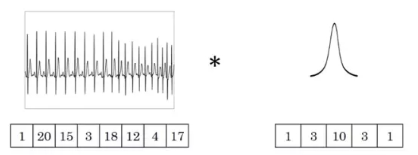
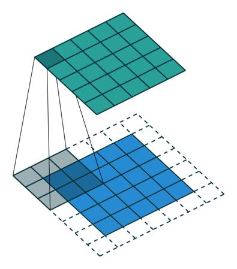
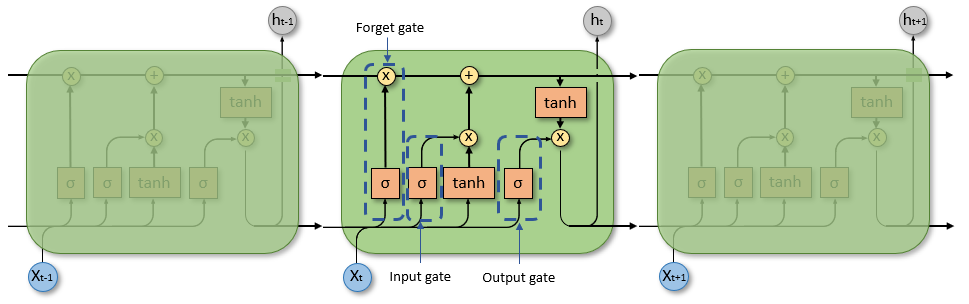
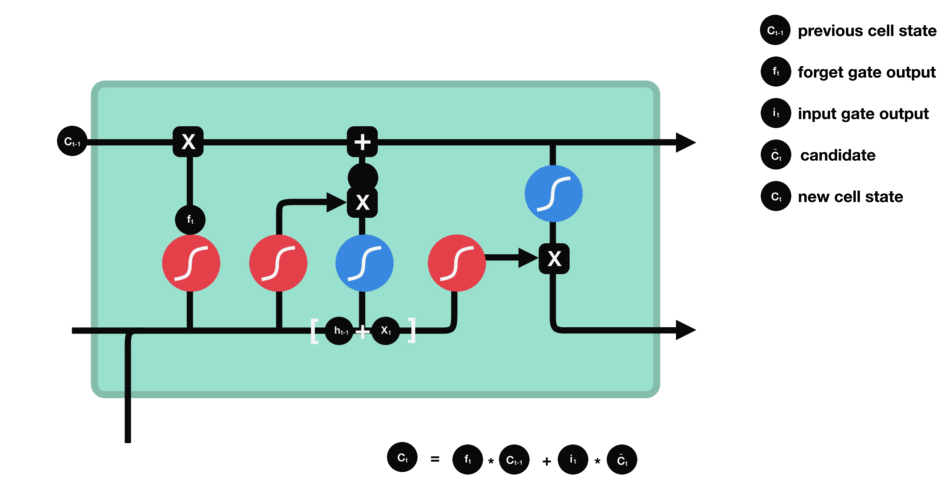

# Input

https://blog.csdn.net/m0_53732376/article/details/117082802

Input() 用于实例化Keras张量

```python
tensorflow.keras.Input()
"""
shape:元组维数，定义输入层神经元对应数据的形状。比如shape=(32, )和shape=32是等价的，表示输入都为长度为32的向量。
	
batch_size：声明输入的batch_size大小，定义输入层时不需要声明，会在fit时声明，一般在训练时候用

name：给layers起个名字，在整个神经网络中不能重复出现。如果name=None，程序会自动为该层创建名字。

dtype：数据类型，一般数据类型为tf.float32，计算速度更快

sparse：特定的布尔值，占位符是否为sparse

tensor：可选的现有tensor包装到“Input”层。如果设置该参数，该层将不会创建占位符张量

"""
```

# BatchNormalization

### 原理概述

`tf.keras.layers.BatchNormalization`是深度学习模型中的一种正则化方法，可以减少模型的过拟合，使训练更加稳定。它在每个batch的数据上，对每个特征维度进行标准化操作，即将**每个特征的均值调整为0，方差调整为1**，然后通过**可学习的拉伸和偏移参数重新缩放和平移每个特征**，从而使得每个**特征的分布都比较接近标准正态分布**，以此来达到加速训练，提高模型精度的效果。

> 在使用 `BatchNormalization `进行标准化操作时，每个特征维度指的是每个样本中的每个特征的值。如果输入的是语音信号序列，则特征维度可能包括频谱、能量等等。在这种情况下，`BatchNormalization `将对每个样本中的每个特征进行标准化，以使得每个特征的分布相似，这样有助于提高模型的稳定性和泛化能力。
>
> 对于一维的语音信号序列，`BatchNormalization `操作仍然是对每个特征维度进行标准化操作，只是这里的**特征维度是指每个时间步上的语音信号振幅**，而不是一般意义上的二维特征。`BatchNormalization`在**每个时间步上对该时间步的所有样本的数据进行标准化处理**。在1D卷积神经网络中，时间步就是输入序列的每个位置，因此`BatchNormalization`会对该位置的所有样本的数据进行标准化。标准化可以使得不同时间步上的振幅具有相同的分布特性，有助于提高模型的泛化能力和训练效果。 
>
> `BatchNormalization` **不会直接提取语音信号的特征，它只是在每个时间步上对输入进行标准化处理**，使得神经网络可以更好地学习到有用的语音特征。如果需要从语音信号中提取更加高级的特征，可以考虑使用卷积层、池化层等操作。

相比之下，`sklearn`的`StandardScaler`只是一种常用的数据预处理方法，用于将数据按特征进行标准化处理，即将每个特征的均值调整为0，方差调整为1，**但是没有可学习的参数，不能自适应地对每个batch的数据进行标准化**，因此不能像`BatchNormalization`一样在训练过程中对模型参数进行调整，从而使得训练更加稳定。

> Batch normalization是通过**可学习的拉伸(scale)和偏移(shift)参数重新缩放和平移每个特征**的。
>
> 在模型的训练过程中，==由于每一层的输入分布都在不断变化，使得后续的层难以拟合数据==。Batch normalization的思想就是通过对每一层的输入进行归一化，将每个特征都限制在均值为0，标准差为1的分布中，**使得网络中每层的输入都具有相似的分布，有利于后续层的训练和优化**。具体实现是对每个batch数据的每个特征分别进行均值和标准差的统计，然后使用**学习到的scale和shift参数对每个特征进行缩放和平移**。
>
> 与此不同，`sklearn`中的`StandardScaler`是对**数据进行全局归一化**，即对整个数据集的每个特征分别计算均值和标准差，并对整个数据集进行归一化处理。因此，Batch normalization在**每个batch内计算均值和标准差**，可以更加灵活地适应不同的数据分布，而`StandardScaler`只能使用全局的统计量进行归一化，适用范围相对较窄。

### 参数详解

`BatchNormalization` 是一种用于深度学习神经网络中的标准化方法，用于加速训练速度和提高模型性能。以下是 `BatchNormalization` 中常用的参数：

- `momentum`：动量，用于控制更新时的加权平均，通常设置在0.9左右。
- `epsilon`：在归一化中用于防止除以零的小常数。
- `center`：是否应将 `beta` 添加到归一化的值中，默认为 `True`。
- `scale`：是否应将 `gamma` 添加到归一化的值中，默认为 `True`。
- `beta_initializer`：`beta` 的权重初始化函数，默认为 `zeros`。
- `gamma_initializer`：`gamma` 的权重初始化函数，默认为 `ones`。
- `moving_mean_initializer`：移动平均值的初始化函数，默认为 `zeros`。
- `moving_variance_initializer`：移动方差的初始化函数，默认为 `ones`。
- `beta_regularizer`：`beta` 的正则化方法，默认为 `None`。
- `gamma_regularizer`：`gamma` 的正则化方法，默认为 `None`。
- `beta_constraint`：`beta` 的约束函数，默认为 `None`。
- `gamma_constraint`：`gamma` 的约束函数，默认为 `None`。

其中，`beta` 和 `gamma` 分别是标准化后的特征向量**加上偏移和缩放的参数**，`moving_mean` 和 `moving_variance` 则是用于跟踪每个特征在训练期间的平均值和方差，并在预测时使用。在训练期间，`BatchNormalization` 通过计算输入数据在特征维度上的均值和标准差来标准化数据，而在预测期间，则使用之前记录下的 `moving_mean` 和 `moving_variance` 来标准化数据。这样做可以帮助模型更好地适应新的数据，并且加速了训练过程。

构建BN层可以**加速训练平稳收敛**

https://www.cnblogs.com/fclbky/p/12636842.html

```python
tf.layers.batch_normalization(
    inputs,
    axis=-1,
    momentum=0.99,
    epsilon=0.001,
    center=True,
    scale=True,
    beta_initializer=tf.zeros_initializer(),
    gamma_initializer=tf.ones_initializer(),
    moving_mean_initializer=tf.zeros_initializer(),
    moving_variance_initializer=tf.ones_initializer(),
    beta_regularizer=None,
    gamma_regularizer=None,
    beta_constraint=None,
    gamma_constraint=None,
    training=False,
    trainable=True,
    name=None,
    reuse=None,
    renorm=False,
    renorm_clipping=None,
    renorm_momentum=0.99,
    fused=None,
    virtual_batch_size=None,
    adjustment=None
)
```

### 反复归一

Batch normalization是一种针对神经网络中每层输入进行归一化的技术，主要目的是使得神经网络中每层的输入分布更加稳定，从而提升模型的训练效果。一般来说，在训练深度神经网络的过程中，我们会**对每一层的输入数据进行标准化操作，即对每个特征维度进行标准化，以保证数据分布的稳定性**。

在模型中使用了多个全连接层时，**每个全连接层都会引入新的参数和非线性变换，从而改变输入数据的分布**。如果不进行`batch normalization`，则后面每一层的输入分布可能会发生变化，从而影响模型的学习能力。因此，即使前面已经进行了`batch normalization`，也需要在后面的全连接层之前再`batch normalization`

在一次深度学习模型中，`BatchNormalization`一般是在卷积层或者全连接层之后使用的。如果一开始已经对输入进行了`BatchNormalization`操作，那么在后续的层中仍然可以使用`BatchNormalization`进行进一步的归一化，但是在这种情况下，需要注意两个问题：

1. 数据归一化的方式要一致：如果一开始对输入进行了`BatchNormalization`操作，那么**后续的层也需要使用相同的均值和方差进行归一化，以保证数据分布的一致性**。
2. 是否需要进行归一化的判断：如果后续的层已经足够深，可以通过自身的归一化操作保证数据分布的一致性，那么就可以不再进行`BatchNormalization`的操作。否则，可以考虑在该层之后再次使用`BatchNormalization`来保证数据分布的一致性。

需要注意的是，`BatchNormalization`的使用是具有一定的灵活性的，需要结合具体的模型和实际的问题进行综合考虑。

# CNN

> 卷积（Convolution）这个名词最初来源于数学领域，指的是两个函数之间的一种数学运算，也称为函数的乘积积分。在深度学习中，卷积操作是通过将一个输入信号与一个卷积核进行卷积运算来提取特征。在这个过程中，**卷积核会在输入信号上滑动，并在每个位置进行一次乘积累加的计算**，最终得到一个输出特征图。因此，这个操作被称为卷积。
>
> 在深入了解卷积神经网络（Convolutional Neural Network, CNN）的原理之前，让我们使用一个简单的生活例子来说明其工作原理。想象一下你正在观看一部电影，而电影是由连续的图像帧组成的。你想要识别电影中的主要角色。这时，你的大脑就会使用类似于卷积神经网络的机制进行处理。首先，你的大脑会将图像帧传递给视觉皮层（Visual Cortex），这相当于CNN中的输入层。在视觉皮层中，一系列的神经元会对图像进行处理，每个神经元对应一个特定的区域（感受野）。然后，每个感受野会执行一个局部感知操作，类似于CNN中的卷积操作。这个操作类似于你的眼睛聚焦在图像的一个小部分，并提取特定的特征。例如，某个感受野可能会注意到脸部特征，而另一个感受野可能会注意到物体的纹理。接下来，提取的特征会通过神经元之间的连接进行传递，这类似于CNN中的池化操作。在池化过程中，一组相邻的感受野的特征被合并为一个单一的特征。这样做可以减少数据的维度，并提取更加重要的特征。这些特征将继续传递到更高级别的层次，类似于CNN中的隐藏层。在这些层次中，神经元将学习更加抽象和高级的特征表示，例如面部表情、物体形状等。最终，通过一系列的卷积、池化和隐藏层的操作，网络可以学习到适合于图像识别的特征。这些特征将传递到输出层，用于识别电影中的主要角色。
>
> 总的来说你的大脑类似于一个卷积神经网络。它通过局部感知、特征提取和特征学习的方式，从连续的图像帧中识别出主要角色。卷积神经网络的原理与此类似，通过卷积、池化和隐藏层的操作，从输入图像中提取有用的特征，并用于各种图像处理任务，如图像分类、目标检测等。尽管实际的卷积神经网络可能更复杂，包含更多的层和参数，但它们都遵循类似的原理

注意点：一定要知道一维卷积、二维卷积、三维卷积不同的是方向上的卷积，并且要知道一维卷积如何处理二维/三维数据，二维卷积如何处理三维数据。

## Conv1D

我们考虑一个简单的情况，就像处理时间序列数据一样。想象你正在观察某个城市在一周内的每日气温变化。你想要通过一维卷积来平滑这些数据，以便更好地理解气温趋势（在该例子其实就是三个连续数值不同加权求和得到一个代表性的数值）。

假设你有一周的气温数据，表示为一维数组：

```python
temperature_data = [20, 22, 24, 25, 28, 27, 26]
```

现在，让我们使用一个长度为3的一维卷积核（或过滤器）来对这些数据进行卷积操作。假设卷积核为：

```python
kernel = [0.5, 0.8, 0.5]
```

进行一维卷积时，卷积核会滑动到数据的每个位置，然后在每个位置上执行元素乘法并相加。例如，对于位置1，卷积操作为：

```python
result[1] = 20 * 0.5 + 22 * 0.8 + 24 * 0.5 = 37.0
```

同样地，对于位置2，卷积操作为：

```python
result[2] = 22 * 0.5 + 24 * 0.8 + 25 * 0.5 = 47.0
```

继续这个过程，直到对整个数据进行卷积操作，得到平滑后的结果：

```python
smoothed_data = [37.0, 47.0, 56.5, 59.0, 63.0, 61.5, 51.5]
```

在这个例子中，我们使用一维卷积核来平滑气温数据，从而减少数据中的噪声，更好地观察气温的整体变化趋势。

### 原理概述

一维卷积是指**在单个方向（通常是时间轴）上进行的卷积操作**。通常用于**序列模型、自然语言处理**领域该层创建卷积的卷积核输入层在单个空间（或时间）维度上以产生输出张量。如果“use_bias”为True，则**创建一个偏置向量并将其添加到输出**中。最后如果“激活”不是“无”，它也应用于输出。当使用该层作为模型中的第一层时，提供“input_shape”参数（整数元组或“无”，例如。`对于128维向量的10个向量的序列，或对于128维向量的可变长度序列为“（None，128）”。

一维卷积操作的原理与二维卷积类似，都是通过**滑动一个固定大小的卷积核（即滤波器）在输入上进行卷积操作**。在一维卷积中，卷积核是一个长度为 `k` 的一维张量，用于对输入的每个时间步进行滤波操作。卷积核的大小会影响到卷积后的输出形状，具体可以使用下面的公式计算：

$\text{output-length} = \lfloor \frac{\text{input-length} - \text{kernel-size} + 2\text{padding}}{\text{stride}} + 1 \rfloor$

其中，`input_length` 是输入张量的时间步数，`kernel_size` 是卷积核的大小，`padding` 是补零操作的大小，`stride` 是卷积核在输入上滑动的步幅。



`layers.Conv1D` 层可以设置多个参数，例如卷积核的**大小、步幅、填充方式、激活函数**等等。通过调整这些参数，可以有效地**提取输入数据中的时序特征**，用于后续的分类、回归等任务。

假设输入的数据为 $x$，卷积核为 $w$，偏置为 $b$，步长为 $s$，padding的大小为 $p$。

**对于一维卷积，我们可以将 $x$ 和 $w$ 的维度都表示为长度**，即：

$x=[x_1,x_2,x_3,…,x_n]$

$w=[w_1,w_2,w_3,…,w_m]$

则在不考虑padding的情况下，输出的每个元素 $y_i$ 可以表示为：


其中，$i$ 表示输出的位置，$j$ 表示卷积核的位置，$s$ 表示步长。而考虑padding的情况下，可以将 $x$ 在两端分别加上 $p$ 个 0，然后代入上述公式即可。 

需要注意的是，一般情况下我们会在卷积层后面**添加一个激活函数来引入非线性**。在这个公式中，我们没有考虑激活函数的影响。


卷积过程如上图所示，输入向量的大小为20，卷积核大小为5，步长（每一步移动距离）为1，不考虑填充，那么输出向量的大小为(20 - 5) / 1 + 1 = 16；如果考虑填充，那么输出向量大小为20 / 1 = 20。

更一般的，假设输入向量大小为F，卷积核大小为K， 步长为S，填充方式为“VALID”（也就是不考虑填充），那么输出向量大小**N= (F - K / S) + 1**；如果填充方式为“SAME”（不考虑步长，使输入矩阵和输出矩阵大小一样），则输出向量大小**N = F / S**

### 参数详解

```python
tf.keras.layers.Conv1D(filters, 
					   kernel_size, 
					   strides=1, 
					   padding='valid',
					   data_format='channels_last', 
					   dilation_rate=1, 
					   groups=1,
					   activation=None, 
					   use_bias=True, 
					   kernel_initializer='glorot_uniform',
					   bias_initializer='zeros',
					   kernel_regularizer=None,
					   bias_regularizer=None, 
					   activity_regularizer=None, 
					   kernel_constraint=None,
					   bias_constraint=None, 
					   **kwargs
)
```


- `filters`: 整数，输出空间的维度（即卷积核的个数）。
- `kernel_size`: 整数或由一个整数构成的元组/列表，卷积核的空间或时间维度大小。
- `strides`: 整数或由一个整数构成的元组/列表，卷积核的步长。默认为 1。
- `padding`: 字符串，补齐策略（'valid' 或 'same'）。默认为 'valid'。
- `activation`: 字符串或可调用对象，激活函数。如果不指定，将不应用任何激活函数。
- `use_bias`: 布尔值，是否使用偏置。
- `kernel_initializer`: 卷积核的初始化器。如果不指定，将使用默认的 `Glorot `均匀分布初始化。
- `bias_initializer`: 偏置的初始化器。如果不指定，将使用默认的零初始化。
- `kernel_regularizer`: 卷积核的正则化器，可以使用 L1、L2 等正则化方式。
- `bias_regularizer`: 偏置的正则化器，可以使用 L1、L2 等正则化方式。
- `activity_regularizer`: 输出的正则化器，可以使用 L1、L2 等正则化方式。
- `kernel_constraint`: 卷积核的约束，可以使用非负值约束、最大范数约束等。
- `bias_constraint`: 偏置的约束，可以使用非负值约束、最大范数约束等。

1D卷积层（例如时间卷积）。通常用于**序列模型、自然语言处理**领域该层创建卷积的卷积核输入层在单个空间（或时间）维度上以产生输出张量。如果“use_bias”为True，则**创建一个偏置向量并将其添加到输出**中。最后如果“激活”不是“无”，它也应用于输出。当使用该层作为模型中的第一层时，提供“input_shape”参数（整数元组或“无”，例如。`对于128维向量的10个向量的序列，或对于128维向量的可变长度序列为“（None，128）”。

https://blog.csdn.net/weixin_49346755/article/details/124267879

```python
# 一维卷积层，输出形状为(None, 16, 8)，定义input_shape作为第一层
tf.keras.layers.Conv1D(8, 5, activation="relu", input_shape=(20, 1))
"""
 filters: 过滤器：整数，输出空间的维度（即卷积中输出滤波器的数量）
 kernel_size: 单个整数的整数或元组/列表，指定1D卷积窗口的长度。
 activation: 要使用的激活功能。激活函数
 strides: 步长，默认为1.
 padding: 表示填充方式，默认为VALID，也就是不填充。
 kernel_initializer: “内核”权重矩阵的初始化器(参见“keras.initizers”）。
 use_bias: 表示是否使用偏置矩阵，默认为True
 bias_initializer: 表示使用的偏置矩阵。
 
 Input shape:
    3D tensor with shape: `(batch_size, steps, input_dim)`

"""
# regularizers.l2(0.01) L2正则化(L2正则化因子)。
Con1 = layers.Conv1D(64, 3, activation='relu', kernel_regularizer=regularizers.l2(0.01))(BN)
```

### 输入与输出

需要注意的是，**该层的输入应该是一个三维张量，形状为 `(batch_size, steps, input_dim)`**，其中 `steps` 表示时间步数，`input_dim` 表示每个时间步的输入特征维度。该层的输出是一个三维张量，形状为 `(batch_size, new_steps, filters)`，其中 `new_steps` 是经过卷积和补齐后的时间步数，与原来的时间步数有关。

卷积层的输出也是一个张量，其**形状取决于卷积层的参数设置**。在一维卷积层中，如果使用padding="valid"，那么输出的形状为(batch_size, output_length, filters)，其中output_length表示输出序列的长度，filters表示卷积核的个数（**即输出序列每个位置上的特征维度数量**）。如果使用padding="same"，那么输出的形状为(batch_size, input_length, filters)，即与输入序列的长度保持一致。

需要注意的是，在卷积层中，**每个卷积核的参数对于输入是共享的**，即卷积核在输入张量的每个位置上进行卷积时使用的是相同的参数。这样可以大大减少模型的参数数量，同时也可以增强模型的泛化能力。

> 如果使用多个卷积核进行卷积操作，它们所提取的特征可能不同，因为它们所学习的卷积核参数不同。每个卷积核学习到的是不同的特征，通过**使用多个卷积核，模型可以同时学习到多种不同的特征**，从而提高模型的性能。

#### ~~输入是二维~~

> ~~举例子如: 第一次卷积层后的维度是（None, 431,64) 输入到同样的卷积层（卷积核个数64个，长度3）输出维度也是（None, 429,64)~~

~~每个卷积核卷积时是在所有64列上进行的，因此每个卷积核的输出将是一个1维向量。**64 个卷积核的输出将组合成一个 64 一维向量，即使进行多次卷积，也不会导致输出的维度增加**。在卷积层中使用多个卷积核的原因是为了捕获输入数据中的不同特征。每个卷积核的输出是一个捕获到的特征映射，这些特征映射通过叠加的方式组成了一个64维向量。具体地说，**这个64维向量是将每个特征映射在时间轴上的输出值取平均得到的。这个过程可以看作是在对输入数据进行一种降维操作，将捕获到的不同特征映射组合成一个向量表示整个输入数据的特征**。~~

#### ~~输入是三维~~


### 多次卷积

在卷积层后再次添加卷积层是一种常见的神经网络架构，其主要目的是在学习更高层次的特征表示，例如在计算机视觉任务中，第一层卷积层可以学习到简单的边缘特征，而第二层卷积层可以学习到更加复杂的形状和纹理特征。因此，通过多层卷积层堆叠，可以逐渐学习到更加抽象和高级的特征表示。

### 卷积核权重维度

如果你设置了六个长度为3的卷积核，那么每个卷积核的**权重矩阵**的形状将会是`(3, input_channels, 6)`，其中`input_channels`是输入数据的**特征维度**。这表示每个卷积核都是一维的，其大小为3，且有6个不同的卷积核。在进行卷积运算时，输入数据中的**每个时刻都会和6个不同的卷积核进行卷积操作**，得到6个卷积后的输出结果，这些结果将被连接成一个更高维的输出张量。

假设我们有一个输入数据的维度为（6， 4， 3），表示有6个时间步，4个特征和3个通道。我们想要应用一个大小为（3， 3）的卷积核。（卷积核的权重维度将是（3， 3， 3， 1））

## Conv2D


就同我们在CNN章节开头所说看电影的生活例子，就是一个二维卷积的例子

一维卷积和二维卷积的区别在于卷积操作的维度不同。在一维卷积中，卷积核只会在一个方向上进行滑动操作，例如在处理时间序列数据时，卷积核只会在时间轴上进行滑动操作。而在二维卷积中，卷积核会在两个方向上进行滑动操作，例如在处理图像数据时，卷积核会在图像的高度和宽度上进行滑动操作。因此，一维卷积和二维卷积的计算方式略有不同，但**本质上都是将卷积核与输入数据进行点积运算，得到特征图作为下一层的输入。**


如上图所示，输入矩阵的大小为5×5，卷积核矩阵的大小为3×3，在x, y 方向移动步长为(1, 1)，采用了填充的方式（SAME）进行卷积（填充不是结果填充，是原本的填充。结果得到一个与输入矩阵大小一样的矩阵（5×5）。


卷积：蓝色的输入图片（4 x4）,深蓝色代表卷积核（3 x 3）,绿色为输出图像（2 x 2）

二维卷积的计算公式与一维卷积的计算公式类似，假设输入图像的大小为F×F，卷积核矩阵大小为K×K，步长为（S，S），如果填充方式为VALID，输出图像大小为N×N，则有**N = (F - K / S) + 1**；如果填充方式为SAME，则有**N = F / S**。

> 在神经网络中，**点积经常用于计算相似度、相似性分数或计算注意力权重等任务**。点积运算是指**两个向量中对应位置的元素相乘，并将所有结果相加的运算**。对于两个长度为n的向量a和b，它们的点积运算结果为：
>
> $a·b = a[0]*b[0] + a[1]*b[1] + ... + a[n-1]*b[n-1]$
>
> **两个向量的点积可以表示它们的相似度**，从而用于计算神经元的输出值或者用于计算损失函数。另外，在计算卷积神经网络中的卷积操作时，通常采用卷积核和输入数据的点积运算来得到卷积的结果。	
>
> > 点积本身并不能直接表示相似度，而是作为相似度度量的一种计算方式之一。**当两个向量的点积较大时，表示它们在相同的方向上有更高的相似度。而当点积较小或为负数时，表示它们在相反的方向上或无关的方向上存在较高的差异。** 通过点积，我们可以得到一种衡量向量之间关系的指标，但具体的解释和应用取决于具体的上下文和任务。

在二维卷积层中，输出的形状也取决于卷积层的参数设置，但是其基本形式为(batch_size, output_height, output_width, filters)，其中output_height和output_width表示输出特征图的高度和宽度，filters表示卷积核的个数（即输出特征图每个位置上的特征维度数量）。

```python
tf.keras.layers.Conv2D(
    filters,
    kernel_size,
    strides=(1, 1),
    padding='valid',
    data_format=None,
    dilation_rate=(1, 1),
    groups=1,
    activation=None,
    use_bias=True,
    kernel_initializer='glorot_uniform',
    bias_initializer='zeros',
    kernel_regularizer=None,
    bias_regularizer=None,
    activity_regularizer=None,
    kernel_constraint=None,
    bias_constraint=None,
    **kwargs
)
```

## Conv3D

在三维卷积中有两种例子，其中之一假设你有一张**彩色图像，其中包含红、绿、蓝三个颜色通道。这样的彩色图像可以表示为一个三维数组，其中每个元素包含了图像在特定位置的颜色信息。**假设你想要对图像应用一个卷积核来进行边缘检测。边缘检测可以帮助我们找到图像中的边界或轮廓。这时，我们需要使用一个三维卷积核来处理彩色图像的每个颜色通道。考虑一个简单的三维卷积核，形状为 3x3x3，表示在3个颜色通道上的3x3的局部感知区域。卷积核会在图像的每个位置滑动，并执行元素乘法和相加操作，以获取特定位置的输出值。例如，对于图像中的某个位置，卷积操作会在每个颜色通道上执行元素乘法和相加，得到一个输出值。这个操作会在图像的所有位置重复进行，从而生成一个新的三维输出图像。这个例子中的三维卷积核用于边缘检测时，会对图像的每个颜色通道执行类似于边缘检测的操作。**它可以帮助我们在每个颜色通道上找到图像中的边缘或轮廓。**

还有一个例子是视频行为识别。假设你正在监控一间会议室，里面有多个人在进行不同的活动，例如站立、走动、举手等。你想要使用卷积神经网络来识别不同的行为。在这个场景中，视频可以看作是一个三维数据，它**由两个空间维度（图像的宽度和高度）和一个时间维度（视频的帧数）组成**。这样的视频可以表示为一个三维数组，其中每个元素代表一个像素值或颜色信息。为了对视频进行行为识别，我们需要使用三维卷积核来处理视频数据。这个卷积核在空间维度上滑动，同时在时间维度上遍历视频的帧，执行元素乘法和相加操作，以获取特定位置和时间的输出值。例如，考虑一个形状为 3x3x3x3 的三维卷积核，其中前两个维度表示在一个3x3的局部感知区域内，每个颜色通道的像素值，最后一个维度表示卷积核在时间维度上遍历视频的3帧。在应用三维卷积时，卷积核会在视频的每个位置和每个时间点滑动，并对每个颜色通道执行元素乘法和相加操作，得到一个输出值。这样的操作会在整个视频上重复进行，生成一个新的三维输出，**表示不同时间点和空间位置的特征**。这个例子中的三维卷积核用于视频行为识别时，可以帮助我们捕捉不同行为在时间序列上的特征变化。例如，当某人举手时，可能在一段时间内会出现特定的**手臂移动模式（一种数据变化模式）**，而这个三维卷积可以帮助我们捕捉这种时间序列上的模式。

三维卷积层主要用于医学领域、视频处理领域（检测人物行为），用于三个维度的卷积。


三维卷积对数据集应用三维过滤器，过滤器向3个方向（x，y，z）移动，计算低层特征表示。输出形状是一个三维体积空间，如立方体或长方体。有助于视频、三维医学图像等的目标物检测。

三维卷积的输入形状为五维张量(batch_size, frames, height, width, channels)，batch_size为批处理数据的大小，frams可以理解为视频中的帧数，其中每一帧为一幅图像，height为图像的高度，width为图像的宽度，channels为图像通道数。输出形状也是一个五维张量。

## 反卷积

> 假设你有一张古老的照片，由于年代久远和物理损坏，照片上出现了许多破损、划痕和噪点。你希望使用反卷积来修复照片，恢复其原始的清晰度和细节。在这个场景中，反卷积可以用于学习照片修复过程，将破损和损坏的像素映射到原始清晰的像素。这样的修复过程可以通过训练反卷积网络来实现。反卷积网络使用反卷积层来进行图像修复。**输入是破损的图像，输出是修复后的图像**。例如，考虑一个简单的反卷积层，输入是一张破损的图像（例如，256x256像素），输出是一张修复后的图像（例如，256x256像素）。在反卷积过程中，网络会使用反卷积核来将破损和损坏的像素恢复到原始图像的空间维度上。通过**训练网络学习图像的修复过程**，它可以从破损的输入图像中恢复出丢失的细节和结构，使修复后的图像更加清晰和自然。
>
> 实际应用中，反卷积在图像修复和复原中起着重要作用。它可以帮助修复老旧照片、受损图像或受到噪声污染的图像，恢复它们的原始外观和细节。这个生活例子展示了反卷积在图像修复中的应用，通过学习将破损的像素映射到原始清晰的像素，实现图像的修复和恢复。

反卷积（deconvolution）也称为转置卷积（transpose convolution），是一种常用于图像处理和计算机视觉领域的操作。它可以将一个低维度的特征映射（如经过卷积和池化后的结果）还原成更高维度的特征映射，通常用于图像分割、目标检测等任务中。

它是一种特殊的卷积，先padding来扩大图像尺寸，紧接着跟正向卷积一样，旋转卷积核180度，再进行卷积计算。看上去就像，已知正向卷积的输出图像，卷积核，得到正向卷积中的原始图像（并非真的得到原始图像，**像素点是不一样的，但是尺寸是一致的**）。它看上去像是正向卷积的逆运算，但其实并不是。因为反卷积只能还原原始图像的尺寸，但是并不能真的恢复原始图像内容，即每个元素值其实是不一样的。

> 由于卷积核一般比原始图像小，所以卷积之后的图像尺寸往往会变小。有时候我们需要将卷积后的图像还原成原始图像的尺寸，即实现图像从小分辨率到大分辨率的映射，这种操作就叫做上采样（Upsampling）。而反卷积正是一种上采样方法。

(参考自： https://www.cnblogs.com/hansjorn/p/14767592.html)

反卷积的Striding跟卷积有点不一样，它在输入的每个元素之间插入 $s- 1$个值为0的元素


我们根据以下例子来了解原理：


反卷积：蓝色是输入（3 x 3）, 灰色是卷积核（3 x 3）, 绿色是输出（5 x 5），padding=1，strides = 2



反卷积：蓝色是输入（5 x 5）, 灰色是卷积核（3 x 3）, 绿色是输出（5 x 5），padding=1，strides =1


反卷积，蓝色是输入（2 x 2）, 灰色是卷积核（3 x 3）, 绿色是输出（4 x 4），padding=2

应用场景：

1. 图像超分辨率：反卷积可以将低分辨率的图像还原为高分辨率，这在图像超分辨率任务中非常有用。
2. 图像去噪：反卷积可以去除图像中的噪声，从而改善图像质量。
3. 图像分割：反卷积可以将卷积网络的最后一层输出特征图还原成与输入图像尺寸相同的特征图，从而帮助进行图像分割。
4. 对抗生成网络（GAN）：反卷积可以用于生成器部分，将低维噪声转换为高维图像。
4. 图像生成：逆卷积操作可以通过学习合适的卷积核来生成新的图像，从而实现图像生成任务。

总的来说，反卷积在计算机视觉领域中有着广泛的应用场景。它是一种非常有效的图像处理技术，可以帮助我们提高计算机视觉任务的准确性和效率。

# DropOut


# Pooling

1. 最大池化（Max Pooling）：在每个池化窗口中选择最大值作为输出。最大池化通常用于提取图像中的主要特征，可以**保留较强的信号**。
2. 平均池化（Average Pooling）：在**每个池化窗口中计算输入值的平均值作为输出**。平均池化通常用于**降低空间维度**，并捕捉输入中的整体趋势。
3. L2-范数池化（L2-Norm Pooling）：在每个池化窗口中计算输入值的L2-范数（欧几里德距离）作为输出。L2-范数池化可以对输入进行标准化，并增强小幅度变化的信号。
4. 均值偏移池化（Mean Shift Pooling）：在每个池化窗口中，通过计算输入值相对于局部均值的偏移量来生成输出。均值偏移池化可以帮助消除图像中的噪声和微小变化。
5. 自适应池化（Adaptive Pooling）：自适应池化可以根据输入的大小自动调整池化窗口的尺寸。它可以**处理不同尺寸的输入，并生成固定大小的输出**。
6. 双线性池化（Bilinear Pooling）：双线性池化首先将输入进行特征映射，然后计算特征图之间的外积。它在图像处理任务中被广泛用于提取特征。

选择使用哪种池化函数取决于具体的应用和任务要求。通常情况下，最大池化是最常用的池化函数，因为它可以有效地保留重要的特征。平均池化则更适合于平滑和降低空间维度。其他池化函数根据具体问题的特点选择使用，例如，在对抗生成网络（GAN）中，双线性池化可以用于捕捉图像之间的相关性。

## overlapping pooling

在Keras中，重叠池化（overlapping pooling）并没有直接提供内置函数来实现。然而，你可以通过使用步幅（stride）和卷积操作来模拟实现重叠池化。

以下是一种可能的方法：

1. 导入所需的库：
```python
from tensorflow.keras.layers import Conv2D
import tensorflow as tf
```

2. 定义一个自定义层类来实现重叠池化：
```python
class OverlappingPooling2D(tf.keras.layers.Layer):
    def __init__(self, pool_size=(2, 2), strides=(1, 1), **kwargs):
        super(OverlappingPooling2D, self).__init__(**kwargs)
        self.pool_size = pool_size
        self.strides = strides

    def call(self, inputs):
        # 使用Conv2D作为替代，使用步幅进行下采样(pooling)
        x = Conv2D(filters=inputs.shape[-1], kernel_size=self.pool_size,
                   strides=self.strides)(inputs)
        
        return x
```

3. 创建模型并添加自定义的重叠池化层：
```python
model = tf.keras.models.Sequential()
# 添加其他层...

# 添加自定义的重叠池化层到模型中。
model.add(OverlappingPooling2D(pool_size=(3, 3), strides=(1, 1)))

# 继续添加其他层...
```

这个自定义层会将输入张量传递给具有指定尺寸和步幅的`Conv2D`操作，并将其用作替代的重叠池化操作。

请注意，这只是一种模拟实现重叠池化的方法，它并不是标准的Keras API功能。对于更高级和灵活性更好的实现方式，你可以考虑使用TensorFlow原生API来自定义层或操作。

## MaxPooling1D

### 原理概述

`MaxPooling1D` 是 `Keras` 中用于一维信号的最大池化层。它可以从一维信号中**提取最显著的特征并减少信号的大小**，从而降低计算量并提高模型的泛化能力。

最大池化是一种常用的池化方式之一，其原理是在输入信号的每个区域内（大小由池化层的 `pool_size` 参数控制）选择最大的数值作为该区域的输出。对于一维信号，`MaxPooling1D` 层在每个子序列（即信号中的连续窗口）内选择最大值并将其汇集在一起，形成输出信号的新子序列。

例如，如果 `MaxPooling1D` 层的输入为 `(batch_size, steps, features)` 的张量，则其输出将是一个 `(batch_size, new_steps, features)` 的张量，其中 `new_steps` 取决于池化层的参数设置。

`MaxPooling1D` 的一个重要参数是 `pool_size`，它是一个整数或整数元组，用于指定池化窗口的大小。另外还可以设置 `strides` 参数来控制池化窗口的步幅。默认情况下，`MaxPooling1D` 的 `strides` 参数与 `pool_size` 参数相同，即**不重叠**地从左到右移动池化窗口。

总之，`MaxPooling1D` 可以有效地减少信号的大小，提取最显著的特征，从而提高模型的泛化能力。

> MaxPooling1D是一种下采样方法，它在每个子序列上执行最大值池化操作。它可以在降低模型复杂度的同时，减小输入序列的尺寸，从而加速模型的训练和预测。
>
> MaxPooling1D的原理比较简单。假设输入序列的长度为n，池化窗口大小为p，则输出序列的长度为 $n//p$。对于每个长度为p的子序列，MaxPooling1D**输出该子序列中的最大值**。因此，MaxPooling1D可以将输入序列的特征缩小为更少的子序列，同时保留子序列中最重要的特征。
>
> MaxPooling1D可以在卷积神经网络中用于减小特征图的空间尺寸。与卷积层一样，MaxPooling1D也可以设置步长和填充方式。通过MaxPooling1D的降维操作，**可以在不丢失太多信息的情况下，减少神经网络的计算量和内存消耗。**
>
> > 池化（pooling）操作是一种常用的神经网络操作，它通常会跟卷积操作一起使用。池化操作通过在一定区域内对特征图的数值进行统计，并保留统计结果中最大（max pooling）或平均值（average pooling），从而减小特征图的大小，增加特征的鲁棒性和计算效率。
> >
> > 这个操作被称为池化是因为它**类似于对水池中的水进行抽样统计**的过程，例如在水池的某个区域内进行采样，统计该区域内水的最大深度或平均深度等。因此，这个操作被称为池化。

### 参数详解

`MaxPooling1D`是`Keras`中的一种卷积层，其作用是对一维输入的数据进行最大值池化操作。其主要参数如下：

- `pool_size`: 整数或整数元组，表示池化窗口的大小。例如，`pool_size = 2`表示每隔2个元素取一个最大值，默认为`(2,)`。
- `strides`: 整数或整数元组，表示池化窗口在每个维度上的滑动步长。例如，`strides = 2`表示窗口每隔2个元素向前滑动一次，默认为`None`，使用`pool_size`的值。
- `padding`: 字符串，可选`'valid'`或`'same'`。表示是否需要补0。默认为`'valid'`，不补0。

`MaxPooling1D`的工作原理是将输入的一维数据划分为不重叠的窗口，并在每个窗口上执行最大值操作。例如，对于输入序列`[1, 2, 4, 3, 1, 5]`，假设`pool_size=2`，则`MaxPooling1D`会将其划分为`[[1, 2], [4, 3], [1, 5]]`三个窗口，然后在每个窗口上找到最大值，输出结果为`[2, 4, 5]`。

最大值池化层常用于卷积神经网络中，可以减少参数数量和计算复杂度，同时可以提高模型的鲁棒性和泛化能力。

```python
layers.MaxPooling1D(pool_size=(3))(Drop1)
"""
参数
pool_size：整数，池化窗口大小
strides：整数或None，下采样因子，例如设2将会使得输出shape为输入的一半，若为None则默认值为pool_size。
padding：‘valid’或者‘same’
输入shape：形如（samples，steps，features）的3D张量
输出shape：形如（samples，downsampled_steps，features）的3D张量
"""
```

### 输入与输出

MaxPooling1D是一种池化操作，它的输入和输出形状与Conv1D层类似。假设输入数据的形状为`(batch_size, steps, channels)`，其中`steps`表示序列长度，`channels`表示特征维度。那么MaxPooling1D的输出形状为`(batch_size, pooled_steps, channels)`，其中`pooled_steps`表示经过池化后的序列长度。

MaxPooling1D的池化操作是对每个时间步上的特征维度执行的，其步骤如下：

1. 首先在序列方向上划分出固定长度的区间（通常称为池化窗口），在这个区间内选择最大值。
2. 将选出的最大值作为该时间步的输出。

因此，MaxPooling1D的输出序列长度`pooled_steps`会比输入序列长度`steps`缩小，而特征维度`channels`不变。

# Dense 

### 原理概述

`layers.Dense`是`Keras`中的一种常用层类型，它实现了全连接层（Fully Connected Layer），也叫稠密层（Dense Layer）或者仿射层（Affine Layer）。该层的作用是将前一层的所有节点都连接到输出层的每个节点上，因此它可以将前一层的输出转化为特征向量。

`layers.Dense`的实现原理是利用**矩阵乘法，将输入数据（一般是一个向量）与权重矩阵相乘，然后加上偏置项，最后通过激活函数得到输出结果**。其数学表达式如下：

$y = f(Wx + b)$

其中，$x$是输入向量，$W$是权重矩阵，$b$是偏置项，$f$是激活函数，$y$是输出向量。	

### 参数详解

```python
"""Just your regular densely-connected NN layer.

`Dense` implements the operation:
`output = activation(dot(input, kernel) + bias)`
where `activation` is the element-wise activation function
passed as the `activation` argument, `kernel` is a weights matrix
created by the layer, and `bias` is a bias vector created by the layer
(only applicable if `use_bias` is `True`). These are all attributes of
`Dense`.

Note: If the input to the layer has a rank greater than 2, then `Dense`
computes the dot product between the `inputs` and the `kernel` along the
last axis of the `inputs` and axis 0 of the `kernel` (using `tf.tensordot`).
For example, if input has dimensions `(batch_size, d0, d1)`, then we create
a `kernel` with shape `(d1, units)`, and the `kernel` operates along axis 2
of the `input`, on every sub-tensor of shape `(1, 1, d1)` (there are
`batch_size * d0` such sub-tensors).  The output in this case will have
shape `(batch_size, d0, units)`.

Besides, layer attributes cannot be modified after the layer has been called
once (except the `trainable` attribute).
When a popular kwarg `input_shape` is passed, then keras will create
an input layer to insert before the current layer. This can be treated
equivalent to explicitly defining an `InputLayer`.

Example:

>>> # Create a `Sequential` model and add a Dense layer as the first layer.
>>> model = tf.keras.models.Sequential()
>>> model.add(tf.keras.Input(shape=(16,)))
>>> model.add(tf.keras.layers.Dense(32, activation='relu'))
>>> # Now the model will take as input arrays of shape (None, 16)
>>> # and output arrays of shape (None, 32).
>>> # Note that after the first layer, you don't need to specify
>>> # the size of the input anymore:
>>> model.add(tf.keras.layers.Dense(32))
>>> model.output_shape
(None, 32)

Args:
  units: Positive integer, dimensionality of the output space.
  activation: Activation function to use.
    If you don't specify anything, no activation is applied
    (ie. "linear" activation: `a(x) = x`).
  use_bias: Boolean, whether the layer uses a bias vector.
  kernel_initializer: Initializer for the `kernel` weights matrix.
  bias_initializer: Initializer for the bias vector.
  kernel_regularizer: Regularizer function applied to
    the `kernel` weights matrix.
  bias_regularizer: Regularizer function applied to the bias vector.
  activity_regularizer: Regularizer function applied to
    the output of the layer (its "activation").
  kernel_constraint: Constraint function applied to
    the `kernel` weights matrix.
  bias_constraint: Constraint function applied to the bias vector.

Input shape:
  N-D tensor with shape: `(batch_size, ..., input_dim)`.
  The most common situation would be
  a 2D input with shape `(batch_size, input_dim)`.

Output shape:
  N-D tensor with shape: `(batch_size, ..., units)`.
  For instance, for a 2D input with shape `(batch_size, input_dim)`,
  the output would have shape `(batch_size, units)`.
"""
```

### 输入与输出

神经元的输入并不一定需要经过Flatten层。Flatten层的作用是将输入数据展平为一维向量，通常在连接全连接(Dense)层之前使用，**以便适应全连接层的输入要求**。

对于一些**具有固定尺寸的输入数据，例如图像数据，可以直接作为多维张量传递给Dense层**，而无需使用Flatten层。例如，对于28x28像素的灰度图像数据，可以将其表示为（28，28，1）的三维张量，其中1表示通道数（灰度图像只有一个通道），然后直接连接到Dense层。

然而，对于一些**不具有固定尺寸的输入数据**，如不定长的序列数据（例如文本或时间序列数据），通常需要使用Flatten层将其转换为固定长度的向量，然后再传递给Dense层进行处理。

因此，是否需要使用Flatten层取决于你的输入数据的形状和你希望构建的网络结构。如果输入数据已经是适合Dense层的形状，就不需要使用Flatten层。

# Timedistributed(Dense)

Timedistributed(Dense) 是一种在神经网络中常用的层级扩展技术，它用于处理时间序列数据或具有时间维度的序列数据。在这个技术中，**Dense（全连接）层被应用到每个时间步上，以实现对整个序列的建模**。 其实该方法相比常规的全连接Dense层是少了很多的参数，因为dense对每一刻数据有一个参数，层输出后会丢失整体的时间序列特征，而timedistributed 则是不对时间序列用特征，对每一刻的时间步的特征进行参数拟合，而该参数对每一个时间步都是共享的，假如说我们每一个时间步只有一个特征，那该层只是对数据进行放大或变小变换，如果每一个时间步有两个特征，则只是不同特征的变换尺度不同，每一个时间步的特征参数是一致的，就可以很好保留了**时间序列**特征。

**原理和推导过程：**

在处理时间序列数据时，传统的Dense层只能对整个序列进行一次性的操作，无法捕捉到序列中每个时间步之间的时序关系。为了解决这个问题，引入了Timedistributed(Dense)层。

假设我们有一个输入张量X，形状为(batch_size, time_steps, input_dim)，其中batch_size表示批量大小，time_steps表示时间步数，input_dim表示输入维度。而Timedistributed(Dense)层的输出为(batch_size, time_steps, units)，其中units表示输出维度。

具体推导过程如下：

1. 假设输入张量X经过Timedistributed(Dense)层后的输出为Y。
2. 对于每个时间步t，输入张量X的第t个时间步的片段为X[:, t, :]，形状为(batch_size, input_dim)。
3. 对于每个时间步t，Timedistributed(Dense)层将输入片段X[:, t, :]与共享的权重W和偏置b结合，进行全连接操作，得到输出片段Y[:, t, :]，形状为(batch_size, units)。
4. 重复上述步骤，对每个时间步t都执行相同的全连接操作，从而得到整个序列的输出张量Y。

通过Timedistributed(Dense)层，我们可以**在每个时间步上应用相同的权重和偏置**，使得模型能够对时间序列数据进行逐步建模，更好地捕捉到时序关系。 

**案例模板代码：**

以下是一个基于Keras库的Python代码示例，展示了如何使用Timedistributed(Dense)层构建一个简单的循环神经网络（RNN）模型，并将其应用于时间序列数据的分类任务。请注意，这只是一个模板，您可以根据自己的需求进行调整和扩展。

```python
from keras.models import Sequential
from keras.layers import Timedistributed, Dense, LSTM

# 构建模型
model = Sequential()
model.add(LSTM(64, return_sequences=True, input_shape=(time_steps, input_dim)))
model.add(Timedistributed(Dense(units=32, activation='relu')))
model.add(Dense(units=num_classes, activation='softmax'))

# 编译模型
model.compile(optimizer='adam', loss='categorical_crossentropy', metrics=['accuracy'])

# 训练模型
model.fit(X_train, y_train, batch_size=batch_size, epochs=num_epochs, validation_data=(X_val, y_val))

# 使用模型进行预测
y_pred = model.predict(X_test)
```

在上述代码中，我们首先构建了一个Sequential模型。然后，将LSTM层添加到模型中，设置return_sequences=True以保留每个时间步的输出。接下来，我们添加了Timedistributed(Dense)层，其中units参数表示输出维度。最后，我们添加了一个全连接层(Dense)进行最终分类，并编译模型以进行训练和评估。

# LSTM

### 原理详解(每个神经元)

LSTM（Long Short-Term Memory）是一种常用于处理序列数据的**循环神经网络模型**。LSTM的核心思想是在传递信息的过程中，通过门的控制来选择性地遗忘或更新信息。LSTM中主要包含三种门：输入门（input gate）、输出门（output gate）和遗忘门（forget gate），以及一个记忆单元（memory cell）。

在LSTM层中，有三个门控单元，即输入门、遗忘门和输出门。这些门控单元在每个时间步上控制着**LSTM单元**如何处理输入和记忆。在每个时间步上，LSTM单元**从输入、前一个时间步的输出和前一个时间步的记忆中**计算出当前时间步的输出和记忆。

在LSTM的每个时间步中，输入$x_t$和前一时刻的隐状态$h_{t-1}$被馈送给门控制器，然后门控制器**根据当前的输入$x_t$和前一时刻的隐状态$h_{t-1}$计算出三种门的权重**，然后将这些权重作用于前一时刻的记忆单元$c_{t-1}$。具体来说，门控制器计算出三个向量：**输入门的开启程度$i_t$、遗忘门的开启程度$f_t$和输出门的开启程度$o_t$，这三个向量的元素值均在[0,1]**之间。

然后，使用这些门的权重对前一时刻的记忆单元$c_{t-1}$进行更新，**计算出当前时刻的记忆单元$c_t$**，并**将它和当前时刻的输入$x_t$作为LSTM的输出$y_t$**。最后，将**当前时刻的记忆单元$c_t$和隐状态$h_t$一起作为下一时刻的输入**，继续进行LSTM的计算。



如果你对LSTM以及其与反向传播算法之间的详细联系感兴趣，我建议你参考以下资源：

1. "Understanding LSTM Networks" by Christopher Olah: https://colah.github.io/posts/2015-08-Understanding-LSTMs/  强烈推荐！！！ 
2. TensorFlow官方教程：Sequence models and long-short term memory network (https://www.tensorflow.org/tutorials/text/text_classification_rnn)
3. PyTorch官方文档：nn.LSTM (https://pytorch.org/docs/stable/generated/torch.nn.LSTM.html)
3. 详细讲解RNN,LSTM,GRU  https://towardsdatascience.com/a-brief-introduction-to-recurrent-neural-networks-638f64a61ff4

以上资源将为你提供更多关于LSTM及其与反向传播算法结合使用的详细解释、示例代码和进一步阅读材料。

> LSTM 的核心概念在于细胞状态以及“门”结构。**细胞状态相当于信息传输的路径，让信息能在序列连中传递下去。你可以将其看作网络的“记忆”**，记忆门一个控制信号控制门是否应该保留该信息，在实现上通常是乘1或乘0来选择保留或忘记。理论上讲，细胞状态能够将序列处理过程中的相关信息一直传递下去。因此，即使是较早时间步长的信息也能携带到较后时间步长的细胞中来，这克服了短时记忆的影响。信息的添加和移除我们通过“门”结构来实现，“门”结构在训练过程中会去学习该保存或遗忘哪些信息。

LSTM的参数包括输入到状态的权重$W_{xi},W_{hi},b_i$，输入到遗忘门的权重$W_{xf},W_{hf},b_f$，输入到输出门的权重$W_{xo},W_{ho},b_o$，以及输入到记忆单元的权重$W_{xc},W_{hc},b_c$，其中$W$表示权重矩阵，$b$表示偏置向量。在实际应用中，LSTM模型的参数通常需要通过训练来获得，以最小化预测误差或最大化目标函数。

#### a. 遗忘门：Forget Gate

遗忘门的功能是决定应丢弃或保留哪些信息。来自前一个隐藏状态的信息和当前输入的信息同时传递到 sigmoid 函数中去，输出值介于 0 和 1 之间，越接近 0 意味着越应该丢弃，越接近 1 意味着越应该保留。

遗忘门的计算公式


#### b. 输入门：Input Gate

输入门用于更新细胞状态。首先将前一层隐藏状态的信息和当前输入的信息传递到 sigmoid 函数中去。将值调整到 0~1 之间来决定要更新哪些信息。0 表示不重要，1 表示重要。其次还要**将前一层隐藏状态的信息和当前输入的信息传递到 tanh 函数中**去，创造一个新的侯选值向量。最后**将 sigmoid 的输出值与 tanh 的输出值相乘，sigmoid 的输出值将决定 tanh 的输出值中哪些信息是重要且需要保留下来**的

> 使用tanh作为LSTM输入层的激活函数，一定程度上可以避免梯度消失和梯度爆炸的问题。
>
> 在LSTM中，如果权重值较大或者较小，那么在反向传播时，梯度值会非常大或者非常小，导致梯度爆炸或者消失的情况。而**tanh函数的导数范围在[-1, 1]之间，可以抑制梯度的放大和缩小，从而避免了梯度爆炸和消失的问题(RNN遇到的问题）**。此外，tanh函数在输入为0附近的时候输出接近于线性，使得网络更容易学习到线性相关的特征。另外，tanh 函数具有对称性，在处理序列数据时能够更好地捕捉序列中的长期依赖关系。
>
> 因此，使用tanh作为LSTM输入层的激活函数是比较常见的做法。


输入门的计算公式


#### c. Cell State
首先前一层的细胞状态与遗忘向量逐点相乘。如果它乘以接近 0 的值，意味着在新的细胞状态中，这些信息是需要丢弃掉的。然后再将该值与输入门的输出值逐点相加，将神经网络发现的新信息更新到细胞状态中去。至此，就得到了更新后的细胞状态。



Cell State的计算公式


#### d. 输出门：Output Gate
输出门用来确定下一个隐藏状态的值，**隐藏状态包含了先前输入的信息**。首先，我们将前一个隐藏状态和当前输入传递到 sigmoid 函数中，然后将新得到的细胞状态传递给 tanh 函数。最后将 tanh 的输出与 sigmoid 的输出相乘，以**确定隐藏状态应携带的信息**。再将隐藏状态作为当前细胞的输出，把新的细胞状态和新的隐藏状态传递到下一个时间步长中去。


输出门的计算公式


在LSTM层中，每个时间步上的计算涉及到许多参数，包括输入、遗忘和输出门的权重，以及当前时间步和前一个时间步的输出和记忆之间的权重。这些参数在模型训练过程中通过反向传播进行学习，以最小化模型在训练数据上的损失函数。总之，LSTM通过门的控制，使得信息在传递过程中可以有选择地被遗忘或更新，从而更好地捕捉长序列之间的依赖关系，广泛应用于语音识别、自然语言处理等领域。

LSTM的输出可以是**它的最终状态（最后一个时间步的隐藏状态）**或者是**所有时间步的隐藏状态序列**。通常，LSTM的最终状态可以被看作是**输入序列的一种编码，可以被送入其他层进行下一步处理**。如果**需要使用LSTM的中间状态，可以将`return_sequences`参数设置为True，这样LSTM层将返回所有时间步的隐藏状态序列**，而不是仅仅最终状态。

> 需要注意的是，LSTM层在**处理长序列时容易出现梯度消失或爆炸的问题**。为了解决这个问题，通常会使用一些技巧，比如截断反向传播、梯度裁剪、残差连接等

### 参数详解

`layers.LSTM` 是一个带有内部状态的循环神经网络层，其中包含了多个可训练的参数。具体地，LSTM层的输入是一个形状为(batch_size, timesteps, input_dim)的三维张量，其中batch_size表示输入数据的批次大小，timesteps表示序列数据的时间步数，input_dim表示每个时间步的输入特征数。LSTM层的输出是一个形状为**(batch_size, timesteps, units)的三维张量，其中units表示LSTM层的输出特征数**。以下是各个参数的详细说明：

- `units`：LSTM 层中的单元数，即 LSTM 层输出的维度。
- `activation`：激活函数，用于计算 LSTM 层的输出和激活门。
- `recurrent_activation`：循环激活函数，用于计算 LSTM 层的循环状态。
- `use_bias`：是否使用偏置向量。
- `kernel_initializer`：用于初始化 LSTM 层的权重矩阵的初始化器。
- `recurrent_initializer`：用于初始化 LSTM 层的循环权重矩阵的初始化器。
- `bias_initializer`：用于初始化 LSTM 层的偏置向量的初始化器。
- `unit_forget_bias`：控制 LSTM 单元的偏置初始化，如果为 True，则将遗忘门的偏置设置为 1，否则设置为 0。
- `kernel_regularizer`：LSTM 层权重的正则化方法。
- `recurrent_regularizer`：LSTM 层循环权重的正则化方法。
- `bias_regularizer`：LSTM 层偏置的正则化方法。
- `activity_regularizer`：LSTM 层输出的正则化方法。
- `dropout`：LSTM 层输出上的 Dropout 比率。
- `recurrent_dropout`：LSTM 层循环状态上的 Dropout 比率。
- `return_sequences`: 可以控制LSTM的输出形式。如果设置为True，则输出每个时间步的LSTM的输出，如果设置为False，则只输出最后一个时间步的LSTM的输出。因此，return_sequences的默认值为False，如果需要输出每个时间步的LSTM的输出，则需要将其设置为True。

这些参数的不同设置将直接影响到 LSTM 层的输出和学习能力。需要根据具体的应用场景和数据特点进行选择和调整。

```python
tf.keras.layers.LSTM(
units,
activation=“tanh”,
recurrent_activation=“sigmoid”, #用于重复步骤的激活功能
use_bias=True, #是否图层使用偏置向量
kernel_initializer=“glorot_uniform”, #kernel权重矩阵的 初始化程序，用于输入的线性转换
recurrent_initializer=“orthogonal”, #权重矩阵的 初始化程序，用于递归状态的线性转换
bias_initializer=“zeros”, #偏差向量的初始化程序
unit_forget_bias=True, #则在初始化时将1加到遗忘门的偏置上
kernel_regularizer=None, #正则化函数应用于kernel权重矩阵
recurrent_regularizer=None, #正则化函数应用于 权重矩阵
bias_regularizer=None, #正则化函数应用于偏差向量
activity_regularizer=None, #正则化函数应用于图层的输出（其“激活”）
kernel_constraint=None,#约束函数应用于kernel权重矩阵
recurrent_constraint=None,#约束函数应用于 权重矩阵
bias_constraint=None,#约束函数应用于偏差向量
dropout=0.0,#要进行线性转换的输入单位的分数
recurrent_dropout=0.0,#为递归状态的线性转换而下降的单位小数
return_sequences=False,#是否返回最后一个输出。在输出序列或完整序列中
return_state=False,#除输出外，是否返回最后一个状态
go_backwards=False,#如果为True，则向后处理输入序列并返回反向的序列
stateful=False,#如果为True，则批次中索引i的每个样本的最后状态将用作下一个批次中索引i的样本的初始状态。
time_major=False,
unroll=False,#如果为True，则将展开网络，否则将使用符号循环。展开可以加快RNN的速度，尽管它通常会占用更多的内存。展开仅适用于短序列。
)
```
###  参数计算

对于一个LSTM（长短期记忆）模型，参数的计算涉及输入维度、隐藏神经元数量和输出维度。在给定输入维度为（64，32）和LSTM神经元数量为32的情况下，我们可以计算出以下参数：

1. 输入维度：（64，32）
   这表示每个时间步长（sequence step）的输入特征维度为32，序列长度为64。

2. 隐藏神经元数量：32
   这是指LSTM层中的隐藏神经元数量。每个时间步长都有32个隐藏神经元。

3. 输入门参数：
   - 权重矩阵：形状为（32，32 + 32）的矩阵。其中32是上一时间步的隐藏状态大小，另外32是当前时间步的输入维度。
   - 偏置向量：形状为（32，）的向量。

4. 遗忘门参数：
   - 权重矩阵：形状为（32，32 + 32）的矩阵。
   - 偏置向量：形状为（32，）的向量。

5. 输出门参数：
   - 权重矩阵：形状为（32，32 + 32）的矩阵。
   - 偏置向量：形状为（32，）的向量。

6. 单元状态参数：
   - 权重矩阵：形状为（32，32 + 32）的矩阵。
   - 偏置向量：形状为（32，）的向量。

7. 输出参数：
   - 权重矩阵：形状为（32，32）的矩阵。将隐藏状态映射到最终的输出维度。
   - 偏置向量：形状为（32，）的向量。

因此，总共的参数数量可以通过计算上述所有矩阵和向量中的元素总数来确定。

### 实际场景

当使用LSTM（长短期记忆）神经网络进行时间序列预测时，可以根据输入和输出的方式将其分为四种类型：单变量单步预测、单变量多步预测、多变量单步预测和多变量多步预测。

1. 单变量单步预测：
   - 输入：只包含单个时间序列特征的历史数据。
   - 输出：预测下一个时间步的单个时间序列值。
   - 例如，给定过去几天的某股票的收盘价，使用LSTM进行单变量单步预测将预测未来一天的收盘价。

2. 单变量多步预测：
   - 输入：只包含单个时间序列特征的历史数据。
   - 输出：预测接下来的多个时间步的单个时间序列值。
   - 例如，给定过去几天的某股票的收盘价，使用LSTM进行单变量多步预测将预测未来三天的收盘价。

3. 多变量单步预测：
   - 输入：包含多个时间序列特征的历史数据。
   - 输出：预测下一个时间步的一个或多个时间序列值。
   - 例如，给定过去几天的某股票的收盘价、交易量和市值等特征，使用LSTM进行多变量单步预测可以预测未来一天的收盘价。

4. 多变量多步预测：
   - 输入：包含多个时间序列特征的历史数据。
   - 输出：预测接下来的多个时间步的一个或多个时间序列值。
   - 例如，给定过去几天的某股票的收盘价、交易量和市值等特征，使用LSTM进行多变量多步预测将预测未来三天的收盘价。

这些不同类型的时间序列预测任务在输入和输出的维度上略有差异，但都可以通过适当配置LSTM模型来实现。具体的模型架构和训练方法可能会因任务类型和数据特点而有所不同。

# Bidirectional(LSTM）

双向LSTM（Bidirectional LSTM）的原理和实现时，我们可以分为以下几个部分：网络结构、前向传播和反向传播的计算过程、以及案例实现代码。

**网络结构：** 双向LSTM由两个LSTM层组成，一个以正向方式处理输入序列，另一个以反向方式处理输入序列。每个LSTM层都有自己的隐藏状态，用于捕捉正向和反向上下文之间的依赖关系。两个LSTM层的输出通常会被合并起来，形成一个综合的表示，用于后续任务。

**前向传播和反向传播的计算过程：**

1. **前向传播（Forward Propagation）：**
   - 对于正向LSTM层，输入序列按时间步骤从开始到结束进行处理。
   - 在每个时间步骤，输入数据和前一个时间步骤的隐藏状态经过一系列操作，包括线性变换、激活函数（如Sigmoid和Tanh）和遗忘门、输入门、输出门等门控机制的计算。这些操作的目的是更新当前时间步骤的细胞状态和隐藏状态。
   - **正向LSTM层的最终输出是预测结果，并且也作为反向LSTM层的输入**。
2. **反向传播（Backward Propagation）：**
   - 对于反向LSTM层，输入序列按时间步骤从结束到开始进行处理。
   - 在每个时间步骤，输入数据和后一个时间步骤的隐藏状态经过类似的操作，但这次是反向方向的计算。
   - **反向LSTM层的最终输出是预测结果**。
3. **输出合并：**
   - 在双向LSTM中，通常将**正向LSTM层和反向LSTM层的输出在每个时间步骤上进行连接**，形成一个综合的表示。这可以通过简单地将对应时间步骤的隐藏状态和预测结果进行拼接来实现。

**案例实现代码：** 下面是一个使用Keras库实现双向LSTM进行情感分析的示例代码：

```PYTHON
from keras.models import Sequential
from keras.layers import Embedding, Bidirectional, LSTM, Dense

# 定义模型
model = Sequential()
model.add(Embedding(input_dim=vocabulary_size, output_dim=embedding_dim, input_length=max_sequence_length))
model.add(Bidirectional(LSTM(units=hidden_units)))
model.add(Dense(units=output_classes, activation='softmax'))

# 编译模型
model.compile(loss='categorical_crossentropy', optimizer='adam', metrics=['accuracy'])

# 训练模型
model.fit(X_train, y_train, batch_size=batch_size, epochs=num_epochs)

# 在测试集上评估模型
loss, accuracy = model.evaluate(X_test, y_test)
```

以上代码用到了Keras库来构建双向LSTM模型。首先，定义了一个Sequential模型，并添加了一个嵌入层（Embedding）作为输入层。接下来，通过Bidirectional函数将LSTM层包裹起来，形成双向LSTM结构。最后，添加了一个全连接层（Dense）作为输出层，使用softmax激活函数进行分类。（这里除了concatenate 还可以summing)

>  In a bidirectional LSTM, the default method for combining the forward and backward hidden states is concatenation, not summing. The concatenated hidden states provide a more comprehensive representation that retains both the forward and backward information separately in different dimensions.
>
>  However, if you specifically want to use summing instead of concatenation to combine the forward and backward hidden states, you would need to modify the implementation of the bidirectional LSTM layer.
>
>  Here's an example of how you can modify the bidirectional LSTM implementation to use summing instead of concatenation:
>
>  ```python
>  import tensorflow as tf
>  
>  class SummingBidirectionalLSTM(tf.keras.layers.Layer):
>      def __init__(self, hidden_units):
>          super(SummingBidirectionalLSTM, self).__init__()
>          self.hidden_units = hidden_units
>          self.forward_lstm = tf.keras.layers.LSTM(units=hidden_units, return_sequences=True)
>          self.backward_lstm = tf.keras.layers.LSTM(units=hidden_units, return_sequences=True, go_backwards=True)
>  
>      def call(self, inputs):
>          forward_output = self.forward_lstm(inputs)
>          backward_output = self.backward_lstm(inputs)
>          summed_output = forward_output + backward_output
>          return summed_output
>  ```
>
>  In this modified implementation, the forward and backward LSTM layers are created separately, and their outputs are summed element-wise using the `+` operator. The `summed_output` represents the combined hidden states obtained by summing the forward and backward information.
>
>  Please note that using summing instead of concatenation may result in a different representation and may affect the model's performance on specific tasks. It's recommended to carefully evaluate the impact of this modification on your specific use case before adopting it.

然后，通过编译模型，并使用训练数据进行模型训练。在训练完成后，可以使用测试数据评估模型的性能，计算损失和准确率（accuracy）。请注意，上述代码仅为示例，实际使用时需要根据具体任务进行适当修改和调整。

# MultiHeadAttention

`layers.MultiHeadAttention`是TensorFlow 2.x中的一个类，用于实现多头注意力机制（Multi-Head Attention）。它是Transformer模型中的关键组件之一，用于捕捉输入序列中的关联信息。

以下是对`layers.MultiHeadAttention`的详细解释：

**参数：**
- `num_heads`：注意力头数，指定了多头注意力的个数。每个头都会学习到不同的权重分配，从而可以关注序列中不同的部分。
- `key_dim`：注意力机制中的键（key）和查询（query）的维度。通常情况下，`key_dim`等于`value_dim`。
- `dropout`（可选）：一个浮点数，表示注意力权重的dropout比例。
- `output_shape`（可选）：输出的形状。如果指定了该参数，注意力层会通过一个线性变换将输出调整为指定的形状。

**方法：**
- `call(inputs, mask=None, training=None)`：调用注意力层，接收输入张量和可选的掩码张量，并返回注意力加权后的输出张量。
  - `inputs`：输入张量，形状为`(batch_size, seq_len, input_dim)`。
  - `mask`（可选）：掩码张量，形状为`(batch_size, seq_len)`或`(batch_size, 1, seq_len)`。用于屏蔽输入序列中的特定位置，以防止在注意力计算中对这些位置进行考虑。
  - `training`（可选）：一个布尔值，指示是否在训练模式下调用注意力层。用于启用/禁用dropout。

**示例用法：**

下面是一个使用`layers.MultiHeadAttention`的简单示例：

```python
import tensorflow as tf
from tensorflow.keras.layers import MultiHeadAttention

num_heads = 4
key_dim = 32
seq_len = 10
input_dim = 64

# 创建一个多头注意力层
self_attention = MultiHeadAttention(num_heads, key_dim)

# 输入张量
inputs = tf.random.normal((1, seq_len, input_dim))

# 调用多头注意力层
outputs = self_attention(inputs)

print(outputs.shape)  # 输出形状为 (1, seq_len, input_dim)
```

在上面的示例中，我们创建了一个具有4个注意力头和32维键/查询的多头注意力层。输入张量的形状为`(1, seq_len, input_dim)`，其中`seq_len`是序列长度，`input_dim`是输入维度。通过调用`self_attention(inputs)`，我们获得了注意力加权后的输出张量`outputs`。

这是`layers.MultiHeadAttention`的基本用法，你可以根据具体的需求和模型架构来使用它，并根据需要调整参数和调用方式。

# Tools

## multiply 

### 原理概述

`layers.Multiply`是`Keras`中的一个层，它用于对输入进行逐元素相乘。

其原理很简单，它接收两个张量作为输入，并通过逐元素相乘将它们相乘。它可以接收两个形状相同的张量，也可以广播其中一个张量以匹配另一个张量的形状。输出的张量形状与输入张量形状相同。

具体地说，如果我们有两个输入张量$A$和$B$，并且它们具有相同的形状$(batch_size, n)$，那么它们的逐元素相乘的结果$C$可以表示为：

$C = A \odot B$

其中，$\odot$表示逐元素相乘。

在实际应用中，`layers.Multiply`通常用于实现注意力机制（Attention Mechanism），其中需要对输入进行逐元素相乘以加强某些特征的重要性。

### 输入与输出

`layers.multiply` 是 `Keras `中的一种层类型，用于对输入进行逐元素乘积运算。该层有以下特点：

- 输入：可以是两个张量或两个列表中的张量。张量的形状必须相同。
- 输出：形状与输入相同的张量，其每个元素都是输入张量对应元素的乘积。

该层可以用于许多不同的场景，例如：

- 将一个张量乘以另一个张量，**用于实现元素级别的加权或缩放**。
- 将两个张量进行点乘操作，用于计算两个向量之间的相似度或相关性。
- 在模型中添加一个**可训练的缩放因子，以便模型能够学习数据的缩放**。
  - 或者乘上注意力权重，实现注意力机制	


该层的实现非常简单，只需要对输入张量进行逐元素的乘积运算即可。在 `Keras `中，可以使用 `multiply` 函数来实现这个操作。在层的实现中，通常会将该函数包装成一个 `Lambda` 层来使用，示例代码如下：

```python
pythonCopy codefrom tensorflow.keras.layers import Lambda, Input
import tensorflow.keras.backend as K

# 定义两个输入张量
input1 = Input(shape=(10,))
input2 = Input(shape=(10,))

# 定义一个逐元素乘积运算的 Lambda 层
multiply_layer = Lambda(lambda x: K.multiply(x[0], x[1]))

# 将两个输入张量通过逐元素乘积运算进行合并
output = multiply_layer([input1, input2])
```

在这个例子中，我们定义了两个形状为 `(10,)` 的输入张量 `input1` 和 `input2`，然后使用 `Lambda` 层定义了一个逐元素乘积运算，最后将两个输入张量通过该运算进行合并得到输出张量 `output`。

需要注意的是，由于 `multiply` 层并没有任何可训练的参数，因此它不会对输入进行任何修改或转换，只是对输入进行逐元素乘积运算。
## Permute

### 原理详解

`layers.Permute` 是 `Keras `中的一种层类型，其作用是**对输入张量的维度进行重排，即进行置换操作**。它的原理如下：

假设输入张量的维度为 (batch_size, dim1, dim2, dim3)，若 `layers.Permute` 的 `dims` 参数设置为 (2, 1, 3, 0)，则输出张量的维度为 (dim2, dim1, dim3, batch_size)，即将原输入张量的第 1 维移动到输出张量的第 4 维，第 2 维移动到第 2 维，第 3 维移动到第 3 维，第 4 维移动到第 1 维。

在深度学习中，有时候需要对输入张量的维度进行重排以便进行后续操作，例如**在自然语言处理中将序列的时间维移动到批次维前面**，或在**图像处理中将图像通道维移动到批次维前面**等。`layers.Permute` 就是为了实现这一功能而设计的。

### 参数详解

`layers.Permute`层没有特定的参数，只有一个输入参数`dims`，它指定要进行排列的维度顺序。`dims`是一个整数列表，用于指定输入张量的新维度顺序。例如，如果`dims=[2,1]`，则将输入张量的第2个维度移动到第1个维度的位置，将第1个维度移动到第2个维度的位置。它可以用来对输入张量的维度顺序进行重新排列，以适应后续层的需要。

## RepeatVector

`layers.RepeatVector`是Keras中的一个层，它用于在神经网络中重复输入向量或矩阵。它接受一个参数`n`，表示要重复的次数。让我们更详细地了解一下它的功能和用法。

使用`layers.RepeatVector`层，你可以将一个向量或矩阵重复多次来创建一个新的张量，其中每个副本都是原始输入的副本。这对于许多序列生成任务非常有用，例如机器翻译、文本生成和时间序列预测等。

下面是`layers.RepeatVector`的一些重要特点和使用示例：

1. 输入形状：`layers.RepeatVector`层的输入应该是一个2D张量，形状为`(batch_size, features)`，其中`batch_size`表示批量大小，`features`表示输入的特征数。

2. 输出形状：输出形状为`(batch_size, n, features)`，其中`n`是通过`layers.RepeatVector`指定的重复次数。

3. 示例代码：

   ```python
   import tensorflow as tf
   from tensorflow.keras import layers
   
   # 假设输入数据的形状为(batch_size, features)
   input_data = tf.keras.Input(shape=(features,))
   
   # 使用RepeatVector重复输入向量10次
   repeated_data = layers.RepeatVector(10)(input_data)
   
   # 在此之后，输出形状将变为(batch_size, 10, features)
   # 这意味着输入向量将重复10次，每个副本都是原始输入的副本
   
   # 接下来可以继续添加其他层进行处理或生成输出
   ```

   在上面的示例中，我们创建了一个`input_data`变量作为输入张量，并使用`layers.RepeatVector`将其重复10次。这样，`repeated_data`的形状就变成了`(batch_size, 10, features)`。

总结一下，`layers.RepeatVector`层允许你在神经网络中重复输入向量或矩阵，以便进行序列生成任务。它接受一个参数`n`，表示要重复的次数。

```python
@keras_export("keras.layers.RepeatVector")
class RepeatVector(Layer):
    """Repeats the input n times.

    Example:

    ```python
    model = Sequential()
    model.add(Dense(32, input_dim=32))
    # now: model.output_shape == (None, 32)
    # note: `None` is the batch dimension

    model.add(RepeatVector(3))
    # now: model.output_shape == (None, 3, 32)


    Args:
      n: Integer, repetition factor.
    Input shape: 2D tensor of shape `(num_samples, features)`.
    Output shape: 3D tensor of shape `(num_samples, n, features)`.
    """
```


## Flatten

### 原理详解

`Flatten` 是一个简单的层，用于**将输入的多维张量转换为一维张量**，其原理可以概括为将输入的张量拉伸成一条向量。例如，输入形状为 `(batch_size, a, b, c)` 的张量，经过 `Flatten` 层处理后，输出形状为 `(batch_size, a * b * c)` 的一维张量。

`Flatten` 层**通常用于将卷积层或池化层的输出张量转换为全连接层的输入张量**。因为全连接层要求输入为一维张量，所以需要将其他维度的特征“拉平”成一维。

在实现上，`Flatten` 层没有可训练的参数，它只是对输入进行简单的变换。

### 参数详解

在使用 `Flatten` 层时，需要注意输入张量的维度，**通常要保证输入张量的最后两个维度是空间维度（如图片的宽和高），前面的维度是批次大小和通道数**，这样才能保证张量能够正确地展平为向量。

举个例子，如果输入张量的形状是 (batch_size, 28, 28, 3)，表示有 `batch_size` 个 28x28 的彩色图片，那么使用 `Flatten` 层将其展开后的形状就是 (batch_size, 2352)，即每个图片都被展开成了一个长度为 2352 的向量。	

## Concatenate

拼接模型输出

## Hyperparameter tuning(调优)

https://towardsdatascience.com/a-brief-introduction-to-recurrent-neural-networks-638f64a61ff4

Keras Tuner是一个用于超参数调优的Python库，它为Keras和TensorFlow提供了高级的超参数搜索和优化功能。它的目标是帮助机器学习工程师和研究人员更轻松地找到最佳的模型配置。

下面是Keras Tuner库的一些重要特性和用法：

1. 灵活的超参数搜索空间定义：Keras Tuner允许用户定义超参数搜索空间，包括离散值、连续值和条件语句。可以使用不同的搜索空间来定义不同的超参数，如学习率、层数、神经元数量等。

2. 多种超参数搜索算法：Keras Tuner支持多种超参数搜索算法，包括随机搜索、网格搜索、贝叶斯优化和进化算法。用户可以根据需要选择适合的搜索算法。

3. 内置的集成Keras和TensorFlow：Keras Tuner与Keras和TensorFlow紧密集成，可以直接在Keras模型中使用，并利用TensorFlow的计算图和分布式训练功能。

4. 自定义搜索空间和评估指标：用户可以自定义搜索空间和评估指标，以适应不同的任务和模型需求。可以根据需要定义自己的超参数搜索空间和评估函数。

5. 自动化的超参数搜索：Keras Tuner提供了简单易用的API，可以自动执行超参数搜索过程。用户只需定义搜索空间和评估函数，Keras Tuner将自动尝试不同的超参数组合并记录性能指标。

6. 结果可视化和模型保存：Keras Tuner提供了结果可视化的功能，可以查看超参数搜索过程中的性能指标变化。此外，还可以保存最佳模型配置和训练日志，方便后续分析和使用。

使用Keras Tuner的一般步骤如下：

1. 定义超参数搜索空间：使用Keras Tuner的API定义超参数搜索空间，包括超参数的类型、取值范围和条件语句等。

2. 定义模型构建函数：定义一个函数，用于构建Keras模型，并接受超参数作为参数。在函数中，根据超参数的值构建模型。

3. 定义评估函数：定义一个评估函数，用于在给定超参数的情况下评估模型的性能。评估函数应该返回一个性能指标，如准确率、损失值等。

4. 配置调优器：选择一个适当的调优器，如随机搜索、网格搜索、贝叶斯优化等，并指定搜索的轮数和其他参数。

5. 运行超参数搜索：使用指定的调优器运行超参数搜索过程。Keras Tuner将尝试不同的超参数组合，并在每个组合上执行模型训练和评估。

6. 获取最佳超参数组合：在搜索完成后，获取性能最佳的超参数组合，并使用该组合重新训练模型。

Keras Tuner简化了超参数调优的过程，提供了简单而强大的API，并与Keras和TensorFlow紧密集成。通过使用Keras Tuner，您可以更快地找到最佳的模型配置，提高模型的性能和泛化能力。

以下是一个简单的使用Keras Tuner库进行超参数调优的案例，以图像分类任务为例：

```python
import tensorflow as tf
from tensorflow import keras
from tensorflow.keras import layers
from kerastuner import HyperModel, RandomSearch

# 定义超参数搜索空间
class MyHyperModel(HyperModel):
    def build(self, hp):
        model = keras.Sequential()
        model.add(layers.Conv2D(
            filters=hp.Int('filters', 32, 128, step=32),
            kernel_size=hp.Choice('kernel_size', values=[3, 5, 7]),
            activation='relu',
            input_shape=(32, 32, 3)
        ))
        model.add(layers.MaxPooling2D(2, 2))
        model.add(layers.Flatten())
        model.add(layers.Dense(
            units=hp.Int('units', 32, 128, step=32),
            activation='relu'
        ))
        model.add(layers.Dense(10, activation='softmax'))
        model.compile(optimizer='adam',
                      loss='sparse_categorical_crossentropy',
                      metrics=['accuracy'])
        return model

# 加载数据
(x_train, y_train), (x_test, y_test) = keras.datasets.cifar10.load_data()
x_train = x_train.astype('float32') / 255.0
x_test = x_test.astype('float32') / 255.0

# 定义评估函数
def evaluate_model(hp):
    hypermodel = MyHyperModel()
    model = hypermodel.build(hp)
    history = model.fit(x_train, y_train, epochs=10, validation_split=0.2)
    val_loss, val_acc = model.evaluate(x_test, y_test)
    return val_acc

# 定义超参数搜索空间和调优器
tuner = RandomSearch(
    evaluate_model,
    objective='val_accuracy',
    max_trials=5,
    directory='my_dir',
    project_name='my_project'
)

# 运行超参数搜索
tuner.search(x_train, y_train, epochs=10, validation_split=0.2)

# 获取最佳超参数配置
best_hps = tuner.get_best_hyperparameters(num_trials=1)[0]
print(f"Best Hyperparameters: {best_hps.values}")
```

在上述代码中，首先定义了一个`MyHyperModel`类，继承自`HyperModel`，用于构建Keras模型并定义超参数搜索空间。然后加载了CIFAR-10数据集。接着定义了评估函数`evaluate_model`，用于在给定超参数的情况下评估模型的性能。然后创建了一个`RandomSearch`调优器，并指定了最大尝试次数、目标指标等参数。最后运行超参数搜索并获取最佳超参数配置。

请注意，这只是一个简单的示例，实际的超参数搜索过程可能需要更长的时间和更复杂的模型。
