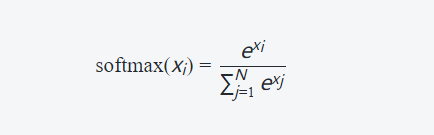

始终关注**新论文并探索论坛中提到的内容之外的内容**。调整激活函数（尝试swish而不是 ReLU）和优化器（尝试AdaBelief而不是 Adam 等）之类的小东西可能只会从模型中挤出一些性能。

## 激活函数的饱和性质概念

饱和性质的激活函数是指在输入数据较大或较小时，激活函数的导数趋近于0，导致梯度消失或爆炸。这种情况下，神经网络可能会面临训练困难、收敛缓慢等问题。

常见的饱和性质的激活函数有Sigmoid函数和双曲正切（Tanh）函数。它们在输入接近极端值时，导数接近于0。对于Sigmoid函数而言，在输入非常大或非常小时，输出值会趋向于1或-1，并且导数几乎为0；对于Tanh函数而言，在输入非常大或非常小时，输出值也会趋向于1或-1，并且导数同样几乎为0。

相比之下，不饱和性质的激活函数没有上述问题并具有更好的表达能力。比如ReLU（Rectified Linear Unit）和 Leaky ReLU

## 激活函数

### Softmax

Softmax函数是一种常用的激活函数，常用于多类别分类问题中。它将一组实数值转换为概率分布，使得每个类别的预测概率落在0到1之间，并且所有类别的概率之和为1。

Softmax函数的数学表达式如下：	



其中，*x_i* 是输入向量中的第 *i* 个元素，*N* 是向量的维度。Softmax函数通过将输入向量的每个元素取指数，然后对所有元素的指数求和，最后将每个元素的指数除以总和来计算输出值。

Softmax函数的特点如下：

1. 将输入值映射到概率分布：Softmax函数将实数值映射为概率分布，确保输出的每个元素都是非负的，并且所有元素的和为1，因此可以解释为各个类别的概率。
2. 强调最大的输入值：Softmax函数对输入值进行指数化操作，增大了较大的输入值与其他值之间的差异，因此最大的输入值在Softmax输出中得到了明显的增强。
3. 鲁棒性：Softmax函数对较大或较小的输入值具有鲁棒性，即在输入值变化时，输出的概率分布相对稳定。

在多类别分类任务中，通常将模型的最后一层使用Softmax激活函数，以获得每个类别的预测概率。然后，可以根据最高概率或一定阈值来确定最终的类别预测。

### Tanh

使用tanh作为激活函数，一定程度上可以避免梯度消失和梯度爆炸的问题。

如果权重值较大或者较小，那么在反向传播时，梯度值会非常大或者非常小，导致梯度爆炸或者消失的情况。而**tanh函数的导数范围在[-1, 1]之间，可以抑制梯度的放大和缩小，从而避免了梯度爆炸和消失的问题(RNN遇到的问题）**。此外，tanh函数在输入为0附近的时候输出接近于线性，使得网络更容易学习到线性相关的特征。另外，tanh 函数具有对称性，在处理序列数据时能够更好地捕捉序列中的长期依赖关系。

使用tanh作为LSTM输入层的激活函数是比较常见的做法。

### Sigmoid

sigmoid函数是一种常用的激活函数，它具有平滑、可导和将输入映射到[0, 1]区间的特点。其数学表达式为：

$$
\sigma(x) = \frac{1}{1 + e^{-x}}
$$

如果在神经元中使用该激活函数，我们可以通过对sigmoid函数进行求导来得到它的导数形式。

首先，我们可以将sigmoid函数表示为指数形式：

$$
\sigma(x) = (1 + e^{-x})^{-1}
$$

接下来，我们使用链式法则对该表达式进行求导。令 $f(x) = (1 + e^{-x})$ ，则 sigmoid 函数可以重写为 $g(f(x))$ 的形式。

根据链式法则， sigmoid 函数关于 x 的导数等于 g 关于 f 的导数乘以 f 关于 x 的导数。即：

$$
\frac{\partial \sigma}{\partial x} = \frac{\partial g}{\partial f} \cdot \frac{\partial f}{\partial x}
$$

现在分别计算 $\frac{\partial g}{\partial f}$ 和 $\frac{\partial f}{\partial x}$ ：

- 对于 $\frac{\partial g}{\partial f}$ ，由指数函数的求导性质可知：
  
  $$
  \frac{\mathrm{d}} {\mathrm{d}f}(g(f)) = -f^2
  $$


- 对于 $\frac{\mathrm{d}} {\mathrm{d}x}(f)$ ，应用指数函数和加法规则：
  
    $$
    \begin{align*}
    \frac{\mathrm{d}} {\mathrm{d}x}(1 + e^{-x}) &= -e^{-x} \\
    &= -\frac{1}{(1+e^{-x})}\cdot (1+e^{-x})\cdot e^{-x}\\
    &= -\frac{1}{(1+e^{-x})}\cdot (-(1+e^{-x}))\\
    &=  \sigma(x) \cdot (-(1+e^{-x})) \\
    &=  \sigma(x) \cdot (-[(-\sigma(x))]) \\
    &=  -(0.5-\sigma(x))
    \end{align*}
    $$

综上所述，我们可以得到 sigmoid 函数的导数形式：

$$
\begin{align*}
\frac{\partial \sigma}{\partial x} 
&= (\frac{\partial g}{\partial f } )(\frac{\partial f }{\partial x })\\
&= (-f^2)\times(-(0.5-\sigma(x))) \\
&=\sigma(x)(-\sigma(x))(0.5-\sigma(x))\\
&=\text{(sigmoid函数)}(1-\text{(sigmoid函数)})(0.5-\text{(sigmoid函数)})
\end{align*}
$$

这个导数形式告诉我们，在计算神经网络中使用sigmoid激活函数时，我们可以直接使用该公式来计算其导数值。

### ReLU 系列

以下列举了一些常见且被广泛使用的ReLU变体，每个变体都有其特定优势和适用场景。选择合适的ReLU变体要根据具体任务需求、数据集以及网络结构等因素进行评估和实验验证，以找到最佳效果。

下面是几种常见的 ReLU 变体算法的详细解释，以及它们的优缺点列表：

| 名称                          | 介绍                                                         | 优点                                                         | 缺点                                                         |
| ----------------------------- | ------------------------------------------------------------ | ------------------------------------------------------------ | ------------------------------------------------------------ |
| ReLU（Rectified Linear Unit） | ReLU 是一种常用的激活函数，对于正数输入，输出为输入值本身，对于负数输入，输出为 0。 | - 具有线性特性，计算简单，导数易于计算。<br>- 可以缓解梯度消失问题。<br>- 在深度神经网络中，具有较好的收敛性能。<br>- 激活后的神经元可以同时激活多个输入，提供稀疏性和更强的表达能力。 | - 可能导致神经元"死亡"现象，即某些神经元永远不会被激活，输出为0。<br>- 在负数输入时梯度为0，可能导致梯度消失。<br>- 不是零中心化的，可能导致梯度下降时的不稳定性。 |
| Leaky ReLU                    | Leaky ReLU 是对 ReLU 的改进，对于负数输入，输出为输入的小斜率乘以输入值。 | - 解决了 ReLU 中的"死亡"神经元问题。<br>- 在负数输入时有非零梯度，避免了梯度消失的问题。<br>- 保留了 ReLU 的计算简单性。 | - 参数化斜率需要额外调整，可能增加模型复杂性。<br>- 在负数区域的导数仍然很小，可能导致梯度消失的问题。 |
| Parametric ReLU (PReLU)       | PReLU 是 Leaky ReLU 的一种扩展，斜率参数化，并可以通过反向传播学习得到。 | - 可以通过学习得到最优的斜率参数。<br>- 在负数输入时有非零梯度，避免了梯度消失的问题。<br>- 在不同的输入上可以学习到不同的斜率，提供更大的灵活性。 | - 增加了模型的复杂性。<br>- 在某些情况下，可能需要更多的数据来训练参数。 |
| Exponential Linear Unit (ELU) | ELU 是对负数输入的扩展，它在负数区域引入了一个指数项，使得输出可以接近负无穷大。 | - 具有负数饱和区域，可以减少梯度爆炸的问题。<br>- 在负数区域保留了较大的梯度，避免了梯度消失的问题。<br>- 在负数输入时可以有更好的表达能力。 | - 计算复杂度较高，包括指数和对数运算。<br>- 非零中心化，可能导致训练的不稳定性。<br>- 引入了额外的超参数，需要调整。 |
| Swish                         | Swish 是一种近似线性的激活函数，它将输入值乘以一个 Sigmoid 函数，输出为输入乘以 Sigmoid 的结果。 | - 在正数区域具有接近线性的特性，保留了 ReLU 的好处。<br>- 在负数区域具有非零梯度，避免了梯度消失的问题。<br>- 在某些情况下，可以提供比 ReLU 更好的模型性能。 | - 计算复杂度较高，包括 Sigmoid 运算。<br>- 非零中心化，可能导导致训练的不稳定性。<br>- 引入了额外的超参数，需要调整。 |

#### ReLU

ReLU（Rectified Linear Unit）激活函数是深度学习中常用的非线性激活函数之一。它在激活神经网络中的隐藏层节点时非常流行，其数学表达式为：

\[  f(x) = \max(0, x) \]

其中，\(x\)是输入，\(f(x)\)是ReLU函数的输出。

ReLU激活函数的详解如下：

1. **非线性性**：ReLU是一个非线性函数，这意味着它可以引入神经网络的非线性特性。非线性函数对于解决更加复杂的问题非常重要，因为线性激活函数只能产生线性映射，无法捕获数据中的复杂模式和非线性关系。

2. **简单性和高效性**：ReLU计算起来非常简单，只需一个简单的阈值判断，将负数部分截断为0，因此它的计算速度较快。相比于其他复杂的激活函数，ReLU的简单性使得它成为深度学习中的首选激活函数之一。

3. **解决梯度消失问题**：ReLU函数在输入大于0时，梯度为1；而在输入小于等于0时，梯度为0。这个特性有助于解决传统激活函数如Sigmoid和tanh中的梯度消失问题。在反向传播过程中，梯度为1的部分可以更有效地传播误差，从而减少梯度消失的情况，加速训练过程。

4. **稀疏激活性**：由于ReLU对于负数输入输出为0，它有助于产生稀疏激活性，即某些神经元在训练过程中可能变得非常不活跃。这种特性使得神经网络具有更好的泛化能力，因为不活跃的神经元对于模型的影响较小，避免过拟合的风险。

然而，值得注意的是，ReLU也存在一些问题：

1. **神经元死亡问题**：由于ReLU在输入小于等于0时**梯度为0**，某些神经元在训练过程中可能永远不会被激活（输出为0），导致这些神经元在后续的迭代中永远不会更新权重，称为"神经元死亡"问题。

2. **输出不是中心化**：ReLU函数的输出范围是\[0, +∞) ，并不是以0为中心的，这可能导致一些问题，特别是在深度神经网络中。

为了解决ReLU激活函数的一些问题，还有一些改进的版本，如Leaky ReLU、Parametric ReLU和Exponential Linear Unit (ELU)等。这些变体在ReLU的基础上进行了改进，以期获得更好的性能和训练稳定性。在实际应用中，选择合适的激活函数取决于具体的问题和数据。

#### Leaky ReLU

Leaky ReLU引入了一个小的斜率（通常设置为0.01）以处理传统ReLU遇到的负输入时失活的问题。当输入为负数时，Leaky ReLU不会完全置零，而是乘以一个小斜率值。这样可以保留部分负数输入信息，并增加模型对负梯度响应。

传统的ReLU函数定义如下：
```
f(x) = max(0, x)
```
其中x是输入值。当x大于等于零时，返回原始输入值；当x小于零时，返回0。这使得ReLU具有非常简单和高效计算的特点，并且对梯度更新也很友好。

然而，在某些情况下，ReLU可能会导致神经元被“死亡”，即负数区域输出恒定为0。这意味着该神经元无法学习并传播任何来自后续层的误差信号，从而影响整个模型的性能。

为了解决这个问题，Leaky ReLU引入了一个小斜率α（通常设置为较小正数），使得在输入为负时仍然有一定程度上的激活：
```
f(x) = max(α*x, x)
```

使用Leaky ReLU相比传统ReLU有以下优势：
- 避免了“死亡”神经元问题：由于存在非零斜率，在训练过程中即使输出结果不理想或者网络较深、复杂时，激活函数依然可以传递一定的误差信号。
- 提供了更广泛的表达能力：Leaky ReLU在负数区域引入斜率后，可以学习到更复杂和丰富的特征表示。

尽管Leaky ReLU有这些优点，但它并不是适用于所有情况。在某些任务中，其他激活函数（如ELU、PReLU等）也可能表现出色。因此，在使用时需要根据具体问题进行实验和选择合适的激活函数来提高模型性能。

#### Parametric ReLU (PReLU)

PReLU类似于Leaky ReLU，**但其斜率值是可学习参数而不仅仅是固定值**。通过**将斜率作为参数进行学习**，在训练过程中可以**自适应**地调整每个神经元的激活响应范围。

**1. PReLU介绍：**

- Parametric ReLU（PReLU）是对传统ReLU进行改进的一种方法。
- PReLU引入了一个可调节的超参数α，代表着负输入部分的斜率或坡度。
- 当输入大于等于零时，其行为与传统ReLU相同；当输入小于零时，则使用α乘以该输入作为输出值。

**2. 公式表示：**

- PReLU函数可以用以下公式表示：
  ```
  f(x) = max(0, x) + α * min(0, x)
  ```
  其中x是输入数值，f(x)是输出数值。

**3. 参数学习：**

- 不同于普通ReLUs中固定阈值（即0），PReLUs允许通过训练过程中学习α的值。
- 通过反向传播算法和梯度下降等优化方法，网络可以自动调整α，从而找到最佳的负斜率。

**4. PReLU的优势：**

- PReLU相比于传统ReLU具有更强大的表达能力。在某些情况下，它可以帮助神经网络更好地适应数据，并提高模型性能。
- α参数允许PReLU在不同层和通道之间自适应地学习负斜率，增加了模型灵活性。

总结起来，Parametric ReLU（PReLU）是一种可调节负斜率的激活函数，在深度学习中被广泛使用。它提供了比传统ReLU更丰富的非线性表示能力，并通过学习参数α来适应不同数据和层数。这使得PReLU成为改善神经网络性能和拟合复杂数据集时常用的工具之一。

### GELU

研究者提出了一种新的非线性激活函数，名为**高斯误差线性单元**（Gaussian Error Linear Unit）。 GELU与随机正则化有关，因为它是自适应Dropout的修正预期。 这表明神经元输出的概率性更高，研究者发现，在计算机视觉、自然语言处理和自动语音识别等任务上，使用GELU激活函数的模型性能与使用RELU或者ELU的模型相当或者超越了它们。

为了避免深度神经网络只作为一种深度线性分类器，必须要加入激活函数以希望其拥有非线性拟合的能力，其中，ReLU就是一个较好的激活函数。而同时为了避免其过拟合，又需要通过加入正则化来提高其泛化能力，其中，Dropout就是一种主流的正则化方式，而zoneout是Dropout的一个变种。而GELU通过来自上面三者的灵感，希望**在激活中加入正则化的思想**。

> ReLU和Dropout都会返回一个神经元的输出，其中，ReLU会确定性的将输入乘上一个0或者1，Dropout则是随机乘上0。而GELU也是通过将输入乘上0或1来实现这个功能，但是输入是乘以0还是1，**是在同时取决于输入自身分布的情况下随机选择的。**换句话说，是0还是1取决于当前的输入有多大的概率大于其余的输入。

> 源码中的GELU

在google-research/bert/modeling.py中的GELU，是采用近似的方式计算：

```python
def gelu():
cdf = 0.5 * (1.0 + tf.tanh((np.sqrt(2 / np.pi) * (x + 0.044715 * tf.pow(x, 3)))))
      return x * cdf
```

而在pretrained-BERT-pytorch/modeling.py中，已经有了精确的计算方式：

```python
def gelu(x):
    """Implementation of the gelu activation function.
        For information: OpenAI GPT's gelu is slightly different (and gives slightly different results):
        0.5 * x * (1 + torch.tanh(math.sqrt(2 / math.pi) * (x + 0.044715 * torch.pow(x, 3))))
        Also see https://arxiv.org/abs/1606.08415
    """
    return x * 0.5 * (1.0 + torch.erf(x / math.sqrt(2.0)))
```

其注释也说明了GPT也是近似的计算方式。

参考文章：
https://zhuanlan.zhihu.com/p/349492378

### Gumbel-Softmax

Gumbel-Softmax算法是一种用于近似离散采样的方法，特别适用于离散化的深度学习模型。它基于Gumbel分布和Softmax函数的结合，通过引入Gumbel噪声来实现离散采样过程。

> Gumbel分布

首先，我们来介绍Gumbel分布。Gumbel分布是一种连续型的分布，它的概率密度函数（PDF）定义如下：

$$
f(x) = \frac{1}{\beta} \exp\left(-\frac{x-\mu}{\beta} - \exp\left(-\frac{x-\mu}{\beta}\right)\right)
$$

其中，$\mu$ 是分布的位置参数，$\beta$ 是分布的尺度参数。

Gumbel分布的关键特性是，它可以通过从两个独立的均匀分布中采样并进行一些变换得到。具体地，如果 $U$ 和 $V$ 是两个独立的服从于 $[0, 1]$ 上均匀分布的随机变量，那么 $X = \mu - \beta \log(-\log(U))$ 就服从于Gumbel分布。

Gumbel-Softmax算法通过将离散变量转化为连续的概率分布来实现离散采样。该算法的核心思想是利用Gumbel分布与Softmax函数的组合，将离散变量的采样问题转化为连续分布的采样问题。

> 其原因就是PQ量化后，特征空间变成了离散的。因为**可导必连续**，变量离散化了也就不可导了，没办法反向传播，所以使用了gumble softmax来近似，让loss可导。

给定一个离散变量 $x$，我们希望对其进行采样，使得采样结果满足原始离散变量的分布。假设 $x$ 的分布可以用一个多项分布参数化，即 $x \sim \text{Multinomial}(p_1, p_2, \ldots, p_k)$，其中 $p_i$ 是$x$ 取值为 $i$ 的概率。

为了实现采样，我们引入Gumbel噪声，并定义如下的变量：

$$
G_i = -\log(-\log(U_i))
$$

其中，$U_i$ 是服从于 $[0, 1]$ 上均匀分布的随机变量，$G_i$ 是服从于Gumbel分布的随机变量。

然后，我们通过对 $G_i$ 进行一些变换，得到与离散变量 $x$ 相关的连续变量 $y_i$：

$$
y_i = \frac{\exp((\log(p_i) + G_i)/\tau)}{\sum_{j=1}^k \exp((\log(p_j) + G_j)/\tau)}
$$

其中，$\tau$ 是一个温度参数，控制了采样的平滑程度。

最后，我们可以使用 $y_i$ 进行近似离散采样，将连续的概率分布转化为离散的采样结果。

**数学推导**

下面是对Gumbel-Softmax算法的数学推导：

我们希望通过Gumbel-Softmax算法来近似采样离散变量 $x$，其中 $x \sim \text{Multinomial}(p_1, p_2, \ldots, p_k)$。

首先，我们定义 $G_i$ 如上所述：

$$
G_i = -\log(-\log(U_i))
$$

然后，我们对连续变量 $y_i$ 进行变换：

$$
y_i = \frac{\exp((\log(p_i) + G_i)/\tau)}{\sum_{j=1}^k \exp((\log(p_j) + G_j)/\tau)}
$$

我们可以通过对 $y_i$ 进行求导，来获得关于 $y_i$ 的梯度信息。

$$
\begin{align*}
\frac{\partial y_i}{\partial (\log(p_j) + G_j)} &= \frac{\partial}{\partial (\log(p_j) + G_j)}\left(\frac{\exp((\log(p_i) + G_i)/\tau)}{\sum_{j=1}^k \exp((\log(p_j) + G_j)/\tau)}\right) \\
&= \frac{\exp((\log(p_i) + G_i)/\tau)}{\sum_{j=1}^k \exp((\log(p_j) + G_j)/\tau)} \left(\delta_{ij} - \frac{\exp((\log(p_j) + G_j)/\tau)}{\sum_{j=1}^k \exp((\log(p_j) + G_j)/\tau)}\right) \\
&= y_i(\delta_{ij} - y_j)
\end{align*}
$$

其中，$\delta_{ij}$ 是克罗内克（Kronecker）符号，当 $i=j$ 时取值为1，否则为0。

通过求导信息，我们可以使用反向传播算法来训练基于Gumbel-Softmax的模型。

以下是一个使用Python实现Gumbel-Softmax算法的经典案例：

```python
import torch
import torch.nn as nn

class GumbelSoftmax(nn.Module):
    def __init__(self, tau=1.0):
        super(GumbelSoftmax, self).__init__()
        self.tau = tau

    def forward(self, logits):
        gumbel_noise = -torch.log(-torch.log(torch.rand_like(logits)))
        logits_with_noise = (logits + gumbel_noise) / self.tau
        softmax_output = nn.functional.softmax(logits_with_noise, dim=-1)
        return softmax_output

# 示例用法
logits = torch.tensor([1.0, 2.0, 3.0])  # 原始的logits
gumbel_softmax = GumbelSoftmax(tau=0.5)  # 创建GumbelSoftmax模型，设置温度参数为0.5
sample = gumbel_softmax(logits)  # 使用GumbelSoftmax进行采样
print(sample)
```

在上述示例中，我们首先定义了一个GumbelSoftmax模型，它是一个继承自`nn.Module`的PyTorch模型。在模型的`forward`方法中，我们首先生成Gumbel噪声，并将其与原始的logits相加。然后，对相加后的结果进行Softmax操作，得到最终的采样结果。

**相关学习资源**

以下是一些关于Gumbel-Softmax算法的学习资源：

1. Jang, E., Gu, S., & Poole, B. (2017). Categorical reparameterization with Gumbel-Softmax. arXiv preprint arXiv:1611.01144.
2. Maddison, C. J., Mnih, A., & Teh, Y. W. (2016). The concrete distribution: A continuous relaxation of discrete random variables. arXiv preprint arXiv:1611.00712.
3. Gumbel-Softmax的PyTorch官方文档：https://pytorch.org/docs/stable/generated/torch.nn.functional.gumbel_softmax.html
