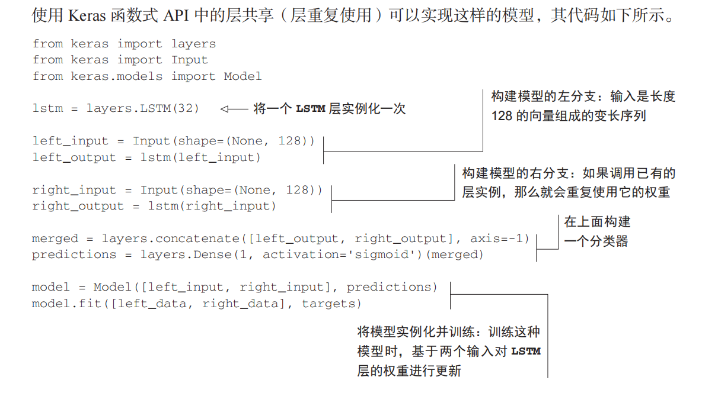
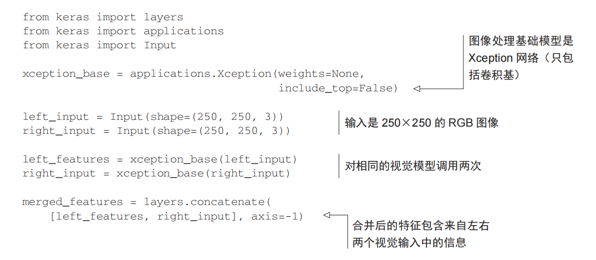

## 常见概念

### SOTA 模型

SOTA模型是指当前领域内的最佳模型，全称为"State-of-the-Art"（即技术水平最先进的）模型。它代表了在某个特定任务或领域中目前取得的最好性能。

SOTA模型通常是通过比较不同研究论文、竞赛结果或实验数据来确定的。当一个新模型在特定任务上获得更高的准确度、更低的误差率或其他评价指标时，它将被认为超越了之前被广泛接受和使用的基准模型，并成为该任务领域内新的SOTA模型。

对于机器学习和深度学习领域而言，发展迅速且涌现出许多创新方法和架构。随着时间推移，新提出的算法往往会不断改善并超过以前最好的方法，从而成为新一代SOTA模型。

借助SOTA模型，在各种应用场景下可以获得更精确、有效或鲁棒等方面有所突破，并推动相关领域持续发展。因此，关注和理解当前状态下令人瞩目和优秀的SOTA模型对于跟踪科学进展以及设计自己项目中合适的模型非常重要。

### FLOP 度量单位

FLOP是一个常用的度量单位，表示浮点运算（Floating Point Operations）的数量。它通常被用来衡量计算机或计算模型在执行某个任务时所需的计算量大小。

具体而言，FLOP指的是**一次浮点运算操作的数量**。这种操作可以是加法、减法、乘法或除法等基本数学运算，其中涉及到浮点数（即带有小数部分的数字）。例如，两个浮点数相乘就需要进行一次FLOP。

对于深度学习中使用的神经网络模型，在训练和推理过程中会涉及大量的矩阵乘法和卷积等复杂计算操作。因此，通过统计网络中总共执行了多少次FLOP可以评估其计算复杂性和效率。

实际上，在机器学习领域中经常使用更大规模单位TFLOPs（Tera-Floating Point Operations per Second）来描述每秒钟能够执行十亿亿次浮点运算。这可以作为衡量硬件设备如GPU或TPU速度和处理能力强弱的标准之一。

总结起来，FLOP是指代表浮点运算数量的度量单位，在机器学习领域用于评估任务所需的计算复杂性，并且常见地应用于衡量硬件设备的计算能力。

> 在TensorFlow 2中，可以使用tf.profiler 来估计模型的FLOP（浮点操作）数量。tf.profiler是一个用于分析和优化TensorFlow性能的工具。
>
> 下面是一种估计模型FLOP的常见方法：
>
> 1. 导入所需的库：
> ```python
> import tensorflow as tf
> from tensorflow.python.profiler import profiler_v2 as profiler
> ```
>
> 2. 构建你想要评估FLOP的模型，并编译它：
> ```python
> model = ... # 在此处构建你的模型
> 
> # 编译模型以准备进行推理
> model.compile(...)
> ```
>
> 3. **创建一个Profiler并运行推理过程**：
> ```python
> profiler.start()
> 
> # 运行你的数据通过模型进行推理，例如使用model.predict或者自定义训练循环等。
> ...
> 
> profiler.stop()
> ```
>
> 4. **生成报告并获取FLOP统计信息**：
> ```python
> profile_result = profiler.profile(
>     tf.get_default_graph(),
>     options=profiler.ProfileOptionBuilder.float_operation(), 
> )
> 
> flop_stats = profile_result.total_float_ops
> 
> print("Total FLOPs: ", flop_stats)
> ```
>
> 这将为您提供总共执行的浮点操作数（FLOPs）。请注意，这个数字表示了整个推理过程期间执行的所有浮点操作数量。
>
> 需要注意以下几点：
> - 在步骤3中，确保在运行前启动Profiler，并在完成后停止它。
> - 步骤4中会打印出总体FLOPs数量。
> - 请确保在安装了TensorFlow 2的环境中运行上述代码。
>
> 这是使用TensorFlow 2来估计模型FLOP的简单示例。通过分析模型的FLOP，您可以更好地了解和优化模型性能，并进行比较和选择不同架构或配置的模型。

### 激活函数的饱和性质概念

饱和性质的激活函数是指在输入数据较大或较小时，激活函数的导数趋近于0，导致梯度消失或爆炸。这种情况下，神经网络可能会面临训练困难、收敛缓慢等问题。

常见的饱和性质的激活函数有Sigmoid函数和双曲正切（Tanh）函数。它们在输入接近极端值时，导数接近于0。对于Sigmoid函数而言，在输入非常大或非常小时，输出值会趋向于1或-1，并且导数几乎为0；对于Tanh函数而言，在输入非常大或非常小时，输出值也会趋向于1或-1，并且导数同样几乎为0。

相比之下，不饱和性质的激活函数没有上述问题并具有更好的表达能力。比如ReLU（Rectified Linear Unit）和 Leaky ReLU

### `Benchmark` & `Baseline`概念

在机器学习中，"benchmark"和"baseline"是两个常用的术语，它们在评估模型性能和比较算法效果方面有着不同的含义。

**Benchmark（基准）**通常指的是已经被广泛接受并**公认为具有`很高水平`或`最佳性能`的模型、算法或数据集**。这些基准可以作为参考标准，用来**衡量其他新提出的方法或模型是否具备更好的性能**。基准模型**通常是经过大规模实验验证，并且在特定领域内取得了优秀结果。**

例如，在图像分类任务中，**ImageNet数据集上训练得到的ResNet网络就成为了一个广泛使用且有效的基准模型**。当研究人员提出新的图像分类算法时，他们会**将其与ResNet进行比较以评估其相对性能。**

**Baseline（基线）**则表示**一种`简单但可行的解决方案或模型`作为初始点来进行比较**。它代表了问题领域内**`最简单、最容易实现`且效果尚可的方法**。通过建立一个基线，在之后**尝试改进和优化时可以更直观地看到所取得进展**。

设定一个合适而有意义的baseline非常重要，因为它可以帮助我们**衡量新方法的改进程度**。如果一个新模型或算法无法超过基线，那么很可能需要重新审视其有效性和可行性。

举个例子，在自然语言处理领域，建立一个简单的词袋模型可以作为baseline来评估更复杂的深度学习模型（如循环神经网络或注意力机制）在文本分类任务上的性能表现。

总结起来，benchmark是已经公认为**高水平或最佳性能**的参考标准（高手云集），用于比较和评估其他方法；而baseline则是问题领域内**最简单、可行但不必然优秀的解决方案，作为初始点进行对比和改进**（自我提升）。

### 多分类多标签 & 多分类单标签概念

多分类多标签是一种机器学习任务，它与传统的单标签分类任务不同。在多标签分类中，每个样本可以被分配多个标签，而不仅仅是单个标签。每个标签可以看作是一个二元分类问题，表示样本是否具有该标签。

以下是多标签分类的一些关键概念：

1. 样本和标签：在多标签分类中，数据集由一组样本组成，每个样本可以**被分配多个标签**。例如，在图像分类任务中，一张图像可能包含多个物体，每个物体可以是一个标签。

2. 二元分类和多类别分类：多标签分类可以看作是一系列独立的二元分类问题。对于每个标签，模型需要预测该样本是否具有该标签。然而，与多类别单标签分类不同的是，多标签多分类中的每个样本可以分配多个标签，而不仅仅是单个标签。

3. 标签空间：标签空间是指所有可能的标签集合。在多标签分类中，标签空间的大小取决于问题的特定情况。例如，对于一种图像分类任务，每个可能出现的物体可以是一个标签，标签空间的大小就是物体类别的数量。

4. 评估指标：由于多标签分类中每个样本可以有多个标签，传统的分类评估指标（如准确率）不再适用。常用的多标签分类评估指标包括准确率、召回率、F1值等。此外，还有一些**针对多标签分类特定问题的指标**，如**Hamming Loss和Jaccard相似度**等。

5. 处理类别不平衡：在多标签分类中，**不同标签的分布可能不平衡**，即某些标签可能比其他标签更常见。类别不平衡问题也需要考虑，可以采取类似于单标签分类中的方法，如调整类别权重或使用过采样/欠采样技术。

多标签分类在许多实际应用中具有重要意义，如图像标注、文本分类、推荐系统等。对于每个具体的问题，需要适当选择合适的模型和评估指标，并根据数据和任务的特点进行适当的预处理和后处理。

### 预训练模型概念

预训练是指在大规模未标注数据上进行的训练，目的是**学习到通用的特征表示**。与传统的监督学习不同，预训练使用的数据并没有标注好的标签，因此可以大量地获取数据来训练模型。

预训练常用的方法包括自编码器、对抗生成网络等。以自编码器为例，其基本思想是通过将**输入数据压缩成低维度编码，然后再将编码解压成输入数据的方式**，来学习到数据的特征表示。在预训练过程中，自编码器的目标是**最小化输入数据和解压缩后的重构数据之间的差异**，同时**保持编码维度足够小**，以避免过拟合。

由于预训练可以充分利用大规模未标注数据，因此得到的模型具有很好的泛化能力，并且可以被应用于各种不同的任务。例如，在自然语言处理领域，预训练模型如BERT、GPT等已经成为了该领域的主流技术，取得了很好的效果。

需要注意的是，预训练虽然可以充分利用未标注数据来学习特征，但是由于模型的结构相对复杂，预训练需要花费大量的计算资源和时间来完成。

> 在深度学习中，预训练和训练是两个不同的阶段。
>
> 预训练（pre-training）指的是在大规模未标注数据上进行的训练，目的是学习到通用的特征表示。预训练常用的方法包括自编码器、对抗生成网络等。预训练得到的模型通常称为预训练模型，这些模型通常具有很好的泛化能力，并且可以被应用于各种不同的任务。
>
> 训练（fine-tuning）则是指在**特定任务上对预训练模型进行微调**，使其适应该任务。训练通常需要**少量的标注数据**，并且通常使用反向传播算法进行优化，以最小化模型在该任务上的损失函数。通过训练，模型可以逐渐地适应特定任务的要求，并且在该任务上表现出色。
>
> 因此，预训练是一种通用模型的构建过程，而训练是针对具体任务的模型优化过程。

### 迁移学习概念

从 HDF5 加载预训练权重时，建议将权重加载到设置了检查点的原始模型中，然后将所需的权重/层提取到新模型中。

**示例：**

```python
def create_functional_model():
    inputs = keras.Input(shape=(784,), name="digits")
    x = keras.layers.Dense(64, activation="relu", name="dense_1")(inputs)
    x = keras.layers.Dense(64, activation="relu", name="dense_2")(x)
    outputs = keras.layers.Dense(10, name="predictions")(x)
    return keras.Model(inputs=inputs, outputs=outputs, name="3_layer_mlp")


functional_model = create_functional_model()
functional_model.save_weights("pretrained_weights.h5")

# In a separate program:
pretrained_model = create_functional_model()
pretrained_model.load_weights("pretrained_weights.h5")

# Create a new model by extracting layers from the original model:
extracted_layers = pretrained_model.layers[:-1]
extracted_layers.append(keras.layers.Dense(5, name="dense_3")) 
model = keras.Sequential(extracted_layers)
model.summary()
```
```
Model: "sequential_6"
_________________________________________________________________
 Layer (type)                Output Shape              Param #   
=================================================================
 dense_1 (Dense)             (None, 64)                50240     
                                                                 
 dense_2 (Dense)             (None, 64)                4160      
                                                                 
 dense_3 (Dense)             (None, 5)                 325       
                                                                 
=================================================================
Total params: 54,725
Trainable params: 54,725
Non-trainable params: 0
_________________________________________________________________
```

一般来说我们是使用`Tensorflow`的`tf.kears.application `来进行迁移学习，但其比较少的种类（主要聚焦在图像分类领域），较多种类可以使用`Tensorflow Hub `来实现

###　`Static Graph` ＆`Eager Execution` 概念

在TensorFlow 1中，静态图（Static Graph）是一种表示**计算流程**的概念。它使用**数据流图（Data Flow Graph）**来描述计算任务，其中节点表示操作（operations），边表示数据流动。

具体而言，在TensorFlow 1中，你需要**先定义一个计算图，并将所有操作和变量添加到该图中**。然后，通过**运行会话（Session）来执行这个静态图。**这种方式使得 TensorFlow 可以**对整个计算过程进行优化和编译**，并允许并行执行多个操作。（C++引擎）

相比之下，在TensorFlow 2中引入了 Eager Execution （即即时执行）。Eager Execution 是一种命令式编程环境，可以立即评估操作并返回结果。与静态图不同的是，在 Eager Execution 模式下，**每条语句都会被立即执行，并且可以实时查看结果**。（Python，性能收到影响，下一节的`@tf.function`便是解决改性能问题的)

Eager Execution 的好处包括**更直观的代码编写、更容易调试、更灵活地处理控制流**等。它消除了在 TensorFlow 1 中构建和运行静态图所需的繁琐步骤，并使得机器学习开发变得更加交互式和直观。（怎么有点像是解释型语言和编译型语言的区别？）

要注意的是，在 TensorFlow 2 中，**默认启用 Eager Execution 。但如果需要使用类似于 TensorFlow 1 的静态图模式，则也可以手动将其启用**。

综上所述：
- 在 TensorFlow 1 中，数据流图是指用于描述计算任务的静态图，需要通过会话进行执行。
- 在 TensorFlow 2 中，默认启用 Eager Execution ，它允许立即执行操作并返回结果，使得代码编写更直观和灵活。

### `@tf.function` 装饰器概念

`@tf.function` 是 TensorFlow 中的一个装饰器（decorator），**它的作用是将 Python 函数转换为 TensorFlow 的计算图，并且可以提供更高效的执行。**

以下是 `@tf.function` 装饰器的主要目的和作用：

1. **提升性能**：通过将函数转换为 TensorFlow 计算图，可以利用 TensorFlow 的自动并行化、GPU 加速等功能，从而实现更高效地执行。这对于大规模数据集或复杂模型特别有益。

2. **实现符号式编程**：TensorFlow 使用静态计算图进行工作。使用 `@tf.function` 将函数转换为计算图后，该计算图中**包含了所有操作和控制流程，使得代码更具可视化和理解性**。这种方式被称为符号式编程，与命令式编程相比，在一些情况下可能会带来性能上的优势。

3. **支持跨平台部署**：由于将函数转换为计算图后，**不再依赖原始 Python 代码本身运行时环境**，因此可以方便地在其他平台上部署、导出或共享训练好的模型。

4. **自动微分**：当使用 `@tf.function` 转换函数时，**默认情况下会启用自动微分功能。这意味着你可以轻松地获取关于输入变量的梯度信息**，用于训练过程中的优化。

需要注意以下几点：

- `@tf.function` 装饰器**只能应用于满足特定条件的函数**。它要求函数内部使用 TensorFlow 的操作（例如张量运算、控制流等），并且**不包含 Python 语法或控制流结构（如循环、条件语句）**。这是因为计算图在转换时需要**静态**确定所有操作，并且无法动态执行 Python 代码。

- 如果你想了解哪些函数可以被装饰，请参考 TensorFlow 官方文档中关于 `@tf.function` 的说明和示例。

### AI SaaS概念

AI SaaS（人工智能即服务）是一种提供人工智能技术和功能作为服务的模式。它允许开发者和企业通过**API（应用程序编程接口）或网页界面来访问和使用各种预构建的人工智能功能**，而无需自己构建、训练和部署复杂的机器学习模型。

>  **SaaS，即软件即服务（Software as a Service）**，是一种基于云计算模型的**软件交付模式**。在传统的软件交付模式中，用户需要购买、安装和维护软件应用程序在自己的服务器上运行。而在SaaS模式下，用户无需关心这些复杂的操作和管理任务，只需通过互联网访问已经部署在云端的应用程序。
>
>  以下是SaaS模型的几个重要特点：
>
>  1. **多租户架构**：SaaS提供商将一个单一实例的应用程序同时提供给多个客户使用，并且每个客户都可以独立地进行配置和定制。
>  2. **按需订阅**：用户根据自身需求选择合适的订阅套餐，并按照所使用功能和服务以及使用时间来支付费用。
>  3. **无需安装或更新**：用户无需下载、安装或升级任何软件，在线通过浏览器就能够直接访问并使用最新版本的应用程序。
>  4. **可扩展性与灵活性**：由于基于云平台运行，SaaS应用具有良好的可扩展性，在处理大量数据或者高并发请求时能够快速响应，并且可以根据业务需要进行灵活调整。
>
>  相对于传统软件交付模式，SaaS模型具有许多优势：
>
>  - **降低成本**：用户无需购买昂贵的服务器硬件和软件许可证，只需支付基于使用量的费用。
>  - **简化管理**：所有与安装、维护和升级相关的任务都由SaaS提供商来处理，用户可以专注于业务而不需要担心技术方面的问题。
>  - **快速部署**：用户只需通过浏览器登录即可立即开始使用应用程序，无需等待复杂的软件安装过程。
>  - **易于集成**：SaaS应用通常提供API（Application Programming Interface），以便与其他系统进行集成。
>
>  常见的SaaS应用包括企业资源规划（ERP）、客户关系管理（CRM）、人力资源管理（HRM）和协作工具等。
>

AI SaaS 提供了一种简单且成本效益高的方式，使开发者和企业可以在他们自己的应用程序或产品中集成强大的人工智能功能。这些功能包括但不限于语音识别、图像识别、情感分析、机器翻译、聊天机器人等。

通过使用 AI SaaS，开发者不必从头开始设计和实现复杂的算法或模型，也无需处理底层基础设施相关问题。相反，他们可以直接调用云端提供商所提供的 API 或服务，并将其嵌入到自己的应用程序中。

优点：
- 简化：AI SaaS 可以极大地简化使用人工智能技术的过程，避免了搭建底层基础设施、数据收集与标注以及模型训练等繁琐步骤。
- 快速上手：由于预先构建好的功能和API的存在，开发者可以更快速地集成人工智能功能到他们的应用程序中。
- 弹性伸缩：云端提供商通常具有强大且可扩展的基础设施，可以根据需求自动调整资源，以满足客户在不同规模上使用 AI 功能时所需的计算能力。

AI SaaS 目前已经得到广泛应用，在各个领域如语音识别、图像处理、自然语言处理等方面提供了便利和创新。许多知名云服务提供商都提供了 AI SaaS 平台，包括阿里云、微软 Azure、谷歌 Cloud 等。

### PaaS 概念

PaaS（Platform as a Service）是一种云计算服务模型，提供了一个完整的应用程序开发和部署平台。它使开发者能够在云上创建、测试、部署和管理应用程序，而无需担心底层的基础设施层面的细节。

在PaaS模型中，云服务提供商负责管理底层的服务器、存储、网络和操作系统等基础设施，开发者则可以专注于应用程序的开发和部署。PaaS平台通常提供了一系列工具和服务，包括开发框架、数据库管理系统、运行时环境、版本控制、部署工具、监控和扩展性管理等，以提高开发和部署的效率。

PaaS的主要优点包括：

1. **简化开发流程**：PaaS提供了开发所需的工具和环境，减少了开发者的配置和部署工作量，加快了应用程序的开发速度。

2. 弹性扩展：PaaS平台可以根据应用程序的需求**自动扩展底层基础设施**，以应对用户流量的增长，提高应用程序的可伸缩性。

3. 降低成本：PaaS模型允许开发者**按需使用基础设施资源**，并根据使用量进行付费，避免了传统的硬件和软件购买成本。

4. 高可用性：PaaS平台通常提供了高可用性和容错机制，确保应用程序在面临故障或中断时仍然可用。

5. 多租户支持：PaaS平台可以支持多个租户共享相同的基础设施，从而提高资源利用率。

一些知名的PaaS平台包括Heroku、Google App Engine、Microsoft Azure App Service和AWS Elastic Beanstalk等。这些平台提供了广泛的功能和服务，适用于各种类型的应用程序开发和部署需求。

### 最佳实践概念

在IT行业中，最佳实践（Best Practices）指的是在特定领域或任务中被广泛认可和接受的一套**最有效、高效的方法、技术或策略**。这些实践经过研究、实践和验证，被认为是在特定情境下能够取得良好结果并提供最佳解决方案的方法。

最佳实践是通过经验总结、行业标准、专家意见和实证研究等途径形成的，可以帮助组织或个人在开发、管理和维护信息技术系统和服务时做出明智的决策。这些实践可以涵盖各个方面，包括项目管理、软件开发、网络安全、数据管理、用户体验设计等。

采用最佳实践有助于避免常见的错误和问题，提高工作效率，降低风险，提供高质量的解决方案，并与行业的标准和规范保持一致。在IT行业中，最佳实践通常是**基于实践经验、学术研究、行业标准和业界领先者**的经验分享形成的，被广泛应用于组织的流程、方法和决策中。

值得注意的是，最佳实践并不是一成不变的，随着技术的发展和行业的变化，最佳实践也会不断演进和更新。因此，**持续学习和跟踪行业动态对于采用最新的最佳实践**非常重要。

### BLEU指标

BLEU（Bilingual Evaluation Understudy）是一种常用的自动评估机器翻译质量的指标，它通过比较候选翻译与人工参考翻译之间的差异来计算得分。BLEU的得分范围通常从0到1，越接近1表示候选翻译与参考翻译的一致性越高。

BLEU的计算方法如下：

1. 首先，将候选翻译和参考翻译都切分成N-gram（连续N个词）。
2. 对于每个N-gram，计算它在候选翻译中出现的次数，并记录最大的参考翻译中出现的次数。这样可以确保计算时不会超过参考翻译中的N-gram数量。
3. 计算候选翻译中的N-gram计数的总和，得到候选翻译中的N-gram总数。
4. 对于每个N-gram，计算交叉数量，即该N-gram在候选翻译中的出现次数与在参考翻译中的最大出现次数的较小值。
5. 计算交叉数量的总和，得到交叉数量总和。
6. 将交叉数量总和除以候选翻译中的N-gram总数，得到精确度。
7. 计算参考翻译中的N-gram总数与候选翻译中的N-gram总数的差值，得到惩罚项（Brevity Penalty），用于惩罚过度短的候选翻译。
8. 将精确度与惩罚项相乘，得到最终的BLEU得分。

BLEU的优点是简单快速，并且与人工评估结果具有一定的相关性。然而，它也有一些限制。例如，它主要关注N-gram的匹配，而忽视了句子的流畅性和语法正确性。此外，由于BLEU仅使用有限的参考翻译进行评估，对于多样性的翻译可能会有偏见。

尽管BLEU存在一些限制，但它仍然是机器翻译领域中广泛使用的评估指标之一，特别是在研究和开发阶段用于快速评估不同模型的性能。

### 长期依赖关系概念

长期依赖关系指的是在序列数据中存在较大时间间隔的依赖性。具体而言，在处理序列数据时，过去的信息对于当前和未来的预测具有重要影响。然而，传统的序列模型（如循环神经网络）在计算过程中存在**梯度消失或梯度爆炸问题，导致难以捕捉到长距离的依赖关系**。

当序列长度较长时，例如几十个或几百个时间步长，信息在每个时间步长传递过程中会经历多次连续的转换。在这个过程中，每个时间步长的输入都会通过一系列的乘法操作进行计算，其中包含一个权重矩阵，即循环神经网络中的参数。梯度在反向传播时通过这些乘法操作进行传递，每次乘法都可能使梯度变小或变大。

梯度消失问题意味着在反向传播过程中，梯度逐渐变小并最终趋近于零，导致远距离时间步长的信息无法有效更新。因此，模型可能无法捕捉到与该信息相关的长期依赖关系。相反，梯度爆炸问题指的是梯度在反向传播过程中变得非常大，导致数值不稳定和训练困难。

为了缓解长期依赖问题，LSTM（长短期记忆网络）引入了门控机制，通过选择性地遗忘和更新信息来控制梯度的流动。LSTM使用了一个称为"遗忘门"的结构，它可以**决定将多少过去的信息保留下来，并通过添加"输入门"决定引入多少新信息**。这些门控机制帮助LSTM模型更好地捕捉长期依赖关系，但**对于特别长期的依赖现象，LSTM仍然可能无法完全解决问题**。

近年来，一些新的序列模型如Transformer和GPT（生成式预训练模型）已经取得了重大突破。它们采用了自注意力机制，通过直接建模序列中所有位置之间的关系，能够更有效地捕捉长距离的依赖关系，从而提升了序列模型在处理长期依赖问题上的能力。

### Layer Normalization（层归一化）和Batch Normalization（批归一化）

Layer Normalization（层归一化）和Batch Normalization（批归一化）是在深度学习中常用的归一化技术，用于提高模型的训练稳定性和性能。它们在**不同层级**上对输入数据进行归一化，以下是它们的详细解释、应用场景以及各自的优缺点。

**Layer Normalization（层归一化）：**

- 解释：Layer Normalization是在同一层的不同样本之间进行归一化处理。它计算每个样本在同一层的特征维度上的均值和方差，并使用这些统计量对样本进行归一化。
- 应用场景：Layer Normalization常用于自然语言处理（NLP）任务中，例如机器翻译、语言模型等。由于NLP任务中序列长度通常不同，Layer Normalization可以在**序列的每个位置上进行归一化**，有助于**处理变长序列数据**。
- 优点：
  - 对于小批量的数据，Layer Normalization仍然能够提供较好的归一化效果。
  - 不依赖于批量大小，适用于不同批量大小的情况。
  - 在处理序列数据时，可以在序列的每个位置上进行归一化，有助于处理变长序列。
- 缺点：
  - 相对于Batch Normalization，Layer Normalization的计算开销较大，因为它需要**对每个样本单独计算均值和方差。**

**Batch Normalization（批归一化）：**

- 解释：Batch Normalization是在每个小批量数据中对**特征维度**进行归一化处理。它计算**每个特征维度上的均值和方差**，并使用这些统计量对小批量数据进行归一化。
- 应用场景：Batch Normalization广泛应用于深度卷积神经网络（CNN）中，特别是在图像识别任务中。它可以加快模型的收敛速度，提高模型的训练稳定性，并有助于防止梯度消失或梯度爆炸问题。
- 优点：
  - 加速网络的训练过程，提高模型的收敛速度。
  - **减少对初始权重的敏感性**，有助于模型更快地适应新的任务。
  - 通过**减少内部协变量偏移**（internal covariate shift），有助于防止梯度消失或梯度爆炸问题。
- 缺点：
  - 对于小批量的数据，Batch Normalization可能引入噪声，并降低归一化效果。
  - 在推理阶段，需要额外的计算来应用批归一化的均值和方差。

总结：
- Layer Normalization适用于处理**变长序列数据**，不依赖于批量大小，但计算开销较大。
- Batch Normalization适用于加速模型的训练过程，提高模型的收敛速度，但对**小批量数据可能引入噪声**。

在实际应用中，选择Layer Normalization还是Batch Normalization取决于具体任务和数据特征。根据任务的性质和数据的分布，可以尝试不同的归一化方法以获得最佳性能。

### Embedding 概念

嵌入（Embedding）是一种常用的特征表示方法，广泛应用于自然语言处理（NLP）和推荐系统等领域。嵌入通过将**高维离散特征**映射到**低维连续向量空间**中，可以捕捉到**特征之间的语义关系和相似性**。

在NLP中，嵌入通常用于将文本数据转换为向量表示，使得计算机可以更好地理解和处理文本。下面是关于嵌入的一些详细解释：

1. 嵌入空间：嵌入将离散的特征映射到一个连续的向量空间，也称为嵌入空间。在嵌入空间中，**特征之间的相对位置和距离可以反映它们的语义关系**。例如，在一个针对自然语言处理任务的嵌入空间中，词语之间的距离可能与它们的语义相似性相关。

2. 嵌入矩阵：**嵌入矩阵是嵌入的参数**，它将离散特征映射到嵌入空间中的向量表示。嵌入矩阵的维度通常由用户指定，可以根据任务的需求进行调整。在NLP中，常见的嵌入矩阵是词嵌入矩阵，其中每一行对应一个词语的嵌入向量。

3. 嵌入训练：嵌入矩阵通常是通过训练模型来学习得到的。在NLP中，可以使用无监督的方法（如Word2Vec、GloVe）或有监督的方法（如基于神经网络的语言模型）来进行嵌入训练。训练过程中，模型试图通过最小化某个目标函数（如**语言模型的损失函数或相似性度量**）来学习到嵌入矩阵的参数。

4. 嵌入应用：学习到的嵌入可以应用于各种NLP任务，如文本分类、命名实体识别、情感分析等。通过将文本数据转换为嵌入表示，可以将其输入到机器学习模型中进行进一步的处理和预测。嵌入可以捕捉到词语的**语义信息**，从而提供更好的特征表示，有助于提高模型的性能。

总之，嵌入是一种将离散特征映射到连续向量空间的方法，常用于NLP任务中。通过学习嵌入表示，可以提取特征之间的语义关系，为后续的模型训练和预测提供更有效的特征表示。


### tensorflow 分类默认阈值

深度学习网络中的结果是 0 1 ，但预测出来的是概率，那评估加过accuary是怎么出来的？ 怎么确定大于多少概率为1 或0？

在深度学习中，常见的二分类任务中，模型的输出是一个表示概率的连续值，通常在0到1之间。但是，我们通常需要将这些概率转化为二进制的0或1以进行评估和判断。

评估指标中的准确率（accuracy）是一种常用的度量方法，用于评估模型在二分类任务中的性能。准确率表示模型预测正确的样本比例。为了将连续的概率转化为二进制的0或1，我们需要设定一个阈值（threshold）。当模型输出的概率大于或等于阈值时，我们将其判定为1；当概率小于阈值时，我们将其判定为0。

通常情况下，阈值被设定为0.5，即当模型输出的概率大于或等于0.5时，将其判定为1；当概率小于0.5时，将其判定为0。这是一个常见的默认阈值，但在某些特定的场景中，根据实际需求，可以根据问题的特点和要求来调整阈值。

>  在 TensorFlow 中，模型的默认阈值通常是0.5。这是因为在二分类问题中，0.5 是一个常见的默认阈值，用于将连续的概率转化为二进制的0或1。
>
>  在 TensorFlow 中，模型的输出通常是经过激活函数（如 sigmoid 或 softmax）处理的概率值。这些概率值表示样本属于某个类别的可能性。
>
>  在使用 TensorFlow 进行评估时，默认情况下，根据这些概率值和阈值0.5，将概率大于或等于0.5的样本预测为1，将概率小于0.5的样本预测为0。
>
>  具体到代码中，模型的输出将是一个概率向量或矩阵，其中每个元素表示样本属于不同类别的概率。你可以使用以下代码来查看模型的输出，并根据阈值进行二分类预测：
>
>  ```python
>  import tensorflow as tf
>  
>  # 假设模型的输出是一个概率向量或矩阵
>  probabilities = model.predict(x_test)
>  
>  # 将概率转化为二进制的0或1，根据默认阈值0.5
>  predictions = (probabilities >= 0.5).astype(int)
>  ```
>
>  在上述代码中，`model` 是你的 TensorFlow 模型，`x_test` 是用于测试的输入数据。`probabilities` 是模型的输出概率向量或矩阵，`predictions` 是根据阈值0.5进行的二分类预测结果。
>
>  需要注意的是，虽然0.5 是常见的默认阈值，但在特定的情况下，根据问题的需求，你可能需要调整阈值来优化模型的性能。这可以根据实际情况在代码中进行调整。

### "小批量"（mini-batch）和"批量"（batch）

在深度学习中，"小批量"（mini-batch）和"批量"（batch）是指在训练神经网络时使用的样本集合的不同规模。一般来说样本在（8~128）左右，样本数一般取2的幂，这样方便GPU上进行内存分配.

1. 小批量（mini-batch）：
   小批量是指从训练数据集中选择的一小部分样本。在深度学习中，通常会将整个训练数据集划分为多个小批量进行训练。每个小批量包含的样本数量可以是任意的，但通常会选择一个适度的数量，以在计算效率和模型收敛性之间取得平衡。小批量训练的优点是可以减少计算成本，同时还可以引入一定程度的随机性，有助于模型的收敛和泛化能力。

2. 批量（batch）：
   批量指的是将整个训练数据集作为一个大批量进行训练。也就是说，将所有训练样本一次性输入模型进行计算和参数更新。批量训练的优点是可以利用更多的信息进行梯度计算和参数更新，从而可能获得更准确的梯度估计和更稳定的模型收敛。然而，批量训练的缺点是需要更多的计算资源和内存来处理整个数据集，因此在大规模数据集上可能会面临计算和存储上的挑战。

在实践中，小批量梯度下降（mini-batch gradient descent）是深度学习中最常用的训练方法。它结合了批量训练和随机梯度下降的优点，通过在每个训练步骤中使用一小批量的样本来计算梯度并更新模型参数。这样可以在充分利用样本信息的同时，降低计算成本和内存需求。

## 常见问题解决方案及最佳实践

### 类别不平衡 & 数据缺少解决方案

在深度学习中，需要足够的训练数据来获得良好的模型性能。不足的训练数据可能导致模型过拟合或无法充分学习到数据的特征。在某些情况下，某些类别的数据较少可能会给模型带来挑战，特别是在处理不平衡数据集或高度错误分类的情况下。

针对这种情况，可以考虑以下方法来处理不足的训练数据和类别不平衡的问题：

1. 数据增强（Data Augmentation）：通过对现有数据进行变换、旋转、缩放、裁剪等操作，生成新的合成数据。例如，在医学影像中，可以进行平移、旋转、翻转等操作来增加训练样本的多样性，从而增加训练数据量。

2. 数据合成（Data Synthesis）：通过合成新的数据样本来增加训练数据量。这可以通过使用**生成对抗网络**（GANs）或其他合成方法来实现。在你提到的例子中，可以考虑使用生成模型来合成一些肺炎数据，以增加该类别的样本数量。

3. 迁移学习（Transfer Learning）：利用在其他大规模数据集上预训练好的模型权重，然后在目标任务上进行**微调**。通过迁移学习，可以利用大规模数据集上学到的特征表示，缓解数据不足的问题。

4. 采样加权（Sampling Weighting）: 采样加权是通过调整样本在训练过程中的权重来平衡不同类别之间的样本分布。通常情况下，数据集中的某些类别可能比其他类别更常见或更罕见。为了避免模型偏向于频繁出现的类别，我们可以赋予罕见类别更高的权重，使其在训练中得到更多关注。这可以通过以下步骤实现：

   - 下采样（Undersampling）：从频繁类别中删除一些样本，使得所有类别具有相似数量的样本。
   - 过采样（Oversampling）：复制罕见类别的样本，使其数量与频繁类别相当。
   - SMOTE（Synthetic Minority Over-sampling Technique）：使用插值方法生成合成的罕见类别样本。

5. 损失加权（Loss Weighting）: 损失加权是通过调整损失函数中各个样本的权重，来解决不平衡数据集问题。在某些情况下，模型可能倾向于优化常见类别而忽视罕见类别。为了解决这个问题，我们可以引入损失加权，其中样本的权重与其所属类别的相对重要性成正比。一种常见的损失加权方法是Focal Loss。

   >  1. 计算每个类别的权重：根据训练数据中每个类别的样本数量或其他衡量指标，计算每个类别应该被赋予的权重。可以根据类别不平衡程度来设置权重，使得样本数量较少的类别获得较高的权重。
   >  2. 定义损失函数：根据问题的特定需求和模型类型，选择适当的损失函数。常见的损失函数包括交叉熵损失函数（Cross-Entropy Loss(损失)）和加权交叉熵损失函数（Weighted Cross-Entropy Loss(损失)）等。
   >  3. 应用权重：将每个样本的损失值与其所属类别的权重相乘，以增加样本权重的影响。这可以通过在计算损失函数时，将每个样本的损失值与其所属类别的权重相乘来实现。
   >  4. 计算总体损失：根据任务要求，计算所有样本的加权损失的总和或平均值作为模型的最终损失函数。
   >
   >  下面是一个示例代码，展示了如何使用`class_weight`参数来处理这些问题：
   >
   >  ```python
   >  from sklearn.utils import class_weight
   >  import numpy as np
   >  from tensorflow import keras
   >  # 假设你有训练数据X和对应的标签y
   >  # 计算类别权重
   >  class_weights = class_weight.compute_class_weight('balanced', np.unique(y), y)
   >  # 将类别权重转换为字典形式
   >  class_weights_dict = dict(enumerate(class_weights))
   >  # 定义模型
   >  model = keras.Sequential(...)
   >  model.compile(loss='sparse_categorical_crossentropy', optimizer='adam', metrics=['accuracy'])
   >  # 使用类别权重进行训练
   >  model.fit(X, y, class_weight=class_weights_dict, ...)
   >  ```
   >
   >  在这个示例中，首先使用`class_weight.compute_class_weight`函数计算类别权重。`'balanced'`参数表示希望类别权重与类别在训练数据中的频率成反比。然后，将类别权重转换为字典形式。

   >  Focal Loss: Focal Loss（焦点损失）是一种损失函数，专门用于解决分类问题中不平衡数据集的训练问题。它通过调整难易样本的权重来解决模型在错误分类方面的问题。Focal Loss的主要思想是减少易分类样本的权重，使模型更加关注困难样本。
   >
   >  Focal Loss引入两个参数：调节因子（调节困难样本的重要性）和焦点参数（控制调节因子的程度）。通过增加焦点参数，可以进一步减少易分类样本的权重，使模型更加关注困难样本。通过这种方式，Focal Loss有助于提高模型在罕见类别上的性能。
   >
   >  > Focal Loss是由Lin et al.在2017年的论文《Focal Loss for Dense Object Detection》中提出的，主要用于解决目标检测任务中的类别不平衡问题。下面我将详细介绍Focal Loss的原理和推导过程。
   >  >
   >  > 假设我们有一个二分类问题，样本分为正样本（Positive）和负样本（Negative）。**传统的交叉熵损失函数对于类别不平衡的问题表现不佳**（因为交叉熵一视同仁），因为它倾向于优化常见类别，而忽视罕见类别。Focal Loss通过引入调节因子和焦点参数，使得模型更关注困难样本，以此来解决类别不平衡问题。
   >  >
   >  > 首先，假设$p_t$表示样本属于正样本的概率，$p_t \in [0, 1]$。那么样本属于负样本的概率可以表示为$1 - p_t$。经过逻辑回归（sigmoid）函数处理后，我们可以得到预测概率：
   >  >
   >  > $$
   >  > \hat{y}_t =
   >  > \begin{cases}
   >  > p_t, & \text{if the ground truth label is positive} \\
   >  > 1 - p_t, & \text{otherwise}
   >  > \end{cases}
   >  > $$
   >  >
   >  > 接下来，我们定义调节因子$(1-\hat{y}_t)^\gamma$，其中$\gamma \geq 0$。这个调节因子用于降低容易分类的样本的权重，使得模型更加关注困难样本。当$\gamma=0$时，调节因子为常数，即不对样本进行加权。当$\gamma>0$时，**调节因子会随着预测概率的增加而减小。**（让不容易的分类变得容易）
   >  >
   >  > 最后，我们将上述两个部分相乘，并使用交叉熵损失函数计算每个样本的损失。整个Focal Loss的公式如下：
   >  >
   >  > $$\text{FL}(p_t) = -\alpha_t (1-\hat{y}_t)^\gamma \log(\hat{y}_t)$$
   >  >
   >  > 其中：
   >  >
   >  > - z表示预测概率的对数。
   >  >
   >  > 通过最小化所有样本的Focal Loss，我们可以训练出在类别不平衡问题上表现更好的模型。
   >  >
   >  > 需要注意的是，以上是Focal Loss的基本原理和推导过程。具体应用中，可能还会对公式进行微调或引入其他参数来适应具体任务的需求。

6. 引入外部数据：考虑从其他来源获取更多数据，例如公共数据集、开放数据集或与领域专家合作收集更多的样本。

无论采用哪种方法，都需要注意保持数据的合理性和代表性。

### Hyperparameter tuning 调优

超参数调优（Hyperparameter tuning）是指在机器学习和深度学习模型中，通过尝试不同的超参数组合来优化模型性能的过程。超参数是在模型训练之前需要手动设置的参数，而不是通过训练过程中学习得到的参数。

超参数调优的目标是找到最佳的超参数组合，以提高模型的性能和泛化能力。调优超参数可以帮助我们找到更好的模型配置，提高模型在验证集或测试集上的性能指标，如准确率、精确率、召回率等。

下面是超参数调优的一般步骤和常用方法：

1. 确定超参数空间：确定需要调优的超参数和其可能的取值范围。常见的超参数包括学习率、正则化参数、网络结构的层数和大小、批量大小等。

2. 选择评估指标：选择一个评估指标来衡量模型的性能，如准确率、F1分数、均方误差等。这个指标将用于比较不同超参数组合的性能。

3. 选择搜索方法：确定超参数搜索的方法。常见的搜索方法包括网格搜索、随机搜索和贝叶斯优化等。

   - 网格搜索（Grid Search）：尝试所有可能的超参数组合，计算每个组合的性能指标，选择性能最佳的组合。网格搜索适用于超参数空间较小的情况。

   - 随机搜索（Random Search）：随机选择一组超参数组合进行评估，可以通过设置迭代次数来控制搜索空间的探索程度。随机搜索适用于超参数空间较大的情况。

   - 贝叶斯优化（Bayesian Optimization）：通过建立模型来估计超参数与性能之间的关系，根据模型提供的信息选择下一组待评估的超参数组合。贝叶斯优化适用于高维的连续超参数空间。

4. 运行实验和评估：根据选定的搜索方法，在训练集和验证集上运行模型，并记录每个超参数组合的性能指标。

5. 选择最佳超参数组合：根据评估指标选择性能最佳的超参数组合作为最终的模型配置。

超参数调优是一个迭代的过程，需要多次尝试不同的超参数组合并进行评估。为了避免过拟合，通常将数据集划分为训练集、验证集和测试集，其中验证集用于选择最佳的超参数组合，测试集用于最终评估模型的泛化性能。

除了以上介绍的方法，还有一些自动化的超参数调优工具和框架，如Optuna、Hyperopt、Keras Tuner等，它们提供了更高级的超参数搜索和优化方法，可以简化调优过程。

需要注意的是，超参数调优是一个耗时且计算资源密集的过程，需要根据实际情况进行权衡和调整。同时，超参数调优并不能保证找到全局最优解，因此在实际应用中需要综合考虑时间、计算资源和性能之间的平衡。

### TensorBoard 可视化

#### Tensorboard

TensorBoard 是一个强大的工具，它可以帮助深度学习研究者和开发者可视化和分析训练过程中的数据和模型结构，包括损失曲线、精度曲线、计算图形等等。它是 TensorFlow 的一个内置组件，可以在模型训练过程中，实时记录模型的训练指标，并以交互方式展示这些指标。

对于 TensorBoard 中的直方图（histogram），**可以看作是训练过程中每一层的权重随时间的变化情况的概览**。我们可以通过查看直方图来了解权重和偏差的变化情况。

在 TensorBoard 中，我们可以通过添加 Summary 操作和 FileWriter 操作来记录和保存数据，然后在 TensorBoard 界面上观察记录的数据。例如：

```python
# 在 Keras 中添加 Summary 操作示例
tensorboard_callback = tf.keras.callbacks.TensorBoard(log_dir=path_to_log_dir)
model.fit(train_images, train_labels, epochs=5, callbacks=[tensorboard_callback])
```

其中 `path_to_log_dir` 是日志保存的路径。

然后，可以在命令行中启动 TensorBoard 服务器，并在浏览器中打开 TensorBoard 界面，从而查看各种训练指标的变化情况。例如，可以通过在命令行中输入以下命令来启动 TensorBoard：

```
tensorboard --logdir=path_to_log_dir
```

其中 `path_to_log_dir` 是你保存日志文件的路径。

在 TensorBoard 界面，可以选择直方图选项卡，在该选项卡下，选择任何一层的权重或偏差变量，即可查看它们随时间的变化情况的概览和详细信息。对于每个权重或偏差变量，可以查看它的最大值、最小值、平均值等信息，并可以以不同的颜色表示它们在不同时期的值分布。

#### 坐标轴参数

在 TensorBoard 的「概览」和「直方图」选项卡中，我们可以看到三种不同的时间类型：

- Step：步数，代表模型在训练中经过的步数，每一步对应一次参数更新；
- Relative：相对时间，以秒为单位，相对于训练开始的时间；
- Wall：墙上时间，也是以秒为单位，但是它**不会受到计算机睡眠或暂停等因素的影响，而是通常以系统的物理时钟为基准。** 

这三种时间类型在 TensorBoard 中的标注方式分别是「Step」、「Relative」和「Wall」，可以通过切换不同的时间类型来查看模型在训练过程中的表现情况。在实际的训练过程中，这些时间标记具有不同的用途，以满足不同的需求。

例如，如果我们想比较模型在不同时期的性能，可以使用 Wall 时间来查看模型在训练期间的损失变化情况。而如果我们想比较模型在相同时间内的性能，可以使用 Relative 时间来查看模型在训练过程中的训练和验证误差曲线。同时，如果我们想比较模型在不同步骤下的性能，可以使用 Step 时间来查看模型训练期间的参数变化情况，例如每次参数更新计算的 L2 范数、参数梯度的值等。

#### 各个模块

这五个模块代表了 TensorBoard 中的五种不同的可视化类型：

1. TIME SERIES（时间序列）：在给定时间内观察变量的值随时间变化的趋势。这可以帮助我们**识别和跟踪随时间发生的变化。**

2. SCALARS（标量）：单个数字随时间变化的趋势，例如损失、准确性等指标。这对于**监视训练进程中单个指标**的变化非常有用。

3. GRAPHS（图表）：TensorFlow 模型结构的可视化，包括计算图或神经网络的结构。这可以帮助我们理解**模型的复杂性并调试模型**。

4. DISTRIBUTIONS（分布）：观察张量值在训练期间如何分布的直方图。这可以帮助我们了解**权重和偏差参数等张量的分布情况**。

5. HISTOGRAMS（直方图）：与分布类似，但显示的是**张量值的频率直方图**。这可以帮助我们更好地了解**张量值的分布情况**。

### 模型初始化最佳实践

Xavier初始化和He初始化是两种常用的权重初始化策略，它们旨在帮助神经网络模型更好地学习和收敛。

**Xavier初始化**（也称为Glorot初始化）：
Xavier初始化适用于**激活函数为`sigmoid`或`tanh`**的神经网络层。该方法根据**输入和输出节点数量**来确定初始权重值的范围，使得信号在前向传播时能够保持一定程度上的平衡。（由 Xavier Glorot 和 Yoshua Bengio 在2010年提出。）

具体步骤如下：

1. 针对每个权重矩阵W，在[-a, a]之间均匀随机采样初始值，其中a = sqrt(6 / (n_in + n_out))。
   - n_in是输入节点数
   - n_out是输出节点数

这种方式通过考虑**输入和输出维度**来推导合适的初始范围（**改神经网络层越复杂权重值越小**），并避免了梯度消失或爆炸等问题。实验证明，在训练深度神经网络时使用Xavier初始化可以加速收敛并提高模型性能。

**He初始化：**He初始化，也称为He正态分布初始化，是一种用于神经网络权重初始化的方法。它由Kaiming He等人在2015年提出，并被广泛应用于深度学习模型中。He初始化旨在解决激活函数为**线性修正单元（Rectified Linear Unit, ReLU）**时可能导致的梯度消失或爆炸问题。在**传统的随机权重初始化方法（如高斯分布、均匀分布）**下，如果网络较深且使用ReLU作为激活函数，则容易发生梯度消失或爆炸现象。（**由于其函数梯度原因激活值值会越来越大或者越来越小**）

-  He初始化通过将每个神经元层输入与一个**服从标准差为sqrt(2/n) 的高斯分布**进行采样来设置初始权重。 （其中n表示前一层神经元数量，输入点，**节点越多整体值分布越小**）

确保了输出信号在前向传播时能够更好地得到激活。He初始化在使用ReLU或其变种（如Leaky ReLU）作为激活函数时表现良好。其是一种**针对ReLU等非线性激活函数**的权重初始化方 法。 

### 共享层 & 模型 权重最佳实践

**共享层权重**

共享层权重全都共享相同的知识并执行相同的运算。也就是说，这些分支**共享相同的表示**，并同时对不同的输入**`集合学习`**这些表示。

举个例子，假设一个模型想要**评估两个句子之间的语义相似度**。这个模型有两个输入（需要比较的两个句子），并输出一个范围在 0~1 的分数，0 表示两个句子毫不相关，1 表示两个句子完全相同或只是换一种表述。这种模型在许多应用中都很有用，其中包括在对话系统中删除重复的自然语言查询。

在这种设置下，两个输入句子是可以**互换**的，因为语义相似度是一种**对称关系**，A 相对于 B 的相似度等于 B 相对于 A 的相似度。因此，学习两个单独的模型来分别处理两个输入句子是没有道理的。相反，你需要用一个 LSTM 层来处理两个句子。这个 LSTM 层的**表示（即它的权重）是同时基于两个输入来学习的**（先后通过损失学习）。我们将其称为**连体 LSTM（Siamese LSTM）或共享LSTM（shared LSTM）**模型。



**共享模型权重**

可以将模型看作“更大的层”。是一个**使用双摄像头作为输入的视觉模型**：两个平行的摄像头，相距几厘米（一英寸）。这样的模型可以**感知深度**，这在很多应用中都很有用。你不需要两个单独的模型从左右两个摄像头中分别提取视觉特征，然后再将二者合并。（添加深度感知学习）这样的底层处理可以**在两个输入之间共享**，即通过共享层（使用相同的权重，从而共享相同的表示）来实现。



###  Keras 回调函数 最佳实践

>  使用 model.fit()
>
>  z  model.fit_generator() 在一个大型数据集上启动数十轮的训练，有点类似于扔一架纸飞
>
>  机，一开始给它一点推力，之后你便再也无法控制其飞行轨迹或着陆点。如果想要避免不好的
>
>  结果（并避免浪费纸飞机），更聪明的做法是不用纸飞机，而是用一架无人机，它可以感知其环
>
>  境，将数据发回给操纵者，并且能够基于当前状态自主航行。我们下面要介绍的技术，可以让
>
>  model.fit() 的调用从纸飞机变为智能的自主无人机，可以自我反省并动态地采取行动。
