### 感知器 (Perceptron) & MLP-BP神经网络

阅读参考文献：

一个非常有趣的讲解 （**感知器是一种单层神经网络，而多层感知器则称为神经网络。**）： https://towardsdatascience.com/what-the-hell-is-perceptron-626217814f53  

#### 感知器

感知器是神经网络的 Fundamentals

在1977年由Frank Roseblatt 所发明的感知器是最简单的ANN架构之一（**线性函数加上硬阈值**，**这里阈值不一定是0**），受在一开始的生物神经元模型启发（`XOR`**问题逻辑问题**），称之为阈值逻辑单元（TLU，threshold logistic unit)  或线性阈	值单元（LTU,linear threshold unit)，其是一个**使用阶跃函数的神经元**来计算，可被用于线性可分二分类任务，也可设置多个感知器输出实现多输出分类以输出n个二进制结果（缺点是各种类别关系无法学习），一般来说还会添加一个偏置特征1来增加模型灵活性。

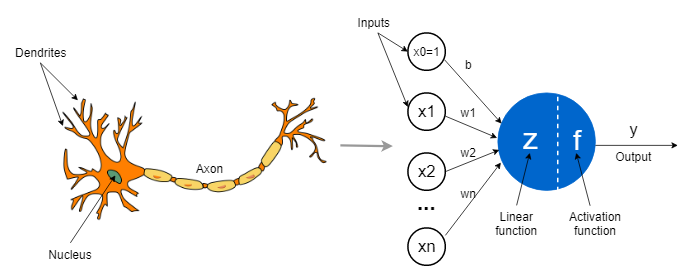

> 在感知器中引入一个偏置特征神经元1的目的是为了增加模型的灵活性和表达能力。这个偏置特征对应于一个固定且始终为1的输入，**其对应的权重称为偏置项（bias）。通过调整偏置项的权重，我们可以控制 TLU 的决策边界在特征空间中平移或倾斜**。（正常来说的话，这个偏置项都是在每个神经元当中所存在，而不是作为单独一个输入存在，能更灵活）
>
> > 在感知器中，将偏置特征固定为1的选择是为了方便计算和表示。
> >
> > 当我们引入一个偏置特征时，可以将其视为与其他输入特征一样的维度，并赋予它一个固定的值1。这样做有以下几个好处：
> >
> > 1. 方便计算：将偏置项乘以1相当于**直接使用权重来表示该偏置项**。在进行加权求和并应用阈值函数时，不需要额外操作或考虑。
> > 2. 参数统一性：通过将偏置项作为一个**独立的权重**进行处理，使得所有输入特征（包括原始输入和偏置）具有**相同的形式和统一性**。
> > 3. 简洁明了：固定为1的偏置特征能够**简化模型参数表示**，并使其更易理解和解释。
> >
> > 请注意，在实际应用中，对于某些任务
> > 可能需要调整默认值1以适应数据分布或优化模型性能。但基本原则仍然是保持一个常数值作为额外输入特征，并且通常会根据具体情况对其进行学习或调整。
>
> 具体来说，引入偏置特征1有以下几个原因： 
>
> 1. **平移决策边界**：通过调整偏置项的权重，可以使得决策边界沿着不同方向平移。如果没有偏置项，则决策边界将必须过原点(0, 0)。
>
> 2. 控制输出截距：当所有**其他输入都为零时，只有存在偏置项才能使感知器产生非零输出**。
>
> 3. 增强模型表达能力：引入一个额外维度后，在某些情况下会更容易找到**合适分割样本空间线性超平面位置**。
>
>    总之，在感知器中引入偏置特征1可以使模型更加灵活，能够适应不同的决策边界位置，并增加了模型对输入数据的表达能力。

其中，Siegrid Lowel非常著名的一句话“一同激活的神经元联系在一起”（Hebb的思想，一个生物元经常触发另外一个神经元，二者关系增强），故此Rosenblatt基于该规则提出一种**感知器训练算法**，其加强了有助于减少错误的连接，如果预测错了，比如预测目标是1，预测到0，就会增强对应神经元权重和偏置，如果预测目标是0，预测到1，就会减小。（根据阶跃函数性质值越大为1，值小为0）

以下是感知器训练算法的步骤（只有一层神经网络）：

1. 初始化参数：初始化权重向量 w 和偏置 b 为零或者随机小数。（一般来说感知器个数不多情况下，个数多则可以使用如神经网络的初始化如He初始化等）
2. 对每个训练样本进行迭代：
   - 计算预测输出 **y_hat = sign(w * x + b)**，其中 w 是权重向量，x 是输入特征向量，b 是偏置项，并且 sign() 函数表示取符号（正负，二分类为例）。
   - 更新权重和偏置：
      - 如果 **y_hat 等于实际标签 y，则无需更新参数**。
      - 如果 y_hat 不等于实际标签 y，则根据下面的规则更新参数：
         - 权重更新规则：w = w + η * (y - y_hat) * x，其中 η 是学习率（控制每次更新的步长）。
         - 偏置更新规则：b = b + η * (y - y_hat)。(偏移)

这个过程会不断迭代直到所有样本被正确分类或达到预定的停止条件（如达到最大迭代次数）。从以下我们就可以看到线性可分的感知机训练过程和线性不可分的感知机训练过程，在线性不可分的情况下，泛化能力较差。


#####  鸢尾花多分类案例

Sci-learn:https://scikit-learn.org/stable/auto_examples/datasets/plot_iris_dataset.html

Wikipedia:https://en.wikipedia.org/wiki/Iris_flower_data_set

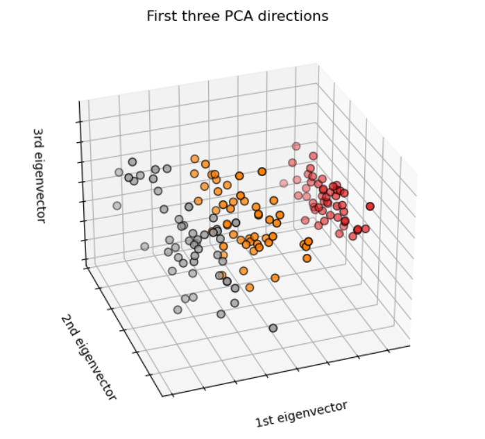


我们从以上的可视化就可以知道，**用Perceptorn分类必然效果不好，因为其线性不可分**。

**不使用库**实现感知器**一对多策略多分类**鸢尾花数据集任务的代码：

```python
import numpy as np
from sklearn.datasets import load_iris
from sklearn.model_selection import train_test_split
from sklearn.metrics import accuracy_score


class Perceptron:
    """设计架构
    1. 初始化基本超参数
    2. 根据算法模型抽象化权重训练流程
    3. 训练中细分单个样本训练和预测中细分单个样本预测以实现多样本训练和预测"""
    def __init__(self, learning_rate=0.1, num_epochs=20):
        self.learning_rate = learning_rate
        self.num_epochs = num_epochs

    def train(self, X, y):
        # 添加偏置项到输入数据中
        X = np.insert(X, 0, 1, axis=1)

        # 初始化权重为随机值
        np.random.seed(42)
        self.weights = []

        # 训练模型（每个类别都有自己独立的感知器）
        for class_label in set(y): # 集合去重
            binary_labels = np.where(y == class_label, 1, -1) # True is 1 or False is  -1
#             print(binary_labels)
            weights_class = self.train_single_perceptron(X, binary_labels)
            self.weights.append(weights_class)

    def train_single_perceptron(self, X, y):
        weights = np.random.rand(X.shape[1]) # 随机初始化后训练（每个样本的特征数）
        for _ in range(self.num_epochs): #轮次
            for i in range(len(X)):
                prediction = self.predict_single_sample(X[i], weights) # 数据和权重求解
                error = y[i]-prediction
                # 更新权重
                update = self.learning_rate*error*X[i]
                weights += update
        return weights

    def predict_single_sample(self, x, weights):
        """receive x and weights return step function"""
        activation_value = np.dot(x, weights)
        return 1 if activation_value >= 0 else -1 # step function (corressponds to the previous binary_labels)

    def predict(self, X_test):
        X_test = np.insert(X_test, 0, 1, axis=1) # 同样需要插入偏置神经元1
        predictions = []
        for i in range(len(X_test)):
            class_predictions = []
            for perceptron_weights in self.weights:
                class_predictions.append(self.predict_single_sample(X_test[i], perceptron_weights))
            predicted_class = np.argmax(class_predictions) # 如果一样大返回最先的下标
#             print(class_predictions) 
#             print(predicted_class)
            predictions.append(predicted_class)
        return predictions


# 加载鸢尾花数据集（数据顺序排列，一定要打乱，泛化能力）
data = load_iris()
X_train, X_test, y_train, y_test = train_test_split(data.data, data.target, test_size=0.2, random_state=42) # 
# X_train, X_test, y_train, y_test = data.data[:120,:],data.data[120:,:],data.target[:120],data.target[120:] # , random_state=42
# 创建感知器对象并训练模型
perceptron = Perceptron()
perceptron.train(X_train, y_train)

# 使用测试数据集进行预测
predictions = perceptron.predict(X_test)
print(np.array(predictions))
print(y_test)
# print(type(y_test))

accuary = sum(predictions == y_test)/len(y_test) 
accuary = accuracy_score(y_test,predictions)
print(accuary)
```

输出

```
[1 0 1 0 1 0 0 2 1 1 2 0 0 0 0 0 2 1 1 2 0 2 0 2 2 2 1 2 0 0]
[1 0 2 1 1 0 1 2 1 1 2 0 0 0 0 1 2 1 1 2 0 2 0 2 2 2 2 2 0 0]
0.8333333333333334
```

**使用库**实现感知器分类鸢尾花数据集任务的代码：

```python
from sklearn.linear_model import Perceptron

# 加载鸢尾花数据集
data = load_iris()
X_train, X_test, y_train, y_test = train_test_split(
    data.data, data.target, test_size=0.2, random_state=42) # 随机数一样的话，随机结果是一样的
# data.data[:120,:],data.data[120:,:],data.target[:120],data.target[120:] #

# 创建并训练感知器模型
perceptron = Perceptron(eta0=0.1, max_iter=100)
perceptron.fit(X_train, y_train)

# 使用测试数据集进行预测
predictions = perceptron.predict(X_test)
print(predictions)
print(y_test)

accuary = sum(predictions == y_test)/len(y_test)
print(accuary)
```

输出：

```
[1 0 2 0 1 0 0 2 1 0 2 0 0 0 0 0 2 0 0 2 0 2 0 2 2 2 2 2 0 0]
[1 0 2 1 1 0 1 2 1 1 2 0 0 0 0 1 2 1 1 2 0 2 0 2 2 2 2 2 0 0]
0.8
```

>  `sklearn.linear_model.Perceptron`的参数：
>
>  - `penalty`: 惩罚项（默认值：None）。可以选择"l1"或"l2"来应用L1或L2正则化，也可以选择None不应用任何惩罚项。
>
>  - `alpha`: 正则化强度（默认值：0.0001）。较大的alpha表示更强的正则化。
>
>  - `fit_intercept`: 是否拟合截距（默认值：True）。如果设置为False，则模型将不会拟合截距。
>
>  - `max_iter`: 最大迭代次数（默认值：1000）。指定在达到收敛之前要执行的最大迭代次数。
>
>  - `tol`: 收敛容忍度（默认值：1e-3）。指定停止训练时目标函数改善小于该阈值时的容忍程度。
>
>  - `shuffle`: 是否在每个周期重新打乱数据顺序（默认值：True）。
>
>  - `eta0`: 初始学习率（默认值：1.0）。控制权重更新速度的学习率。较低的初始学习率可能有助于稳定模型收敛过程，但训练时间可能变长。
>
>  - `random_state`: 随机种子。提供一个整数以保证结果可重复性，或者设置为None以使用随机状态。
>
>  - `verbose`: 是否打印详细输出（默认值：0）。设置为1时，会定期打印出损失函数的值。
>

在这两个例子中，我们都使用了鸢尾花数据集，并将其分为训练和测试数据。然后，我们创建了一个感知器对象（自定义或Scikit-Learn提供的），并使用`train()`方法（自定义）或`fit()`方法（Scikit-Learn）来训练模型。最后，在测试数据上使用`predict()`方法来生成预测结果。（其中我们还可以设置一些超参数达到优化的目的）

>  扩展：
>
>  `MLPClassifier`和Keras中的`Dense`层都用于实现多层感知器（Multi-Layer Perceptron）模型。
>
>  在Scikit-Learn库中，`MLPClassifier`是一个基于神经网络的分类器，它使用反向传播算法进行训练，并可以处理多类别分类问题。你可以通过指定不同的参数来配置隐藏层、激活函数、优化算法等。
>
>  而在Keras库中，`Dense`层也被用作构建神经网络模型的一部分。它定义了全连接层（fully connected layer），其中每个输入节点与输出节点之间都有权重连接。你可以通过设置不同的参数来调整该层的大小、激活函数等。
>
>  虽然两者具有相似的功能，但由于框架和接口不同，它们在代码编写上可能会有所差异。因此，在使用时需要根据所选框架来适当调整代码。
>
>  总体上说，**“MLPClassifier”和Keras中“Dense”层都是为了实现多层感知器模型而设计的工具，在不同框架下提供了类似功能但语法略有差异。**

##### 应用场景

相比其他机器学习算法，感知器具有以下优势：

1. 简单而高效：感知器算法**非常简单且易于实现，计算速度快**。
2. 对噪声数据鲁棒：由于**其使用了阶跃函数作为激活函数，在处理带有噪声数据时表现较好**。
3. 支持在线学习：感知器是一种在线学习算法，可以逐步更新权重和阈值，并在每次迭代中对新样本进行训练。

然而，感知器也存在一些局限性：

1. **仅适用于线性可分问题**：由于其基于线性模型，在**处理非线性可分问题时无法取得良好的结果**。
2. **只能进行二分类**：感知器只能用于二分类任务，并**不能直接扩展**到多类别分类问题上。
3. **对输入特征缩放敏感**：感知器对输入特征的缩放比较敏感，如果**特征之间的尺度差异较大**（因为结果是根据值的大小决定的，所以在使用前需要数据特征归一化或者标准化），可能会影响算法的性能。

在实际应用中，当面对非线性可分问题时，可以考虑使用其他更复杂的模型，如支持向量机、神经网络等。这些模型具有更强大的表示能力，并且能够处理更为复杂和抽象的关系。然而，在某些简单问题上，感知器仍然是一个有效且高效的选择。

总结起来就是，感知器适用于解决线性可分二分类问题，并且**具有简单、高效和鲁棒等优点**。但它无法处理非线性可分问题，并且只能进行二分类任务。对于不同类型或更复杂的问题，可以考虑使用其他更适合的方法。

#### BP神经网络

`BP神经网络`，指的是用了**“BP算法”进行训练的“多层感知器模型”（MLP)。**并为了TLU感知机算法正常工 作，对MLP的架构进行了修改，即将阶跃函数替换成其他激活函数，如`tanh`，`Relu`。这里之所以用反向传播是因为多层的感知机无法再用感知机学习规则来训练. 

### 卷积神经网络

 [Keras layers.md](Keras\Keras layers.md) 

推荐视频：https://www.youtube.com/watch?v=KuXjwB4LzSA&list=RDCMUCYO_jab_esuFRV4b17AJtAw

确定卷积层的最佳数量以及它们对其他参数的影响是一个挑战性的任务，通常需要进行实验和调整来找到最佳的模型架构。

一般而言，卷积层数量的选择可以基于以下因素进行评估：

1. **数据集大小**和复杂程度：更大更复杂的数据集可能需要更深的卷积神经网络，以便提取更丰富的特征。较小的数据集则可能需要较浅的卷积神经网络，以避免过拟合。

2. 训练时长和计算资源：更深的卷积神经网络需要更长的训练时间和更多的计算资源。在限制时间和计算资源的情况下，可能需要权衡深度和精度。

3. 预训练模型的可用性：使用预训练模型可以减少训练时间并提高模型的精度。如果可用的预训练模型包含了与问题相关的卷积层，则可以考虑从这些层开始，然后通过微调来逐步优化模型。

除了卷积层的数量外，其他参数也会影响模型的性能。例如，卷积层的大小、步幅、填充等参数会影响特征图的大小和数量。池化层的类型、大小和步幅也会影响特征图的大小和数量，从而影响后续层的表现。因此，在设计卷积神经网络时，需要综合考虑这些参数，并进行实验和调整以找到最佳的模型结构。

> Q: CNN 1D与1至5个卷积层模型测试性能获得的准确性分别为88.36%、89.48%、88.86%、87.96和86.89%。五个1D CNN层是最大的界限，因为这个层上的函数图的最小尺寸已经超过了。
>
> A: 这个问题涉及到卷积神经网络中的**感受野（receptive field）概念**。
>
> 在卷积神经网络中，每一层的卷积核实际上是对上一层特征图的局部区域进行处理，而**该局部区域的大小就是该层的感受野大小**。这意味着，随着层数的增加，感受野也会逐渐扩大。
>
> 在1D CNN中，每个卷积核只能查看其左右固定数目的元素，这个固定数目就是感受野。因此，通过堆叠多个1D CNN层，可以使得后面的层拥有更大的感受野，从而提取更全局的特征。
>
> 但是，当1D CNN层数过多时，每一层的输出的长度也会逐步缩小。这是因为，在1D CNN中，卷积操作将输入向量的每个元素映射到输出向量的一个元素，因此每次卷积操作都会减少向量长度。随着层数的增加，输出向量的长度也会逐渐缩小，最终可能会导致信息丢失，从而影响模型性能。
>
> 因此，作者在该问题中使用了1至5个1D CNN层进行测试，并发现5层是极限。作者指出，当使用5个1D CNN层时，**最后一层的输出长度已经非常短，无法再添加更多的卷积层**。因此，**作者不能通过增加层数来进一步提高模型性能，而必须尝试其他方法，如调整卷积核大小、池化方式等**，以达到更好的性能。或者使用transformer模型思想，一层就可以看到整个序列的感受野。


### 循环神经网络	

下面是RNN、LSTM和GRU三者的优缺点的比较：

| 模型 | 优点                                                         | 缺点                                                         |
| ---- | ------------------------------------------------------------ | ------------------------------------------------------------ |
| RNN  | - 简单的结构和参数<br>- 可以处理序列数据的时间依赖关系<br>- 计算效率较高 | - 难以处理长期依赖关系<br>- 容易遇到梯度消失或梯度爆炸问题   |
| LSTM | - 能够捕捉和处理长期依赖关系<br>- 通过门控机制控制信息流动<br>- 网络结构相对简单 | - 参数较多，计算开销较大<br>- 可能会出现过拟合问题           |
| GRU  | - 相对于LSTM，参数更少，计算效率更高<br>- 通过门控机制控制信息流动<br>- 可以捕捉长期依赖关系 | - 可能会失去一些细粒度的时间信息<br>- 对于某些复杂的序列问题，性能可能不如LSTM |

这是对RNN、LSTM和GRU三者的一般性优缺点的总结。实际应用中，选择合适的模型取决于具体任务和数据集的特点。有时候，LSTM可能更适合捕捉长期依赖关系，而GRU则具有更高的计算效率。因此，建议在实际应用中根据具体情况选择适合的模型。

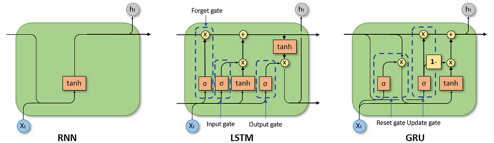


详细讲解RNN,LSTM,GRU  https://towardsdatascience.com/a-brief-introduction-to-recurrent-neural-networks-638f64a61ff4

#### Recurrent Neural Network (RNN)

递归神经网络是将信息存在了隐藏层往后传递，由于这个原因，在处理时序数据中是一个时间步一个时间步的输入，在一百个时间步的情况下，需要先算出前99个时间步才能算出第100个，所以并行能力较差，在计算机性能表示方面较差。同样还是这个原因，在序列比较长的话，长短期记忆较差。在并行上也就有人提出了使用CNN来代替RNN


循环神经网络（Recurrent Neural Network，RNN）是一种用于处理序列数据的神经网络算法。相比于传统的前馈神经网络，RNN引入了**循环连接**，使网络能够对序列中的**时间依赖关系**进行建模。

>  RNN 通过单元中的反馈循环实现记忆。这是 RNN 与传统神经网络的主要区别。与信息仅在层之间传递的前馈神经网络相比，反馈循环允许信息在层内传递。

RNN的核心思想是在网络的隐藏层之间引入循环连接，使得网络在处理每个时间步的输入时，不仅依赖当前时间步的输入，还依赖前一个时间步的隐藏状态。这种循环连接的设计使得网络具有记忆性，能够捕捉到序列数据中的长期依赖关系。

下面是RNN的算法步骤：

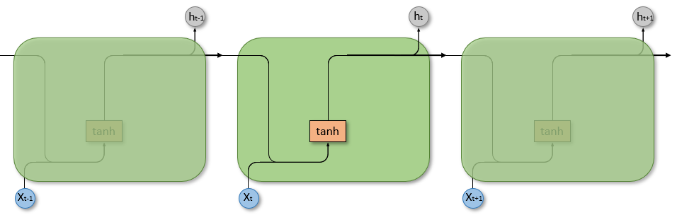

公式如下:

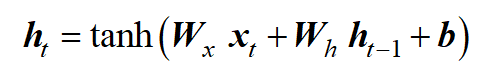

1. 初始化参数：
   - 定义输入序列的维度（例如，词向量的维度）和隐藏状态的维度。
   - 随机初始化权重矩阵，如输入到隐藏层的权重矩阵、隐藏层到隐藏层的权重矩阵和隐藏层到输出层的权重矩阵。
2. 前向传播：
   - 对于输入序列中的每个时间步，将输入向量和前一个时间步的隐藏状态向量输入到隐藏层中。
   - 根据当前时间步的输入和前一个时间步的隐藏状态，计算隐藏层的输出。
   - 使用隐藏层的输出计算当前时间步的预测结果（可以是分类问题的概率分布或回归问题的连续值）。
3. 更新隐藏状态：
   - 使用当前时间步的隐藏状态更新到下一个时间步的隐藏状态。通常使用tanh或ReLU等激活函数来处理隐藏状态。
4. 计算损失：
   - 根据预测结果和真实标签计算损失函数（如交叉熵损失或均方误差）。
5. 反向传播：
   - 计算损失函数对于权重矩阵的梯度。
   - 使用梯度下降或其他优化算法更新权重矩阵。
6. 重复步骤2-5直到所有时间步的输入都被处理完毕，或达到指定的训练迭代次数。


RNN算法的核心是通过循环连接实现对序列数据的建模和预测。它在自然语言处理（NLP）领域广泛应用于语言模型、机器翻译、情感分析等任务，也适用于时间序列数据的预测和生成。

需要注意的是，传统的RNN在处理长期依赖关系时可能会遇到梯度消失或梯度爆炸的问题。为了克服这个问题，改进的RNN变体，如长短期记忆网络（LSTM）和门控循环单元（GRU），被提出并广泛应用。

#### LSTM

详见  [Keras layers.md](Keras\Keras layers.md) 

#### GRU 门控循环单元

GRU（Gated Recurrent Unit，门控循环单元）是一种循环神经网络（RNN）的变体，用于处理序列数据。它是为了解决传统RNN中的梯度消失问题和长期依赖问题而提出的。

GRU单元通过引入门控机制来控制信息的流动，从而能够更好地捕捉长期依赖关系。相比于传统的RNN和LSTM，GRU具有更简单的结构和更少的参数，但仍能有效地建模和处理序列数据。

GRU单元的核心结构包括以下几个关键组件：

1. 更新门（Update Gate）：
   - 更新门决定了当前时间步的输入和前一个时间步的隐藏状态之间的权重。
   - 更新门的输出范围在0和1之间，用于控制信息流动的权重。接近1表示重要信息被保留，接近0表示信息被丢弃。

2. 重置门（Reset Gate）：
   - 重置门决定了前一个时间步的隐藏状态如何影响当前时间步的输入。
   - 重置门的输出范围在0和1之间，用于控制前一个时间步的隐藏状态对当前时间步的输入的影响程度。

3. 候选隐藏状态（Candidate Hidden State）：
   - 候选隐藏状态是基于当前时间步的输入和前一个时间步的隐藏状态计算得到的中间状态。
   - 它是一个候选的更新后的隐藏状态，用于在考虑前一个时间步的隐藏状态的同时，结合当前时间步的输入。

4. 最终隐藏状态：
   - 最终的隐藏状态是通过加权平均候选隐藏状态和前一个时间步的隐藏状态得到的。
   - 更新门的输出和候选隐藏状态决定了最终隐藏状态中保留的信息。

GRU单元的计算过程可以描述如下：

- 输入：当前时间步的输入（x_t）、前一个时间步的隐藏状态（h_{t-1}）
- 输出：当前时间步的隐藏状态（h_t）

1. 计算更新门（z_t）：
   - z_t = sigmoid(W_z * x_t + U_z * h_{t-1})

2. 计算重置门（r_t）：
   - r_t = sigmoid(W_r * x_t + U_r * h_{t-1})

3. 计算候选隐藏状态（h~_t）：
   - h~_t = tanh(W_h * x_t + r_t * U_h * h_{t-1})

4. 计算最终隐藏状态（h_t）：
   - h_t = (1 - z_t) * h_{t-1} + z_t * h~_t

GRU单元的参数包括权重矩阵（W和U）和偏置向量。这些参数通过反向传播算法进行训练，以最小化定义的损失函数。

相比于传统的RNN和LSTM，GRU单元的结构更简洁，具有更少的门控单元和参数。这使得GRU在处理序列数据时具有更高的计算效率，并能够更好地捕捉长期依赖关系。

希望这个解释对您有帮助。如果您有任何进一步的问题，请随时提问。

### Transformer

注意力（Attention）机制由Bengio团队与2014年提出并在近年广泛的应用在深度学习中的各个领域，例如在计算机视觉方向用于捕捉图像上的感受野，或者NLP中用于定位关键token或者特征。谷歌团队近期提出的用于生成词向量的BERT算法在NLP的11项任务中取得了效果的大幅提升，堪称2018年深度学习领域最振奋人心的消息。而BERT算法的最重要的部分便是本文中提出的Transformer的概念。

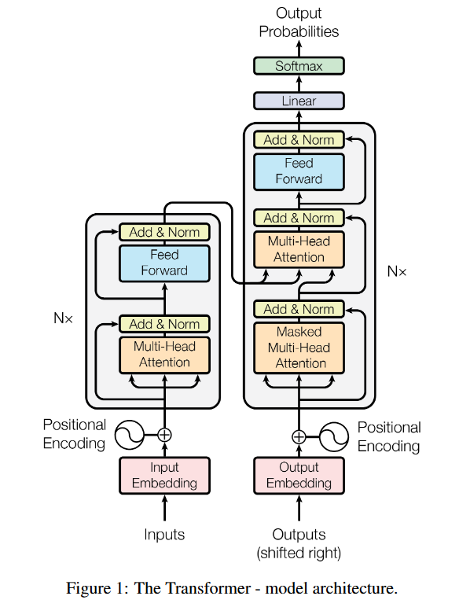


#### 背景和动机

作者采用Attention机制的原因是考虑到RNN（或者LSTM，GRU等）的计算限制为是顺序的，也就是说RNN相关算法只能从左向右依次计算或者从右向左依次计算，这种机制带来了两个问题：

1. 时间片 t 的计算依赖 t−1 时刻的计算结果，这样限制了**模型的并行能力**；

2. 传统的序列模型（如循环神经网络）存在着长期依赖问题，难以捕捉长距离的依赖关系。顺序计算的过程中**信息会丢失**，尽管LSTM等门机制的结构一定程度上缓解了长期依赖的问题，但是对于特别长期的依赖现象,LSTM依旧无能为力。故提出了用CNN来代替RNN的解决方法（平行化)。

   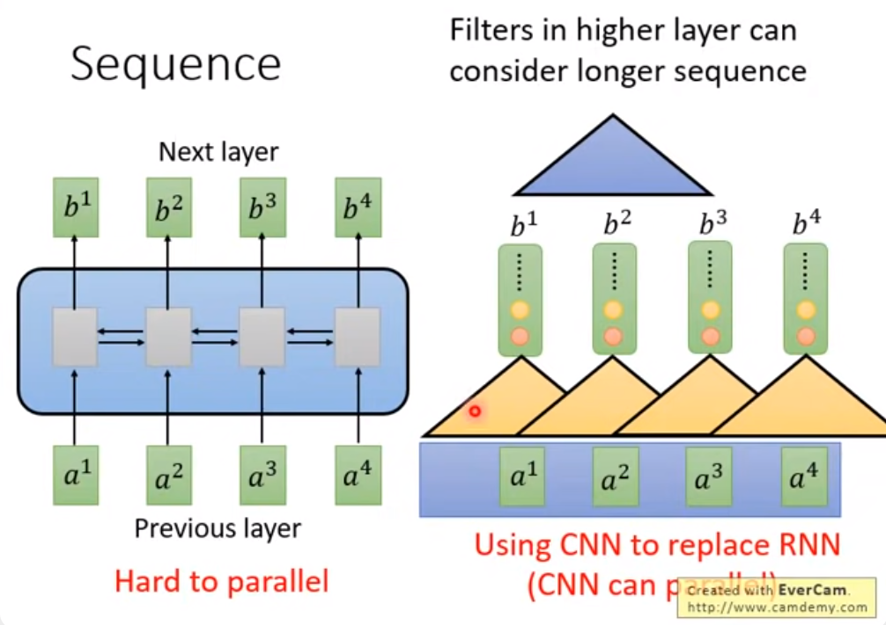
   
   > 长期依赖关系见笔记本  [classical concept.md](classical concept.md) 
   
 3. 但是卷积神经网络只能感受到部分的感受野，**需要多层叠加**才能感受整个图像，而transformer注意力机制可以一层感受到全部序列，并提出了 Multi-Head Attention 实现和卷积网络多个输出识别不同模式的效果 ，故提出了自注意力机制

我们下面的内容依次按照模型的顺序讲解，首先讲解Positional Encoding，在讲解自注意力机制和多头注意力机制，再到全连接和跳跃连接

#### Positional Encoding

由于 Transformer 模型没有显式的顺序信息（**没有**循环神经网络的迭代操作），为了保留输入序列的位置信息&顺序关系，需要引入位置编码。位置编码是一种向输入**嵌入中添加的特殊向量**（不被训练的），用于表示单词或标记在序列中的位置。

相比起直接 concatenate ，直接相加似乎看起来会被糅合在输入中似乎位置信息会被擦除，我们可以假设concatenate 一个独热向量p_i ， 代表其位置信息，

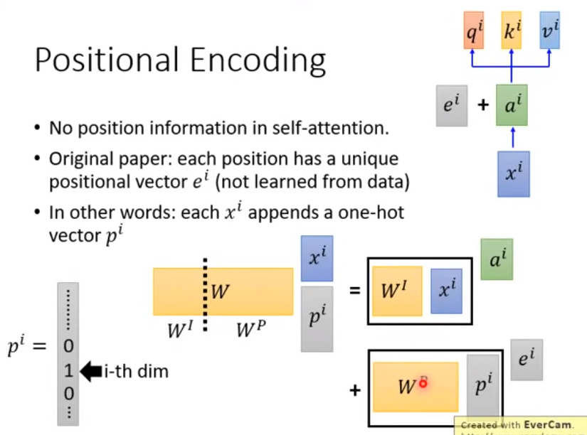

如图所示，最后也可以看为二者相加，但是此时的e^i 的权重W_P是可以被learn的 W^P^，根据研究表明这个W^P^ learn 有人做过了在convolution中`seq to seq`中类似的学习参数做法效果并不是很好，还有说其实会添加很多的不必要的参数学习等（issue地址：https://github.com/tensorflow/tensor2tensor/issues/1591，https://datascience.stackexchange.com/questions/55901/in-a-transformer-model-why-does-one-sum-positional-encoding-to-the-embedding-ra  不过我觉得实验才是真理，但似乎目前我还没有看到相关实验，如果有请在评论区留言！！），所以有一个人手设置的非常奇怪的式子产生确定W^P^ （其中W^P^ 绘图如图所示）

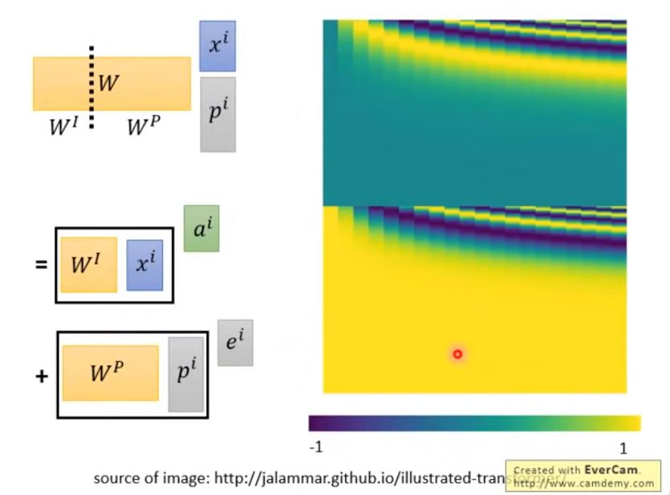

Transformer 模型一般以**字**为单位训练，论文中使用了 sin(罪) 和 cos 函数的线性变换来提供给模型位置信息.

理想情况下，信息编码（piece of information）的设计应该满足以下条件：

-  它应该为每个字（时间步）输出唯一的编码
-  不同长度的句子之间，任何两个字（时间步）之间的差值应该保持一致
-  我们的模型应该无需任何努力就能推广到更长的句子。它的值应该是有界的。
-  它必须是确定性的

在Transformer中，位置编码器的函数可以由以下公式表示：

$$
PE_{(pos, 2i)} = \sin\left(\frac{{pos}}{{10000^{2i/d_{\text{model}}}}}\right)
$$

$$
PE_{(pos, 2i+1)} = \cos\left(\frac{{pos}}{{10000^{2i/d_{\text{model}}}}}\right)
$$

其中，$pos$表示输入序列中的位置，$i$表示位置编码中的维度索引，$d_{\text{model}}$表示Transformer模型的隐藏单元大小。

您可能想知道正弦和余弦的这种组合如何表示位置 / 顺序？其实很简单，假设你想用二进制格式来表示一个数字，会怎样可以发现不同位之间的变化，在每个数字上交替，第二低位在每两个数字上轮换，依此类推。但在浮点数世界中使用二进制值会浪费空间。因此，我们可以使用它们的浮点连续对应物 - 正弦函数。事实上，它们相当于交替位。

这个公式中的分数部分将位置$pos$进行了缩放，并使用不同的频率（$10000^{2i/d_{\text{model}}}$）来控制不同维度的变化速度。这样，**不同位置和不同维度的位置编码会得到不同的数值，形成一个独特的向量表示**，

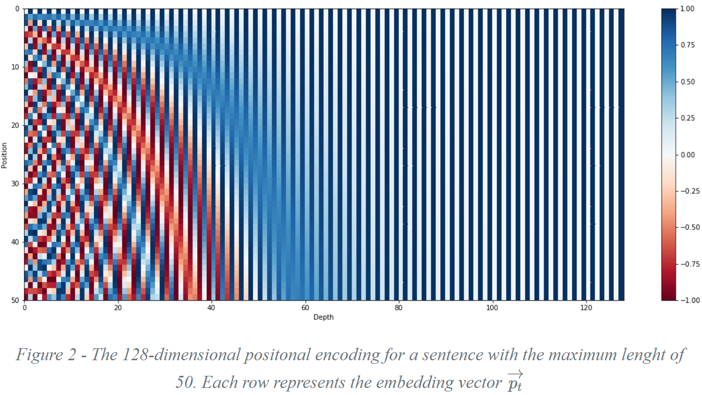

正弦位置编码的另一个特点是它允许模型**毫不费力地关注相对位置**。以下是原论文的引用：

>  We chose this function because we hypothesized it would allow the model to easily learn to attend by relative positions, since for any fixed  offset  k, PEpos+k can  be represented as a linear function  of PEpos.

https://kazemnejad.com/blog/transformer_architecture_positional_encoding/  这篇文章就很好的讲解了，这是因为其实这个添加的位置offset可以通过PEpos本身dot product 一个矩阵M得到对应offset后的结果PEpos+k（相当于线性变换，独立于时间变量t)

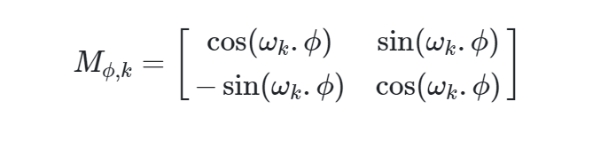

>  总结来看：位置编码器采用正弦和余弦函数的函数形式是为了满足一些重要特性，以便在Transformer模型中有效地表示位置信息。
>
>  1. 周期性: 使用正弦和余弦函数能够使位置编码具有周期性。使得位置编码的值在每个维度上循环变化。这对于表示序列中的不同位置非常重要，因为不同位置之间可能存在重要的依赖关系。
>  2. 连续性: 正弦和余弦函数在输入空间中是连续的。这意味着相邻位置之间的位置编码也是连续的，有助于保持输入序列中的顺序信息的连贯性。
>  3. 维度关联: 位置编码中的维度与Transformer模型的隐藏单元大小相关联。这意味着不同维度的位置编码会以不同的频率变化，从而能够捕捉不同尺度的位置信息。较低维度的位置编码可以更好地表示较短距离的依赖关系，而较高维度的位置编码可以更好地表示较长距离的依赖关系。

#### 自注意力机制（Self-Attention）

 Transformer 模型的核心组件之一。自注意力允许模型根据输入序列中**不同位置的相关性权重**来计算每个位置的表示。通过计**算查询、键和值之间的相似性得分**，并将这些得分应用于值来获取**加权和，从而生成每个位置的输出表示**。（其目的就是取代RNN要做的事情，sequence to sequence（seq2seq），同时计算)

Q、K和V是通过对输入序列进行线性变换得到的，具体来说，通过对输入序列的每个位置应用不同的权重矩阵，将输入序列映射到具有不同维度的查询（Q）、键（K）和值（V）空间。这样，我们就可以使用这些查询、键和值来计算注意力权重并生成加权表示。

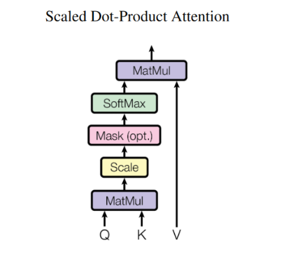

>  值（V）代表的是确切的值（线性变换得到），一般是不变的用于求最后的输出，其次要实现求各个向量的相似性，如果只有一个k，而没有q，那k 与其他输入的 k作相似性，自己单元没有可以做相似性的地方，而再加一个q就可以实现了, 从而最后得到权重。

具体来说，给定一个输入序列X，我们可以通过线性变换得到Q、K和V：

Q = X * W_Q
K = X * W_K
V = X * W_V

其中W_Q、W_K和W_V是可学习的权重矩阵。

使用Q、K和V的好处是，它们允许模型根据**输入的不同部分**对相关信息进行加权。Q用于查询**输入序列的每个位置**，K用于提供关于**其他位置的信息**，V则提供用于计算加权表示的值。

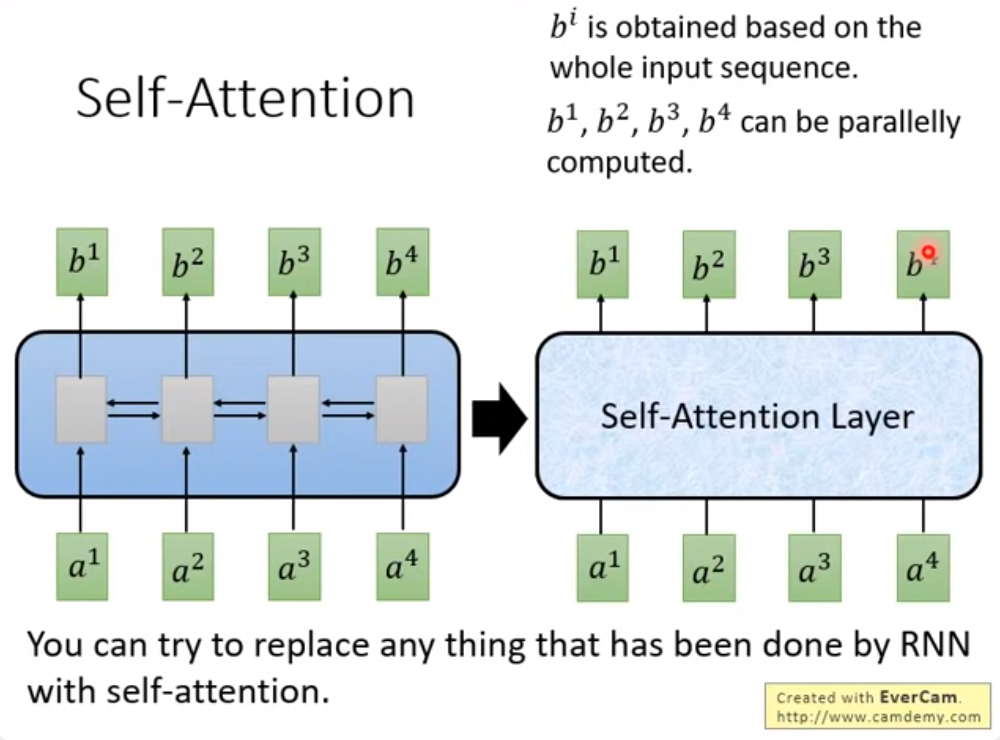

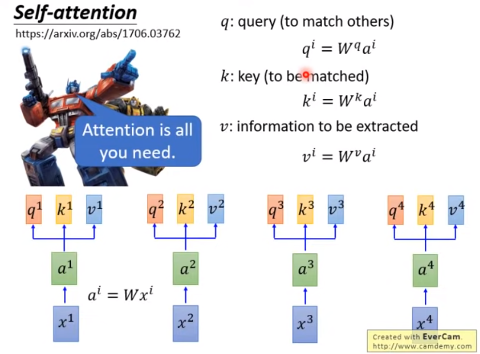

q,k做一个 inner product，并除与维度长度，这是因为维度值越大，输出结果a越大，所以通过除于维度的根号来平衡，通过计算Q和K之间的相似度得到注意力权重。一种常用的计算相似度的方法是使用点积操作：

Attention(Q, K, V) = softmax(QK^T / sqrt(d_k)) * V

其中d_k是Q和K的维度。通过将Q和K进行点积操作并除以sqrt(d_k)来缩放注意力权重，这有助于减小梯度在计算注意力时的变化范围（维度越大值越大），使得训练更加稳定。

这只是一个案例，不一定要使用scaled dot-product attention, 用其他的attention方法也有很多种，只要能输入两个向量输出一个分数即可

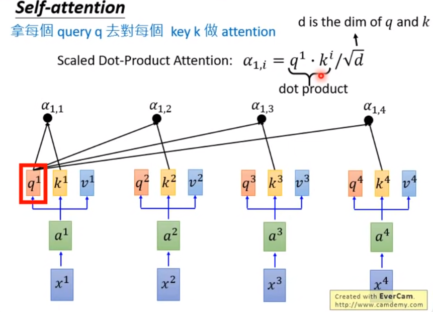

将注意力权重与V进行加权求和，得到最终的表示：

Output = Attention(Q, K, V)

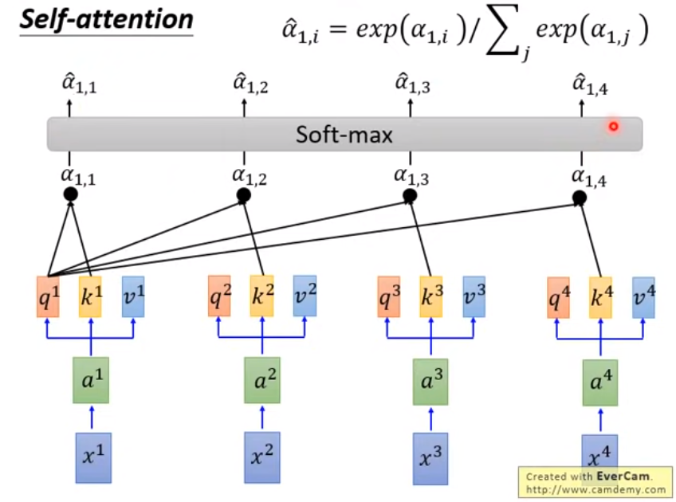

通过每个attention权重乘上v累加最终根据 $x^1$ 数据的 $q^1$ 得到基于全部序列长度的attention权重下的求和值，得到对应的 $b^1$

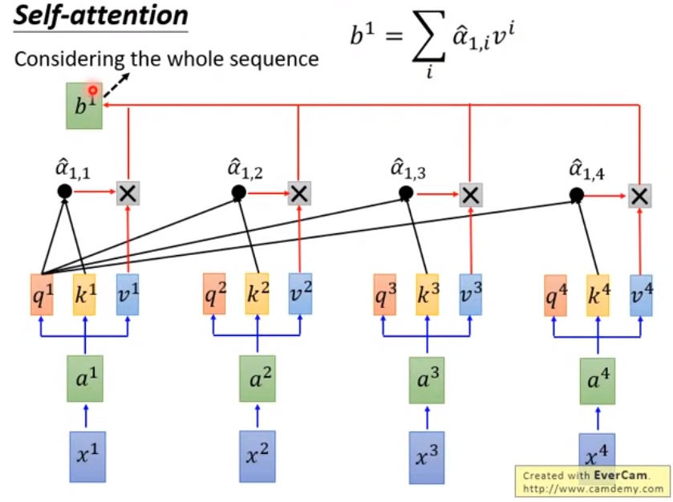

通过这种方法，我产生了一个 $b^1$ ,看到了全部的输入序列，但是如果说不想考虑到全部的输入，比如时序预测中只想看到以前的，只需要将对应权重为0即可，即给q , v 相似度输出默认给一个非常大的负数，在经过`softmax`就会变成0。

以此类推切换 $q$，输出全部输出 $b$ 序列。该方法所实现的平行化的意思是实现矩阵运算，上面介绍的方法需要一个循环遍历所有的字 xt，我们可以把上面的向量计算变成矩阵的形式，从而一次计算出所有时刻的输出

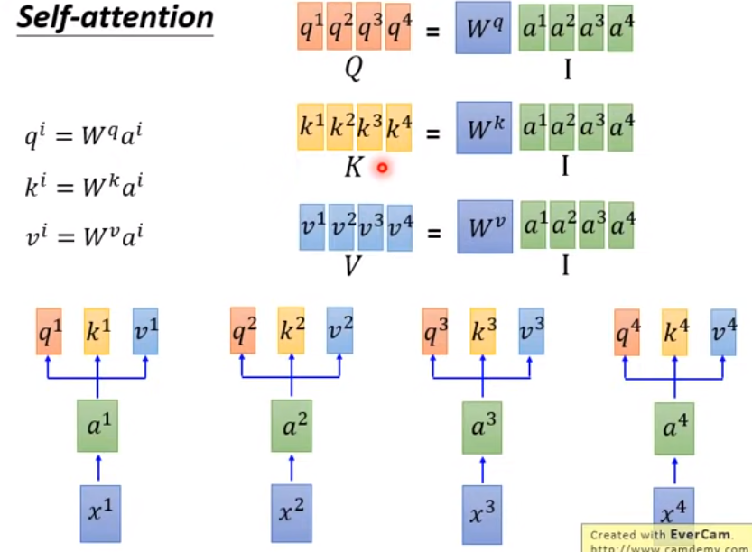

第一步就不是计算某个时刻的 qt,kt,vt 了，而是一次计算所有时刻的 Q,K 和 V。计算过程如下图所示，这里的输入是一个矩阵 X，矩阵第 t 行为第 t 个词的向量表示 xt

#### 多头注意力机制（Multi-head Self-attention)

为了实现多个输出扑捉多种不同模式下的状态，Transformer 模型同时使用多个自注意力机制，每个注意力机制被称为一个头（head）。通过并行计算多个头，模型可以学习不同粒度和关注不同方面的特征表示。

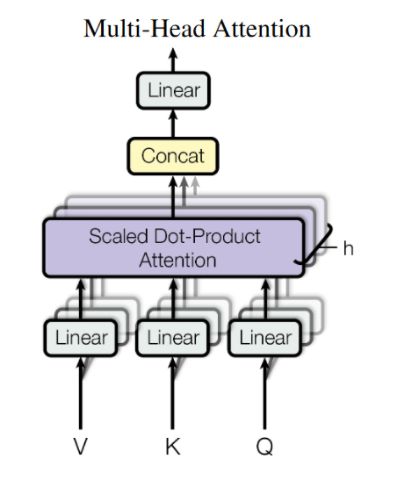

这里以两个头为例

前面定义的一组 Q,K,V 可以让一个词 attend to 相关的词，我们可以定义多组 Q,K,V，让它们分别关注不同的上下文。计算 Q,K,V 的过程还是一样，只不过线性变换的矩阵从一组 (WQ,WK,WV) 变成了多组 (W0Q,W0K,W0V) ，(W1Q,W1K,W1V)，… 如下图所示


对于输入矩阵 X，每一组 Q、K 和 V 都可以得到一个输出矩阵 Z。如下图所示


最后输出再乘以一个**矩阵降维**得到同样大小的输出。

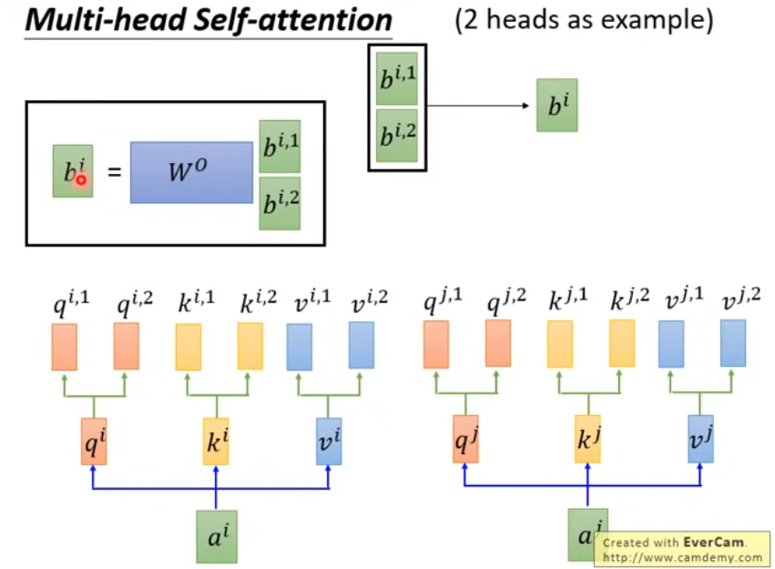


#### Padding Mask

其中在output输入的多头注意力机制中可以看到添加了Masked（Padding Mask），

1.  传统 Seq2Seq 中 Decoder 使用的是 RNN 模型，因此在训练过程中输入 t 时刻的词，循环神经网络是时间驱动的，只有当 t 时刻运算结束了，才能看到 t+1 时刻的词。但在使用self-attention训练过程中，整个 ground truth都暴露在 Decoder 中，这显然是不对的，我们需要对 Decoder 的输入进行一些处理，**即在训练中只注意当前训练时间刻前的历史数据**
2.  句子长度不同中，根据最长句子补齐后，对不等长的句子进行mask。

为了屏蔽后续时间步，可以将Mask矩阵中对应位置的元素设置为一个很大的负数（例如-1e9），这样在经过Softmax函数后，注意力权重接近于零，相当于忽略了后续时间步的信息。

假设有一个时间序列数据，长度为10，你想要关注前6个时间步的数据，而忽略后面的时间步。

```
时间序列: [1, 2, 3, 4, 5, 6, 7, 8, 9, 10]

Mask矩阵:
[[0, -1e9, -1e9, -1e9, -1e9, -1e9, -1e9, -1e9, -1e9, -1e9],
 [0, 0, -1e9, -1e9, -1e9, -1e9, -1e9, -1e9, -1e9, -1e9],
 [0, 0, 0, -1e9, -1e9, -1e9, -1e9, -1e9, -1e9, -1e9],
 [0, 0, 0, 0, -1e9, -1e9, -1e9, -1e9, -1e9, -1e9],
 [0, 0, 0, 0, 0, -1e9, -1e9, -1e9, -1e9, -1e9],
 [0, 0, 0, 0, 0, 0, -1e9, -1e9, -1e9, -1e9]]
```

这样，在进行注意力计算时，将**输入序列与Mask矩阵相加**，之后再做 softmax，就能将 - inf 变为 0，得到的这个矩阵即为每个字之间的权重，从而达到忽略后续时间步的效果。

在不等长句子处理中则同理对无效句子进行masking操作即可

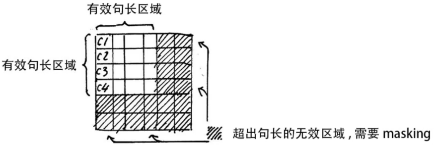

#### 残差链接和层归一化

Transformer 模型使用残差连接（residual connections）来使梯度更容易传播，在进行self(自我)-attention 加权之后输出，也就是 Self(自我)-Attention(Q, K, V)，然后把他们加起来做残差连接

$Xembedding+Self-Attention(Q, K, V)$

以及层归一化（layer normalization）来加速训练过程和提高模型性能。 [classical concept.md](classical concept.md)  这里有讲解关于层归一化的概念

下面的图总结了以上 encode 的部分，接下来我们看关于decode的部分

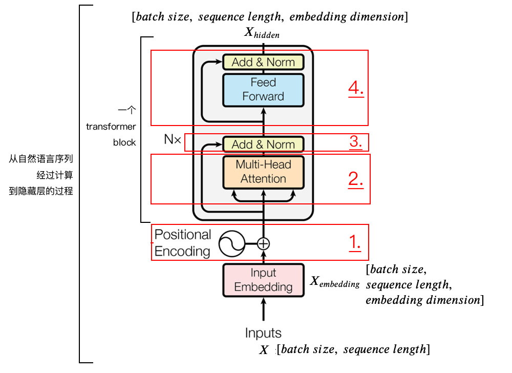

Deocoder中的 Masked Encoder-Decoder Attention 唯一不同的是这里的 K,V 为 Encoder 的输出，Q 为 Decoder 中 Masked(掩盖) Self(自我)-Attention 的输出

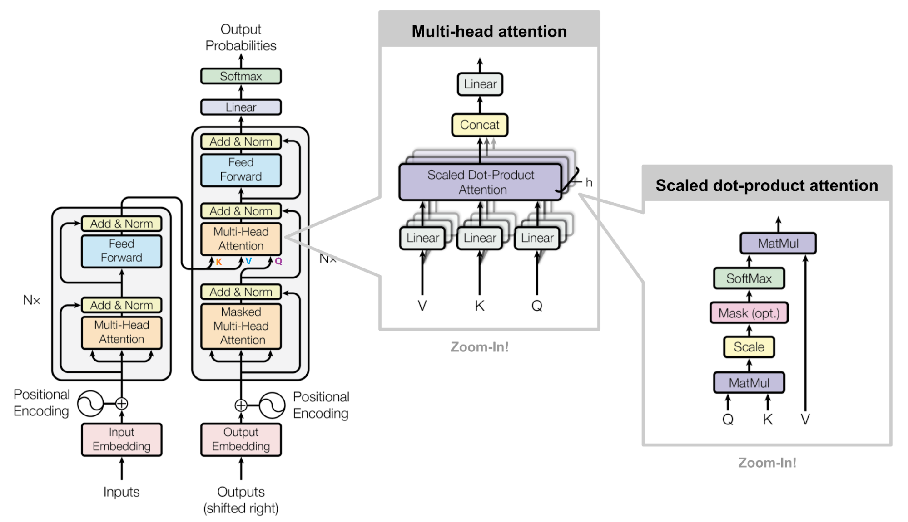

该方法将输入的信息作为键值传入，并将对于输入的序列查询信息糅合，达到学习关联二者序列的关系，并通过最终结果训练得到最优参数。

#### English to French j机器翻译案例

在机器翻译任务中，输入是一个源语言句子（例如英文句子），输出是该句子的目标语言翻译（例如法文句子）。

1. 输入（Input）：
   - 源语言句子：将源语言句子进行编码，通常使用词嵌入（Word Embedding）来表示每个单词。例如，将英文句子"Hello, how are you?"转换为一系列词嵌入向量。
   - 位置编码（Positional Encoding）：为了捕捉单词在句子中的位置信息，Transformer模型引入位置编码，将位置信息与词嵌入向量相结合。
   - 输入嵌入（Input Embedding）：将词嵌入向量和位置编码向量相加，得到每个单词的最终输入表示。

2. 输出（Output）：
   - 目标语言句子：目标语言句子也会进行类似的处理，将目标语言句子进行编码和嵌入表示。
   - 解码器输入（Decoder Input）：解码器的输入是**目标语言句子的编码表示**，通常会在每个目标语言句子的开头添加一个特殊的起始标记（例如\<start>）来表示解码器的起始位置。
   - 解码器输出（Decoder Output）：解码器的输出是对目标语言句子的预测结果，通常是一个单词或一个单词的词嵌入向量。解码器会逐步生成目标语言句子，每一步生成一个单词，直到遇到特殊的结束标记（例如\<end>）或达到最大长度。

下面是一个机器翻译任务的例子：

源语言句子（英文）： "Hello, how are you?"
目标语言句子（法文）： "Bonjour, comment ça va ?"

在这个例子中，输入是源语言句子的编码表示，输出是目标语言句子的解码器输入和解码器输出。

输入（Input）：
- 源语言句子编码：[0.2, 0.3, -0.1, ..., 0.5] （词嵌入向量表示）
- 位置编码：[0.1, 0.2, -0.3, ..., 0.4]
- 输入嵌入：[0.3, 0.5, -0.4, ..., 0.9]

输出（Output）：
- 解码器输入：[\<start>, 0.7, 0.2, -0.8, ..., 0.6]
- 解码器输出：[0.1, 0.5, -0.6, ..., 0.2]

通过训练，Transformer模型会根据输入的源语言句子和目标语言句子进行参数优化，使得模型能够生成准确的目标语言翻译。

需要注意的是，具体任务中的输入和输出的表示方式可能会有所不同，这只是一个简单的机器翻译示例。不同任务和模型架构可能会有不同的输入和输出定义。

#### 一些值得思考的问题

##### 为什么说 Transformer 在 seq2seq 能够更优秀？

RNN等循环神经网络的问题在于**将 Encoder 端的所有信息压缩到一个固定长度的向量中**，并将其作为 Decoder 端首个隐藏状态的输入，来预测 Decoder 端第一个单词 (token) 的隐藏状态。在输入序列比较长的时候，这样做显然会损失 Encoder 端的很多信息，而且这样一股脑的把该固定向量送入 Decoder 端，**Decoder 端不能够关注到其想要关注的信息**。Transformer 通过使用Multi-self-attention 模块，让源序列和目标序列首先 “**自关联**” 起来，并实现全局观和并行能力，模型所能提取的信息和特征更加丰富，运算更加高效。  

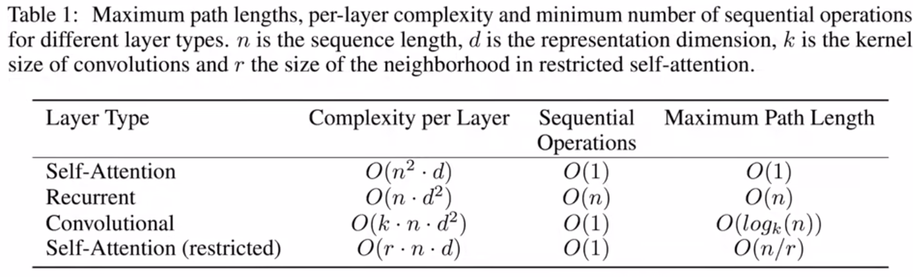

##### 关于代码

官方代码地址： https://github.com/tensorflow/tensor2tensor

http://nlp.seas.harvard.edu/2018/04/03/attention.html （Pytorch_实现）

如果有能力的话，大家可以尝试一下手撕代码哦，大佬嘿嘿。

参考文献:

https://wmathor.com/index.php/archives/1438/

https://www.youtube.com/watch?v=ugWDIIOHtPA&list=PLJV_el3uVTsOK_ZK5L0Iv_EQoL1JefRL4&index=62

https://www.bilibili.com/video/BV1pu411o7BE/?spm_id_from=333.337.search-card.all.click&vd_source=2700e3c11aa1109621e9a88a968cd50c

https://wmathor.com/index.php/archives/1453/#comment-2101

https://kazemnejad.com/blog/transformer_architecture_positional_encoding/

http://jalammar.github.io/illustrated-transformer/

https://ifwind.github.io/2021/08/17/Transformer%E7%9B%B8%E5%85%B3%E2%80%94%E2%80%94%EF%BC%887%EF%BC%89Mask%E6%9C%BA%E5%88%B6/#xlnet%E4%B8%AD%E7%9A%84mask

代码详解：http://nlp.seas.harvard.edu/2018/04/03/attention.html （Pytorch_实现）

#### 扩展模型

下面是一些对Transformer模型进行改进和扩展的其他模型：

1. BERT（Bidirectional Encoder Representations from Transformers）：BERT是一种预训练的语言表示模型，通过双向Transformer编码器来学习句子的上下文相关表示。它利用了Transformer的自注意力机制和多层编码器的结构，通过大规模的无监督预训练和有监督微调，取得了在多项自然语言处理任务上的显著性能提升。

2. GPT（Generative Pre-trained Transformer）：GPT是一种基于Transformer的预训练语言生成模型。它通过自回归的方式，使用Transformer的解码器部分来生成文本。GPT模型在大规模文本语料上进行预训练，并通过微调在各种任务上展现出出色的语言生成和理解能力。

3. XLNet：XLNet是一种自回归和自编码混合的预训练语言模型。不同于BERT模型的双向预训练，XLNet采用了排列语言模型（Permutation Language Model）的方法，通过随机遮盖和预测全局排列来学习句子的上下文表示。这种方法能够更好地捕捉句子内部的依赖关系，提高了模型的性能。

4. Transformer-XL：Transformer-XL是一种具有记忆能力的Transformer模型。它通过引入相对位置编码和循环机制，解决了标准Transformer模型在处理长文本时的限制。Transformer-XL能够有效地捕捉长距离依赖关系，并保持对先前信息的记忆，从而提高了模型的上下文理解能力。

5. Reformer：Reformer是一种通过优化Transformer模型的存储和计算效率的方法。它引入了可逆网络层和局部敏感哈希（Locality Sensitive Hashing）等技术，以减少内存消耗和加速自注意力计算。Reformer模型在大规模数据和长序列上具有很好的可扩展性，并在多项任务上取得了优异的性能。

这些模型都是对Transformer模型的改进和扩展，通过引入不同的结构和训练策略，提高了模型在自然语言处理和其他领域任务中的表现。它们的出现丰富了深度学习模型的选择，并推动了自然语言处理领域的发展。
