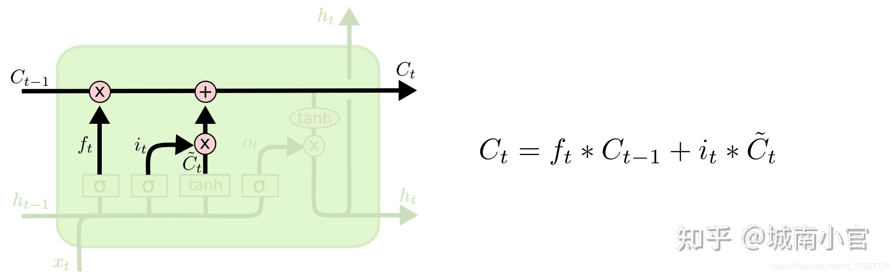
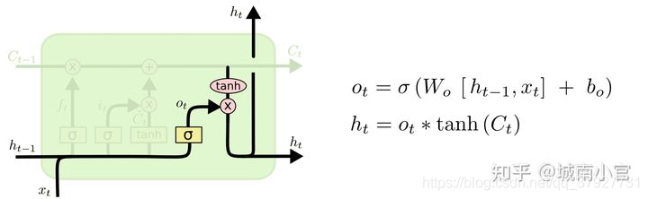

### 感知器 (Perceptron) & MLP-BP神经网络 （全连接)

阅读参考文献：

一个非常有趣的讲解 （**感知器是一种单层神经网络，而多层感知器则称为神经网络。**）： https://towardsdatascience.com/what-the-hell-is-perceptron-626217814f53  

#### 感知器

感知器是神经网络的 Fundamentals

在1977年由Frank Roseblatt 所发明的感知器是最简单的ANN架构之一（**线性函数加上硬阈值**，**这里阈值不一定是0**），受在一开始的生物神经元模型启发（`XOR`**问题逻辑问题**），称之为阈值逻辑单元（TLU，threshold logistic unit)  或线性阈	值单元（LTU,linear threshold unit)，其是一个**使用阶跃函数的神经元**来计算，可被用于线性可分二分类任务，也可设置多个感知器输出实现多输出分类以输出n个二进制结果（缺点是各种类别关系无法学习），一般来说还会添加一个偏置特征1来增加模型灵活性。


> 在感知器中引入一个偏置特征神经元1的目的是为了增加模型的灵活性和表达能力。这个偏置特征对应于一个固定且始终为1的输入，**其对应的权重称为偏置项（bias）。通过调整偏置项的权重，我们可以控制 TLU 的决策边界在特征空间中平移或倾斜**。（正常来说的话，这个偏置项都是在每个神经元当中所存在，而不是作为单独一个输入存在，能更灵活）
>
> > 在感知器中，将偏置特征固定为1的选择是为了方便计算和表示。
> >
> > 当我们引入一个偏置特征时，可以将其视为与其他输入特征一样的维度，并赋予它一个固定的值1。这样做有以下几个好处：
> >
> > 1. 方便计算：将偏置项乘以1相当于**直接使用权重来表示该偏置项**。在进行加权求和并应用阈值函数时，不需要额外操作或考虑。
> > 2. 参数统一性：通过将偏置项作为一个**独立的权重**进行处理，使得所有输入特征（包括原始输入和偏置）具有**相同的形式和统一性**。
> > 3. 简洁明了：固定为1的偏置特征能够**简化模型参数表示**，并使其更易理解和解释。
> >
> > 请注意，在实际应用中，对于某些任务
> > 可能需要调整默认值1以适应数据分布或优化模型性能。但基本原则仍然是保持一个常数值作为额外输入特征，并且通常会根据具体情况对其进行学习或调整。
>
> 具体来说，引入偏置特征1有以下几个原因： 
>
> 1. **平移决策边界**：通过调整偏置项的权重，可以使得决策边界沿着不同方向平移。如果没有偏置项，则决策边界将必须过原点(0, 0)。
>
> 2. 控制输出截距：当所有**其他输入都为零时，只有存在偏置项才能使感知器产生非零输出**。
>
> 3. 增强模型表达能力：引入一个额外维度后，在某些情况下会更容易找到**合适分割样本空间线性超平面位置**。
>
>    总之，在感知器中引入偏置特征1可以使模型更加灵活，能够适应不同的决策边界位置，并增加了模型对输入数据的表达能力。

其中，Siegrid Lowel非常著名的一句话“一同激活的神经元联系在一起”（Hebb的思想，一个生物元经常触发另外一个神经元，二者关系增强），故此Rosenblatt基于该规则提出一种**感知器训练算法**，其加强了有助于减少错误的连接，如果预测错了，比如预测目标是1，预测到0，就会增强对应神经元权重和偏置，如果预测目标是0，预测到1，就会减小。（根据阶跃函数性质值越大为1，值小为0）

以下是感知器训练算法的步骤（只有一层神经网络）：

1. 初始化参数：初始化权重向量 w 和偏置 b 为零或者随机小数。（一般来说感知器个数不多情况下，个数多则可以使用如神经网络的初始化如He初始化等）
2. 对每个训练样本进行迭代：
   - 计算预测输出 **y_hat = sign(w * x + b)**，其中 w 是权重向量，x 是输入特征向量，b 是偏置项，并且 sign() 函数表示取符号（正负，二分类为例）。
   - 更新权重和偏置：
      - 如果 **y_hat 等于实际标签 y，则无需更新参数**。
      - 如果 y_hat 不等于实际标签 y，则根据下面的规则更新参数：
         - 权重更新规则：w = w + η * (y - y_hat) * x，其中 η 是学习率（控制每次更新的步长）。
         - 偏置更新规则：b = b + η * (y - y_hat)。(偏移)

这个过程会不断迭代直到所有样本被正确分类或达到预定的停止条件（如达到最大迭代次数）。从以下我们就可以看到线性可分的感知机训练过程和线性不可分的感知机训练过程，在线性不可分的情况下，泛化能力较差。


#####  鸢尾花多分类案例

Sci-learn:https://scikit-learn.org/stable/auto_examples/datasets/plot_iris_dataset.html

Wikipedia:https://en.wikipedia.org/wiki/Iris_flower_data_set


我们从以上的可视化就可以知道，**用Perceptorn分类必然效果不好，因为其线性不可分**。

**不使用库**实现感知器**一对多策略多分类**鸢尾花数据集任务的代码：

```python
import numpy as np
from sklearn.datasets import load_iris
from sklearn.model_selection import train_test_split
from sklearn.metrics import accuracy_score


class Perceptron:
    """设计架构
    1. 初始化基本超参数
    2. 根据算法模型抽象化权重训练流程
    3. 训练中细分单个样本训练和预测中细分单个样本预测以实现多样本训练和预测"""
    def __init__(self, learning_rate=0.1, num_epochs=20):
        self.learning_rate = learning_rate
        self.num_epochs = num_epochs

    def train(self, X, y):
        # 添加偏置项到输入数据中
        X = np.insert(X, 0, 1, axis=1)

        # 初始化权重为随机值
        np.random.seed(42)
        self.weights = []

        # 训练模型（每个类别都有自己独立的感知器）
        for class_label in set(y): # 集合去重
            binary_labels = np.where(y == class_label, 1, -1) # True is 1 or False is  -1
#             print(binary_labels)
            weights_class = self.train_single_perceptron(X, binary_labels)
            self.weights.append(weights_class)

    def train_single_perceptron(self, X, y):
        weights = np.random.rand(X.shape[1]) # 随机初始化后训练（每个样本的特征数）
        for _ in range(self.num_epochs): #轮次
            for i in range(len(X)):
                prediction = self.predict_single_sample(X[i], weights) # 数据和权重求解
                error = y[i]-prediction
                # 更新权重
                update = self.learning_rate*error*X[i]
                weights += update
        return weights

    def predict_single_sample(self, x, weights):
        """receive x and weights return step function"""
        activation_value = np.dot(x, weights)
        return 1 if activation_value >= 0 else -1 # step function (corressponds to the previous binary_labels)

    def predict(self, X_test):
        X_test = np.insert(X_test, 0, 1, axis=1) # 同样需要插入偏置神经元1
        predictions = []
        for i in range(len(X_test)):
            class_predictions = []
            for perceptron_weights in self.weights:
                class_predictions.append(self.predict_single_sample(X_test[i], perceptron_weights))
            predicted_class = np.argmax(class_predictions) # 如果一样大返回最先的下标
#             print(class_predictions) 
#             print(predicted_class)
            predictions.append(predicted_class)
        return predictions


# 加载鸢尾花数据集（数据顺序排列，一定要打乱，泛化能力）
data = load_iris()
X_train, X_test, y_train, y_test = train_test_split(data.data, data.target, test_size=0.2, random_state=42) # 
# X_train, X_test, y_train, y_test = data.data[:120,:],data.data[120:,:],data.target[:120],data.target[120:] # , random_state=42
# 创建感知器对象并训练模型
perceptron = Perceptron()
perceptron.train(X_train, y_train)

# 使用测试数据集进行预测
predictions = perceptron.predict(X_test)
print(np.array(predictions))
print(y_test)
# print(type(y_test))

accuary = sum(predictions == y_test)/len(y_test) 
accuary = accuracy_score(y_test,predictions)
print(accuary)
```

输出

```
[1 0 1 0 1 0 0 2 1 1 2 0 0 0 0 0 2 1 1 2 0 2 0 2 2 2 1 2 0 0]
[1 0 2 1 1 0 1 2 1 1 2 0 0 0 0 1 2 1 1 2 0 2 0 2 2 2 2 2 0 0]
0.8333333333333334
```

**使用库**实现感知器分类鸢尾花数据集任务的代码：

```python
from sklearn.linear_model import Perceptron

# 加载鸢尾花数据集
data = load_iris()
X_train, X_test, y_train, y_test = train_test_split(
    data.data, data.target, test_size=0.2, random_state=42) # 随机数一样的话，随机结果是一样的
# data.data[:120,:],data.data[120:,:],data.target[:120],data.target[120:] #

# 创建并训练感知器模型
perceptron = Perceptron(eta0=0.1, max_iter=100)
perceptron.fit(X_train, y_train)

# 使用测试数据集进行预测
predictions = perceptron.predict(X_test)
print(predictions)
print(y_test)

accuary = sum(predictions == y_test)/len(y_test)
print(accuary)
```

输出：

```
[1 0 2 0 1 0 0 2 1 0 2 0 0 0 0 0 2 0 0 2 0 2 0 2 2 2 2 2 0 0]
[1 0 2 1 1 0 1 2 1 1 2 0 0 0 0 1 2 1 1 2 0 2 0 2 2 2 2 2 0 0]
0.8
```

>  `sklearn.linear_model.Perceptron`的参数：
>
>  - `penalty`: 惩罚项（默认值：None）。可以选择"l1"或"l2"来应用L1或L2正则化，也可以选择None不应用任何惩罚项。
>
>  - `alpha`: 正则化强度（默认值：0.0001）。较大的alpha表示更强的正则化。
>
>  - `fit_intercept`: 是否拟合截距（默认值：True）。如果设置为False，则模型将不会拟合截距。
>
>  - `max_iter`: 最大迭代次数（默认值：1000）。指定在达到收敛之前要执行的最大迭代次数。
>
>  - `tol`: 收敛容忍度（默认值：1e-3）。指定停止训练时目标函数改善小于该阈值时的容忍程度。
>
>  - `shuffle`: 是否在每个周期重新打乱数据顺序（默认值：True）。
>
>  - `eta0`: 初始学习率（默认值：1.0）。控制权重更新速度的学习率。较低的初始学习率可能有助于稳定模型收敛过程，但训练时间可能变长。
>
>  - `random_state`: 随机种子。提供一个整数以保证结果可重复性，或者设置为None以使用随机状态。
>
>  - `verbose`: 是否打印详细输出（默认值：0）。设置为1时，会定期打印出损失函数的值。
>

在这两个例子中，我们都使用了鸢尾花数据集，并将其分为训练和测试数据。然后，我们创建了一个感知器对象（自定义或Scikit-Learn提供的），并使用`train()`方法（自定义）或`fit()`方法（Scikit-Learn）来训练模型。最后，在测试数据上使用`predict()`方法来生成预测结果。（其中我们还可以设置一些超参数达到优化的目的）

>  扩展：
>
>  `MLPClassifier`和Keras中的`Dense`层都用于实现多层感知器（Multi-Layer Perceptron）模型。
>
>  在Scikit-Learn库中，`MLPClassifier`是一个基于神经网络的分类器，它使用反向传播算法进行训练，并可以处理多类别分类问题。你可以通过指定不同的参数来配置隐藏层、激活函数、优化算法等。
>
>  而在Keras库中，`Dense`层也被用作构建神经网络模型的一部分。它定义了全连接层（fully connected layer），其中每个输入节点与输出节点之间都有权重连接。你可以通过设置不同的参数来调整该层的大小、激活函数等。
>
>  虽然两者具有相似的功能，但由于框架和接口不同，它们在代码编写上可能会有所差异。因此，在使用时需要根据所选框架来适当调整代码。
>
>  总体上说，**“MLPClassifier”和Keras中“Dense”层都是为了实现多层感知器模型而设计的工具，在不同框架下提供了类似功能但语法略有差异。**

##### 应用场景

相比其他机器学习算法，感知器具有以下优势：

1. 简单而高效：感知器算法**非常简单且易于实现，计算速度快**。
2. 对噪声数据鲁棒：由于**其使用了阶跃函数作为激活函数，在处理带有噪声数据时表现较好**。
3. 支持在线学习：感知器是一种在线学习算法，可以逐步更新权重和阈值，并在每次迭代中对新样本进行训练。

然而，感知器也存在一些局限性：

1. **仅适用于线性可分问题**：由于其基于线性模型，在**处理非线性可分问题时无法取得良好的结果**。
2. **只能进行二分类**：感知器只能用于二分类任务，并**不能直接扩展**到多类别分类问题上。
3. **对输入特征缩放敏感**：感知器对输入特征的缩放比较敏感，如果**特征之间的尺度差异较大**（因为结果是根据值的大小决定的，所以在使用前需要数据特征归一化或者标准化），可能会影响算法的性能。

在实际应用中，当面对非线性可分问题时，可以考虑使用其他更复杂的模型，如支持向量机、神经网络等。这些模型具有更强大的表示能力，并且能够处理更为复杂和抽象的关系。然而，在某些简单问题上，感知器仍然是一个有效且高效的选择。

总结起来就是，感知器适用于解决线性可分二分类问题，并且**具有简单、高效和鲁棒等优点**。但它无法处理非线性可分问题，并且只能进行二分类任务。对于不同类型或更复杂的问题，可以考虑使用其他更适合的方法。

#### MLP全连接神经网络

`BP神经网络`，指的是用了**“BP算法”进行训练的“多层感知器模型”（MLP)。**并为了TLU感知机算法正常工 作，对MLP的架构进行了修改，即将阶跃函数替换成其他激活函数，如`tanh`，`Relu`。这里之所以用反向传播是因为多层的感知机无法再用感知机学习规则来训练. 

##### 原理概述

`layers.Dense`是`Keras`中的一种常用层类型，它实现了全连接层（Fully Connected Layer），也叫稠密层（Dense Layer）或者仿射层（Affine Layer）。该层的作用是将前一层的所有节点都连接到输出层的每个节点上，因此它可以将前一层的输出转化为特征向量。

`layers.Dense`的实现原理是利用**矩阵乘法，将输入数据（一般是一个向量）与权重矩阵相乘，然后加上偏置项，最后通过激活函数得到输出结果**。其数学表达式如下：

$y = f(Wx + b)$

其中，$x$是输入向量，$W$是权重矩阵，$b$是偏置项，$f$是激活函数，$y$是输出向量。	

##### 输入与输出

神经元的输入并不一定需要经过Flatten层。Flatten层的作用是将输入数据展平为一维向量，通常在连接全连接(Dense)层之前使用，**以便适应全连接层的输入要求**。

对于一些**具有固定尺寸的输入数据，例如图像数据，可以直接作为多维张量传递给Dense层**，而无需使用Flatten层。例如，对于28x28像素的灰度图像数据，可以将其表示为（28，28，1）的三维张量，其中1表示通道数（灰度图像只有一个通道），然后直接连接到Dense层。

然而，对于一些**不具有固定尺寸的输入数据**，如不定长的序列数据（例如文本或时间序列数据），通常需要使用Flatten层将其转换为固定长度的向量，然后再传递给Dense层进行处理。

因此，是否需要使用Flatten层取决于你的输入数据的形状和你希望构建的网络结构。如果输入数据已经是适合Dense层的形状，就不需要使用Flatten层。

##### Timedistributed(Dense)

Timedistributed(Dense) 是一种在神经网络中常用的层级扩展技术，它用于处理时间序列数据或具有时间维度的序列数据。在这个技术中，**Dense（全连接）层被应用到每个时间步上，以实现对整个序列的建模**。 其实该方法相比常规的全连接Dense层是少了很多的参数，因为dense对每一刻数据有一个参数，层输出后会丢失整体的时间序列特征，而timedistributed 则是不对时间序列用特征，对每一刻的时间步的特征进行参数拟合，而该参数对每一个时间步都是共享的，假如说我们每一个时间步只有一个特征，那该层只是对数据进行放大或变小变换，如果每一个时间步有两个特征，则只是不同特征的变换尺度不同，每一个时间步的特征参数是一致的，就可以很好保留了**时间序列**特征。

**原理和推导过程：**

在处理时间序列数据时，传统的Dense层只能对整个序列进行一次性的操作，无法捕捉到序列中每个时间步之间的时序关系。为了解决这个问题，引入了Timedistributed(Dense)层。

假设我们有一个输入张量X，形状为(batch_size, time_steps, input_dim)，其中batch_size表示批量大小，time_steps表示时间步数，input_dim表示输入维度。而Timedistributed(Dense)层的输出为(batch_size, time_steps, units)，其中units表示输出维度。

具体推导过程如下：

1. 假设输入张量X经过Timedistributed(Dense)层后的输出为Y。
2. 对于每个时间步t，输入张量X的第t个时间步的片段为X[:, t, :]，形状为(batch_size, input_dim)。
3. 对于每个时间步t，Timedistributed(Dense)层将输入片段X[:, t, :]与共享的权重W和偏置b结合，进行全连接操作，得到输出片段Y[:, t, :]，形状为(batch_size, units)。
4. 重复上述步骤，对每个时间步t都执行相同的全连接操作，从而得到整个序列的输出张量Y。

通过Timedistributed(Dense)层，我们可以**在每个时间步上应用相同的权重和偏置**，使得模型能够对时间序列数据进行逐步建模，更好地捕捉到时序关系。 

**案例模板代码：**

以下是一个基于Keras库的Python代码示例，展示了如何使用Timedistributed(Dense)层构建一个简单的循环神经网络（RNN）模型，并将其应用于时间序列数据的分类任务。请注意，这只是一个模板，您可以根据自己的需求进行调整和扩展。

```python
from keras.models import Sequential
from keras.layers import Timedistributed, Dense, LSTM

# 构建模型
model = Sequential()
model.add(LSTM(64, return_sequences=True, input_shape=(time_steps, input_dim)))
model.add(Timedistributed(Dense(units=32, activation='relu')))
model.add(Dense(units=num_classes, activation='softmax'))

# 编译模型
model.compile(optimizer='adam', loss='categorical_crossentropy', metrics=['accuracy'])

# 训练模型
model.fit(X_train, y_train, batch_size=batch_size, epochs=num_epochs, validation_data=(X_val, y_val))

# 使用模型进行预测
y_pred = model.predict(X_test)
```

在上述代码中，我们首先构建了一个Sequential模型。然后，将LSTM层添加到模型中，设置return_sequences=True以保留每个时间步的输出。接下来，我们添加了Timedistributed(Dense)层，其中units参数表示输出维度。最后，我们添加了一个全连接层(Dense)进行最终分类，并编译模型以进行训练和评估。

### 卷积神经网络

CNN非常强大！！ 跳出框框思考！使用一维CNN对表格数据进行特征提取。或者使用DeepInsight（一种将非图像数据转换为图像以用于卷积神经网络架构的方法），将表格数据转换为图像，利用 CNN 的优势。

推荐视频：https://www.youtube.com/watch?v=KuXjwB4LzSA&list=RDCMUCYO_jab_esuFRV4b17AJtAw

确定卷积层的最佳数量以及它们对其他参数的影响是一个挑战性的任务，通常需要进行实验和调整来找到最佳的模型架构。

一般而言，卷积层数量的选择可以基于以下因素进行评估：

1. **数据集大小**和复杂程度：更大更复杂的数据集可能需要更深的卷积神经网络，以便提取更丰富的特征。较小的数据集则可能需要较浅的卷积神经网络，以避免过拟合。

2. 训练时长和计算资源：更深的卷积神经网络需要更长的训练时间和更多的计算资源。在限制时间和计算资源的情况下，可能需要权衡深度和精度。

3. 预训练模型的可用性：使用预训练模型可以减少训练时间并提高模型的精度。如果可用的预训练模型包含了与问题相关的卷积层，则可以考虑从这些层开始，然后通过微调来逐步优化模型。

除了卷积层的数量外，其他参数也会影响模型的性能。例如，卷积层的大小、步幅、填充等参数会影响特征图的大小和数量。池化层的类型、大小和步幅也会影响特征图的大小和数量，从而影响后续层的表现。因此，在设计卷积神经网络时，需要综合考虑这些参数，并进行实验和调整以找到最佳的模型结构。

> Q: CNN 1D与1至5个卷积层模型测试性能获得的准确性分别为88.36%、89.48%、88.86%、87.96和86.89%。五个1D CNN层是最大的界限，因为这个层上的函数图的最小尺寸已经超过了。
>
> A: 这个问题涉及到卷积神经网络中的**感受野（receptive field）概念**。
>
> 在卷积神经网络中，每一层的卷积核实际上是对上一层特征图的局部区域进行处理，而**该局部区域的大小就是该层的感受野大小**。这意味着，随着层数的增加，感受野也会逐渐扩大。
>
> 在1D CNN中，每个卷积核只能查看其左右固定数目的元素，这个固定数目就是感受野。因此，通过堆叠多个1D CNN层，可以使得后面的层拥有更大的感受野，从而提取更全局的特征。
>
> 但是，当1D CNN层数过多时，每一层的输出的长度也会逐步缩小。这是因为，在1D CNN中，卷积操作将输入向量的每个元素映射到输出向量的一个元素，因此每次卷积操作都会减少向量长度。随着层数的增加，输出向量的长度也会逐渐缩小，最终可能会导致信息丢失，从而影响模型性能。
>
> 因此，作者在该问题中使用了1至5个1D CNN层进行测试，并发现5层是极限。作者指出，当使用5个1D CNN层时，**最后一层的输出长度已经非常短，无法再添加更多的卷积层**。因此，**作者不能通过增加层数来进一步提高模型性能，而必须尝试其他方法，如调整卷积核大小、池化方式等**，以达到更好的性能。或者使用transformer模型思想，一层就可以看到整个序列的感受野。

> 卷积（Convolution）这个名词最初来源于数学领域，指的是两个函数之间的一种数学运算，也称为函数的乘积积分。在深度学习中，卷积操作是通过将一个输入信号与一个卷积核进行卷积运算来提取特征。在这个过程中，**卷积核会在输入信号上滑动，并在每个位置进行一次乘积累加的计算**，最终得到一个输出特征图。因此，这个操作被称为卷积。
>
> 在深入了解卷积神经网络（Convolutional Neural Network, CNN）的原理之前，让我们使用一个简单的生活例子来说明其工作原理。想象一下你正在观看一部电影，而电影是由连续的图像帧组成的。你想要识别电影中的主要角色。这时，你的大脑就会使用类似于卷积神经网络的机制进行处理。首先，你的大脑会将图像帧传递给视觉皮层（Visual Cortex），这相当于CNN中的输入层。在视觉皮层中，一系列的神经元会对图像进行处理，每个神经元对应一个特定的区域（感受野）。然后，每个感受野会执行一个局部感知操作，类似于CNN中的卷积操作。这个操作类似于你的眼睛聚焦在图像的一个小部分，并提取特定的特征。例如，某个感受野可能会注意到脸部特征，而另一个感受野可能会注意到物体的纹理。接下来，提取的特征会通过神经元之间的连接进行传递，这类似于CNN中的池化操作。在池化过程中，一组相邻的感受野的特征被合并为一个单一的特征。这样做可以减少数据的维度，并提取更加重要的特征。这些特征将继续传递到更高级别的层次，类似于CNN中的隐藏层。在这些层次中，神经元将学习更加抽象和高级的特征表示，例如面部表情、物体形状等。最终，通过一系列的卷积、池化和隐藏层的操作，网络可以学习到适合于图像识别的特征。这些特征将传递到输出层，用于识别电影中的主要角色。
>
> 总的来说你的大脑类似于一个卷积神经网络。它通过局部感知、特征提取和特征学习的方式，从连续的图像帧中识别出主要角色。卷积神经网络的原理与此类似，通过卷积、池化和隐藏层的操作，从输入图像中提取有用的特征，并用于各种图像处理任务，如图像分类、目标检测等。尽管实际的卷积神经网络可能更复杂，包含更多的层和参数，但它们都遵循类似的原理

注意点：一定要知道一维卷积、二维卷积、三维卷积不同的是方向上的卷积，并且要知道一维卷积如何处理二维/三维数据，二维卷积如何处理三维数据。

####Conv1D

我们考虑一个简单的情况，就像处理时间序列数据一样。想象你正在观察某个城市在一周内的每日气温变化。你想要通过一维卷积来平滑这些数据，以便更好地理解气温趋势（在该例子其实就是三个连续数值不同加权求和得到一个代表性的数值）。

假设你有一周的气温数据，表示为一维数组：

```python
temperature_data = [20, 22, 24, 25, 28, 27, 26]
```

现在，让我们使用一个长度为3的一维卷积核（或过滤器）来对这些数据进行卷积操作。假设卷积核为：

```python
kernel = [0.5, 0.8, 0.5]
```

进行一维卷积时，卷积核会滑动到数据的每个位置，然后在每个位置上执行元素乘法并相加。例如，对于位置1，卷积操作为：

```python
result[1] = 20 * 0.5 + 22 * 0.8 + 24 * 0.5 = 37.0
```

同样地，对于位置2，卷积操作为：

```python
result[2] = 22 * 0.5 + 24 * 0.8 + 25 * 0.5 = 47.0
```

继续这个过程，直到对整个数据进行卷积操作，得到平滑后的结果：

```python
smoothed_data = [37.0, 47.0, 56.5, 59.0, 63.0, 61.5, 51.5]
```

在这个例子中，我们使用一维卷积核来平滑气温数据，从而减少数据中的噪声，更好地观察气温的整体变化趋势。

##### 原理概述

一维卷积是指**在单个方向（通常是时间轴）上进行的卷积操作**。通常用于**序列模型、自然语言处理**领域该层创建卷积的卷积核输入层在单个空间（或时间）维度上以产生输出张量。如果“use_bias”为True，则**创建一个偏置向量并将其添加到输出**中。最后如果“激活”不是“无”，它也应用于输出。当使用该层作为模型中的第一层时，提供“input_shape”参数（整数元组或“无”，例如。`对于128维向量的10个向量的序列，或对于128维向量的可变长度序列为“（None，128）”。

一维卷积操作的原理与二维卷积类似，都是通过**滑动一个固定大小的卷积核（即滤波器）在输入上进行卷积操作**。在一维卷积中，卷积核是一个长度为 `k` 的一维张量，用于对输入的每个时间步进行滤波操作。卷积核的大小会影响到卷积后的输出形状，具体可以使用下面的公式计算：

$\text{output-length} = \lfloor \frac{\text{input-length} - \text{kernel-size} + 2\text{padding}}{\text{stride}} + 1 \rfloor$

其中，`input_length` 是输入张量的时间步数，`kernel_size` 是卷积核的大小，`padding` 是补零操作的大小，`stride` 是卷积核在输入上滑动的步幅。


`layers.Conv1D` 层可以设置多个参数，例如卷积核的**大小、步幅、填充方式、激活函数**等等。通过调整这些参数，可以有效地**提取输入数据中的时序特征**，用于后续的分类、回归等任务。

假设输入的数据为 $x$，卷积核为 $w$，偏置为 $b$，步长为 $s$，padding的大小为 $p$。

**对于一维卷积，我们可以将 $x$ 和 $w$ 的维度都表示为长度**，即：

$x=[x_1,x_2,x_3,…,x_n]$

$w=[w_1,w_2,w_3,…,w_m]$

则在不考虑padding的情况下，输出的每个元素 $y_i$ 可以表示为：


其中，$i$ 表示输出的位置，$j$ 表示卷积核的位置，$s$ 表示步长。而考虑padding的情况下，可以将 $x$ 在两端分别加上 $p$ 个 0，然后代入上述公式即可。 

需要注意的是，一般情况下我们会在卷积层后面**添加一个激活函数来引入非线性**。在这个公式中，我们没有考虑激活函数的影响。


卷积过程如上图所示，输入向量的大小为20，卷积核大小为5，步长（每一步移动距离）为1，不考虑填充，那么输出向量的大小为(20 - 5) / 1 + 1 = 16；如果考虑填充，那么输出向量大小为20 / 1 = 20。

更一般的，假设输入向量大小为F，卷积核大小为K， 步长为S，填充方式为“VALID”（也就是不考虑填充），那么输出向量大小**N= (F - K / S) + 1**；如果填充方式为“SAME”（不考虑步长，使输入矩阵和输出矩阵大小一样），则输出向量大小**N = F / S**

##### 参数详解

```python
tf.keras.layers.Conv1D(filters, 
					   kernel_size, 
					   strides=1, 
					   padding='valid',
					   data_format='channels_last', 
					   dilation_rate=1, 
					   groups=1,
					   activation=None, 
					   use_bias=True, 
					   kernel_initializer='glorot_uniform',
					   bias_initializer='zeros',
					   kernel_regularizer=None,
					   bias_regularizer=None, 
					   activity_regularizer=None, 
					   kernel_constraint=None,
					   bias_constraint=None, 
					   **kwargs
)
```

- `filters`: 整数，输出空间的维度（即卷积核的个数）。
- `kernel_size`: 整数或由一个整数构成的元组/列表，卷积核的空间或时间维度大小。
- `strides`: 整数或由一个整数构成的元组/列表，卷积核的步长。默认为 1。
- `padding`: 字符串，补齐策略（'valid' 或 'same'）。默认为 'valid'。
- `activation`: 字符串或可调用对象，激活函数。如果不指定，将不应用任何激活函数。
- `use_bias`: 布尔值，是否使用偏置。
- `kernel_initializer`: 卷积核的初始化器。如果不指定，将使用默认的 `Glorot `均匀分布初始化。
- `bias_initializer`: 偏置的初始化器。如果不指定，将使用默认的零初始化。
- `kernel_regularizer`: 卷积核的正则化器，可以使用 L1、L2 等正则化方式。
- `bias_regularizer`: 偏置的正则化器，可以使用 L1、L2 等正则化方式。
- `activity_regularizer`: 输出的正则化器，可以使用 L1、L2 等正则化方式。
- `kernel_constraint`: 卷积核的约束，可以使用非负值约束、最大范数约束等。
- `bias_constraint`: 偏置的约束，可以使用非负值约束、最大范数约束等。

1D卷积层（例如时间卷积）。通常用于**序列模型、自然语言处理**领域该层创建卷积的卷积核输入层在单个空间（或时间）维度上以产生输出张量。如果“use_bias”为True，则**创建一个偏置向量并将其添加到输出**中。最后如果“激活”不是“无”，它也应用于输出。当使用该层作为模型中的第一层时，提供“input_shape”参数（整数元组或“无”，例如。`对于128维向量的10个向量的序列，或对于128维向量的可变长度序列为“（None，128）”。

https://blog.csdn.net/weixin_49346755/article/details/124267879

```python
# 一维卷积层，输出形状为(None, 16, 8)，定义input_shape作为第一层
tf.keras.layers.Conv1D(8, 5, activation="relu", input_shape=(20, 1))
"""
 filters: 过滤器：整数，输出空间的维度（即卷积中输出滤波器的数量）
 kernel_size: 单个整数的整数或元组/列表，指定1D卷积窗口的长度。
 activation: 要使用的激活功能。激活函数
 strides: 步长，默认为1.
 padding: 表示填充方式，默认为VALID，也就是不填充。
 kernel_initializer: “内核”权重矩阵的初始化器(参见“keras.initizers”）。
 use_bias: 表示是否使用偏置矩阵，默认为True
 bias_initializer: 表示使用的偏置矩阵。
 
 Input shape:
    3D tensor with shape: `(batch_size, steps, input_dim)`

"""
# regularizers.l2(0.01) L2正则化(L2正则化因子)。
Con1 = layers.Conv1D(64, 3, activation='relu', kernel_regularizer=regularizers.l2(0.01))(BN)
```

##### 输入与输出

需要注意的是，**该层的输入应该是一个三维张量，形状为 `(batch_size, steps, input_dim)`**，其中 `steps` 表示时间步数，`input_dim` 表示每个时间步的输入特征维度。该层的输出是一个三维张量，形状为 `(batch_size, new_steps, filters)`，其中 `new_steps` 是经过卷积和补齐后的时间步数，与原来的时间步数有关。

卷积层的输出也是一个张量，其**形状取决于卷积层的参数设置**。在一维卷积层中，如果使用padding="valid"，那么输出的形状为(batch_size, output_length, filters)，其中output_length表示输出序列的长度，filters表示卷积核的个数（**即输出序列每个位置上的特征维度数量**）。如果使用padding="same"，那么输出的形状为(batch_size, input_length, filters)，即与输入序列的长度保持一致。

需要注意的是，在卷积层中，**每个卷积核的参数对于输入是共享的**，即卷积核在输入张量的每个位置上进行卷积时使用的是相同的参数。这样可以大大减少模型的参数数量，同时也可以增强模型的泛化能力。

> 如果使用多个卷积核进行卷积操作，它们所提取的特征可能不同，因为它们所学习的卷积核参数不同。每个卷积核学习到的是不同的特征，通过**使用多个卷积核，模型可以同时学习到多种不同的特征**，从而提高模型的性能。

 ~~输入是二维~~

> ~~举例子如: 第一次卷积层后的维度是（None, 431,64) 输入到同样的卷积层（卷积核个数64个，长度3）输出维度也是（None, 429,64)~~

~~每个卷积核卷积时是在所有64列上进行的，因此每个卷积核的输出将是一个1维向量。**64 个卷积核的输出将组合成一个 64 一维向量，即使进行多次卷积，也不会导致输出的维度增加**。在卷积层中使用多个卷积核的原因是为了捕获输入数据中的不同特征。每个卷积核的输出是一个捕获到的特征映射，这些特征映射通过叠加的方式组成了一个64维向量。具体地说，**这个64维向量是将每个特征映射在时间轴上的输出值取平均得到的。这个过程可以看作是在对输入数据进行一种降维操作，将捕获到的不同特征映射组合成一个向量表示整个输入数据的特征**。~~

~~输入是三维~~


##### 多次卷积

在卷积层后再次添加卷积层是一种常见的神经网络架构，其主要目的是在学习更高层次的特征表示，例如在计算机视觉任务中，第一层卷积层可以学习到简单的边缘特征，而第二层卷积层可以学习到更加复杂的形状和纹理特征。因此，通过多层卷积层堆叠，可以逐渐学习到更加抽象和高级的特征表示。

##### 卷积核权重维度

如果你设置了六个长度为3的卷积核，那么每个卷积核的**权重矩阵**的形状将会是`(3, input_channels, 6)`，其中`input_channels`是输入数据的**特征维度**。这表示每个卷积核都是一维的，其大小为3，且有6个不同的卷积核。在进行卷积运算时，输入数据中的**每个时刻都会和6个不同的卷积核进行卷积操作**，得到6个卷积后的输出结果，这些结果将被连接成一个更高维的输出张量。

假设我们有一个输入数据的维度为（6， 4， 3），表示有6个时间步，4个特征和3个通道。我们想要应用一个大小为（3， 3）的卷积核。（卷积核的权重维度将是（3， 3， 3， 1））

#### Conv2D


就同我们在CNN章节开头所说看电影的生活例子，就是一个二维卷积的例子

一维卷积和二维卷积的区别在于卷积操作的维度不同。在一维卷积中，卷积核只会在一个方向上进行滑动操作，例如在处理时间序列数据时，卷积核只会在时间轴上进行滑动操作。而在二维卷积中，卷积核会在两个方向上进行滑动操作，例如在处理图像数据时，卷积核会在图像的高度和宽度上进行滑动操作。因此，一维卷积和二维卷积的计算方式略有不同，但**本质上都是将卷积核与输入数据进行点积运算，得到特征图作为下一层的输入。**


如上图所示，输入矩阵的大小为5×5，卷积核矩阵的大小为3×3，在x, y 方向移动步长为(1, 1)，采用了填充的方式（SAME）进行卷积（填充不是结果填充，是原本的填充。结果得到一个与输入矩阵大小一样的矩阵（5×5）。


卷积：蓝色的输入图片（4 x4）,深蓝色代表卷积核（3 x 3）,绿色为输出图像（2 x 2）

二维卷积的计算公式与一维卷积的计算公式类似，假设输入图像的大小为F×F，卷积核矩阵大小为K×K，步长为（S，S），如果填充方式为VALID，输出图像大小为N×N，则有**N = (F - K / S) + 1**；如果填充方式为SAME，则有**N = F / S**。

> 在神经网络中，**点积经常用于计算相似度、相似性分数或计算注意力权重等任务**。点积运算是指**两个向量中对应位置的元素相乘，并将所有结果相加的运算**。对于两个长度为n的向量a和b，它们的点积运算结果为：
>
> $a·b = a[0]*b[0] + a[1]*b[1] + ... + a[n-1]*b[n-1]$
>
> **两个向量的点积可以表示它们的相似度**，从而用于计算神经元的输出值或者用于计算损失函数。另外，在计算卷积神经网络中的卷积操作时，通常采用卷积核和输入数据的点积运算来得到卷积的结果。	
>
> > 点积本身并不能直接表示相似度，而是作为相似度度量的一种计算方式之一。**当两个向量的点积较大时，表示它们在相同的方向上有更高的相似度。而当点积较小或为负数时，表示它们在相反的方向上或无关的方向上存在较高的差异。** 通过点积，我们可以得到一种衡量向量之间关系的指标，但具体的解释和应用取决于具体的上下文和任务。

在二维卷积层中，输出的形状也取决于卷积层的参数设置，但是其基本形式为(batch_size, output_height, output_width, filters)，其中output_height和output_width表示输出特征图的高度和宽度，filters表示卷积核的个数（即输出特征图每个位置上的特征维度数量）。

```python
tf.keras.layers.Conv2D(
    filters,
    kernel_size,
    strides=(1, 1),
    padding='valid',
    data_format=None,
    dilation_rate=(1, 1),
    groups=1,
    activation=None,
    use_bias=True,
    kernel_initializer='glorot_uniform',
    bias_initializer='zeros',
    kernel_regularizer=None,
    bias_regularizer=None,
    activity_regularizer=None,
    kernel_constraint=None,
    bias_constraint=None,
    **kwargs
)
```

#### Conv3D

在三维卷积中有两种例子，其中之一假设你有一张**彩色图像，其中包含红、绿、蓝三个颜色通道。这样的彩色图像可以表示为一个三维数组，其中每个元素包含了图像在特定位置的颜色信息。**假设你想要对图像应用一个卷积核来进行边缘检测。边缘检测可以帮助我们找到图像中的边界或轮廓。这时，我们需要使用一个三维卷积核来处理彩色图像的每个颜色通道。考虑一个简单的三维卷积核，形状为 3x3x3，表示在3个颜色通道上的3x3的局部感知区域。卷积核会在图像的每个位置滑动，并执行元素乘法和相加操作，以获取特定位置的输出值。例如，对于图像中的某个位置，卷积操作会在每个颜色通道上执行元素乘法和相加，得到一个输出值。这个操作会在图像的所有位置重复进行，从而生成一个新的三维输出图像。这个例子中的三维卷积核用于边缘检测时，会对图像的每个颜色通道执行类似于边缘检测的操作。**它可以帮助我们在每个颜色通道上找到图像中的边缘或轮廓。**

还有一个例子是视频行为识别。假设你正在监控一间会议室，里面有多个人在进行不同的活动，例如站立、走动、举手等。你想要使用卷积神经网络来识别不同的行为。在这个场景中，视频可以看作是一个三维数据，它**由两个空间维度（图像的宽度和高度）和一个时间维度（视频的帧数）组成**。这样的视频可以表示为一个三维数组，其中每个元素代表一个像素值或颜色信息。为了对视频进行行为识别，我们需要使用三维卷积核来处理视频数据。这个卷积核在空间维度上滑动，同时在时间维度上遍历视频的帧，执行元素乘法和相加操作，以获取特定位置和时间的输出值。例如，考虑一个形状为 3x3x3x3 的三维卷积核，其中前两个维度表示在一个3x3的局部感知区域内，每个颜色通道的像素值，最后一个维度表示卷积核在时间维度上遍历视频的3帧。在应用三维卷积时，卷积核会在视频的每个位置和每个时间点滑动，并对每个颜色通道执行元素乘法和相加操作，得到一个输出值。这样的操作会在整个视频上重复进行，生成一个新的三维输出，**表示不同时间点和空间位置的特征**。这个例子中的三维卷积核用于视频行为识别时，可以帮助我们捕捉不同行为在时间序列上的特征变化。例如，当某人举手时，可能在一段时间内会出现特定的**手臂移动模式（一种数据变化模式）**，而这个三维卷积可以帮助我们捕捉这种时间序列上的模式。

三维卷积层主要用于医学领域、视频处理领域（检测人物行为），用于三个维度的卷积。


三维卷积对数据集应用三维过滤器，过滤器向3个方向（x，y，z）移动，计算低层特征表示。输出形状是一个三维体积空间，如立方体或长方体。有助于视频、三维医学图像等的目标物检测。

三维卷积的输入形状为五维张量(batch_size, frames, height, width, channels)，batch_size为批处理数据的大小，frams可以理解为视频中的帧数，其中每一帧为一幅图像，height为图像的高度，width为图像的宽度，channels为图像通道数。输出形状也是一个五维张量。

#### 反卷积

> 假设你有一张古老的照片，由于年代久远和物理损坏，照片上出现了许多破损、划痕和噪点。你希望使用反卷积来修复照片，恢复其原始的清晰度和细节。在这个场景中，反卷积可以用于学习照片修复过程，将破损和损坏的像素映射到原始清晰的像素。这样的修复过程可以通过训练反卷积网络来实现。反卷积网络使用反卷积层来进行图像修复。**输入是破损的图像，输出是修复后的图像**。例如，考虑一个简单的反卷积层，输入是一张破损的图像（例如，256x256像素），输出是一张修复后的图像（例如，256x256像素）。在反卷积过程中，网络会使用反卷积核来将破损和损坏的像素恢复到原始图像的空间维度上。通过**训练网络学习图像的修复过程**，它可以从破损的输入图像中恢复出丢失的细节和结构，使修复后的图像更加清晰和自然。
>
> 实际应用中，反卷积在图像修复和复原中起着重要作用。它可以帮助修复老旧照片、受损图像或受到噪声污染的图像，恢复它们的原始外观和细节。这个生活例子展示了反卷积在图像修复中的应用，通过学习将破损的像素映射到原始清晰的像素，实现图像的修复和恢复。

反卷积（deconvolution）也称为转置卷积（transpose convolution），是一种常用于图像处理和计算机视觉领域的操作。它可以将一个低维度的特征映射（如经过卷积和池化后的结果）还原成更高维度的特征映射，通常用于图像分割、目标检测等任务中。

它是一种特殊的卷积，先padding来扩大图像尺寸，紧接着跟正向卷积一样，旋转卷积核180度，再进行卷积计算。看上去就像，已知正向卷积的输出图像，卷积核，得到正向卷积中的原始图像（并非真的得到原始图像，**像素点是不一样的，但是尺寸是一致的**）。它看上去像是正向卷积的逆运算，但其实并不是。因为反卷积只能还原原始图像的尺寸，但是并不能真的恢复原始图像内容，即每个元素值其实是不一样的。

> 由于卷积核一般比原始图像小，所以卷积之后的图像尺寸往往会变小。有时候我们需要将卷积后的图像还原成原始图像的尺寸，即实现图像从小分辨率到大分辨率的映射，这种操作就叫做上采样（Upsampling）。而反卷积正是一种上采样方法。

(参考自： https://www.cnblogs.com/hansjorn/p/14767592.html)

反卷积的Striding跟卷积有点不一样，它在输入的每个元素之间插入 $s- 1$个值为0的元素


我们根据以下例子来了解原理：


反卷积：蓝色是输入（3 x 3）, 灰色是卷积核（3 x 3）, 绿色是输出（5 x 5），padding=1，strides = 2


反卷积：蓝色是输入（5 x 5）, 灰色是卷积核（3 x 3）, 绿色是输出（5 x 5），padding=1，strides =1


反卷积，蓝色是输入（2 x 2）, 灰色是卷积核（3 x 3）, 绿色是输出（4 x 4），padding=2

应用场景：

1. 图像超分辨率：反卷积可以将低分辨率的图像还原为高分辨率，这在图像超分辨率任务中非常有用。
2. 图像去噪：反卷积可以去除图像中的噪声，从而改善图像质量。
3. 图像分割：反卷积可以将卷积网络的最后一层输出特征图还原成与输入图像尺寸相同的特征图，从而帮助进行图像分割。
4. 对抗生成网络（GAN）：反卷积可以用于生成器部分，将低维噪声转换为高维图像。
5. 图像生成：逆卷积操作可以通过学习合适的卷积核来生成新的图像，从而实现图像生成任务。

总的来说，反卷积在计算机视觉领域中有着广泛的应用场景。它是一种非常有效的图像处理技术，可以帮助我们提高计算机视觉任务的准确性和效率。

#### 空间可分离卷积

空间可分离卷积（Spatial Separable Convolution）算法是一种用于图像处理和计算机视觉任务的卷积操作优化技术。它的主要特点是将二维卷积操作拆分成两个一维卷积操作，从而显著降低计算复杂度。

空间可分离卷积的历史发展可以追溯到上世纪80年代。这个想法最初由Grossmann和Morlet于1984年提出，用于处理信号上的小波变换。后来，它被引入到图像处理和计算机视觉领域，成为一种常用的卷积操作优化方法。

空间可分离卷积的灵感源自于观察到，二维卷积操作可以分解为两个独立的一维卷积操作。具体来说，对于一个M×N的输入图像和一个K×K的卷积核，传统的二维卷积操作需要执行M×N×K×K次乘法运算。而空间可分离卷积算法将其分解为一个M×K的水平卷积操作和一个K×N的垂直卷积操作，分别执行M×K×K和K×N×K次乘法运算。这样，总的乘法运算次数减少为M×K×K + K×N×K，大大降低了计算复杂度。

除此之外，该算法可以对多通道序列很好学习到**时域和特征域**。

空间可分离卷积的主要特点和结构如下：
1. 分解性质：空间可分离卷积将二维卷积操作分解为两个独立的一维卷积操作。这种分解性质使得卷积操作的计算复杂度降低，同时也方便了算法的实现和优化。
2. 计算效率：由于分解后的一维卷积操作具有更低的计算复杂度，空间可分离卷积算法在图像处理和计算机视觉任务中能够显著加快计算速度，提高算法的实时性。
3. 空间相关性：空间可分离卷积算法充分利用了图像中的空间相关性。一维卷积操作分别在水平和垂直方向上进行，更好地捕捉了图像中的水平和垂直特征，提高了算法的表达能力。
4. 可扩展性：空间可分离卷积算法可以与其他卷积算法结合使用，如深度卷积神经网络（CNN）。它可以作为CNN中的一种基础卷积操作，用于提取图像特征。

关于学习资源，以下是一些相关的参考资料和论文：
1. Gonzalez, R. C., & Woods, R. E. (2008). Digital Image Processing (3rd ed.). Prentice Hall.
2. Szeliski, R. (2010). Computer Vision: Algorithms and Applications. Springer.
3. LeCun, Y., Bengio, Y., & Hinton, G. (2015). Deep learning. Nature, 521(7553), 436–444.
4. Grossmann, A., & Morlet, J. (1984). Decomposition of Hardy Functions into Square Integrable Wavelets of Constant Shape. SIAM Journal on Mathematical Analysis, 15(4), 723–736.
5. Mallat, S. (1989). A Theory for Multiresolution Signal Decomposition: The Wavelet Representation. IEEE Transactions on Pattern Analysis and Machine Intelligence, 11(7), 674–693.

### 循环神经网络

在卷积神经网络和MLP全连接神经网络中，数据点在神经层都是互相独立无联系的，直接输入与相应的参数进行变换，如果要**将数据点的序列或者时间序列进行输入，则需要将整个序列当作一个数据点进行输入**，而在循环神经网络中面对数据中不同的时间时刻或者序列position会有不同的状态，**在形式上也是一个序列整体输入，但不同的是在内部中参数对每个时刻是共享的，每个时刻的数据步依次进行输入，在新的序列中状态被重置**。 timedistribute(dense) 也是同样的思想。

下面是RNN、LSTM和GRU三者的优缺点的比较：

| 模型 | 优点                                                         | 缺点                                                         |
| ---- | ------------------------------------------------------------ | ------------------------------------------------------------ |
| RNN  | - 简单的结构和参数<br>- 可以处理序列数据的时间依赖关系<br>- 计算效率较高 | - 难以处理长期依赖关系<br>- 容易遇到梯度消失或梯度爆炸问题   |
| LSTM | - 能够捕捉和处理长期依赖关系<br>- 通过门控机制控制信息流动<br>- 网络结构相对简单 | - 参数较多，计算开销较大<br>- 可能会出现过拟合问题           |
| GRU  | - 相对于LSTM，参数更少，计算效率更高<br>- 通过门控机制控制信息流动<br>- 可以捕捉长期依赖关系 | - 可能会失去一些细粒度的时间信息<br>- 对于某些复杂的序列问题，性能可能不如LSTM |

这是对RNN、LSTM和GRU三者的一般性优缺点的总结。实际应用中，选择合适的模型取决于具体任务和数据集的特点。有时候，LSTM可能更适合捕捉长期依赖关系，而GRU则具有更高的计算效率。因此，建议在实际应用中根据具体情况选择适合的模型。


详细讲解RNN,LSTM,GRU  https://towardsdatascience.com/a-brief-introduction-to-recurrent-neural-networks-638f64a61ff4

#### Recurrent Neural Network (RNN)

递归神经网络是将信息存在了隐藏层往后传递，由于这个原因，在处理时序数据中是一个时间步一个时间步的输入，在一百个时间步的情况下，需要先算出前99个时间步才能算出第100个，所以并行能力较差，在计算机性能表示方面较差。同样还是这个原因，在序列比较长的话，长短期记忆较差。在并行上也就有人提出了使用CNN来代替RNN


循环神经网络（Recurrent Neural Network，RNN）是一种用于处理序列数据的神经网络算法。相比于传统的前馈神经网络，RNN引入了**循环连接**，使网络能够对序列中的**时间依赖关系**进行建模。

>  RNN 通过单元中的反馈循环实现记忆。这是 RNN 与传统神经网络的主要区别。与信息仅在层之间传递的前馈神经网络相比，反馈循环允许信息在层内传递。

RNN的核心思想是在网络的隐藏层之间引入循环连接，使得网络在处理每个时间步的输入时，不仅依赖当前时间步的输入，还依赖前一个时间步的隐藏状态。这种循环连接的设计使得网络具有记忆性，能够捕捉到序列数据中的长期依赖关系。

下面是RNN的算法步骤：


公式如下:


1. 初始化参数：
   - 定义输入序列的维度（例如，词向量的维度）和隐藏状态的维度。
   - 随机初始化权重矩阵，如输入到隐藏层的权重矩阵、隐藏层到隐藏层的权重矩阵和隐藏层到输出层的权重矩阵。
2. 前向传播：
   - 对于输入序列中的每个时间步，将输入向量和前一个时间步的隐藏状态向量输入到隐藏层中。
   - 根据当前时间步的输入和前一个时间步的隐藏状态，计算隐藏层的输出。
   - 使用隐藏层的输出计算当前时间步的预测结果（可以是分类问题的概率分布或回归问题的连续值）。
3. 更新隐藏状态：
   - 使用当前时间步的隐藏状态更新到下一个时间步的隐藏状态。通常使用tanh或ReLU等激活函数来处理隐藏状态。
4. 计算损失：
   - 根据预测结果和真实标签计算损失函数（如交叉熵损失或均方误差）。
5. 反向传播：
   - 计算损失函数对于权重矩阵的梯度。
   - 使用梯度下降或其他优化算法更新权重矩阵。
6. 重复步骤2-5直到所有时间步的输入都被处理完毕，或达到指定的训练迭代次数。


RNN算法的核心是通过循环连接实现对序列数据的建模和预测。它在自然语言处理（NLP）领域广泛应用于语言模型、机器翻译、情感分析等任务，也适用于时间序列数据的预测和生成。

需要注意的是，传统的RNN在处理长期依赖关系时可能会遇到梯度消失或梯度爆炸的问题。为了克服这个问题，改进的RNN变体，如长短期记忆网络（LSTM）和门控循环单元（GRU），被提出并广泛应用。

#### LSTM

##### 原理详解(每个神经元)

LSTM（Long Short-Term Memory）是一种常用于处理序列数据的**循环神经网络模型**。LSTM的核心思想是在传递信息的过程中，通过门的控制来选择性地遗忘或更新信息。LSTM中主要包含三种门：输入门（input gate）、输出门（output gate）和遗忘门（forget gate），以及一个记忆单元（memory cell）。

在LSTM层中，有三个门控单元，即输入门、遗忘门和输出门。这些门控单元在每个时间步上控制着**LSTM单元**如何处理输入和记忆。在每个时间步上，LSTM单元**从输入、前一个时间步的输出和前一个时间步的记忆中**计算出当前时间步的输出和记忆。

在LSTM的每个时间步中，输入$x_t$和前一时刻的隐状态$h_{t-1}$被馈送给门控制器，然后门控制器**根据当前的输入$x_t$和前一时刻的隐状态$h_{t-1}$计算出三种门的权重**，然后将这些权重作用于前一时刻的记忆单元$c_{t-1}$。具体来说，门控制器计算出三个向量：**输入门的开启程度$i_t$、遗忘门的开启程度$f_t$和输出门的开启程度$o_t$，这三个向量的元素值均在[0,1]**之间。

然后，使用这些门的权重对前一时刻的记忆单元$c_{t-1}$进行更新，**计算出当前时刻的记忆单元$c_t$**，并**将它和当前时刻的输入$x_t$作为LSTM的输出$y_t$**。最后，将**当前时刻的记忆单元$c_t$和隐状态$h_t$一起作为下一时刻的输入**，继续进行LSTM的计算。


如果你对LSTM以及其与反向传播算法之间的详细联系感兴趣，我建议你参考以下资源：

1. "Understanding LSTM Networks" by Christopher Olah: https://colah.github.io/posts/2015-08-Understanding-LSTMs/  强烈推荐！！！ 
2. TensorFlow官方教程：Sequence models and long-short term memory network (https://www.tensorflow.org/tutorials/text/text_classification_rnn)
3. PyTorch官方文档：nn.LSTM (https://pytorch.org/docs/stable/generated/torch.nn.LSTM.html)
4. 详细讲解RNN,LSTM,GRU  https://towardsdatascience.com/a-brief-introduction-to-recurrent-neural-networks-638f64a61ff4

以上资源将为你提供更多关于LSTM及其与反向传播算法结合使用的详细解释、示例代码和进一步阅读材料。

> LSTM 的核心概念在于细胞状态以及“门”结构。**细胞状态相当于信息传输的路径，让信息能在序列连中传递下去。你可以将其看作网络的“记忆”**，记忆门一个控制信号控制门是否应该保留该信息，在实现上通常是乘1或乘0来选择保留或忘记。理论上讲，细胞状态能够将序列处理过程中的相关信息一直传递下去。因此，即使是较早时间步长的信息也能携带到较后时间步长的细胞中来，这克服了短时记忆的影响。信息的添加和移除我们通过“门”结构来实现，“门”结构在训练过程中会去学习该保存或遗忘哪些信息。

LSTM的参数包括输入到状态的权重$W_{xi},W_{hi},b_i$，输入到遗忘门的权重$W_{xf},W_{hf},b_f$，输入到输出门的权重$W_{xo},W_{ho},b_o$，以及输入到记忆单元的权重$W_{xc},W_{hc},b_c$，其中$W$表示权重矩阵，$b$表示偏置向量。在实际应用中，LSTM模型的参数通常需要通过训练来获得，以最小化预测误差或最大化目标函数。

###### a. 遗忘门：Forget Gate

遗忘门的功能是决定应丢弃或保留哪些信息。来自前一个隐藏状态的信息和当前输入的信息同时传递到 sigmoid 函数中去，输出值介于 0 和 1 之间，越接近 0 意味着越应该丢弃，越接近 1 意味着越应该保留。

遗忘门的计算公式


###### b. 输入门：Input Gate

输入门用于更新细胞状态。首先将前一层隐藏状态的信息和当前输入的信息传递到 sigmoid 函数中去。将值调整到 0~1 之间来决定要更新哪些信息。0 表示不重要，1 表示重要。其次还要**将前一层隐藏状态的信息和当前输入的信息传递到 tanh 函数中**去，创造一个新的侯选值向量。最后**将 sigmoid 的输出值与 tanh 的输出值相乘，sigmoid 的输出值将决定 tanh 的输出值中哪些信息是重要且需要保留下来**的

> 使用tanh作为LSTM输入层的激活函数，一定程度上可以避免梯度消失和梯度爆炸的问题。
>
> 在LSTM中，如果权重值较大或者较小，那么在反向传播时，梯度值会非常大或者非常小，导致梯度爆炸或者消失的情况。而**tanh函数的导数范围在[-1, 1]之间，可以抑制梯度的放大和缩小，从而避免了梯度爆炸和消失的问题(RNN遇到的问题）**。此外，tanh函数在输入为0附近的时候输出接近于线性，使得网络更容易学习到线性相关的特征。另外，tanh 函数具有对称性，在处理序列数据时能够更好地捕捉序列中的长期依赖关系。
>
> 因此，使用tanh作为LSTM输入层的激活函数是比较常见的做法。


输入门的计算公式


###### c. Cell State

首先前一层的细胞状态与遗忘向量逐点相乘。如果它乘以接近 0 的值，意味着在新的细胞状态中，这些信息是需要丢弃掉的。然后再将该值与输入门的输出值逐点相加，将神经网络发现的新信息更新到细胞状态中去。至此，就得到了更新后的细胞状态。


Cell State的计算公式



###### d. 输出门：Output Gate

输出门用来确定下一个隐藏状态的值，**隐藏状态包含了先前输入的信息**。首先，我们将前一个隐藏状态和当前输入传递到 sigmoid 函数中，然后将新得到的细胞状态传递给 tanh 函数。最后将 tanh 的输出与 sigmoid 的输出相乘，以**确定隐藏状态应携带的信息**。再将隐藏状态作为当前细胞的输出，把新的细胞状态和新的隐藏状态传递到下一个时间步长中去。


输出门的计算公式




在LSTM层中，每个时间步上的计算涉及到许多参数，包括输入、遗忘和输出门的权重，以及当前时间步和前一个时间步的输出和记忆之间的权重。这些参数在模型训练过程中通过反向传播进行学习，以最小化模型在训练数据上的损失函数。总之，LSTM通过门的控制，使得信息在传递过程中可以有选择地被遗忘或更新，从而更好地捕捉长序列之间的依赖关系，广泛应用于语音识别、自然语言处理等领域。

LSTM的输出可以是**它的最终状态（最后一个时间步的隐藏状态）**或者是**所有时间步的隐藏状态序列**。通常，LSTM的最终状态可以被看作是**输入序列的一种编码，可以被送入其他层进行下一步处理**。如果**需要使用LSTM的中间状态，可以将`return_sequences`参数设置为True，这样LSTM层将返回所有时间步的隐藏状态序列**，而不是仅仅最终状态。

> 需要注意的是，LSTM层在**处理长序列时容易出现梯度消失或爆炸的问题**。为了解决这个问题，通常会使用一些技巧，比如截断反向传播、梯度裁剪、残差连接等

##### 参数详解

`layers.LSTM` 是一个带有内部状态的循环神经网络层，其中包含了多个可训练的参数。具体地，LSTM层的输入是一个形状为(batch_size, timesteps, input_dim)的三维张量，其中batch_size表示输入数据的批次大小，timesteps表示序列数据的时间步数，input_dim表示每个时间步的输入特征数。LSTM层的输出是一个形状为**(batch_size, timesteps, units)的三维张量，其中units表示LSTM层的输出特征数**。以下是各个参数的详细说明：

- `units`：LSTM 层中的单元数，即 LSTM 层输出的维度。
- `activation`：激活函数，用于计算 LSTM 层的输出和激活门。
- `recurrent_activation`：循环激活函数，用于计算 LSTM 层的循环状态。
- `use_bias`：是否使用偏置向量。
- `kernel_initializer`：用于初始化 LSTM 层的权重矩阵的初始化器。
- `recurrent_initializer`：用于初始化 LSTM 层的循环权重矩阵的初始化器。
- `bias_initializer`：用于初始化 LSTM 层的偏置向量的初始化器。
- `unit_forget_bias`：控制 LSTM 单元的偏置初始化，如果为 True，则将遗忘门的偏置设置为 1，否则设置为 0。
- `kernel_regularizer`：LSTM 层权重的正则化方法。
- `recurrent_regularizer`：LSTM 层循环权重的正则化方法。
- `bias_regularizer`：LSTM 层偏置的正则化方法。
- `activity_regularizer`：LSTM 层输出的正则化方法。
- `dropout`：LSTM 层输出上的 Dropout 比率。
- `recurrent_dropout`：LSTM 层循环状态上的 Dropout 比率。
- `return_sequences`: 可以控制LSTM的输出形式。如果设置为True，则输出每个时间步的LSTM的输出，如果设置为False，则只输出最后一个时间步的LSTM的输出。因此，return_sequences的默认值为False，如果需要输出每个时间步的LSTM的输出，则需要将其设置为True。

这些参数的不同设置将直接影响到 LSTM 层的输出和学习能力。需要根据具体的应用场景和数据特点进行选择和调整。

```python
tf.keras.layers.LSTM(
units,
activation=“tanh”,
recurrent_activation=“sigmoid”, #用于重复步骤的激活功能
use_bias=True, #是否图层使用偏置向量
kernel_initializer=“glorot_uniform”, #kernel权重矩阵的 初始化程序，用于输入的线性转换
recurrent_initializer=“orthogonal”, #权重矩阵的 初始化程序，用于递归状态的线性转换
bias_initializer=“zeros”, #偏差向量的初始化程序
unit_forget_bias=True, #则在初始化时将1加到遗忘门的偏置上
kernel_regularizer=None, #正则化函数应用于kernel权重矩阵
recurrent_regularizer=None, #正则化函数应用于 权重矩阵
bias_regularizer=None, #正则化函数应用于偏差向量
activity_regularizer=None, #正则化函数应用于图层的输出（其“激活”）
kernel_constraint=None,#约束函数应用于kernel权重矩阵
recurrent_constraint=None,#约束函数应用于 权重矩阵
bias_constraint=None,#约束函数应用于偏差向量
dropout=0.0,#要进行线性转换的输入单位的分数
recurrent_dropout=0.0,#为递归状态的线性转换而下降的单位小数
return_sequences=False,#是否返回最后一个输出。在输出序列或完整序列中
return_state=False,#除输出外，是否返回最后一个状态
go_backwards=False,#如果为True，则向后处理输入序列并返回反向的序列
stateful=False,#如果为True，则批次中索引i的每个样本的最后状态将用作下一个批次中索引i的样本的初始状态。
time_major=False,
unroll=False,#如果为True，则将展开网络，否则将使用符号循环。展开可以加快RNN的速度，尽管它通常会占用更多的内存。展开仅适用于短序列。
)
```

#####  参数计算

对于一个LSTM（长短期记忆）模型，参数的计算涉及输入维度、隐藏神经元数量和输出维度。在给定输入维度为（64，32）和LSTM神经元数量为32的情况下，我们可以计算出以下参数：

1. 输入维度：（64，32）
   这表示每个时间步长（sequence step）的输入特征维度为32，序列长度为64。

2. 隐藏神经元数量：32
   这是指LSTM层中的隐藏神经元数量。每个时间步长都有32个隐藏神经元。

3. 输入门参数：
   - 权重矩阵：形状为（32，32 + 32）的矩阵。其中32是上一时间步的隐藏状态大小，另外32是当前时间步的输入维度。
   - 偏置向量：形状为（32，）的向量。

4. 遗忘门参数：
   - 权重矩阵：形状为（32，32 + 32）的矩阵。
   - 偏置向量：形状为（32，）的向量。

5. 输出门参数：
   - 权重矩阵：形状为（32，32 + 32）的矩阵。
   - 偏置向量：形状为（32，）的向量。

6. 单元状态参数：
   - 权重矩阵：形状为（32，32 + 32）的矩阵。
   - 偏置向量：形状为（32，）的向量。

7. 输出参数：
   - 权重矩阵：形状为（32，32）的矩阵。将隐藏状态映射到最终的输出维度。
   - 偏置向量：形状为（32，）的向量。

因此，总共的参数数量可以通过计算上述所有矩阵和向量中的元素总数来确定。

##### 实际场景

当使用LSTM（长短期记忆）神经网络进行时间序列预测时，可以根据输入和输出的方式将其分为四种类型：单变量单步预测、单变量多步预测、多变量单步预测和多变量多步预测。

1. 单变量单步预测：
   - 输入：只包含单个时间序列特征的历史数据。
   - 输出：预测下一个时间步的单个时间序列值。
   - 例如，给定过去几天的某股票的收盘价，使用LSTM进行单变量单步预测将预测未来一天的收盘价。

2. 单变量多步预测：
   - 输入：只包含单个时间序列特征的历史数据。
   - 输出：预测接下来的多个时间步的单个时间序列值。
   - 例如，给定过去几天的某股票的收盘价，使用LSTM进行单变量多步预测将预测未来三天的收盘价。

3. 多变量单步预测：
   - 输入：包含多个时间序列特征的历史数据。
   - 输出：预测下一个时间步的一个或多个时间序列值。
   - 例如，给定过去几天的某股票的收盘价、交易量和市值等特征，使用LSTM进行多变量单步预测可以预测未来一天的收盘价。

4. 多变量多步预测：
   - 输入：包含多个时间序列特征的历史数据。
   - 输出：预测接下来的多个时间步的一个或多个时间序列值。
   - 例如，给定过去几天的某股票的收盘价、交易量和市值等特征，使用LSTM进行多变量多步预测将预测未来三天的收盘价。

这些不同类型的时间序列预测任务在输入和输出的维度上略有差异，但都可以通过适当配置LSTM模型来实现。具体的模型架构和训练方法可能会因任务类型和数据特点而有所不同。

##### Bidirectional(LSTM）

双向LSTM（Bidirectional LSTM）的原理和实现时，我们可以分为以下几个部分：网络结构、前向传播和反向传播的计算过程、以及案例实现代码。

**网络结构：** 双向LSTM由两个LSTM层组成，一个以正向方式处理输入序列，另一个以反向方式处理输入序列。每个LSTM层都有自己的隐藏状态，用于捕捉正向和反向上下文之间的依赖关系。两个LSTM层的输出通常会被合并起来，形成一个综合的表示，用于后续任务。

**前向传播和反向传播的计算过程：**

1. **前向传播（Forward Propagation）：**
   - 对于正向LSTM层，输入序列按时间步骤从开始到结束进行处理。
   - 在每个时间步骤，输入数据和前一个时间步骤的隐藏状态经过一系列操作，包括线性变换、激活函数（如Sigmoid和Tanh）和遗忘门、输入门、输出门等门控机制的计算。这些操作的目的是更新当前时间步骤的细胞状态和隐藏状态。
   - **正向LSTM层的最终输出是预测结果，并且也作为反向LSTM层的输入**。
2. **反向传播（Backward Propagation）：**
   - 对于反向LSTM层，输入序列按时间步骤从结束到开始进行处理。
   - 在每个时间步骤，输入数据和后一个时间步骤的隐藏状态经过类似的操作，但这次是反向方向的计算。
   - **反向LSTM层的最终输出是预测结果**。
3. **输出合并：**
   - 在双向LSTM中，通常将**正向LSTM层和反向LSTM层的输出在每个时间步骤上进行连接**，形成一个综合的表示。这可以通过简单地将对应时间步骤的隐藏状态和预测结果进行拼接来实现。

**案例实现代码：** 下面是一个使用Keras库实现双向LSTM进行情感分析的示例代码：

```PYTHON
from keras.models import Sequential
from keras.layers import Embedding, Bidirectional, LSTM, Dense

# 定义模型
model = Sequential()
model.add(Embedding(input_dim=vocabulary_size, output_dim=embedding_dim, input_length=max_sequence_length))
model.add(Bidirectional(LSTM(units=hidden_units)))
model.add(Dense(units=output_classes, activation='softmax'))

# 编译模型
model.compile(loss='categorical_crossentropy', optimizer='adam', metrics=['accuracy'])

# 训练模型
model.fit(X_train, y_train, batch_size=batch_size, epochs=num_epochs)

# 在测试集上评估模型
loss, accuracy = model.evaluate(X_test, y_test)
```

以上代码用到了Keras库来构建双向LSTM模型。首先，定义了一个Sequential模型，并添加了一个嵌入层（Embedding）作为输入层。接下来，通过Bidirectional函数将LSTM层包裹起来，形成双向LSTM结构。最后，添加了一个全连接层（Dense）作为输出层，使用softmax激活函数进行分类。（这里除了concatenate 还可以summing)

>  In a bidirectional LSTM, the default method for combining the forward and backward hidden states is concatenation, not summing. The concatenated hidden states provide a more comprehensive representation that retains both the forward and backward information separately in different dimensions.
>
>  However, if you specifically want to use summing instead of concatenation to combine the forward and backward hidden states, you would need to modify the implementation of the bidirectional LSTM layer.
>
>  Here's an example of how you can modify the bidirectional LSTM implementation to use summing instead of concatenation:
>
>  ```python
>  import tensorflow as tf
>  
>  class SummingBidirectionalLSTM(tf.keras.layers.Layer):
>    def __init__(self, hidden_units):
>        super(SummingBidirectionalLSTM, self).__init__()
>        self.hidden_units = hidden_units
>        self.forward_lstm = tf.keras.layers.LSTM(units=hidden_units, return_sequences=True)
>        self.backward_lstm = tf.keras.layers.LSTM(units=hidden_units, return_sequences=True, go_backwards=True)
>  
>    def call(self, inputs):
>        forward_output = self.forward_lstm(inputs)
>        backward_output = self.backward_lstm(inputs)
>        summed_output = forward_output + backward_output
>        return summed_output
>  ```
>
>  In this modified implementation, the forward and backward LSTM layers are created separately, and their outputs are summed element-wise using the `+` operator. The `summed_output` represents the combined hidden states obtained by summing the forward and backward information.
>
>  Please note that using summing instead of concatenation may result in a different representation and may affect the model's performance on specific tasks. It's recommended to carefully evaluate the impact of this modification on your specific use case before adopting it.

然后，通过编译模型，并使用训练数据进行模型训练。在训练完成后，可以使用测试数据评估模型的性能，计算损失和准确率（accuracy）。请注意，上述代码仅为示例，实际使用时需要根据具体任务进行适当修改和调整。

#### GRU 门控循环单元

GRU（Gated Recurrent Unit，门控循环单元）是一种循环神经网络（RNN）的变体，用于处理序列数据。它是为了解决传统RNN中的梯度消失问题和长期依赖问题而提出的。

GRU单元通过引入门控机制来控制信息的流动，从而能够更好地捕捉长期依赖关系。相比于传统的RNN和LSTM，GRU具有更简单的结构和更少的参数，但仍能有效地建模和处理序列数据。

GRU单元的核心结构包括以下几个关键组件：

1. 更新门（Update Gate）：
   - 更新门决定了当前时间步的输入和前一个时间步的隐藏状态之间的权重。
   - 更新门的输出范围在0和1之间，用于控制信息流动的权重。接近1表示重要信息被保留，接近0表示信息被丢弃。

2. 重置门（Reset Gate）：
   - 重置门决定了前一个时间步的隐藏状态如何影响当前时间步的输入。
   - 重置门的输出范围在0和1之间，用于控制前一个时间步的隐藏状态对当前时间步的输入的影响程度。

3. 候选隐藏状态（Candidate Hidden State）：
   - 候选隐藏状态是基于当前时间步的输入和前一个时间步的隐藏状态计算得到的中间状态。
   - 它是一个候选的更新后的隐藏状态，用于在考虑前一个时间步的隐藏状态的同时，结合当前时间步的输入。

4. 最终隐藏状态：
   - 最终的隐藏状态是通过加权平均候选隐藏状态和前一个时间步的隐藏状态得到的。
   - 更新门的输出和候选隐藏状态决定了最终隐藏状态中保留的信息。

GRU单元的计算过程可以描述如下：

- 输入：当前时间步的输入（x_t）、前一个时间步的隐藏状态（h_{t-1}）
- 输出：当前时间步的隐藏状态（h_t）

1. 计算更新门（z_t）：
   - z_t = sigmoid(W_z * x_t + U_z * h_{t-1})

2. 计算重置门（r_t）：
   - r_t = sigmoid(W_r * x_t + U_r * h_{t-1})

3. 计算候选隐藏状态（h~_t）：
   - h~_t = tanh(W_h * x_t + r_t * U_h * h_{t-1})

4. 计算最终隐藏状态（h_t）：
   - h_t = (1 - z_t) * h_{t-1} + z_t * h~_t

GRU单元的参数包括权重矩阵（W和U）和偏置向量。这些参数通过反向传播算法进行训练，以最小化定义的损失函数。

相比于传统的RNN和LSTM，GRU单元的结构更简洁，具有更少的门控单元和参数。这使得GRU在处理序列数据时具有更高的计算效率，并能够更好地捕捉长期依赖关系。

希望这个解释对您有帮助。如果您有任何进一步的问题，请随时提问。

### Transformer

注意力（Attention）机制由Bengio团队与2014年提出并在近年广泛的应用在深度学习中的各个领域，例如在计算机视觉方向用于捕捉图像上的感受野，或者NLP中用于定位关键token或者特征。谷歌团队近期提出的用于生成词向量的BERT算法在NLP的11项任务中取得了效果的大幅提升，堪称2018年深度学习领域最振奋人心的消息。而BERT算法的最重要的部分便是本文中提出的Transformer的概念。


#### 背景和动机

作者采用Attention机制的原因是考虑到RNN（或者LSTM，GRU等）的计算限制为是顺序的，也就是说RNN相关算法只能从左向右依次计算或者从右向左依次计算，这种机制带来了两个问题：

1. 时间片 t 的计算依赖 t−1 时刻的计算结果，这样限制了**模型的并行能力**；

2. 传统的序列模型（如循环神经网络）存在着长期依赖问题，难以捕捉长距离的依赖关系。顺序计算的过程中**信息会丢失**，尽管LSTM等门机制的结构一定程度上缓解了长期依赖的问题，但是对于特别长期的依赖现象,LSTM依旧无能为力。故提出了用CNN来代替RNN的解决方法（平行化)。

   
   
   > 长期依赖关系见笔记本  [classical concept.md](classical concept.md) 
   
 3. 但是卷积神经网络只能感受到部分的感受野，**需要多层叠加**才能感受整个图像，而transformer注意力机制可以一层感受到全部序列，并提出了 Multi-Head Attention 实现和卷积网络多个输出识别不同模式的效果 ，故提出了自注意力机制

我们下面的内容依次按照模型的顺序讲解，首先讲解Positional Encoding，在讲解自注意力机制和多头注意力机制，再到全连接和跳跃连接

#### Positional Encoding

由于 Transformer 模型没有显式的顺序信息（**没有**循环神经网络的迭代操作），为了保留输入序列的位置信息&顺序关系，需要引入位置编码。位置编码是一种向输入**嵌入中添加的特殊向量**（不被训练的），用于表示单词或标记在序列中的位置。

相比起直接 concatenate ，直接相加似乎看起来会被糅合在输入中似乎位置信息会被擦除，我们可以假设concatenate 一个独热向量p_i ， 代表其位置信息，


如图所示，最后也可以看为二者相加，但是此时的e^i 的权重W_P是可以被learn的 W^P^，根据研究表明这个W^P^ learn 有人做过了在convolution中`seq to seq`中类似的学习参数做法效果并不是很好，还有说其实会添加很多的不必要的参数学习等（issue地址：https://github.com/tensorflow/tensor2tensor/issues/1591，https://datascience.stackexchange.com/questions/55901/in-a-transformer-model-why-does-one-sum-positional-encoding-to-the-embedding-ra  不过我觉得实验才是真理，但似乎目前我还没有看到相关实验，如果有请在评论区留言！！），所以有一个人手设置的非常奇怪的式子产生确定W^P^ （其中W^P^ 绘图如图所示）


Transformer 模型一般以**字**为单位训练，论文中使用了 sin(罪) 和 cos 函数的线性变换来提供给模型位置信息.

理想情况下，信息编码（piece of information）的设计应该满足以下条件：

-  它应该为每个字（时间步）输出唯一的编码
-  不同长度的句子之间，任何两个字（时间步）之间的差值应该保持一致
-  我们的模型应该无需任何努力就能推广到更长的句子。它的值应该是有界的。
-  它必须是确定性的

在Transformer中，位置编码器的函数可以由以下公式表示：

$$
PE_{(pos, 2i)} = \sin\left(\frac{{pos}}{{10000^{2i/d_{\text{model}}}}}\right)
$$

$$
PE_{(pos, 2i+1)} = \cos\left(\frac{{pos}}{{10000^{2i/d_{\text{model}}}}}\right)
$$

其中，$pos$表示输入序列中的位置，$i$表示位置编码中的维度索引，$d_{\text{model}}$表示Transformer模型的隐藏单元大小。

您可能想知道正弦和余弦的这种组合如何表示位置 / 顺序？其实很简单，假设你想用二进制格式来表示一个数字，会怎样可以发现不同位之间的变化，在每个数字上交替，第二低位在每两个数字上轮换，依此类推。但在浮点数世界中使用二进制值会浪费空间。因此，我们可以使用它们的浮点连续对应物 - 正弦函数。事实上，它们相当于交替位。

这个公式中的分数部分将位置$pos$进行了缩放，并使用不同的频率（$10000^{2i/d_{\text{model}}}$）来控制不同维度的变化速度。这样，**不同位置和不同维度的位置编码会得到不同的数值，形成一个独特的向量表示**，


正弦位置编码的另一个特点是它允许模型**毫不费力地关注相对位置**。以下是原论文的引用：

>  We chose this function because we hypothesized it would allow the model to easily learn to attend by relative positions, since for any fixed  offset  k, PEpos+k can  be represented as a linear function  of PEpos.

https://kazemnejad.com/blog/transformer_architecture_positional_encoding/  这篇文章就很好的讲解了，这是因为其实这个添加的位置offset可以通过PEpos本身dot product 一个矩阵M得到对应offset后的结果PEpos+k（相当于线性变换，独立于时间变量t)


>  总结来看：位置编码器采用正弦和余弦函数的函数形式是为了满足一些重要特性，以便在Transformer模型中有效地表示位置信息。
>
>  1. 周期性: 使用正弦和余弦函数能够使位置编码具有周期性。使得位置编码的值在每个维度上循环变化。这对于表示序列中的不同位置非常重要，因为不同位置之间可能存在重要的依赖关系。
>  2. 连续性: 正弦和余弦函数在输入空间中是连续的。这意味着相邻位置之间的位置编码也是连续的，有助于保持输入序列中的顺序信息的连贯性。
>  3. 维度关联: 位置编码中的维度与Transformer模型的隐藏单元大小相关联。这意味着不同维度的位置编码会以不同的频率变化，从而能够捕捉不同尺度的位置信息。较低维度的位置编码可以更好地表示较短距离的依赖关系，而较高维度的位置编码可以更好地表示较长距离的依赖关系。

#### 自注意力机制（Self-Attention）

 Transformer 模型的核心组件之一。自注意力允许模型根据输入序列中**不同位置的相关性权重**来计算每个位置的表示。通过计**算查询、键和值之间的相似性得分**，并将这些得分应用于值来获取**加权和，从而生成每个位置的输出表示**。（其目的就是取代RNN要做的事情，sequence to sequence（seq2seq），同时计算)

Q、K和V是通过对输入序列进行线性变换得到的，具体来说，通过对输入序列的每个位置应用不同的权重矩阵，将输入序列映射到具有不同维度的查询（Q）、键（K）和值（V）空间。这样，我们就可以使用这些查询、键和值来计算注意力权重并生成加权表示。


>  值（V）代表的是确切的值（线性变换得到），一般是不变的用于求最后的输出，其次要实现求各个向量的相似性，如果只有一个k，而没有q，那k 与其他输入的 k作相似性，自己单元没有可以做相似性的地方，而再加一个q就可以实现了, 从而最后得到权重。

具体来说，给定一个输入序列X，我们可以通过线性变换得到Q、K和V：

Q = X * W_Q
K = X * W_K
V = X * W_V

其中W_Q、W_K和W_V是可学习的权重矩阵。

使用Q、K和V的好处是，它们允许模型根据**输入的不同部分**对相关信息进行加权。Q用于查询**输入序列的每个位置**，K用于提供关于**其他位置的信息**，V则提供用于计算加权表示的值。


q,k做一个 inner product，并除与维度长度，这是因为维度值越大，输出结果a越大，所以通过除于维度的根号来平衡，通过计算Q和K之间的相似度得到注意力权重。一种常用的计算相似度的方法是使用点积操作：

Attention(Q, K, V) = softmax(QK^T / sqrt(d_k)) * V

其中d_k是Q和K的维度。通过将Q和K进行点积操作并除以sqrt(d_k)来缩放注意力权重，这有助于减小梯度在计算注意力时的变化范围（维度越大值越大），使得训练更加稳定。

这只是一个案例，不一定要使用scaled dot-product attention, 用其他的attention方法也有很多种，只要能输入两个向量输出一个分数即可


将注意力权重与V进行加权求和，得到最终的表示：

Output = Attention(Q, K, V)


通过每个attention权重乘上v累加最终根据 $x^1$ 数据的 $q^1$ 得到基于全部序列长度的attention权重下的求和值，得到对应的 $b^1$


通过这种方法，我产生了一个 $b^1$ ,看到了全部的输入序列，但是如果说不想考虑到全部的输入，比如时序预测中只想看到以前的，只需要将对应权重为0即可，即给q , v 相似度输出默认给一个非常大的负数，在经过`softmax`就会变成0。

以此类推切换 $q$，输出全部输出 $b$ 序列。该方法所实现的平行化的意思是实现矩阵运算，上面介绍的方法需要一个循环遍历所有的字 xt，我们可以把上面的向量计算变成矩阵的形式，从而一次计算出所有时刻的输出


第一步就不是计算某个时刻的 qt,kt,vt 了，而是一次计算所有时刻的 Q,K 和 V。计算过程如下图所示，这里的输入是一个矩阵 X，矩阵第 t 行为第 t 个词的向量表示 xt

#### 多头注意力机制（Multi-head Self-attention)

为了实现多个输出扑捉多种不同模式下的状态，Transformer 模型同时使用多个自注意力机制，每个注意力机制被称为一个头（head）。通过并行计算多个头，模型可以学习不同粒度和关注不同方面的特征表示。


这里以两个头为例

前面定义的一组 Q,K,V 可以让一个词 attend to 相关的词，我们可以定义多组 Q,K,V，让它们分别关注不同的上下文。计算 Q,K,V 的过程还是一样，只不过线性变换的矩阵从一组 (WQ,WK,WV) 变成了多组 (W0Q,W0K,W0V) ，(W1Q,W1K,W1V)，… 如下图所示


对于输入矩阵 X，每一组 Q、K 和 V 都可以得到一个输出矩阵 Z。如下图所示


最后输出再乘以一个**矩阵降维**得到同样大小的输出。


#### Padding Mask

其中在output输入的多头注意力机制中可以看到添加了Masked（Padding Mask），

1.  传统 Seq2Seq 中 Decoder 使用的是 RNN 模型，因此在训练过程中输入 t 时刻的词，循环神经网络是时间驱动的，只有当 t 时刻运算结束了，才能看到 t+1 时刻的词。但在使用self-attention训练过程中，整个 ground truth都暴露在 Decoder 中，这显然是不对的，我们需要对 Decoder 的输入进行一些处理，**即在训练中只注意当前训练时间刻前的历史数据**
2.  句子长度不同中，根据最长句子补齐后，对不等长的句子进行mask。

为了屏蔽后续时间步，可以将Mask矩阵中对应位置的元素设置为一个很大的负数（例如-1e9），这样在经过Softmax函数后，注意力权重接近于零，相当于忽略了后续时间步的信息。

假设有一个时间序列数据，长度为10，你想要关注前6个时间步的数据，而忽略后面的时间步。

```
时间序列: [1, 2, 3, 4, 5, 6, 7, 8, 9, 10]

Mask矩阵:
[[0, -1e9, -1e9, -1e9, -1e9, -1e9, -1e9, -1e9, -1e9, -1e9],
 [0, 0, -1e9, -1e9, -1e9, -1e9, -1e9, -1e9, -1e9, -1e9],
 [0, 0, 0, -1e9, -1e9, -1e9, -1e9, -1e9, -1e9, -1e9],
 [0, 0, 0, 0, -1e9, -1e9, -1e9, -1e9, -1e9, -1e9],
 [0, 0, 0, 0, 0, -1e9, -1e9, -1e9, -1e9, -1e9],
 [0, 0, 0, 0, 0, 0, -1e9, -1e9, -1e9, -1e9]]
```

这样，在进行注意力计算时，将**输入序列与Mask矩阵相加**，之后再做 softmax，就能将 - inf 变为 0，得到的这个矩阵即为每个字之间的权重，从而达到忽略后续时间步的效果。

在不等长句子处理中则同理对无效句子进行masking操作即可


#### 残差链接和层归一化

Transformer 模型使用残差连接（residual connections）来使梯度更容易传播，在进行self(自我)-attention 加权之后输出，也就是 Self(自我)-Attention(Q, K, V)，然后把他们加起来做残差连接

$Xembedding+Self-Attention(Q, K, V)$

以及层归一化（layer normalization）来加速训练过程和提高模型性能。 [classical concept.md](classical concept.md)  这里有讲解关于层归一化的概念

下面的图总结了以上 encode 的部分，接下来我们看关于decode的部分


Deocoder中的 Masked Encoder-Decoder Attention 唯一不同的是这里的 K,V 为 Encoder 的输出，Q 为 Decoder 中 Masked(掩盖) Self(自我)-Attention 的输出


该方法将输入的信息作为键值传入，并将对于输入的序列查询信息糅合，达到学习关联二者序列的关系，并通过最终结果训练得到最优参数。

#### English to French 机器翻译案例

在机器翻译任务中，输入是一个源语言句子（例如英文句子），输出是该句子的目标语言翻译（例如法文句子）。

1. 输入（Input）：
   - 源语言句子：将源语言句子进行编码，通常使用词嵌入（Word Embedding）来表示每个单词。例如，将英文句子"Hello, how are you?"转换为一系列词嵌入向量。
   - 位置编码（Positional Encoding）：为了捕捉单词在句子中的位置信息，Transformer模型引入位置编码，将位置信息与词嵌入向量相结合。
   - 输入嵌入（Input Embedding）：将词嵌入向量和位置编码向量相加，得到每个单词的最终输入表示。

2. 输出（Output）：
   - 目标语言句子：目标语言句子也会进行类似的处理，将目标语言句子进行编码和嵌入表示。
   - 解码器输入（Decoder Input）：解码器的输入是**目标语言句子的编码表示**，通常会在每个目标语言句子的开头添加一个特殊的起始标记（例如\<start>）来表示解码器的起始位置。
   - 解码器输出（Decoder Output）：解码器的输出是对目标语言句子的预测结果，通常是一个单词或一个单词的词嵌入向量。解码器会逐步生成目标语言句子，每一步生成一个单词，直到遇到特殊的结束标记（例如\<end>）或达到最大长度。

下面是一个机器翻译任务的例子：

源语言句子（英文）： "Hello, how are you?"
目标语言句子（法文）： "Bonjour, comment ça va ?"

在这个例子中，输入是源语言句子的编码表示，输出是目标语言句子的解码器输入和解码器输出。

输入（Input）：
- 源语言句子编码：[0.2, 0.3, -0.1, ..., 0.5] （词嵌入向量表示）
- 位置编码：[0.1, 0.2, -0.3, ..., 0.4]
- 输入嵌入：[0.3, 0.5, -0.4, ..., 0.9]

输出（Output）：
- 解码器输入：[\<start>, 0.7, 0.2, -0.8, ..., 0.6]
- 解码器输出：[0.1, 0.5, -0.6, ..., 0.2]

通过训练，Transformer模型会根据输入的源语言句子和目标语言句子进行参数优化，使得模型能够生成准确的目标语言翻译。

需要注意的是，具体任务中的输入和输出的表示方式可能会有所不同，这只是一个简单的机器翻译示例。不同任务和模型架构可能会有不同的输入和输出定义。

#### 一些值得思考的问题

##### 为什么说 Transformer 在 seq2seq 能够更优秀？

RNN等循环神经网络的问题在于**将 Encoder 端的所有信息压缩到一个固定长度的向量中**，并将其作为 Decoder 端首个隐藏状态的输入，来预测 Decoder 端第一个单词 (token) 的隐藏状态。在输入序列比较长的时候，这样做显然会损失 Encoder 端的很多信息，而且这样一股脑的把该固定向量送入 Decoder 端，**Decoder 端不能够关注到其想要关注的信息**。Transformer 通过使用Multi-self-attention 模块，让源序列和目标序列首先 “**自关联**” 起来，并实现全局观和并行能力，模型所能提取的信息和特征更加丰富，运算更加高效。  


##### 关于代码

官方代码地址： https://github.com/tensorflow/tensor2tensor

http://nlp.seas.harvard.edu/2018/04/03/attention.html （Pytorch_实现）

如果有能力的话，大家可以尝试一下手撕代码哦，大佬嘿嘿。

参考文献:

https://wmathor.com/index.php/archives/1438/

https://www.youtube.com/watch?v=ugWDIIOHtPA&list=PLJV_el3uVTsOK_ZK5L0Iv_EQoL1JefRL4&index=62

https://www.bilibili.com/video/BV1pu411o7BE/?spm_id_from=333.337.search-card.all.click&vd_source=2700e3c11aa1109621e9a88a968cd50c

https://wmathor.com/index.php/archives/1453/#comment-2101

https://kazemnejad.com/blog/transformer_architecture_positional_encoding/

http://jalammar.github.io/illustrated-transformer/

https://ifwind.github.io/2021/08/17/Transformer%E7%9B%B8%E5%85%B3%E2%80%94%E2%80%94%EF%BC%887%EF%BC%89Mask%E6%9C%BA%E5%88%B6/#xlnet%E4%B8%AD%E7%9A%84mask

代码详解：http://nlp.seas.harvard.edu/2018/04/03/attention.html （Pytorch_实现）

#### 扩展模型

下面是一些对Transformer模型进行改进和扩展的其他模型：

1. BERT（Bidirectional Encoder Representations from Transformers）：BERT是一种预训练的语言表示模型，通过双向Transformer编码器来学习句子的上下文相关表示。它利用了Transformer的自注意力机制和多层编码器的结构，通过大规模的无监督预训练和有监督微调，取得了在多项自然语言处理任务上的显著性能提升。

2. GPT（Generative Pre-trained Transformer）：GPT是一种基于Transformer的预训练语言生成模型。它通过自回归的方式，使用Transformer的解码器部分来生成文本。GPT模型在大规模文本语料上进行预训练，并通过微调在各种任务上展现出出色的语言生成和理解能力。

3. XLNet：XLNet是一种自回归和自编码混合的预训练语言模型。不同于BERT模型的双向预训练，XLNet采用了排列语言模型（Permutation Language Model）的方法，通过随机遮盖和预测全局排列来学习句子的上下文表示。这种方法能够更好地捕捉句子内部的依赖关系，提高了模型的性能。

4. Transformer-XL：Transformer-XL是一种具有记忆能力的Transformer模型。它通过引入相对位置编码和循环机制，解决了标准Transformer模型在处理长文本时的限制。Transformer-XL能够有效地捕捉长距离依赖关系，并保持对先前信息的记忆，从而提高了模型的上下文理解能力。

5. Reformer：Reformer是一种通过优化Transformer模型的存储和计算效率的方法。它引入了可逆网络层和局部敏感哈希（Locality Sensitive Hashing）等技术，以减少内存消耗和加速自注意力计算。Reformer模型在大规模数据和长序列上具有很好的可扩展性，并在多项任务上取得了优异的性能。

这些模型都是对Transformer模型的改进和扩展，通过引入不同的结构和训练策略，提高了模型在自然语言处理和其他领域任务中的表现。它们的出现丰富了深度学习模型的选择，并推动了自然语言处理领域的发展。

# 自监督学习

